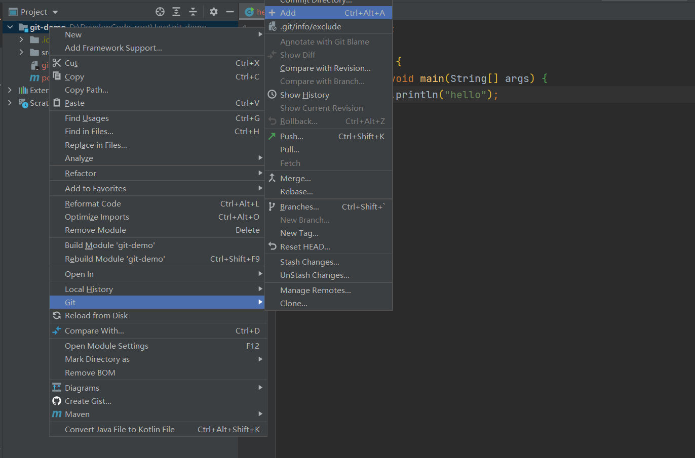
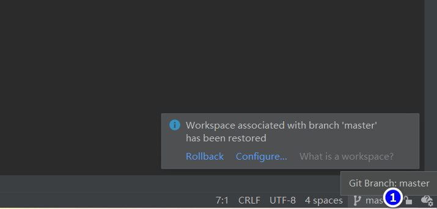

# Git

## 1.概述

工作区:指的是本地项目的文件夹,代码在此进行编写,git add可将其添加到暂存区

暂存区:临时存储,不会生成版本,可以删除(可以理解为撤回),git commit可以将文件提交到本地库

本地库:一旦提交到本地库,就生成**版本**(这个版本是在本地的),不可删除,可以push到远程仓库

远程仓库:项目组中其他人可以查看

## 2.命令


### 2.1 设置用户名/邮箱

用户名:虚拟的用户名,这个用户名将与你登录电脑时选择的用户挂钩

邮箱:虚拟邮箱,并非是真正的电子邮箱

以上设置只是本地的配置,与github上的账号邮箱没有任何关系


例如:登录电脑的用户名为`Alm0nd`,设置用户名为`caffeine`

```
Alm0nd@LAPTOP-81T0VGQS MINGW64 ~/Desktop/git/test
$ git config --global user.name caffeine
```

设置一个不存在的邮箱:

```
Alm0nd@LAPTOP-81T0VGQS MINGW64 ~/Desktop/git/test
$ git config --global user.email caffeine@qq.com
```

在用户家目录查看:


结果:

```
[user]
	name = caffeine
	email = caffeine@qq.com
```

设置成功

### 2.2 初始化本地库

在目标文件夹中:

```
Alm0nd@LAPTOP-81T0VGQS MINGW64 ~/Desktop/git/test
$ git init
Initialized empty Git repository in C:/Users/Alm0nd/Desktop/git/test/.git/
```

生成隐藏的.git文件


### 2.3 状态

新创建一个文件并写入内容:

```
Alm0nd@LAPTOP-81T0VGQS MINGW64 ~/Desktop/git/test (master)
$ touch hello.txt

Alm0nd@LAPTOP-81T0VGQS MINGW64 ~/Desktop/git/test (master)
$ ll
total 0
-rw-r--r-- 1 Alm0nd 197121 0 Aug 31 14:34 hello.txt

Alm0nd@LAPTOP-81T0VGQS MINGW64 ~/Desktop/git/test (master)
$ vim hello.txt

```

查看状态:

```
Alm0nd@LAPTOP-81T0VGQS MINGW64 ~/Desktop/git/test (master)
$ git status
On branch master

No commits yet

Untracked files:
  (use "git add <file>..." to include in what will be committed)
        hello.txt//这里标红,在工作区有,但是没有被添加到暂存区(没有被追踪)

nothing added to commit but untracked files present (use "git add" to track)

```

### 2.4 追踪文件(添加暂存区)

```
Alm0nd@LAPTOP-81T0VGQS MINGW64 ~/Desktop/git/test (master)
$ git add hello.txt
warning: in the working copy of 'hello.txt', LF will be replaced by CRLF the next time Git touches it//这里是说换行符在两个系统(Windows,Linux)中不一致,会自动替换
```

查看状态:

```
Alm0nd@LAPTOP-81T0VGQS MINGW64 ~/Desktop/git/test (master)
$ git status
On branch master

No commits yet

Changes to be committed:
  (use "git rm --cached <file>..." to unstage)
        new file:   hello.txt//绿色,说明git已经追踪到这个文件

```


在暂存区里删除文件,本地文件夹(工作区)仍然会有该文件,仅仅是git不追踪该文件:

```
Alm0nd@LAPTOP-81T0VGQS MINGW64 ~/Desktop/git/test (master)
$ git rm --cached hello.txt
rm 'hello.txt'

Alm0nd@LAPTOP-81T0VGQS MINGW64 ~/Desktop/git/test (master)
$ git status
On branch master

No commits yet

Untracked files:
  (use "git add <file>..." to include in what will be committed)
        hello.txt//红

nothing added to commit but untracked files present (use "git add" to track)

```

此时的工作区:


### 2.5 提交到本地库

提交信息必须要写:

```
git commit -m "在这里写提交信息" hello.txt
```


```
Alm0nd@LAPTOP-81T0VGQS MINGW64 ~/Desktop/git/test (master)
$ git commit hello.txt
warning: in the working copy of 'hello.txt', LF will be replaced by CRLF the next time Git touches it
[master (root-commit) a4945c1] my first commit //a4945c1为版本号(前七位)
 1 file changed, 15 insertions(+)
 create mode 100644 hello.txt
```


状态:

```
Alm0nd@LAPTOP-81T0VGQS MINGW64 ~/Desktop/git/test (master)
$ git status
On branch master
nothing to commit, working tree clean
```

查看版本信息:

(1)git reflog

```
Alm0nd@LAPTOP-81T0VGQS MINGW64 ~/Desktop/git/test (master)
$ git reflog
a4945c1 (HEAD -> master) HEAD@{0}: commit (initial): my first commit
```

(2)git log(详细信息)

```
Alm0nd@LAPTOP-81T0VGQS MINGW64 ~/Desktop/git/test (master)
$ git log
commit a4945c179b1514430d8d0c22c761e45380dd2c75 (HEAD -> master)//完整版本号
Author: caffeine <caffeine@qq.com>
Date:   Wed Aug 31 14:49:08 2022 +0800

    my first commit

```

### 2.6 修改

工作区到暂存区

```
Alm0nd@LAPTOP-81T0VGQS MINGW64 ~/Desktop/git/test (master)
$ vim hello.txt

Alm0nd@LAPTOP-81T0VGQS MINGW64 ~/Desktop/git/test (master)
$ git status
On branch master
Changes not staged for commit:
  (use "git add <file>..." to update what will be committed)
  (use "git restore <file>..." to discard changes in working directory)
        modified:   hello.txt

no changes added to commit (use "git add" and/or "git commit -a")

Alm0nd@LAPTOP-81T0VGQS MINGW64 ~/Desktop/git/test (master)
$ git add hello.txt
warning: in the working copy of 'hello.txt', LF will be replaced by CRLF the next time Git touches it

Alm0nd@LAPTOP-81T0VGQS MINGW64 ~/Desktop/git/test (master)
$ git status
On branch master
Changes to be committed:
  (use "git restore --staged <file>..." to unstage)
        modified:   hello.txt
```

暂存区到本地库

```
Alm0nd@LAPTOP-81T0VGQS MINGW64 ~/Desktop/git/test (master)
$ git commit -m "my second commit" hello.txt
warning: in the working copy of 'hello.txt', LF will be replaced by CRLF the next time Git touches it
[master a886aca] my second commit
 1 file changed, 1 insertion(+) //以行为单位,如果行被修改,则记录为增加一行,减少一行

Alm0nd@LAPTOP-81T0VGQS MINGW64 ~/Desktop/git/test (master)
$ git status
On branch master
nothing to commit, working tree clean

Alm0nd@LAPTOP-81T0VGQS MINGW64 ~/Desktop/git/test (master)
$ git log
commit a886acaabfb43a0be2277cc72e69de296eb53311 (HEAD -> master)
Author: caffeine <caffeine@qq.com>
Date:   Wed Aug 31 14:58:51 2022 +0800

    my second commit

commit a4945c179b1514430d8d0c22c761e45380dd2c75
Author: caffeine <caffeine@qq.com>
Date:   Wed Aug 31 14:49:08 2022 +0800

    my first commit

Alm0nd@LAPTOP-81T0VGQS MINGW64 ~/Desktop/git/test (master)
$ cat hello.txt //此时调用的是新文件
helloGit
helloGit
helloGit
helloGit
helloGit
helloGit
helloGit
helloGit
helloGit
helloGit
helloGit
helloGit
helloGit
helloGit
helloGit
22222222modified

```

关于指针:

```
Alm0nd@LAPTOP-81T0VGQS MINGW64 ~/Desktop/git/test (master)
$ git reflog
a886aca (HEAD -> master) HEAD@{0}: commit: my second commit //主指针指向新提交的版本
a4945c1 HEAD@{1}: commit (initial): my first commit 
```


### 2.7 版本切换

(1)原理:

head->master->版本x

当切换版本,只是切换head和master指向的地址


(2)实现:

在.git文件中:


HEAD:

```
ref: refs/heads/master
```

refs的heads中有master文件:

```
a886acaabfb43a0be2277cc72e69de296eb53311//当前指针的地址
```


(3)切换版本

```
Alm0nd@LAPTOP-81T0VGQS MINGW64 ~/Desktop/git/test (master)
$ git reflog
a886aca (HEAD -> master) HEAD@{0}: commit: my second commit
a4945c1 HEAD@{1}: commit (initial): my first commit

Alm0nd@LAPTOP-81T0VGQS MINGW64 ~/Desktop/git/test (master)
$ git reset --hard a4945c1
HEAD is now at a4945c1 my first commit

Alm0nd@LAPTOP-81T0VGQS MINGW64 ~/Desktop/git/test (master)
$ git reflog
a4945c1 (HEAD -> master) HEAD@{0}: reset: moving to a4945c1
a886aca HEAD@{1}: commit: my second commit
a4945c1 (HEAD -> master) HEAD@{2}: commit (initial): my first commit

```


## 3.分支操作


### 3.1 创建/切换分支

创建hot-fix分支,并切换:

```
Alm0nd@LAPTOP-81T0VGQS MINGW64 ~/Desktop/git/test (master)
$ git branch -v
* master a4945c1 my first commit

Alm0nd@LAPTOP-81T0VGQS MINGW64 ~/Desktop/git/test (master)
$ git branch hot-fix

Alm0nd@LAPTOP-81T0VGQS MINGW64 ~/Desktop/git/test (master)
$ git branch -v
  hot-fix a4945c1 my first commit
* master  a4945c1 my first commit

Alm0nd@LAPTOP-81T0VGQS MINGW64 ~/Desktop/git/test (master)
$ git checkout hot-fix
Switched to branch 'hot-fix'

Alm0nd@LAPTOP-81T0VGQS MINGW64 ~/Desktop/git/test (hot-fix)
$ git branch -v
* hot-fix a4945c1 my first commit
  master  a4945c1 my first commit

```

在hot-fix上修改hello.txt并添加,提交

```
Alm0nd@LAPTOP-81T0VGQS MINGW64 ~/Desktop/git/test (hot-fix)
$ git reflog
08e052c (HEAD -> hot-fix) HEAD@{0}: commit: hot-fix first commit
a4945c1 (master) HEAD@{1}: checkout: moving from master to hot-fix
a4945c1 (master) HEAD@{2}: reset: moving to a4945c1
a886aca HEAD@{3}: commit: my second commit
a4945c1 (master) HEAD@{4}: commit (initial): my first commit

```


新增一个文件:


### 3.2 合并分支

hot-fix分支中hello.txt被修改后,master分支上的hello.txt不会改变,需要合并

在主分支(master)上合并子分支(hot-fix):

```
Alm0nd@LAPTOP-81T0VGQS MINGW64 ~/Desktop/git/test (master)
$ cat hello.txt
helloGit
helloGit
helloGit
helloGit
helloGit
helloGit
helloGit
helloGit
helloGit
helloGit
helloGit
helloGit
helloGit
helloGit
helloGit

Alm0nd@LAPTOP-81T0VGQS MINGW64 ~/Desktop/git/test (master)
$ git merge hot-fix
Updating a4945c1..08e052c
Fast-forward
 hello.txt | 2 +-
 1 file changed, 1 insertion(+), 1 deletion(-)

Alm0nd@LAPTOP-81T0VGQS MINGW64 ~/Desktop/git/test (master)
$ cat hello.txt
helloGit
helloGit
helloGit
helloGit
helloGit
helloGit
helloGit
helloGit
helloGit
helloGit
helloGit
helloGit
helloGit
helloGit
helloGit hot-fix modified

```

### 3.3 冲突合并

两个分支对**同一个文件**产生了不同的修改

例子:
master和hot-fix在自己的分支上修改了hello.txt,并提交到仓库

这时,在master分支上合并hot-fix:

```sh
Alm0nd@LAPTOP-81T0VGQS MINGW64 ~/Desktop/git/test (master)
$ git merge hot-fix
Auto-merging hello.txt
CONFLICT (content): Merge conflict in hello.txt
Automatic merge failed; fix conflicts and then commit the result.

Alm0nd@LAPTOP-81T0VGQS MINGW64 ~/Desktop/git/test (master|MERGING)
$ git status
On branch master
You have unmerged paths.
  (fix conflicts and run "git commit")
  (use "git merge --abort" to abort the merge)

Unmerged paths:
  (use "git add <file>..." to mark resolution)
        both modified:   hello.txt

no changes added to commit (use "git add" and/or "git commit -a")

Alm0nd@LAPTOP-81T0VGQS MINGW64 ~/Desktop/git/test (master|MERGING)
$ vim hello.txt

```

冲突:

<<和==之间为当前分支的代码

==和>>之间为要合并分支的代码


合并后:


注意,commit时不能带文件名

```sh
Alm0nd@LAPTOP-81T0VGQS MINGW64 ~/Desktop/git/test (master|MERGING)
$ git add hello.txt

Alm0nd@LAPTOP-81T0VGQS MINGW64 ~/Desktop/git/test (master|MERGING)
$ git commit -m "merge"
[master 29fe2bc] merge

Alm0nd@LAPTOP-81T0VGQS MINGW64 ~/Desktop/git/test (master)

```

## 4.团队协作

### 4.1 单一团队

A 将本地库push到远程仓库

B 从远程仓库clone代码到本地库

B 修改代码后,将本地库的代码push

A 从远程仓库pull代码到本地 (本地已经有仓库了,所以是pull,这是和clone的区别)


### 4.2 跨团队协作

红蓝不是一个组:


## 5.Github


### 5.1 创建远程库

在github上创建仓库后,拿到https地址:


进入后写仓库名,创建完后有地址


### 5.2 起别名

HTTPS的链接太长了,需要给HTTPS指定的地址起别名(**一般使用仓库的名字**):

```sh
Alm0nd@LAPTOP-81T0VGQS MINGW64 ~/Desktop/git/test (master)
$ git remote -v

Alm0nd@LAPTOP-81T0VGQS MINGW64 ~/Desktop/git/test (master)
$ git remote add git-demo https://github.com/Almond-satori/git-demo.git

Alm0nd@LAPTOP-81T0VGQS MINGW64 ~/Desktop/git/test (master)
$ git remote -v
git-demo        https://github.com/Almond-satori/git-demo.git (fetch)
git-demo        https://github.com/Almond-satori/git-demo.git (push)

```


### 5.3 推送

````sh
Alm0nd@LAPTOP-81T0VGQS MINGW64 ~/Desktop/git/test (master)
$ git push git-demo master
Enumerating objects: 13, done.
Counting objects: 100% (13/13), done.
Delta compression using up to 8 threads
Compressing objects: 100% (9/9), done.
Writing objects: 100% (13/13), 970 bytes | 970.00 KiB/s, done.
Total 13 (delta 5), reused 0 (delta 0), pack-reused 0
remote: Resolving deltas: 100% (5/5), done.
To https://github.com/Almond-satori/git-demo.git
 * [new branch]      master -> master
````


### 5.4 拉取

假设我们的远程库发生了修改:


现在需要更新本地库,此时本地库存在,使用pull拉取即可

```sh
Alm0nd@LAPTOP-81T0VGQS MINGW64 ~/Desktop/git/test (master)
$ git pull git-demo master
remote: Enumerating objects: 5, done.
remote: Counting objects: 100% (5/5), done.
remote: Compressing objects: 100% (2/2), done.
remote: Total 3 (delta 1), reused 0 (delta 0), pack-reused 0
Unpacking objects: 100% (3/3), 669 bytes | 55.00 KiB/s, done.
From https://github.com/Almond-satori/git-demo
 * branch            master     -> FETCH_HEAD
   29fe2bc..06b73a7  master     -> git-demo/master
Updating 29fe2bc..06b73a7
Fast-forward
 hello.txt | 1 +
 1 file changed, 1 insertion(+)
Alm0nd@LAPTOP-81T0VGQS MINGW64 ~/Desktop/git/test (master)

$ git status
On branch master
nothing to commit, working tree clean

Alm0nd@LAPTOP-81T0VGQS MINGW64 ~/Desktop/git/test (master)
$ cat hello.txt
helloGit master test
helloGit
helloGit
helloGit
helloGit
helloGit
helloGit
helloGit
helloGit
helloGit
helloGit
helloGit
helloGit
helloGit hot-fix test
helloGit hot-fix modified
remote modified //已经修改

```

### 5.5 克隆

克隆后,已经完成了克隆代码,初始化本地仓库,创建别名(默认为origin)

### 5.6 推送

B已经拉取了A的远程仓库到本地,并修改提交了代码到本地库,现在要push到远程仓库.

B需要在A的远程仓库的组中,否则无法推送,A设置B为组员后,B拿到设置组员的url,accept即可加入组


## 6.SSH

指令:ssh-keygen -t 加密方式 -C 邮箱

1.在家目录打开git-bash:

```sh
Alm0nd@LAPTOP-81T0VGQS MINGW64 ~
$ ssh-keygen -t rsa -C caffeine@qq.com
Generating public/private rsa key pair.
Enter file in which to save the key (/c/Users/Alm0nd/.ssh/id_rsa):
Created directory '/c/Users/Alm0nd/.ssh'.
Enter passphrase (empty for no passphrase):
Enter same passphrase again:
Your identification has been saved in /c/Users/Alm0nd/.ssh/id_rsa
Your public key has been saved in /c/Users/Alm0nd/.ssh/id_rsa.pub
The key fingerprint is:
SHA256:4ZR/dCSYiOBgKw1Nv4mkciCDOk/UIE2+bdCtsjNL9Zo caffeine@qq.com
The key's randomart image is:
+---[RSA 3072]----+
|o=* .. . . o. .  |
|.*oO .. ..o  o   |
|* B = . +   . .  |
|oB = + o o . .   |
|= * B   S . .    |
|.= = .     .     |
|  *   .          |
| . + o           |
|  . E            |
+----[SHA256]-----+


```

完成后,家目录内创建了.ssh文件

2.在.ssh中拿取公钥(pub)

```
Alm0nd@LAPTOP-81T0VGQS MINGW64 ~/.ssh
$ cat id_rsa.pub
ssh-rsa AA...44qnWfMz5hx/W5tGIeo3NTmENragzWGV/+jLdFhT9GW3XMrExrjrJJUQtcsECF4F+m5xZSkR9oBKLilhOppqIPWHFylwDEAgyhCbyrBpI2NsTiRq9K1PYowx34uO42hDFYDK5dNTVeXRFuZaB1l/PQBQCk9yGAiT3UzcRNfdqtx8P545lFlChyEY+FoPGFkQGgFCWeVBji11LDLTZsyTPjFfdrkU2fysaMo/4wDad/Fv+JCITIRzMihRKcufsFf9WOPI9MTvwjz+a1KSODJswSH53JDtPZYpmEVZiRcrm/K5q30u3wSEacD79EBYDeHCLXLpydIo1l3qRHmeVG8gPg27UCsekkPB03aUBOG/t36ZowD1IKBZKiSd7a7C5+Q7Zs6qFvOJwz8mqaD3k= caffeine@qq.com

```

3.在github中验证公钥

setting->SSH中的SSH-keys:

```
ssh-rsa AAAAB...Yowx34uO42hDFYDK5dNTVeXRFuZaB1l/PQBQCk9yGAiT3UzcRNfdqtx8P545lFlChyEY+FoPGFkQGgFCWeVBji11LDLTZsyTPjFfdrkU2fysaMo/4wDad/Fv+JCITIRzMihRKcufsFf9WOPI9MTvwjz+a1KSODJswSH53JDtPZYpmEVZiRcrm/K5q30u3wSEacD79EBYDeHCLXLpydIo1l3qRHmeVG8gPg27UCsekkPB03aUBOG/t36ZowD1IKBZKiSd7a7C5+Q7Zs6qFvOJwz8mqaD3k= caffeine@qq.com

```

确认即可


测试:直接使用SSH进行推送

```
Alm0nd@LAPTOP-81T0VGQS MINGW64 ~/Desktop/git/test (master)
$ git push git@github.com:Almond-satori/git-demo.git master
The authenticity of host 'github.com (20.205.243.166)' can't be established.
ED25519 key fingerprint is SHA256:+DiY3wvvV6TuJJhbpZisF/zLDA0zPMSvHdkr4UvCOqU.
This key is not known by any other names
Are you sure you want to continue connecting (yes/no/[fingerprint])? yes
Warning: Permanently added 'github.com' (ED25519) to the list of known hosts.
Enumerating objects: 5, done.
Counting objects: 100% (5/5), done.
Delta compression using up to 8 threads
Compressing objects: 100% (2/2), done.
Writing objects: 100% (3/3), 282 bytes | 282.00 KiB/s, done.
Total 3 (delta 1), reused 0 (delta 0), pack-reused 0
remote: Resolving deltas: 100% (1/1), completed with 1 local object.
To github.com:Almond-satori/git-demo.git
   06b73a7..9024aaf  master -> master

```


## 7.IDEA集成git

### 7.1 集成git

1.配置忽略文件

在家目录创建文件`git.ignore`

```
### Java template
*.class
 
# Mobile Tools for Java (J2ME)
.mtj.tmp/
 
# Package Files #
*.jar
*.war
*.ear
 
# virtual machine crash logs, see http://www.java.com/en/download/help/error_hotspot.xml
hs_err_pid*
### JetBrains template
# Covers JetBrains IDEs: IntelliJ, RubyMine, PhpStorm, AppCode, PyCharm, CLion, Android Studio and Webstorm
# Reference: https://intellij-support.jetbrains.com/hc/en-us/articles/206544839
 
# User-specific stuff:
.idea/workspace.xml
.idea/tasks.xml
.idea/dictionaries
.idea/vcs.xml
.idea/jsLibraryMappings.xml
 
# Sensitive or high-churn files:
.idea/dataSources.ids
.idea/dataSources.xml
.idea/dataSources.local.xml
.idea/sqlDataSources.xml
.idea/dynamic.xml
.idea/uiDesigner.xml
 
# Gradle:
.idea/gradle.xml
.idea/
 
# Mongo Explorer plugin:
.idea/mongoSettings.xml
 
## File-based project format:
*.iws
 
## Plugin-specific files:
 
# IntelliJ
/out/
 
# mpeltonen/sbt-idea plugin
.idea_modules/
 
# JIRA plugin
atlassian-ide-plugin.xml
 
# Crashlytics plugin (for Android Studio and IntelliJ)
com_crashlytics_export_strings.xml
crashlytics.properties
crashlytics-build.properties
fabric.properties
### Windows template
# Windows image file caches
Thumbs.db
ehthumbs.db
 
# Folder config file
Desktop.ini
 
# Recycle Bin used on file shares
$RECYCLE.BIN/
 
# Windows Installer files
*.cab
*.msi
*.msm
*.msp
 
# Windows shortcuts
*.lnk
### Maven template
target/
pom.xml.tag
pom.xml.releaseBackup
pom.xml.versionsBackup
pom.xml.next
release.properties
dependency-reduced-pom.xml
buildNumber.properties
.mvn/timing.properties
# ignore eclipse files
.project
.classpath
.settings
.metadata
```

在家目录的`.gitconfig`文件引入git.ignore,**注意斜线**

```
[core]
	excludesfile = C:/Users/Alm0nd/git.ignore
```


2.在idea中配置git,并test(可能无提示,看文件路径下面是否有version)


### 7.2 使用git

(1)初始化git项目


选择项目目录即可.


(2)add以及commit:




(3)左下角git中可以查看版本,切换版本


(4)切换分支,右下角




## 8.IDEA继承github

token:ghp_
