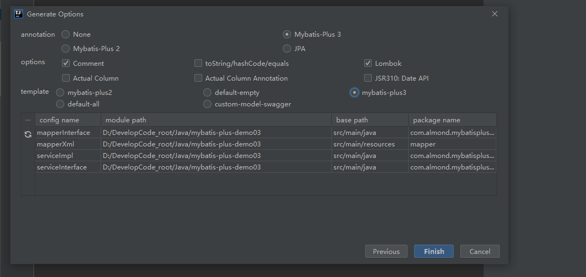

# MybatisPlus

## 1.增删改查见官方文档

## 2.可以使用原生mybatis写mapper.xml

在application中可以写mapper-locations修改mapper文件位置

默认为

```
resources/mapper/**/*.xml
```

放在mapper文件下任何位置都行

## 3.Service层

提供接口，这个接口继承IService<实体类pojo>

```java
public interface UserService extends IService<User> {
}
```

提供接口实现类，接口继承的方法通过继承ServiceImpl<映射类，实体类>实现

```java
@Service//注意给实现类添加注解
public class UserServiceImpl extends ServiceImpl<UserMapper, User> implements UserService {
}
```


注意，批量添加功能也在service层中

```java
@Test
void addBatch(){
    ArrayList<User> users = new ArrayList<>();
    for (int i = 0; i < 10; i++) {
        users.add(new User(i+9L,"x"+i,18,"x@gmasd"));
    }
    userService.saveBatch(users);
}
```

sql语句预编译一次，后续操作填入不同的参数


## 4.注解

### 表名问题

表名默认和实体类的名字对应（User类对应user表），或者给实体类加上注解指示表名

```java
@TableName("t_user")
```


在所有javaBean和表满足关系：User->user（首字母小写）->t_user（加相同前缀）时

也可以给一个全局的通用配置:

```yaml
global-config:
  db-config:
    table-prefix: t_
```


### id问题

1.如果增加的行没有赋id值，mybatis会对**字段名为id**的字段实现雪花算法：

```java
@Test
void insertOne(){
    User user = new User(null, "aaa", 12, "tom@qq.com");
    userMapper.insert(user);
}


sql语句为
    ==>  Preparing: INSERT INTO t_user ( id, name, age, email ) VALUES ( ?, ?, ?, ? )
	==> Parameters: 1525061005036556289(Long), aaa(String), 12(Integer), tom@qq.com(String)
```

如果我们表中的主键用是uid，而且没有传入uid的值，mybatis就不会使用雪花算法，在javaBean的uid属性上加上@TableId注解即可


2.当javaBean中属性为id而表中为uid时

```java
@TableId(value ="uid")
```


3.当我们不想使用雪花算法，而使用递增策略生成id时，**必须保证对应的字段在数据库里的设置是自增的**，在javaBean上的对应属性设置:

```JAVA
@TableId(value = "id",type = IdType.AUTO)
```

测试时可能仍然是一长串数字，这是因为我们没有完全删除表(必须truncate表)，但是已经实现了递增:


可以直接在配置文件中改

```yaml
global-config:
  db-config:
    id-type: auto
```


雪花算法：


### 普通属性与数据库字段不一致的问题

@TableField

```java
@TableField("user_name")
private String name;
```


### 逻辑删除

```java
@TableLogic//该注解说明is_deleted是逻辑删除字段
private Integer isDeleted;
```


逻辑删除后，查询不到删除的数据


## 5.wrapper

UpdateWrapper以及LambdaUpdateWrapper适合于update操作，QueryWrapper也可以update，需要提供一个修改使用的User对象，比较繁琐


### 1.使用QueryWrapper进行查询

```java
@Test
void testWrapper() {

    QueryWrapper<User> userQueryWrapper = new QueryWrapper<>();
    userQueryWrapper.like("user_name", "a")
            .between("age", 10, 100)
            .isNotNull("email");
    List<User> users =
            userMapper.selectList(userQueryWrapper);

    users.forEach(System.out::println);
}
```

### 2.使用QueryWrapper修改

```java
@Test
void test01(){
    QueryWrapper<User> userQueryWrapper = new QueryWrapper<>();
    userQueryWrapper.like("user_name", "a")
            .between("age", 10, 20)
            .isNotNull("email");
    User tom = new User(null, "tom", 26, "tom@qq.com");
    userMapper.update(tom, userQueryWrapper);
}
```

### 3.或关系

关于or和and的逻辑关系，如果.xxx()之间不是以or（），and（）连接，则最后拼接的sql都是and，所以要使用或关系，需要把or的两个条件优先执行，包裹在一个and中

```java
@Test
void test02(){
    QueryWrapper<User> userQueryWrapper = new QueryWrapper<>();
    //查询username中有o的，而且age在10-50之间或者Email不为空
    userQueryWrapper.like("user_name", "o")
            .and(i->i.between("age", 10, 50).or().isNotNull("email"));

    User tom = new User(null, "tom", 27, "tom@qq.com");
    userMapper.update(tom, userQueryWrapper);
}
```


### 4.只查询部分字段

```java
@Test
void test03(){
    QueryWrapper<User> userQueryWrapper = new QueryWrapper<>();
    userQueryWrapper.select("user_name","age","email");
    List<User> users = userMapper.selectList(userQueryWrapper);
    users.forEach(System.out::println);
}

res：
User(id=null, name=null, age=27, email=tom@qq.com, isDeleted=null)
User(id=null, name=null, age=27, email=tom@qq.com, isDeleted=null)
User(id=null, name=null, age=21, email=test4@baomidou.com, isDeleted=null)
User(id=null, name=null, age=27, email=tom@qq.com, isDeleted=null)
User(id=null, name=null, age=27, email=tom@qq.com, isDeleted=null)
User(id=null, name=null, age=27, email=tom@qq.com, isDeleted=null)
User(id=null, name=null, age=27, email=tom@qq.com, isDeleted=null)
```


### 5.子查询

```java
@Test
void test04(){
    QueryWrapper<User> userQueryWrapper = new QueryWrapper<>();
    userQueryWrapper.inSql("id", "select id from t_user where id<100");
    List<User> users = userMapper.selectList(userQueryWrapper);//select * from t_user where id in(select id from t_user where id<100)
    users.forEach(System.out::println);
}
```


### 6.使用UpdateWrapper

```java
@Test
void test05(){
    UpdateWrapper<User> userUpdateWrapper = new UpdateWrapper<>();
    userUpdateWrapper.like("user_name", "o")
            .and(i->i.isNotNull("email").or().between("age", 10, 200));
    userUpdateWrapper.set("user_name", "小黑");
    userMapper.update(null,userUpdateWrapper);
}
```


业务开发的组装条件：

```java
@Test
void test06(){
    String username ="xxx";
    Integer minAge = 20;
    Integer maxAge = 45;
    UpdateWrapper<User> userUpdateWrapper = new UpdateWrapper<>();
    if(!StringUtils.isBlank(username)){
        userUpdateWrapper.set("user_name", username);
    }
    if(minAge!=null)
        userUpdateWrapper.ge("age", minAge);
    if(maxAge!=null)
        userUpdateWrapper.le("age", maxAge);

    userUpdateWrapper.set("user_name", username);
    userMapper.update(null,userUpdateWrapper);
}
```


简单的组装条件

```java
@Test
void test07() {
    String username = "xxx";
    Integer minAge = 20;
    Integer maxAge = 45;
    UpdateWrapper<User> userUpdateWrapper = new UpdateWrapper<>();

    userUpdateWrapper.set(!StringUtils.isBlank(username), "user_name", username)
        .ge(minAge != null, "age", minAge)
        .le(maxAge != null, "age", maxAge);
    
    userUpdateWrapper.set("user_name", username);
    userMapper.update(null, userUpdateWrapper);
}
```


### 7.lambda

query

```java
@Test
void test09(){
    String username = "aaa";
    Integer minAge = 20;
    Integer maxAge = 45;
    LambdaQueryWrapper<User> queryMapper = new LambdaQueryWrapper<>();
    //避免字段写错，这里参数直接写类中属性的get方法
    queryMapper.like(!StringUtils.isBlank(username),User::getName,username)
            .ge(minAge != null, User::getAge, minAge)
            .le(maxAge != null, User::getAge, maxAge);
    List<User> list = userMapper.selectList(queryMapper);
    list.forEach(System.out::println);
}
```

update

```java
@Test
void test08(){
    String username = "a";
    Integer minAge = 20;
    Integer maxAge = 45;
    LambdaUpdateWrapper<User> updateWrapper = new LambdaUpdateWrapper<>();

    updateWrapper.like(User::getName,username)
            .ge(minAge != null, User::getAge, minAge)
            .le(maxAge != null, User::getAge, maxAge)
            .set(User::getName,"tom");
    userMapper.update(null, updateWrapper);
}
```


## 6.分页插件

### 1.配置

创建mybatisPlus的配置类：

```java
@Configuration
@MapperScan("com.almond.mybatis.mapper")//建议在提供了配置类的情况下，把springboot主程序上的映射文件扫描放在这里
public class MyBatisPlusConfig {
    
    //通过拦截器来对方法(最终是对sql语句)进行增强，以实现分页效果
    @Bean
    public MybatisPlusInterceptor mybatisPlusInterceptor(){
        MybatisPlusInterceptor mybatisPlusInterceptor = new MybatisPlusInterceptor();
        mybatisPlusInterceptor.addInnerInterceptor(new PaginationInnerInterceptor(DbType.MYSQL));
        return mybatisPlusInterceptor;
    }
}
```

测试：

```java
@Test
    void test01(){
        //当前页码为1（从1开始而不是0），当前页的大小为4
        Page<User> userPage = new Page<>(1,4);
        //selectPage方法返回给userPage对象
        userMapper.selectPage(userPage, null);
        List<User> records = userPage.getRecords();//获取本次查询结果
        records.forEach(System.out::println);
        System.out.println(userPage.getCurrent());//获取当前页码
        System.out.println(userPage.getSize());//获取一页数据的大小
        System.out.println(userPage.getTotal());//获取总记录数
        System.out.println(userPage.hasNext());//是否有下一页
        System.out.println(userPage.hasPrevious());//是否有上一页
    }
```


### 2.自定义sql语句的分页

定义接口方法：第一个参数为page，返回值也为page

```java
/**
 * page必须放在第一个参数
 * @param page
 * @param age @param可以使用#{age}的方式获取age值，不然要使用#{param2}
 * @return 返回值必须是Page对象
 */
public Page<User> getUserByAge(@Param("page") Page<User> page, @Param("age") Integer age);
```

定义映射文件：resultType也可以在application.yaml中配置type-aliases-package: 包名，这样直接写resultType="类名"就行

```xml
<select id="getUserByAge" resultType="com.almond.mybatis.pojo.User">
    select * from t_user where age>#{age}
</select>
```

测试

```java
@Test
void test02(){
    Page<User> userPage = new Page<>(2, 4);
    userMapper.getUserByAge(userPage, 10);
    System.out.println(userPage.getRecords());
}
```

## 7.乐观锁悲观锁

问题：

A，B操作数据x，x=100

A的操作是x=x+50，B的操作是x=x-30；

正确情况是x=100+50-30

当没有锁控制的情况下，AB同时拿到x=100这个数（注意拿到的是数字100）,A先执行完成，x最终改为了150；B执行它的操作，x=100-30，最终x改为70，覆盖了A的操作；


解决方法：悲观锁，A拿到数据也拿到了锁，直到A的操作结束才释放这个锁。


乐观锁：每一次操作数据都有一个版本号，对数据进行操作时需要检查这个版本号

初始x=100，版本为v1

A修改完成后x=150，版本号v2

B拿到的数据是x=100，版本号为v1，这时完成了操作，提交时发现版本号错误，提交失败


以上过程的模拟：

```java
@Test
void testLock(){
    //A,B拿到相同的数据
    Product productA = productMapper.selectById(1);
    Product productB = productMapper.selectById(1);

    productA.setPrice(productA.getPrice()+50);
    productMapper.updateById(productA);

    productB.setPrice(productB.getPrice()-30);
    productMapper.updateById(productB);

    Product product = productMapper.selectById(1);
    System.out.println(product);//price=70
}
```


### 1.使用mybatisPlus中的乐观锁

实体类的版本属性上加注解@Version

```java
@Version
private Integer version;
```

在mybatiPlus的配置类上将乐观锁插件注册

```java
@Configuration
@MapperScan("com.almond.mybatis.mapper")//建议在提供了配置类的情况下，把springboot主程序上的映射文件扫描放在这里
public class MyBatisPlusConfig {

    //通过拦截器来对方法(最终是对sql语句)进行增强，以实现分页效果
    @Bean
    public MybatisPlusInterceptor mybatisPlusInterceptor(){
        MybatisPlusInterceptor mybatisPlusInterceptor = new MybatisPlusInterceptor();
        mybatisPlusInterceptor.addInnerInterceptor(new PaginationInnerInterceptor(DbType.MYSQL));
        //*添加乐观锁插件*
        mybatisPlusInterceptor.addInnerInterceptor(new OptimisticLockerInnerInterceptor());
        return mybatisPlusInterceptor;
    }
}
```


完整的逻辑：

```java
@Test
void testLock(){
    //A,B拿到相同的数据
    Product productA = productMapper.selectById(1);
    Product productB = productMapper.selectById(1);

    productA.setPrice(productA.getPrice()+50);
    productMapper.updateById(productA);

    productB.setPrice(productB.getPrice()-30);
    int result = productMapper.updateById(productB);
    //如果操作失败，重试
    if(result==0){
        Product productNew = productMapper.selectById(1);
        productNew.setPrice(productNew.getPrice()-30);
        productMapper.updateById(productNew);
    }

    Product product = productMapper.selectById(1);
    System.out.println(product);
}
```

## 8.枚举

给User新增一个gender属性，该属性是枚举类

```java
private Gender gender;
```

创建这个枚举类：标识哪个属性是放在数据库中的

```java
@Getter
public enum Gender {
    MALE(1,"男"),
    FEMALE(2,"女");

    @EnumValue//标识这个属性是存储在数据库中的值
    private Integer genderValue;

    private String genderName;

    Gender(Integer genderValue, String genderName) {
        this.genderValue = genderValue;
        this.genderName = genderName;
    }
}
```

开启对枚举类的扫描：

```yaml
# 配置日志以便查看sql语句
mybatis-plus:
  configuration:
    log-impl: org.apache.ibatis.logging.stdout.StdOutImpl
    #*扫描枚举包，以便使用@EnumValue注解*
  type-enums-package: com.almond.mybatis.enums
```

test：

```java
@Test
void enumTest(){
    User user = new User(null, "jack", 18, "aaa@qq.com", Gender.MALE);
    userMapper.insert(user);
}
```


## 9.自动生成

引入依赖

mybatis-plus-generator的版本必须和mybatis-plus-boot-starter相同

```xml
<dependency>
    <groupId>com.baomidou</groupId>
    <artifactId>mybatis-plus-generator</artifactId>
    <version>3.5.1</version>
</dependency>
<dependency>
    <groupId>org.freemarker</groupId>
    <artifactId>freemarker</artifactId>
    <version>2.3.31</version>
</dependency>
```

在测试类中运行代码，注意配置好数据库用户名密码等，提供生成位置的文件夹，

```java
public class AutoCodeTest {

    public static void main(String[] args) {
        FastAutoGenerator.create("jdbc:mysql://localhost:3306/mybatisplus?serverTimezone=Asia/Shanghai&useUnicode=true&characterEncoding=utf8&useSSL=false",
                "root", "932723")
                .globalConfig(builder -> {
                    builder.author("almond") // 设置作者
//                            .enableSwagger() // 开启 swagger 模式
                            .fileOverride() // 覆盖已生成文件
                            .outputDir("D://mybatisPlusAutoCode"); // 指定输出目录
                })
                .packageConfig(builder -> {
                    builder.parent("com.almond") // 设置父包名
                            .moduleName("system") // 设置父包模块名
                            .pathInfo(Collections.singletonMap(OutputFile.mapperXml, "D://mybatisPlusAutoCode")); // 设置mapperXml生成路径
                })
                .strategyConfig(builder -> {
                    builder.addInclude("t_user") // 设置需要生成的表名
                            .addTablePrefix("t_", "c_"); // 设置过滤表前缀
                })
                .templateEngine(new FreemarkerTemplateEngine()) // 使用Freemarker引擎模板，默认的是Velocity引擎模板
                .execute();
    }
}
```


## 10.多数据源

当我们在一个工程中需要访问多个不同数据库中的表时需要使用多数据源功能

pom.xml中：

```xml
<!--多数据源-->
    <dependency>
        <groupId>com.baomidou</groupId>
        <artifactId>dynamic-datasource-spring-boot-starter</artifactId>
        <version>3.5.0</version>
    </dependency>
```

多数据源的配置application.yaml中：

```yaml
spring:
  datasource:
    dynamic:
      primary: master #设置默认的数据源或者数据源组,默认值即为master
      strict: false #严格匹配数据源,默认false. true未匹配到指定数据源时抛异常,false使用默认数据源
      datasource:
        master:
          url: jdbc:mysql://localhost:3306/mybatisplus?serverTimezone=Asia/Shanghai&useUnicode=true&characterEncoding=utf8&useSSL=false
          username: root
          password: 932723
          driver-class-name: com.mysql.jdbc.Driver # 3.2.0开始支持SPI可省略此配置
        slave_1:
          url: jdbc:mysql://localhost:3306/mybatisplus1?serverTimezone=Asia/Shanghai&useUnicode=true&characterEncoding=utf8&useSSL=false
          username: root
          password: 932723
          driver-class-name: com.mysql.jdbc.Driver
```

javabean，mapper层配置跟正常情况相同

配置service层：

```java
@DS("slave_1")
@Service
public class ProductServiceImpl extends ServiceImpl<ProductMapper, Product> implements ProductService {
}
```


```java
@DS("master")
@Service
public class UserServiceImpl extends ServiceImpl<UserMapper, User> implements UserService {
}
```

## 11.mybatisX自动生成mapper，service

依赖：

```xml
<dependency>
    <groupId>org.projectlombok</groupId>
    <artifactId>lombok</artifactId>
    <optional>true</optional>
</dependency>
<dependency>
    <groupId>com.baomidou</groupId>
    <artifactId>mybatis-plus-boot-starter</artifactId>
    <version>3.5.1</version>
</dependency>
<dependency>
    <groupId>mysql</groupId>
    <artifactId>mysql-connector-java</artifactId>
</dependency>
```

配置数据源：

```yaml
spring:
  datasource:
    url: jdbc:mysql://localhost:3306/mybatisplus?serverTimezone=Asia/Shanghai&useUnicode=true&characterEncoding=utf8&useSSL=false
    username: root
    password: 932723
    driver-class-name: com.mysql.cj.jdbc.Driver
```


若没有以下文件，刷新一下:


base package：生成位置

relative package：生成包的名字

忽略表的前缀



