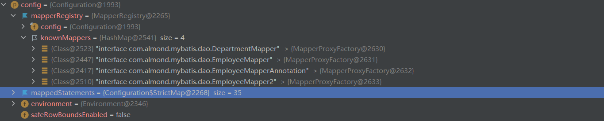

# 一、mybatis上手

## 1.环境准备

**（1）引入必要的依赖**

使用 maven构建，pom.xml中：

```xml
<dependencies>
    <!--导入mybatis-->
    <dependency>
        <groupId>org.mybatis</groupId>
        <artifactId>mybatis</artifactId>
        <version>3.4.1</version>
    </dependency>
    <!--导入log4j日志-->
    <dependency>
        <groupId>org.apache.logging.log4j</groupId>
        <artifactId>log4j-core</artifactId>
        <version>2.17.2</version>
    </dependency>
    <dependency>
        <groupId>junit</groupId>
        <artifactId>junit</artifactId>
        <version>RELEASE</version>
        <scope>compile</scope>
    </dependency>
    <!--mysql的版本需要多次测试，才能找到合适的版本-->
    <dependency>
        <groupId>mysql</groupId>
        <artifactId>mysql-connector-java</artifactId>
        <version>5.1.26</version>
    </dependency>
</dependencies>
```

**（2）配置mybatis的全局配置文件**

在src/main/resources目录下创建mybatis.xml，此文件作为全局配置文件，所有的配置文件都需要在这个目录下创建，这个目录的配置文件会被自动部署到工程的**类路径**下：


**（3）创建数据库连接的properties**

同样在resources下创建，这里写入数据库的信息

>Driver，大写D

```properties
jdbc.driver=com.mysql.jdbc.Driver
jdbc.url=jdbc:mysql://localhost:3306/mybatis
jdbc.username=root
jdbc.password=932723
```

**（4）在mybatis全局配置文件中引入数据库信息**

```xml
<!--设置引入外部文件，默认路径在类路径下-->
<properties resource="databaseConfig.properties"></properties>

<environments default="development">
    <environment id="development">
        <transactionManager type="JDBC"/>
        <dataSource type="POOLED">
            <property name="driver" value="${jdbc.driver}"/>
            <property name="url" value="${jdbc.url}"/>
            <property name="username" value="${jdbc.username}"/>
            <property name="password" value="${jdbc.password}"/>
        </dataSource>
    </environment>
</environments>
```

## 2.开始连接

**（1）创建bean**

创建数据库名为mybatis，创建一张测试的表，创建与之对应的类并提供对应的get，set等方法：

```java
public class Employee {
    private Integer id;
    private String lastName;
    private String email;
    private String gender;
    
    ...
}
```

**（2）创建接口**

我们需要接口来定义访问Bean的规则，mybatis会帮助我们将这个接口实现

```java
public interface EmployeeMapper {
    public Employee getEmployeeById(Integer id);
}
```

**（3）创建接口对应的配置文件**

创建EmployeeMapper.xml

在mapper标签中写入名称空间，select标签，这样就将接口方法和接口的配置文件绑定了

```XML
<?xml version="1.0" encoding="UTF-8" ?>
<!DOCTYPE mapper
        PUBLIC "-//mybatis.org//DTD Mapper 3.0//EN"
        "http://mybatis.org/dtd/mybatis-3-mapper.dtd">

<!--namespace名称空间，不使用接口可以随便取个名字;如果使用接口，则为接口的全类名，这样就绑定了接口-->
<mapper namespace="com.almond.mybatis.dao.EmployeeMapper">
    
<!--
id:本select标签的唯一标识
resultType:表示查询的数据对应java中的那个对象的全类名
#{id}:占位符，相当于之前使用的?
-->
<!--    getEmployeeById是接口中的方法名，这样就将select标签和接口对应的方法绑定-->
    <select id="getEmployeeById" resultType="com.almond.mybatis.bean.Employee">
        select id,last_name as lastName,email,gender from tbl_employee where id = #{id}
    </select>
    
</mapper>
```

**（4）向全局配置文件注册接口配置文件**

resource：引用类路径下的资源，由于我们的配置文件都在resources文件夹中创建，直接部署在类路径下，可以直接引用。

```xml
<!--将我们写好的sql映射文件在全局注册文件中注册-->
<mappers>
    <mapper resource="EmployeeMapper.xml"/>
</mappers>
```

## 3.开始测试

**（1）原始方法，不使用接口**

不推荐实际中这么写，我们只使用了sql映射配置文件EmployeeMapper.xml，没有使用到接口EmployeeMapper

```java
//不建议使用的原始方法
@Test
public void test1() {
    SqlSession sqlSession = null;
    try {
        //根据mybatis的全局注册文件的输入流生成SqlSessionFactory对象
        String resource = "mybatis.xml";
        InputStream inputStream = Resources.getResourceAsStream(resource);
        SqlSessionFactory sqlSessionFactory = new SqlSessionFactoryBuilder().build(inputStream);

        //获取sqlSession实例
        sqlSession = sqlSessionFactory.openSession();
        //selectOne方法的参数说明
        //sql语句的唯一标识，建议使用namespace.id的方式提供唯一标识，可以解决多个配置文件（名称空间不同）id相同的情况
        //sql要使用的参数
        Employee employee = sqlSession.selectOne("com.almond.mybatis.dao.EmployeeMapper.getEmployeeById", 1);

        System.out.println(employee);
        //Employee{id=1, lastName='tom', email='tom@qq.com', gender='0'}
    } catch (IOException e) {
        e.printStackTrace();
    } finally {
        if (sqlSession != null) {
            //用完关闭
            sqlSession.close();
        }
    }
}
```

**（2）接口式编程**

推荐使用的方法，可以看出，mybatis根据我们的接口类，生成了实现接口的代理类完成了数据库的操作，这个代理类相当于DaoImpl

```java
//将获取SqlSessionFactory的方法抽取出来
public SqlSessionFactory getSqlSessionFactroy() throws IOException {
    String resource = "mybatis.xml";
    InputStream inputStream = Resources.getResourceAsStream(resource);
    return new SqlSessionFactoryBuilder().build(inputStream);
}

//面向接口编程,推荐使用
@Test
public void test2() {

    SqlSession sqlSession = null;
    try {
        SqlSessionFactory sqlSessionFactroy = getSqlSessionFactroy();
        sqlSession = sqlSessionFactroy.openSession();
        //根据这个接口的类生成这个接口的EmployeeMapper对象，这是一个代理对象，该代理对象实现了接口中的方法
        EmployeeMapper mapper = sqlSession.getMapper(EmployeeMapper.class);
        Employee e = mapper.getEmployeeById(1);

        System.out.println(e);
        //Employee{id=1, lastName='tom', email='tom@qq.com', gender='0'}
        System.out.println(mapper);
        //org.apache.ibatis.binding.MapperProxy@61322f9d
    } catch (IOException ioException) {
        ioException.printStackTrace();
    } finally {
        if (sqlSession != null)
            sqlSession.close();
    }

}
```

# 二、配置文件中的配置标签（了解）

MyBatis 的配置文件包含了会深深影响 MyBatis 行为的设置和属性信息。配置文档的顶层结构如下：

- configuration（配置）          

  - properties（属性）

  - settings（设置）

  - typeAliases（类型别名）

  - typeHandlers（类型处理器）：负责数据库类型和java类型的转换

  - objectFactory（对象工厂）

  - plugins（插件）

    MyBatis 允许使用插件来拦截的方法调用包括：        

    - ​            Executor            (update, query, flushStatements, commit, rollback,            getTransaction, close,            isClosed)          
    - ​            ParameterHandler            (getParameterObject, setParameters)          
    - ​            ResultSetHandler            (handleResultSets, handleOutputParameters)          
    - ​            StatementHandler            (prepare, parameterize, batch, update, query)          

  - environments（环境配置）：因为可能有多个环境，使用default参数指定使用的环境

    -  environment（环境变量）下列两个子标签必须有环境标签才完整，可以由多个环境，比如一个用于测试，一个用于开发              
      - transactionManager（事务管理器）
      - dataSource（数据源）

  - databaseIdProvider（数据库厂商标识）

  - mappers（映射器）

**注意：我们在配置文件中写入的顺序需要和上述顺序一致**

## mappers:基于注解的映射配置

**（1）新建一个接口，方法上使用注解修饰**

这样我们就不需要创建接口对应的xml文件

```java
public interface EmployeeMapperAnnotation {
    @Select("select * from tbl_employee where id =#{id}")
    public Employee getEmployeeById(Integer id);
}
```

**（2）在全局配置文件引入这个接口**

```xml
<!--将我们写好的sql映射文件在全局注册文件中注册-->
<mappers>
    <!--基于xml的接口映射-->
    <mapper resource="EmployeeMapper.xml"/>
    <!--基于注解的接口映射-->
    <mapper class="com.almond.mybatis.dao.EmployeeMapperAnnotation"/>
</mappers>
```

> 注意：实际开发中的选择是，仍然以xml为主，因为xml就是为了从java中抽取sql命令存在的，注解反而在java中写sql语句，当sql语句很复杂时，不利于维护。
>
> 为了简化开发，当sql语句简单时，可以采用注解方式配置
>
> 当sql语句很重要而且很复杂，必须使用xml配置。

## mappers：简单引入xml的方式

我们可以将接口和它对应的xml配置文件放在一个包下，并保证两者的文件名相同，这样也可以使用class直接引入

> 注意：在maven项目中java文件夹中非java文件是不会打包的，所以我们不能直接将xml放在对应的包中


思路：在resources中创建同名包，并将xml文件放入其中，那么在打包时就会将这个文件部署到同一个包中了

注意：在resources中创建文件可能跟我们想象的不一样，它创建的文件是这样的：


因此我们需要做一个设置，取消包名com.almond.mybatis的格式改为com/almond/mybatis


此时可以在resources中正确创建文件夹


将接口引入全局配置文件：

```xml
<mappers>
    <!--        <mapper resource="EmployeeMapper.xml"/>-->
    <!--基于注解的接口映射-->
    <mapper class="com.almond.mybatis.dao.EmployeeMapperAnnotation"/>
    <!--当xml文件和对应的接口放在一个路径下而且两者文件名相同时，可以采用如下的简单配置-->
    <mapper class="com.almond.mybatis.dao.EmployeeMapper"/>
</mappers>
```

# 三、映射文件

绑定了接口方法的xml文件是映射文件

## 1.增删改查

（1）接口中定义方法：

```java
public interface EmployeeMapper {

    public Employee getEmployeeById(Integer id);

    public Integer addEmployee(Employee employee);

    public void updateEmployee(Employee employee);

    public void deleteEmployeeById(Integer id);
}
```

> 注意：mybatis为我们提供了三种返回类型，
>
> boolean：如果影响行数为0返回false，如果>0返回true
>
> Integer，Long：返回影响的行数


（2）在映射文件中配置四种标签：

```xml
<!--    getEmployeeById是接口中的方法名，这样就将select标签和接口对应的方法绑定-->
<select id="getEmployeeById" resultType="com.almond.mybatis.bean.Employee">
    select id,last_name,email,gender from tbl_employee where id = #{id}
</select>

<!--parameterType可以省略,sql没有分号-->
<insert id="addEmployee" parameterType="com.almond.mybatis.bean.Employee">
    insert into tbl_employee(last_name,email,gender)
    values(#{lastName},#{email},#{gender})
</insert>

<update id="updateEmployee" parameterType="com.almond.mybatis.bean.Employee">
    update tbl_employee
    set last_name=#{lastName},email=#{email},gender=#{gender}
    where id=#{id}
</update>

<delete id="deleteEmployeeById">
    delete from tbl_employee where id=#{id}
</delete>
```


（3）这里提供一个测试方法，**注意我们获取到的SqlSession类默认取消自动提交功能，不要忘记手动提交**

```java
@Test
public void testAdd() {
    SqlSession sqlSession = null;
    try {
        //获取到的sqlSession不会自动提交数据
        sqlSession = getSqlSessionFactroy().openSession();
        EmployeeMapper mapper = sqlSession.getMapper(EmployeeMapper.class);
        //返回影响的行数
        Integer lines = mapper.addEmployee(new Employee(null, "jack", "jack@qq.com", "0"));
        //手动提交数据
        sqlSession.commit();
        System.out.println(lines);//返回影响的行数
    } catch (IOException e) {
        e.printStackTrace();
    } finally {
        if (sqlSession != null)
            sqlSession.close();
    }
}
```

想要实现自动提交可以直接在获取SqlSession的方法参数上加true

```java
sqlSession = getSqlSessionFactroy().openSession(true);
```

## 2.获取自增的主键值

id是自增的，当我们向表中添加一条记录，我们想要查看添加记录的id值时，在映射文件的对应标签上设置属性

useGeneratedKeys="true" ：告知mybatis主键是自增的

keyProperty="id" ：告知mybatis获取到的主键值放在我们加入的对象的id属性中

```xml
<insert id="addEmployee" parameterType="com.almond.mybatis.bean.Employee"
useGeneratedKeys="true" keyProperty="id">
    insert into tbl_employee(last_name,email,gender)
    values(#{lastName},#{email},#{gender})
</insert>
```

测试：我们没有赋id值，操作结束发现id值为5

```java
@Test
public void testMainKey() {
    SqlSession sqlSession = null;
    try {
        //true:获取到的sqlSession会自动提交数据
        sqlSession = getSqlSessionFactroy().openSession(true);
        EmployeeMapper mapper = sqlSession.getMapper(EmployeeMapper.class);
        //返回影响的行数
        Employee jack = new Employee(null, "jack", "jack@qq.com", "0");
        Integer lines = mapper.addEmployee(jack);
        System.out.println(jack);//Employee{id=5, lastName='jack', email='jack@qq.com', gender='0'}
    } catch (IOException e) {
        e.printStackTrace();
    } finally {
        if (sqlSession != null)
            sqlSession.close();
    }
}
```

## 3.方法的参数

### 1.传入多个参数的问题

当方法只有一个参数时，参数的占位符可以随便写:

```
#{任意值}
```


问题：当有多个参数时，**不能**写成如下类型：(id是操作对象中的属性值):

```
#{id}
```

测试如下：

映射xml：

```xml
<!--public Employee getEmployeeByIdAndLastName(Integer id,String lastName);-->
<select id="getEmployeeByIdAndLastName" resultType="com.almond.mybatis.bean.Employee">
    select * from tbl_employee where id=#{id} and last_name=#{lastname}
</select>
```

测试类报错：

```java
@Test
public void testParam() {
    SqlSession sqlSession = null;
    try {
        sqlSession = getSqlSessionFactroy().openSession(true);
        EmployeeMapper mapper = sqlSession.getMapper(EmployeeMapper.class);

        Employee zzz = mapper.getEmployeeByIdAndLastName(1, "zzz");
        //Parameter 'id' not found. Available parameters are [0, 1, param1, param2]
        System.out.println(zzz);

    } catch (IOException e) {
        e.printStackTrace();
    } finally {
        if (sqlSession != null)
            sqlSession.close();
    }
}
```

> 原因：
>
> mybatis底层在有多个参数时，维护一个map，
>
> key：param1，param2，...paramN
>
> value：我们传入的参数值
>
> #{x}的含义就是从map中取出key为x的value值

#### 1. 解决方法：使用默认方法传入参数（不推荐）

要想正确访问，只能写成[0, 1, param1, param2]：

```xml
<!--public Employee getEmployeeByIdAndLastName(Integer id,String lastName);-->
<select id="getEmployeeByIdAndLastName" resultType="com.almond.mybatis.bean.Employee">
    select * from tbl_employee where id=#{param1} and last_name=#{param2}
</select>
```

#### 2. 解决方法：明确参数的方法

我们可以通过在接口方法中加上注解@param("参数名")来标识，这样就可以使用#{参数名}获取参数

```java
public Employee getEmployeeByIdAndLastName(@Param("id")Integer id, @Param("lastName") String lastName);
```

xml映射文件中：

```xml
<!--public Employee getEmployeeByIdAndLastName(Integer id,String lastName);-->
<select id="getEmployeeByIdAndLastName" resultType="com.almond.mybatis.bean.Employee">
    select * from tbl_employee where id=#{id} and last_name=#{lastName}
</select>
```

#### 3. 解决方法：改为只传入一个封装了数据的Map

当我们传入Map，mybatis会自动将这个map作为参数查找map替换默认的查找映射，此时我们定义：

key：String类型，作为参数名

value：Object类型，具体参数值

此时#{id}会查找key为id的值


步骤：

**（1）在接口中定义这个方法以及传入的参数Map**

```java
public Employee getEmployeeByMap(Map<String,Object> map);
```

**（2）在映射的配置文件中写入sql语句**

```xml
<select id="getEmployeeByMap" resultType="com.almond.mybatis.bean.Employee">
    select * from tbl_employee where id=#{id} and last_name=#{lastName}
</select>
```

**（3）将参数名和参数值装入map中进行测试**

```java
@Test
public void testParam2() {
    SqlSession sqlSession = null;
    try {
        sqlSession = getSqlSessionFactroy().openSession(true);
        EmployeeMapper mapper = sqlSession.getMapper(EmployeeMapper.class);

        Map<String,Object> hm = new HashMap<>();
        hm.put("id",1);
        hm.put("lastName","zzz");
        Employee zzz = mapper.getEmployeeByMap(hm);

        System.out.println(zzz);
        //Employee{id=1, lastName='zzz', email='zk@qq.com', gender='1'}
    } catch (IOException e) {
        e.printStackTrace();
    } finally {
        if (sqlSession != null)
            sqlSession.close();
    }
}
```

>  注意：只建议在这种参数组合出现很少的情况下才使用map，因为每次都要向map中装入参数名和参数值，如果使用频繁会非常麻烦，这时可以生成一个新的类TO(TransferObject)

#### 4.解决方法：TO

将多个参数封装为一个类，只传入这个类的对象


### 2.关于参数的特殊情况

如果是集合Collection中的List，Set类型，或者是数组，mybatis会进行特殊处理，将这些值封装在map中，其中：

key：

参数是集合key为collection，

参数是数组key为array，

参数是List类型key为list/collection

value：参数的具体值

例如：取出List第一个值写为 #{list[0]}

### 3.mybatis对参数处理的源码

我们对操作数据库的方法进行debug：

```java
public void testParam2() {
    SqlSession sqlSession = null;
    try {
        sqlSession = getSqlSessionFactroy().openSession(true);
        EmployeeMapper mapper = sqlSession.getMapper(EmployeeMapper.class);

        Map<String,Object> hm = new HashMap<>();
        hm.put("id",1);
        hm.put("lastName","zzz");
        Employee zzz = mapper.getEmployeeByMap(hm);//对这个方法进行debug

        System.out.println(zzz);
        
    } catch (IOException e) {
        e.printStackTrace();
    } finally {
        if (sqlSession != null)
            sqlSession.close();
    }
}
```

进入MapperHandler类，可见它实现了InvocationHandler接口

```java
public class MapperProxy<T> implements InvocationHandler, Serializable {...
```

因此这个类是一个代理类，我们查看它的invoke方法：

```java
//method是被调用的当前接口的方法的信息
//args是占位符对应的实际参数
public Object invoke(Object proxy, Method method, Object[] args) throws Throwable {
//getDeclaringClass()获取创建这个method的类的class对象
//创建这个方法的类可能是声明这个方法的类，也有可能是继承于别的方法。
    //如果这个方法是Object创建的,直接return
    if (Object.class.equals(method.getDeclaringClass())) {
        try {
            return method.invoke(this, args);
        } catch (Throwable var5) {
            throw ExceptionUtil.unwrapThrowable(var5);
        }
        //如果这个方法不是Object创建的，那么我们需要对其进行处理
    } else {
        //mapperMethod带有访问数据库的方式(可能是select/update/...)，返回值类型，接口中的方法名等信息
        MapperMethod mapperMethod = this.cachedMapperMethod(method);
        return mapperMethod.execute(this.sqlSession, args);
    }
}
```

execute方法:

```java
public Object execute(SqlSession sqlSession, Object[] args) {
    Object param;
    Object result;
    switch(this.command.getType()) {
    case INSERT:
        param = this.method.convertArgsToSqlCommandParam(args);
        result = this.rowCountResult(sqlSession.insert(this.command.getName(), param));
        break;
    case UPDATE:
        param = this.method.convertArgsToSqlCommandParam(args);
        result = this.rowCountResult(sqlSession.update(this.command.getName(), param));
        break;
    case DELETE:
        param = this.method.convertArgsToSqlCommandParam(args);
        result = this.rowCountResult(sqlSession.delete(this.command.getName(), param));
        break;
    case SELECT:
            //确定返回值的类型是否是void
        if (this.method.returnsVoid() && this.method.hasResultHandler()) {
            this.executeWithResultHandler(sqlSession, args);
            result = null;
        } else if (this.method.returnsMany()) {//确定返回值是为多个还是单个
            result = this.executeForMany(sqlSession, args);
        } else if (this.method.returnsMap()) {//确定是否返回Map
            result = this.executeForMap(sqlSession, args);
        } else if (this.method.returnsCursor()) {//确定返回类型是否为Cursor
            result = this.executeForCursor(sqlSession, args);
        } else {//将占位符对应的参数列表转换为可用的参数
            param = this.method.convertArgsToSqlCommandParam(args);//下面debug这一步
            //底层还是跟我们之前写的一样，调用selectOne方法
            result = sqlSession.selectOne(this.command.getName(), param);
        }
        break;
    case FLUSH:
        result = sqlSession.flushStatements();
        break;
    default:
        throw new BindingException("Unknown execution method for: " + this.command.getName());
    }

    if (result == null && this.method.getReturnType().isPrimitive() && !this.method.returnsVoid()) {
        throw new BindingException("Mapper method '" + this.command.getName() + " attempted to return null from a method with a primitive return type (" + this.method.getReturnType() + ").");
    } else {
        return result;
    }
}
```

关于参数的转换，在本方法中根据我们传入的args生成param，这里我采用了传入一个封装数据的Map，实际我们传入的args可以是对象，可以是单个变量(见3.1传入多个参数的问题)，mybatis由此生成一个自己的HashMap，作为参数进行查询。


convertArgsToSqlCommandParam:

```java
public Object convertArgsToSqlCommandParam(Object[] args) {
    return this.paramNameResolver.getNamedParams(args);
}
```


paramNameResolver.getNamedParams:这是处理参数的方法:

names是SortedMap，key=下标值/注解值/参数名 value=**参数名**

```java
public Object getNamedParams(Object[] args) {
    int paramCount = this.names.size();//见下跟踪names的创建
    if (args != null && paramCount != 0) {
        //如果参数列表中只有一个参数，直接返回
        if (!this.hasParamAnnotation && paramCount == 1) {
            return args[(Integer)this.names.firstKey()];
        } else {
            //多个参数的情况
            Map<String, Object> param = new ParamMap();
            int i = 0;
			//对names做遍历,names:key=下标值/注解值/参数名 value=参数名
            for(Iterator i$ = this.names.entrySet().iterator(); i$.hasNext(); ++i) {
                Entry<Integer, String> entry = (Entry)i$.next();
                //param：key=属性名 value=属性值
                param.put(entry.getValue(), args[(Integer)entry.getKey()]);
                //genericParamName为param1，param2，...，paramN
                String genericParamName = "param" + String.valueOf(i + 1);
                //如果我们的参数名不是按照下标值加入names的，补充下标值 
                //这样我们无论是否使用注解，或者设置全局配置，都可以通过#{paramN}获取参数
                if (!this.names.containsValue(genericParamName)) {
                    param.put(genericParamName, args[(Integer)entry.getKey()]);
                }
            }

            return param;
        }
    } else {
        return null;
    }
}
```


**跟踪names**

这是实例域中的一个属性

```
private final SortedMap<Integer, String> names;
```

在构造器中继续寻找：

```
this.names = Collections.unmodifiableSortedMap(map);
```

跟踪构造器中的部变量map：

```java
public ParamNameResolver(Configuration config, Method method) {
    Class<?>[] paramTypes = method.getParameterTypes();//获取参数列表
    //获取注解列表，一个参数的注解可能有多个
    Annotation[][] paramAnnotations = method.getParameterAnnotations();
    SortedMap<Integer, String> map = new TreeMap();
    //根据注解列表长度循环
    int paramCount = paramAnnotations.length;

    for(int paramIndex = 0; paramIndex < paramCount; ++paramIndex) {
        if (!isSpecialParameter(paramTypes[paramIndex])) {
            String name = null;
            Annotation[] arr$ = paramAnnotations[paramIndex];
            int len$ = arr$.length;

            for(int i$ = 0; i$ < len$; ++i$) {
                Annotation annotation = arr$[i$];
                if (annotation instanceof Param) {
                    //如果参数有合法注解，将hasParamAnnotation设置为true，跳出循环
                    this.hasParamAnnotation = true;
                    name = ((Param)annotation).value();
                    break;
                }
            }

            if (name == null) {
                //isUseActualParamName是使用参数名作为获取参数的key，这是一个全局配置，使用java8的情况可以设置，这是因为jdk1.8后的反射才能拿到参数列表
                if (config.//isUseActualParamName()) {
                    name = this.getActualParamName(method, paramIndex);
                }

                if (name == null) {
                    name = String.valueOf(map.size());
                }
            }
			//如果进行到这一步说明该参数没有注解，将它在参数列表中的index作为key，参数名为key放入map
            map.put(paramIndex, name);
        }
    }

    this.names = Collections.unmodifiableSortedMap(map);
}
```

### 4. #{}和${}

#{}：预编译sql语句形式，使用PreparedStatement方式，没有sql注入问题，常用。


${}：采用Statement方式，存在sql注入问题，使用场景：

(1)当我们每一次查询的表不一定时：比如查一个每年都不一样的表(2017_salary,2018_salary,...)

```
select * from ${year}_salary;
```

(2)原生的jdbc不支持使用占位符的情况

```
select * from salary order by ${name} ${order}
```

**因为原生的jdbc只支持在参数中使用占位符，而statement本质是字符串拼接，可以在任何位置拼接sql语句**


比如：这里写入${tableName}

```xml
<select id="getEmployeeByMap" resultType="com.almond.mybatis.bean.Employee">
    select * from ${tableName} where id=#{id} and last_name=#{lastName}
</select>
```

在测试类中提供参数值，即可成功查询

```java
public void testParam2() {
    SqlSession sqlSession = null;
    try {
        sqlSession = getSqlSessionFactroy().openSession(true);
        EmployeeMapper mapper = sqlSession.getMapper(EmployeeMapper.class);

        Map<String,Object> hm = new HashMap<>();
        hm.put("id",1);
        hm.put("lastName","zzz");
        hm.put("tableName", "tbl_employee");//在这里将占位名和表名放入map
        Employee zzz = mapper.getEmployeeByMap(hm);

        System.out.println(zzz);
        //Employee{id=1, lastName='zzz', email='zk@qq.com', gender='1'}
    } catch (IOException e) {
        e.printStackTrace();
    } finally {
        if (sqlSession != null)
            sqlSession.close();
    }
}
```

## 4.Select标签中的resultType

### 1.返回值为多个对象

当返回多个对象时，resultType仍然是返回的单个对象类型，而不是List

```xml
<!--    public List<Employee> getEmployeeByLike(String like);-->
    <select id="getEmployeeByLike" resultType="com.almond.mybatis.bean.Employee">
        select * from tbl_employee where last_name like #{like}
    </select>
```

### 2.返回一个对象，将其封装为Map

接口方法：

```java
//返回一条记录的map，key为列名，value为具体的值
public Map<String,Object> getEmpByIdReturnMap(Integer id);
```

xml：

```xml
<!--    public Map<String,Object> getEmpByIdReturnMap(Integer id);-->
<!--    mybatis为Map起了别名map-->
    <select id="getEmpByIdReturnMap" resultType="map">
        select * from tbl_employee where id = #{id}
    </select>
```

测试类：

```java
public void testMap() {
    SqlSession sqlSession = null;
    try {
        sqlSession = getSqlSessionFactroy().openSession(true);
        EmployeeMapper mapper = sqlSession.getMapper(EmployeeMapper.class);

        Map<String, Object> map = mapper.getEmpByIdReturnMap(1);
        System.out.println(map);//{gender=1, last_name=zzz, id=1, email=zk@qq.com}

    } catch (IOException e) {
        e.printStackTrace();
    } finally {
        if (sqlSession != null)
            sqlSession.close();
    }
}
```

 ### 3.返回多个对象，将其封装为map

key=每个对象中的某一个属性 

value=这个对象


接口：

```
@MapKey("id")
public Map<Integer,Object> getEmployeeByLikeReturnMap(String like);
```

xml：

```xml
<!--    public Map<Integer,Object> getEmployeeByLikeReturnMap(String like);-->
    <select id="getEmployeeByLikeReturnMap" resultType="map">
        select * from tbl_employee where last_name like #{like}
    </select>
```

测试类：

```java
public void testLikeMap() {
    SqlSession sqlSession = null;
    try {
        sqlSession = getSqlSessionFactroy().openSession(true);
        EmployeeMapper mapper = sqlSession.getMapper(EmployeeMapper.class);

        Map<Integer, Object> map = mapper.getEmployeeByLikeReturnMap("%a%");
        System.out.println(map);
        //{
        // 4={gender=0, last_name=jack, id=4, email=jack@qq.com}, 
        // 5={gender=0, last_name=jack, id=5, email=jack@qq.com}
        //}
        
    } catch (IOException e) {
        e.printStackTrace();
    } finally {
        if (sqlSession != null)
            sqlSession.close();
    }
}
```

## 5.Select标签中的resultMap

### 1.自定义映射

resultMap允许我们自定义映射：

```xml
<resultMap id="myEmployeeMap" type="com.almond.mybatis.bean.Employee">
<!--        id标签指定主键，数据库中的列对应Employee中的属性-->
        <id column="id" property="id"></id>
<!--        result标签指定普通列（不是主键）-->
        <result column="last_name" property="lastName"></result>
        <result column="gender" property="gender"></result>
        <result column="email" property="email"></result>
</resultMap>
```

在select标签中resultMap和resultType两个属性只能存在一个：

```xml
<!--    public Employee getEmpById(Integer id);-->
<select id="getEmpById" resultMap="myEmployeeMap">
    select * from tbl_employee where id = #{id}
</select>
```


### 2.查询一个对象中含有另一个对象的情况

employee中有字段d_id依赖于tbl_dept表中的id

#### 方法1：嵌套结果集

```xml
<!--    场景，员工和部门表关联的情况-->
<select id="getEmpAndDeptById" resultMap="myEmployeeMapPlus">
    SELECT e.id id,e.last_name lastName,e.gender gender,e.email email,e.d_id empDeptId,
    d.id AS deptId,d.dept_name dName
    FROM tbl_employee e,tbl_dept d
    WHERE e.d_id=d.id AND e.id=#{id}
</select>
<resultMap id="myEmployeeMapPlus" type="com.almond.mybatis.bean.Employee">
    <id column="id" property="id"></id>
    <result column="lastName" property="lastName"></result>
    <result column="gender" property="gender"></result>
    <result column="email" property="email"></result>
    <result column="empDeptId" property="dept.deptId"></result>
    <result column="dName" property="dept.deptName"></result>
</resultMap>
```

#### 方法2：手动将列名和对象属性绑定

association标签，select标签与方法1一致

```xml
<resultMap id="myEmployeeMapPlus2" type="com.almond.mybatis.bean.Employee">
        <id column="id" property="id"></id>
        <result column="lastName" property="lastName"></result>
        <result column="gender" property="gender"></result>
        <result column="email" property="email"></result>
<!--       property:给哪个Employee对象中的属性绑定另一个类
           javaType:绑定哪一个类，填写全类名-->
        <association property="dept" javaType="com.almond.mybatis.bean.Department">
            <id column="deptId" property="deptId"></id>
            <result column="dName" property="deptName"></result>
        </association>
</resultMap>
```

#### 方法3：分段查询

给depatement也创建一个查询映射在查询employee时引用这个查询即可

```xml
<select id="getEmpByIdStep1" resultMap="myEmployeeMapPlus3">
    select * from tbl_employee where id=#{id}
</select>
<resultMap id="myEmployeeMapPlus3" type="com.almond.mybatis.bean.Employee">
    <id column="id" property="id"></id>
    <result column="lastName" property="lastName"></result>
    <result column="gender" property="gender"></result>
    <result column="email" property="email"></result>
    <!--       property:给哪个Employee对象中的属性绑定另一个类
               select:引入另一个映射,表名属性dept的值为这个映射的查询结果
               column:根据当前查询的指定列的值去做另一次查询的参数-->
    <association property="dept"
                 select="com.almond.mybatis.dao.DepartmentMapper.getDeptById"
                 column="d_id">
    </association>
</resultMap>
```


**对于分段查询，我们可以使用懒加载**

子查询会得到一个对象，只有这个对象被使用的情况下，我们才执行子查询，而不是跟随第一个查询都查出来

```xml
<!--        设置懒加载，当我们在一个查询中做了子查询(该子查询会返回一个对象)，这个子查询仅在这个对象被使用的时候才会执行-->
<setting name="lazyLoadingEnabled" value="true"/>
<setting name="aggressiveLazyLoading" value="false"/>
```

测试：需要使用dept时，操作数据库执行子查询：

```
接下来使用dept对象
2022-04-22 16:40:59 DEBUG com.almond.mybatis.dao.DepartmentMapper.getDeptById - ==>  Preparing: select id as deptId,dept_name as deptName from tbl_Dept where id=? 
2022-04-22 16:40:59 DEBUG com.almond.mybatis.dao.DepartmentMapper.getDeptById - ==> Parameters: 1(Integer)
2022-04-22 16:40:59 DEBUG com.almond.mybatis.dao.DepartmentMapper.getDeptById - <==      Total: 1
Department{deptId=1, deptName='开发部'}
```

### 3.查询一个对象中含有另一个对象集合的情况

#### 方法1：嵌套结果集

定义关联的集合的封装规则

使用collection标签：

```xml
<select id="getDeptByIdPlus" resultMap="dept1">
        SELECT d.id AS deptId,d.dept_name AS deptName,
               e.id id,e.last_name lastName,e.email email,e.gender gender,e.d_id did
        FROM tbl_Dept d
                 RIGHT JOIN tbl_employee e
                            ON d.id=e.d_id
        WHERE d.id=#{id}
    </select>
    <resultMap id="dept1" type="com.almond.mybatis.bean.Department">
        <id column="deptId" property="deptId"></id>
        <result column="deptName" property="deptName"></result>
<!--        property指定集合属性，ofType指定集合中的每个元素的类型的全类名-->
        <collection property="empList" ofType="com.almond.mybatis.bean.Employee">
<!--            定义集合中每个元素的封装规则-->
            <id column="id" property="id" ></id>
            <result column="lastName" property="lastName"></result>
            <result column="email" property="email"></result>
            <result column="gender" property="gender"></result>
        </collection>
    </resultMap>
```

#### 方法2：分段查询

在部门映射中加入子查询

```xml
<select id="getDeptByIdStep" resultMap="step">
    select id ,dept_name from tbl_Dept where id=#{id}
</select>
<resultMap id="step" type="com.almond.mybatis.bean.Department">
    <id column="id" property="deptId"></id>
    <result column="dept_name" property="deptName"></result>
    <collection property="empList"
                select="com.almond.mybatis.dao.EmployeeMapper2.getEmpByDeptId"
                column="id">
    </collection>
</resultMap>
```

在员工映射中实现子查询

```xml
<select id="getEmpByDeptId" resultMap="deptId">
    select id,last_name,gender,email from tbl_employee where d_id=#{id}
</select>
<resultMap id="deptId" type="com.almond.mybatis.bean.Employee">
    <id column="id" property="id"></id>
    <result column="last_name" property="lastName"></result>
    <result column="gender" property="gender"></result>
    <result column="email" property="email"></result>
</resultMap>
```

**一些特性：**

> 1.当我们需要在分步查询中提供多个参数时，可以将参数封装为map
>
> {子查询需要的参数1=要传递的列名1,
>
> 子查询需要的参数2=要传递的列名2,
>
> 子查询需要的参数N=要传递的列名N}

比如这里可以写为：

```xml
<collection property="empList"
	select="com.almond.mybatis.dao.EmployeeMapper2.getEmpByDeptId"
	column="{id=id}">
</collection>
```

第一个id是子查询中的参数名#{id}，第二个id是数据库返回的列名id


> 2.在collection有子查询时设置fetchType="eager"或者fetchType="lazy"可以对该查询实现立即查询/懒加载

```xml
<collection property="empList"
            select="com.almond.mybatis.dao.EmployeeMapper2.getEmpByDeptId"
            column="{id=id}"
            fetchType="eager">
```


> 3.使用discriminator标签可以根据查询结果的列值进行不同操作

```xml
<select id="getEmpByGender" resultMap="gender">
        select id,last_name,email,gender,d_id from tbl_employee where id=#{id}
    </select>
    <resultMap id="gender" type="com.almond.mybatis.bean.Employee">
        <id column="id" property="id"></id>
        <result column="last_name" property="lastName"></result>
        <result column="gender" property="gender"></result>
        <result column="email" property="email"></result>
        <!--javaType：参与判断case的字段类型，不写全类名是因为mybatis为java的常用类做了封装
			column：参与判断case的列名
-->
        <discriminator javaType="string" column="gender">
<!--            gender为0查询部门信息，resultType指出封装的类，这里也可以使用resultMap自定义规则-->
            <case value="0" resultType="com.almond.mybatis.bean.Employee">
                <!--       property:给哪个Employee对象中的属性绑定另一个类
           select:引入另一个映射,表名属性dept的值为这个映射的查询结果
           column:根据当前查询的指定列的值去做另一次查询的参数-->
                <association property="dept"
                             select="com.almond.mybatis.dao.DepartmentMapper.getDeptById"
                             column="d_id">
                </association>
            </case>
<!--            gender为1将email赋值为lastName-->
            <case value="1" resultType="com.almond.mybatis.bean.Employee">
                <id column="id" property="id"></id>
                <result column="lastName" property="lastName"></result>
                <result column="gender" property="gender"></result>
                <result column="email" property="lastName"></result>
            </case>
        </discriminator>
</resultMap>
```

# 四、动态sql语句

## 1.使用标签if进行判断

```xml
<select id="getEmpByCondition" resultType="com.almond.mybatis.bean.Employee">
    select id,last_name as lastName,email,gender from tbl_employee
    where
    <if test="id!=null">
        id =#{id}
    </if>
    <!--ognl需要使用''确定是否是空串，或者使用[""]的转义字符[&quot;&quot;]表示-->
    <if test="lastName!=null and lastName!=''">
        and last_name like #{lastName}
    </if>
    <!--ognl可以调用函数-->
    <if test="email!=null and email.trim()!=''">
        and email=#{email}
    </if>
      <!--ognl会进行数字和字符串之间的转换-->
    <if test="gender==0 or gender==1">
        and gender=#{gender}
    </if>

</select>
```


### 解决if标签中没有第一个条件的问题

本例中如果测试时不写id值，第一个if标签判断为false，sql语句拼接错误

```sql
select id,last_name as lastName,email,gender from tbl_employee where and last_name = ?
```


解决：

使用where标签包含整个判断语句

```xml
<select id="getEmpByCondition" resultType="com.almond.mybatis.bean.Employee">
    select id,last_name as lastName,email,gender from tbl_employee
    <where>
        <if test="id!=null">
            id =#{id}
        </if>
        <!--ognl需要使用''确定是否是空串，或者使用[""]的转义字符[&quot;&quot;]表示-->
        <if test="lastName!=null and lastName!=''">
            and last_name like #{lastName}
        </if>
        <!--ognl可以调用函数-->
        <if test="email!=null and email.trim()!=''">
            and email=#{email}
        </if>
        <!--ognl会进行数字和字符串之间的转换-->
        <if test="gender==0 or gender==1">
            and gender=#{gender}
        </if>    
    </where>
</select>
```

加入where标签后，如果在第一个条件为空的情况下，自动删除多余的and，本次拼接的sql语句是：

```sql
select id,last_name as lastName,email,gender from tbl_employee WHERE last_name like ? and gender=? 
```


**注意这种方法只能把条件写成 and columnName=property的形式，and的位置不能改变**

## 2.trim标签

trim标签代表它范围内的整个字符串，可以增加前缀，增加后缀，删除前缀，删除后缀

使用情景：

where标签不能去掉后缀多余的and

```xml
<select id="getEmpByCondition" resultType="com.almond.mybatis.bean.Employee">
    select id,last_name as lastName,email,gender from tbl_employee
    <where>
        <if test="id!=null">
            id =#{id} and 
        </if>
        <!--ognl需要使用''确定是否是空串，或者使用[""]的转义字符[&quot;&quot;]表示-->
        <if test="lastName!=null and lastName!=''">
            last_name like #{lastName} and
        </if>
        <!--ognl可以调用函数-->
        <if test="email!=null and email.trim()!=''">
            email=#{email} and
        </if>
        <!--ognl会进行数字和字符串之间的转换-->
        <if test="gender==0 or gender==1">
            gender=#{gender}
        </if>
    </where>
</select>
```

使用trim：prefix表示trim包裹的字符串前拼接一个where，suffixOverrides表示去掉trim包裹的字符串末尾的and

```xml
<select id="getEmpByCondition" resultType="com.almond.mybatis.bean.Employee">
        select id,last_name as lastName,email,gender from tbl_employee
       
            <trim prefix="where" suffixOverrides="and">
                <if test="id!=null">
                    id =#{id} and
                </if>
                <!--ognl需要使用''确定是否是空串，或者使用[""]的转义字符[&quot;&quot;]表示-->
                <if test="lastName!=null and lastName!=''">
                    last_name like #{lastName} and
                </if>
                <!--ognl可以调用函数-->
                <if test="email!=null and email.trim()!=''">
                    email=#{email} and
                </if>
                <!--ognl会进行数字和字符串之间的转换-->
                <if test="gender==0 or gender==1">
                    gender=#{gender}
                </if>
            </trim>
        
    </select>
```

拼接的sql字符串为：

```sql
select id,last_name as lastName,email,gender from tbl_employee WHERE last_name like ? and gender=?
```

## 3.choose标签

choose可以解决情景：如果带了条件a就按照a来查询，如果带了条件b就按b查询。也就是说，**分支只进一个**

注意这里的choose是如果id不为空，直接拼接id的条件，后面的lastName，otherwise是直接跳过的，相当于自带break

```xml
<select id="getEmpByConditions" resultType="com.almond.mybatis.bean.Employee">
    select id, last_name as lastName, email, gender
    from tbl_employee
    <where>
        <choose>
            <when test="id!=null">
                id=#{id}
            </when>
            <when test="lastName!=null">
                last_name like #{lastName}
            </when>
            <otherwise>
                gender = 0
            </otherwise>
        </choose>
    </where>

</select>
```

如果查询类只带了lastName，则sql为：

```sql
select id, last_name as lastName, email, gender from tbl_employee WHERE last_name = ?
```

## 4.set标签

进行更改数据时使用，需要注意的是set和where不同，set去掉sql语句**后缀**中的逗号，可以使用trim标签自定义

## 5.foreach标签

### 使用情景1：查询数据库中是否有id=1，2，3，5


1.我们想要使用idList作为列表的值，在接口方法中使用注解@Param

```java
public List<Employee> getEmpByIds(@Param("idList") List<Integer> idList);
```

2.在映射文件中：

collection：传入的集合，可以是List，Map

item：集合中的每个元素的名字/当前key对应的value值

separator：每个元素之间的分隔符

open：前缀

close：后缀

index：当前元素的下标/当前元素的key值

```xml
<select id="getEmpByIds" resultType="com.almond.mybatis.bean.Employee">
    select id, last_name as lastName, email, gender
    from tbl_employee
    where id in
    <foreach collection="idList" item="item_id"
             separator="," open="(" close=")" index="i">
        #{item_id}
    </foreach>

</select>
```

拼接的字符串为：

```sql
select id, last_name as lastName, email, gender from tbl_employee where id in ( ? , ? , ? , ? )
```

### 使用情景2：批量插入

为了使用empList获取集合，在接口方法中使用注解：

```java
public void insertBatch(@Param("empList") List<Employee> empList);
```

在映射配置文件中：

```xml
<insert id="insertBatch">
    insert into tbl_employee(last_name,email,gender,d_id) values
    <foreach collection="empList" item="emp" separator=","
             >
        (#{emp.lastName},#{emp.email},#{emp.gender},#{emp.dept.deptId})
    </foreach>
</insert>
```

拼接后的sql：

```sql
insert into tbl_employee(last_name,email,gender,d_id) values (?,?,?,?) , (?,?,?,?) 
```

## 6.内置参数

不止是我们方法中传入的参数可以被使用，mybatis还有两个内置参数：

_parameter：

当我们传入单个参数时，_parameter就是该参数

当我们传入多个参数时，多个参数封装到map中，_parameter为这个map

_databaseId：如果配置了多个数据库的别名，这个参数就有值，为当前使用的数据库的别名

## 7.bind标签

情景：模糊查询出名字中有字母a的employee，在测试中仅传入字符串"a"，通过bind标签加上%（这里仅仅举例，实际开发中还是写在java里，便于修改）

接口方法中加注解：

```java
public List<Employee> getEmpByLastNameLike(@Param("lastName") String lastName);
```

通过bind标签，在参数基础上修改，并作为另一个参数使用：

```xml
<select id="getEmpByLastNameLike" resultType="com.almond.mybatis.bean.Employee">
    <bind name="_lastName" value="'%'+lastName+'%'"/>
    select id, last_name, email, gender
    from tbl_employee
    where last_name like #{_lastName}
</select>
```

## 8.抽取sql语句

sql标签可以将sql语句抽取出来

```xml
<sql id="test">
    抽取的sql语句
</sql>
```

使用方法：引用sql标签中的id

```xml
<select id="">
    <include refid="test"></include>
</select>
```

# 五、缓存机制

## 1.缓存概述

（1）什么是缓存：对于经常使用的数据，频繁地访问数据库代价太大，因此我们可以第一次对该数据的查询缓存下来，下次查询直接使用。


（2）mybatis中缓存的分类：

一级缓存：本地缓存，又叫SqlSession缓存，一级缓存一直开启不能关闭，这个缓存的实现是SqlSession中的Map

与数据库一次会话期间查询到的数据放在缓存中，如果需要获取相同的数据，直接使用缓存中的数据，不再访问数据库。

二级缓存：全局缓存，基于namespace的缓存

## 2.一级缓存

### 2.1 测试

```java
@Test
public void testParam() {
    SqlSession sqlSession = null;
    try {
        sqlSession = getSqlSessionFactroy().openSession(true);
        EmployeeMapper mapper = sqlSession.getMapper(EmployeeMapper.class);

        Employee zzz1 = mapper.getEmployeeByIdAndLastName(1, "zzz");
        System.out.println("得到zzz1");
        Employee zzz2 = mapper.getEmployeeByIdAndLastName(1, "zzz");
        System.out.println("得到zzz2");
        System.out.println(zzz1==zzz2);//true

    } catch (IOException e) {
        e.printStackTrace();
    } finally {
        if (sqlSession != null)
            sqlSession.close();
    }
}
```

 控制台：只发送了一次sql语句，并且两次查询得到的两个对象完全相同（指向同一个堆空间）

```
2022-04-23 17:19:52 DEBUG com.almond.mybatis.dao.EmployeeMapper.getEmployeeByIdAndLastName - ==>  Preparing: select * from tbl_employee where id=? and last_name=? 
2022-04-23 17:19:52 DEBUG com.almond.mybatis.dao.EmployeeMapper.getEmployeeByIdAndLastName - ==> Parameters: 1(Integer), zzz(String)
2022-04-23 17:19:52 DEBUG com.almond.mybatis.dao.EmployeeMapper.getEmployeeByIdAndLastName - <==      Total: 1
得到zzz1
得到zzz2
true
```

### 2.2 一级缓存的四种失效情况

#### （1）SqlSession不同

一级缓存又叫SqlSession缓存，每个SqlSession都有自己的缓存，不同的SqlSession之间缓存不能共享

#### （2）查询的条件不同

使用不同方法查询，或者相同语句不同参数查询都是条件不同，根本是缓存中没有这个数据

#### （3）两次查询之间执行了增删改操作

```java
@Test
public void testParam() {
    SqlSession sqlSession = null;
    try {
        sqlSession = getSqlSessionFactroy().openSession(true);
        EmployeeMapper mapper = sqlSession.getMapper(EmployeeMapper.class);

        Employee zzz1 = mapper.getEmployeeByIdAndLastName(1, "zzz");
        System.out.println("得到zzz1");

        mapper.addEmployee(
                new Employee(null,"john",
                        "john@gmail","1"));

        Employee zzz2 = mapper.getEmployeeByIdAndLastName(1, "zzz");
        System.out.println("得到zzz2");
        System.out.println(zzz1==zzz2);

    } catch (IOException e) {
        e.printStackTrace();
    } finally {
        if (sqlSession != null)
            sqlSession.close();
    }
}
/*
2022-04-23 17:33:15 DEBUG com.almond.mybatis.dao.EmployeeMapper.getEmployeeByIdAndLastName - ==>  Preparing: select * from tbl_employee where id=? and last_name=? 
2022-04-23 17:33:15 DEBUG com.almond.mybatis.dao.EmployeeMapper.getEmployeeByIdAndLastName - ==> Parameters: 1(Integer), zzz(String)
2022-04-23 17:33:15 DEBUG com.almond.mybatis.dao.EmployeeMapper.getEmployeeByIdAndLastName - <==      Total: 1
得到zzz1
2022-04-23 17:33:15 DEBUG com.almond.mybatis.dao.EmployeeMapper.addEmployee - ==>  Preparing: insert into tbl_employee(last_name,email,gender) values(?,?,?) 
2022-04-23 17:33:15 DEBUG com.almond.mybatis.dao.EmployeeMapper.addEmployee - ==> Parameters: john(String), john@gmail(String), 1(String)
2022-04-23 17:33:15 DEBUG com.almond.mybatis.dao.EmployeeMapper.addEmployee - <==    Updates: 1
2022-04-23 17:33:15 DEBUG com.almond.mybatis.dao.EmployeeMapper.getEmployeeByIdAndLastName - ==>  Preparing: select * from tbl_employee where id=? and last_name=? 
2022-04-23 17:33:15 DEBUG com.almond.mybatis.dao.EmployeeMapper.getEmployeeByIdAndLastName - ==> Parameters: 1(Integer), zzz(String)
2022-04-23 17:33:15 DEBUG com.almond.mybatis.dao.EmployeeMapper.getEmployeeByIdAndLastName - <==      Total: 1
得到zzz2
false
2022-04-23 17:33:15 DEBUG org.apache.ibatis.transaction.jdbc.JdbcTransaction - Closing JDBC Connection [com.mysql.jdbc.JDBC4Connection@6f45df59]
2022-04-23 17:33:15 DEBUG org.apache.ibatis.datasource.pooled.PooledDataSource - Returned connection 1866850137 to pool.

Process finished with exit code 0

*/
```

#### （4）手动清除了缓存

```java
@Test
public void testParam() {
    SqlSession sqlSession = null;
    try {
        sqlSession = getSqlSessionFactroy().openSession(true);
        EmployeeMapper mapper = sqlSession.getMapper(EmployeeMapper.class);

        Employee zzz1 = mapper.getEmployeeByIdAndLastName(1, "zzz");
        System.out.println("得到zzz1");

        sqlSession.clearCache();

        Employee zzz2 = mapper.getEmployeeByIdAndLastName(1, "zzz");
        System.out.println("得到zzz2");
        System.out.println(zzz1==zzz2);

    } catch (IOException e) {
        e.printStackTrace();
    } finally {
        if (sqlSession != null)
            sqlSession.close();
    }
}
/*
2022-04-23 17:31:47 DEBUG com.almond.mybatis.dao.EmployeeMapper.getEmployeeByIdAndLastName - ==>  Preparing: select * from tbl_employee where id=? and last_name=? 
2022-04-23 17:31:47 DEBUG com.almond.mybatis.dao.EmployeeMapper.getEmployeeByIdAndLastName - ==> Parameters: 1(Integer), zzz(String)
2022-04-23 17:31:47 DEBUG com.almond.mybatis.dao.EmployeeMapper.getEmployeeByIdAndLastName - <==      Total: 1
得到zzz1
2022-04-23 17:31:47 DEBUG com.almond.mybatis.dao.EmployeeMapper.getEmployeeByIdAndLastName - ==>  Preparing: select * from tbl_employee where id=? and last_name=? 
2022-04-23 17:31:47 DEBUG com.almond.mybatis.dao.EmployeeMapper.getEmployeeByIdAndLastName - ==> Parameters: 1(Integer), zzz(String)
2022-04-23 17:31:47 DEBUG com.almond.mybatis.dao.EmployeeMapper.getEmployeeByIdAndLastName - <==      Total: 1
得到zzz2
false
*/
```

## 3.二级缓存

二级缓存：全局缓存，基于namespace的缓存，一个namespace对应一个全局缓存，存储在这个namespace自己的Map中

工作机制：

（1）一个会话查询到一条数据，如果这个会话没有关闭，默认使用一级缓存

（2）当这个会话关闭，一级缓存的数据会保存到二级缓存中，新的会话查询数据可以访问二级缓存

（3）基于namespace的缓存，意味着不同namespace之间缓存不共享

namespace就是我们在映射文件中配置的mapper标签中的属性，比如：

```java
<mapper namespace="com.almond.mybatis.dao.EmployeeMapper2">
```

上述的映射产生的二级缓存和如下映射的二级缓存不共享，因为名称空间不同：

```java
<mapper namespace="com.almond.mybatis.dao.EmployeeMapper">
```

### 3.1.二级缓存的使用/配置

#### （1）开启全局缓存配置

在mybatis配置文件中设置：

```java
<setting name="cacheEnabled" value="true"/>
```

#### （2）在映射配置文件中配置全局缓存

在配置文件中设置：

```xml
<cache></cache>
```


cache标签的属性：

eviction：清除策略，可用的清楚策略有

- `LRU` – 最近最少使用：移除最长时间不被使用的对象，默认使用          
- `FIFO` – 先进先出：按对象进入缓存的顺序来移除它们。          
- `SOFT` – 软引用：基于垃圾回收器状态和软引用规则移除对象。          
- `WEAK` – 弱引用：更积极地基于垃圾收集器状态和弱引用规则移除对象。          

flushInterval：刷新缓存的间隔ms

size：引用元素的数量

readOnly：属性可以被设置为 true 或 false。

只读的缓存会给所有调用者返回缓存对象的相同实例。因此这些对象不能被修改。这就提供了可观的性能提升。

而可读写的缓存会（通过**序列化**）返回缓存对象的拷贝。速度上会慢一些，但是更安全，因此默认值是 false。

type：指定自定义缓存类的全类名，这个自定义类是实现cache接口的类        

#### （3）Pojo中实现序列化接口

```java
public class Department implements Serializable {
    private static final long serialVersionUID=1L;
	...
}
```


测试：

注意，

（1）只有在SqlSession关闭的情况下才会将一级缓存转换为二级缓存，如下的测试不能成功

（2）必须是一个SqlSessionFactory创建的SqlSession才能测试成功

```java
@Test
    public void testNameSpaceRedis() {
        SqlSession sqlSession1 = null;
        SqlSession sqlSession2 = null;
        try {
            sqlSession1 = getSqlSessionFactroy().openSession(true);
            sqlSession2 = getSqlSessionFactroy().openSession(true);
            EmployeeMapper mapper = sqlSession1.getMapper(EmployeeMapper.class);
            EmployeeMapper mapper2 = sqlSession2.getMapper(EmployeeMapper.class);

            Employee zzz1 = mapper.getEmployeeByIdAndLastName(1, "zzz");
            System.out.println("得到zzz1");

            Employee zzz2 = mapper2.getEmployeeByIdAndLastName(1, "zzz");
            System.out.println("得到zzz2");

            System.out.println(zzz1==zzz2);
            /*
2022-04-23 20:05:11 DEBUG com.almond.mybatis.dao.EmployeeMapper.getEmployeeByIdAndLastName - ==>  Preparing: select * from tbl_employee where id=? and last_name=? 
2022-04-23 20:05:11 DEBUG com.almond.mybatis.dao.EmployeeMapper.getEmployeeByIdAndLastName - ==> Parameters: 1(Integer), zzz(String)
2022-04-23 20:05:11 DEBUG com.almond.mybatis.dao.EmployeeMapper.getEmployeeByIdAndLastName - <==      Total: 1
得到zzz1
2022-04-23 20:05:11 DEBUG com.almond.mybatis.dao.EmployeeMapper - Cache Hit Ratio [com.almond.mybatis.dao.EmployeeMapper]: 0.0
2022-04-23 20:05:11 DEBUG org.apache.ibatis.transaction.jdbc.JdbcTransaction - Opening JDBC Connection
2022-04-23 20:05:11 DEBUG org.apache.ibatis.datasource.pooled.PooledDataSource - Created connection 231786897.
2022-04-23 20:05:11 DEBUG com.almond.mybatis.dao.EmployeeMapper.getEmployeeByIdAndLastName - ==>  Preparing: select * from tbl_employee where id=? and last_name=? 
2022-04-23 20:05:11 DEBUG com.almond.mybatis.dao.EmployeeMapper.getEmployeeByIdAndLastName - ==> Parameters: 1(Integer), zzz(String)
2022-04-23 20:05:11 DEBUG com.almond.mybatis.dao.EmployeeMapper.getEmployeeByIdAndLastName - <==      Total: 1
得到zzz2
false
             */

        } catch (IOException e) {
            e.printStackTrace();
        } finally {
            if (sqlSession1 != null)
                sqlSession1.close();
            if (sqlSession2 != null)
                sqlSession2.close();
        }
    }
```

正确的测试：

```java
@Test
public void testNameSpaceRedis() {
    SqlSession sqlSession1 = null;
    SqlSession sqlSession2 = null;
    try {
        SqlSessionFactory sqlSessionFactroy = getSqlSessionFactroy();
        sqlSession1 = sqlSessionFactroy.openSession(true);
        sqlSession2 = sqlSessionFactroy.openSession(true);
        EmployeeMapper mapper1 = sqlSession1.getMapper(EmployeeMapper.class);
        EmployeeMapper mapper2 = sqlSession2.getMapper(EmployeeMapper.class);

        Employee zzz1 = mapper1.getEmployeeById(1);
        System.out.println(zzz1);
        sqlSession1.close();

        Employee zzz2 = mapper2.getEmployeeById(1);
        System.out.println(zzz2);
        sqlSession2.close();

        System.out.println(zzz1==zzz2);
		/*
		第一次查询：缓存命中比例0.0
2022-04-23 20:23:07 DEBUG com.almond.mybatis.dao.EmployeeMapper - Cache Hit Ratio [com.almond.mybatis.dao.EmployeeMapper]: 0.0
2022-04-23 20:23:07 DEBUG org.apache.ibatis.transaction.jdbc.JdbcTransaction - Opening JDBC Connection
2022-04-23 20:23:07 DEBUG org.apache.ibatis.datasource.pooled.PooledDataSource - Created connection 2063763486.
2022-04-23 20:23:07 DEBUG com.almond.mybatis.dao.EmployeeMapper.getEmployeeById - ==>  Preparing: select id,last_name,email,gender from tbl_employee where id = ? 
2022-04-23 20:23:07 DEBUG com.almond.mybatis.dao.EmployeeMapper.getEmployeeById - ==> Parameters: 1(Integer)
2022-04-23 20:23:07 DEBUG com.almond.mybatis.dao.EmployeeMapper.getEmployeeById - <==      Total: 1
Employee{id=1, lastName='zzz', email='zk@qq.com', gender='1', dept=null}
2022-04-23 20:23:07 DEBUG org.apache.ibatis.transaction.jdbc.JdbcTransaction - Closing JDBC Connection [com.mysql.jdbc.JDBC4Connection@7b02881e]
2022-04-23 20:23:07 DEBUG org.apache.ibatis.datasource.pooled.PooledDataSource - Returned connection 2063763486 to pool.
		第二次查询缓存命中比例0.5
2022-04-23 20:23:07 DEBUG com.almond.mybatis.dao.EmployeeMapper - Cache Hit Ratio [com.almond.mybatis.dao.EmployeeMapper]: 0.5
Employee{id=1, lastName='zzz', email='zk@qq.com', gender='1', dept=null}
		虽然拿到了缓存，由于我们在映射配置文件中设置了readOnly为false，每次拿到的是一个完全相同的另一个对象，而不是原对象
false
		*/
    } catch (IOException e) {
        e.printStackTrace();
    }
}
```

### 3.2 缓存有关的属性

（1）mybatis配置文件中cacheEnable=true/false 使用/禁用**二级**缓存（一级缓存一直可用）

（2）每个select标签中设置是否使用缓存usecache，关闭后不能使用**二级**缓存（一级缓存可用）

```xml
<select id="getEmployeeById"
        resultType="com.almond.mybatis.bean.Employee"
        useCache="true">
    select id,last_name,email,gender from tbl_employee where id = #{id}
</select>
```

（3）增删改标签中自带 flushcache=“true” 表示执行完语句后清除缓存，执行完成后**一级二级**缓存都被清空

（4）java代码中sqlSession.clearCache();

只清理一级缓存，对二级缓存没有影响

```java
@Test
public void testNameSpaceRedis() {
    SqlSession sqlSession1 = null;
    SqlSession sqlSession2 = null;
    try {
        SqlSessionFactory sqlSessionFactroy = getSqlSessionFactroy();
        sqlSession1 = sqlSessionFactroy.openSession(true);
        sqlSession2 = sqlSessionFactroy.openSession(true);
        EmployeeMapper mapper1 = sqlSession1.getMapper(EmployeeMapper.class);
        EmployeeMapper mapper2 = sqlSession2.getMapper(EmployeeMapper.class);

        Employee zzz1 = mapper1.getEmployeeById(1);
        System.out.println(zzz1);
        sqlSession1.clearCache();
        sqlSession1.close();//在第一个会话关闭前我们已经清除了会话1的一级缓存，但是第二次查询仍然命中了二级缓存
        
        Employee zzz2 = mapper2.getEmployeeById(1);
        System.out.println(zzz2);
        sqlSession2.close();

        System.out.println(zzz1==zzz2);

    } catch (IOException e) {
        e.printStackTrace();
    }
}
```

控制台

```java
2022-04-23 20:44:37 DEBUG com.almond.mybatis.dao.EmployeeMapper - Cache Hit Ratio [com.almond.mybatis.dao.EmployeeMapper]: 0.0
2022-04-23 20:44:37 DEBUG org.apache.ibatis.transaction.jdbc.JdbcTransaction - Opening JDBC Connection
2022-04-23 20:44:37 DEBUG org.apache.ibatis.datasource.pooled.PooledDataSource - Created connection 2063763486.
2022-04-23 20:44:37 DEBUG com.almond.mybatis.dao.EmployeeMapper.getEmployeeById - ==>  Preparing: select id, last_name, email, gender from tbl_employee where id = ? 
2022-04-23 20:44:37 DEBUG com.almond.mybatis.dao.EmployeeMapper.getEmployeeById - ==> Parameters: 1(Integer)
2022-04-23 20:44:37 DEBUG com.almond.mybatis.dao.EmployeeMapper.getEmployeeById - <==      Total: 1
Employee{id=1, lastName='zzz', email='zk@qq.com', gender='1', dept=null}
2022-04-23 20:44:37 DEBUG org.apache.ibatis.transaction.jdbc.JdbcTransaction - Closing JDBC Connection [com.mysql.jdbc.JDBC4Connection@7b02881e]
2022-04-23 20:44:37 DEBUG org.apache.ibatis.datasource.pooled.PooledDataSource - Returned connection 2063763486 to pool.
2022-04-23 20:44:37 DEBUG com.almond.mybatis.dao.EmployeeMapper - Cache Hit Ratio [com.almond.mybatis.dao.EmployeeMapper]: 0.5//命中了缓存而且没有去数据库查询
Employee{id=1, lastName='zzz', email='zk@qq.com', gender='1', dept=null}
false
```

（5）loaclCacheScope：本地缓存作用域，默认值为SESSION，如果设置为STATEMENT则不会共享一级缓存，相当于禁用了一级缓存

## 4.缓存总结

优先级：一个新会话先访问二级缓存，再访问一级缓存，最后访问数据库

# 六、MyBatis逆向工程

## 1.环境搭建

新建maven工程，pom.xml中：

```xml
<?xml version="1.0" encoding="UTF-8"?>
<project xmlns="http://maven.apache.org/POM/4.0.0"
         xmlns:xsi="http://www.w3.org/2001/XMLSchema-instance"
         xsi:schemaLocation="http://maven.apache.org/POM/4.0.0 http://maven.apache.org/xsd/maven-4.0.0.xsd">
    <modelVersion>4.0.0</modelVersion>

    <groupId>org.example</groupId>
    <artifactId>mybatis-MBG2</artifactId>
    <version>1.0-SNAPSHOT</version>
    <packaging>jar</packaging>

    <properties>
        <maven.compiler.source>8</maven.compiler.source>
        <maven.compiler.target>8</maven.compiler.target>
    </properties>

<!--注意引入mysql驱动，下面的mysql驱动是在插件中的，而不是整个工程，所以要再配置一个-->
    <dependencies>
        <dependency>
            <groupId>mysql</groupId>
            <artifactId>mysql-connector-java</artifactId>
            <version>5.1.8</version>
        </dependency>

    <!-- 依赖MyBatis核心包 -->
        <dependency>
            <groupId>org.mybatis</groupId>
            <artifactId>mybatis</artifactId>
            <version>3.5.7</version>
        </dependency>
        <dependency>
            <groupId>junit</groupId>
            <artifactId>junit</artifactId>
            <version>RELEASE</version>
            <scope>compile</scope>
        </dependency>
    </dependencies>

    <!-- 控制Maven在构建过程中相关配置 -->
    <build>
        <!-- 构建过程中用到的插件 -->
        <plugins>
            <!-- 具体插件，逆向工程的操作是以构建过程中插件形式出现的 -->
            <plugin>
                <groupId>org.mybatis.generator</groupId>
                <artifactId>mybatis-generator-maven-plugin</artifactId>
                <version>1.3.0</version>
                <!-- 插件的依赖 -->
                <dependencies>
                    <!-- 逆向工程的核心依赖 -->
                    <dependency>
                        <groupId>org.mybatis.generator</groupId>
                        <artifactId>mybatis-generator-core</artifactId>
                        <version>1.3.2</version>
                    </dependency>
                    <!-- 数据库连接池 -->
                    <dependency>
                        <groupId>com.mchange</groupId>
                        <artifactId>c3p0</artifactId>
                        <version>0.9.2</version>
                    </dependency>
                    <!-- 注意这个驱动只在plugin中使用，我们需要在外面再配置一个MySQL驱动 -->
                    <dependency>
                        <groupId>mysql</groupId>
                        <artifactId>mysql-connector-java</artifactId>
                        <version>5.1.8</version>
                    </dependency>
                </dependencies>
            </plugin>
        </plugins>
    </build>
</project>
```


resources文件中配置mybatis的全局配置文件mybatis.xml：

```xml
<?xml version="1.0" encoding="UTF-8" ?>
<!DOCTYPE configuration
        PUBLIC "-//mybatis.org//DTD Config 3.0//EN"
        "http://mybatis.org/dtd/mybatis-3-config.dtd">
<configuration>
    <!--设置连接数据库的环境-->
    <environments default="development">
        <environment id="development">
            <transactionManager type="JDBC"/>
            <dataSource type="POOLED">
                <property name="driver" value="com.mysql.jdbc.Driver"/>
                <property name="url"
                          value="jdbc:mysql://localhost:3306/mybatis"/>
                <property name="username" value="root"/>
                <property name="password" value="932723"/>
            </dataSource>
        </environment>
    </environments>
    <!--引入映射文件-->
    <mappers>
      	
    </mappers>
</configuration>
```


配置MGB（逆向工程）配置文件，文件名为generatorConfig.xml，根据需要修改包名，数据库配置

```xml
<?xml version="1.0" encoding="UTF-8"?>
<!DOCTYPE generatorConfiguration
        PUBLIC "-//mybatis.org//DTD MyBatis Generator Configuration 1.0//EN"
        "http://mybatis.org/dtd/mybatis-generator-config_1_0.dtd">

<generatorConfiguration>
    <!--
    targetRuntime: 执行生成的逆向工程的版本
    MyBatis3Simple: 生成基本的CRUD（清新简洁版）
    MyBatis3: 生成带条件的CRUD（奢华尊享版）
    -->
    <context id="DB2Tables" targetRuntime="MyBatis3">
        <!-- 数据库的连接信息 -->
        <jdbcConnection driverClass="com.mysql.jdbc.Driver"
                        connectionURL="jdbc:mysql://localhost:3306/mybatis"
                        userId="root"
                        password="932723">
        </jdbcConnection>
        <!-- javaBean的生成策略-->
        <javaModelGenerator targetPackage="com.almond.mybatis.bean"
                            targetProject=".\src\main\java">
            <property name="enableSubPackages" value="true" />
            <property name="trimStrings" value="true" />
        </javaModelGenerator>
        <!-- SQL映射文件的生成策略 -->
        <sqlMapGenerator targetPackage="com.almond.mybatis.mapper"
                         targetProject=".\src\main\resources">
            <property name="enableSubPackages" value="true" />
        </sqlMapGenerator>
        <!-- Mapper接口的生成策略 -->
        <javaClientGenerator type="XMLMAPPER"
                             targetPackage="com.almond.mybatis.mapper"
                             targetProject=".\src\main\java">
            <property name="enableSubPackages" value="true" />
        </javaClientGenerator>
        <!-- 逆向分析的表 -->
        <!-- tableName设置为*号，可以对应所有表，此时不写domainObjectName -->
        <!-- domainObjectName属性指定生成出来的实体类的类名 -->
        <table tableName="tbl_employee" domainObjectName="Employee"/>
        <table tableName="tbl_dept" domainObjectName="Department"/>
    </context>
</generatorConfiguration>
```

开启逆向工程：


完成后应当出现pojo，mapper配置文件和mapper接口:


# 七、分页

## 1.环境配置

pom.xml：

```xml
<!--        分页插件需要的依赖-->
        <dependency>
            <groupId>com.github.pagehelper</groupId>
            <artifactId>pagehelper</artifactId>
            <version>5.2.0</version>
        </dependency>
```

mybatis全局配置文件：

```xml
<plugins>
    <!--设置分页插件-->
    <plugin interceptor="com.github.pagehelper.PageInterceptor"></plugin>
</plugins>
```

测试：在查询之前设置开启分页，并指定查询第几页（从1开始），每页几个元素

```java
@Test
public void test01() throws IOException {
    InputStream is = null;
    SqlSession sqlSession = null;
    try {
        is = Resources.getResourceAsStream("mybatis.xml");
        SqlSessionFactory factory = new SqlSessionFactoryBuilder().build(is);
        sqlSession = factory.openSession(true);
        EmployeeMapper mapper = sqlSession.getMapper(EmployeeMapper.class);
        //查询每页为5个数据的情况下的第一页
        PageHelper.startPage(1, 5);
        //条件是null，意思是查询全部数据
        List<Employee> employees =
                mapper.selectByExample(null);
        System.out.println(employees);
        //Page{count=true, pageNum=1, pageSize=5, startRow=0, endRow=5, total=20, pages=4, reasonable=false, pageSizeZero=false}
        // [com.almond.mybatis.bean.Employee@d83da2e,
        // com.almond.mybatis.bean.Employee@a4102b8,
        // com.almond.mybatis.bean.Employee@11dc3715,
        // com.almond.mybatis.bean.Employee@69930714,
        // com.almond.mybatis.bean.Employee@7a52f2a2]
    } catch (IOException e) {
        e.printStackTrace();
    } finally {
        sqlSession.close();
        is.close();
    }
}
```

注意查询第二页时startRow，endRow的值，可以利用这两个值来做前端的分页下标56[7]89，而且边界情况这两个值也可用(上面的测试查询0页startRow=0，endRow=5)，可以显示为[1]2345，而不会显示0和负数

```
Page{count=true, pageNum=2, pageSize=5, startRow=5, endRow=10, total=20, pages=4, reasonable=false, pageSizeZero=false}
[com.almond.mybatis.bean.Employee@d83da2e, 
com.almond.mybatis.bean.Employee@a4102b8, 
com.almond.mybatis.bean.Employee@11dc3715, 
com.almond.mybatis.bean.Employee@69930714,
com.almond.mybatis.bean.Employee@7a52f2a2]
```

# 八、mybatis工作原理

## 1.build：

```java
return new SqlSessionFactoryBuilder().build(inputStream);
```

build方法流程：


重点：

解析配置文件的所有信息，保存在Configuration中，将包含Configuration的DefaultSqlSession返回

MappedStatement代表一个增删改查标签的详细信息


**过程：**

（1）BaseBuilder中实例域有configuration对象，而

```java
XMLConfigBuilder extends BaseBuilder
```

因此，我们可以解析配置文件，使用XMLConfigBuilder对象对configuration进行设置

（2）对configuration设置完成后，将这个configuration作为DefaultSqlSession的构造器参数构造DefaultSqlSession，并将其返回

```java
public SqlSessionFactory build(Configuration config) {
    return new DefaultSqlSessionFactory(config);
}
```


**configuration中的两个重要变量**

mappedStatements中的mappedStatement：含有每一个增删改查标签的所有信息


mapperRegistry：含有所有接口的类对象




## 2.openSession()


重点：返回SqlSession的一个实现类DefaultSqlSession，其中包含了Configuration和执行器Executor，Executor在这一步创建

```java
var8 = new DefaultSqlSession(this.configuration, executor, autoCommit);
```


## 3.getMapper返回代理对象


创建*MapperProxy*对象：

```java
public MapperProxy(SqlSession sqlSession, Class<T> mapperInterface, Map<Method, MapperMethod> methodCache) {
    this.sqlSession = sqlSession;
    this.mapperInterface = mapperInterface;
    this.methodCache = methodCache;
}
```

新建一个代理类mapper（自定义名，方便说明），参数有含有接口的类加载器，接口的类对象，*mapperProxy对象*

```java
protected T newInstance(MapperProxy<T> mapperProxy) {
    return Proxy.newProxyInstance(this.mapperInterface.getClassLoader(), 
                                  new Class[]{this.mapperInterface}, 
                                  mapperProxy);
}
```


重点：返回的代理对象mapper包含了SqlSession，是MapperProxy的代理对象

因为是代理对象，在其（我们程序中的mapper）被使用时自动调用其invoke方法：

```java
public Object invoke(Object proxy, Method method, Object[] args) throws Throwable {
    if (Object.class.equals(method.getDeclaringClass())) {
        try {
            return method.invoke(this, args);
        } catch (Throwable var5) {
            throw ExceptionUtil.unwrapThrowable(var5);
        }
    } else {
        MapperMethod mapperMethod = this.cachedMapperMethod(method);
        return mapperMethod.execute(this.sqlSession, args);//执行具体方法见下
    }
}
```

return mapperMethod.execute(this.sqlSession, args):

```java
public Object execute(SqlSession sqlSession, Object[] args) {
    Object param;
    Object result;
    switch(this.command.getType()) {
    case INSERT:
        param = this.method.convertArgsToSqlCommandParam(args);
        result = this.rowCountResult(sqlSession.insert(this.command.getName(), param));
        break;
    case UPDATE:
        param = this.method.convertArgsToSqlCommandParam(args);
        result = this.rowCountResult(sqlSession.update(this.command.getName(), param));
        break;
    case DELETE:
        param = this.method.convertArgsToSqlCommandParam(args);
        result = this.rowCountResult(sqlSession.delete(this.command.getName(), param));
        break;
    case SELECT:
        if (this.method.returnsVoid() && this.method.hasResultHandler()) {
            this.executeWithResultHandler(sqlSession, args);
            result = null;
        } else if (this.method.returnsMany()) {
            result = this.executeForMany(sqlSession, args);
        } else if (this.method.returnsMap()) {
            result = this.executeForMap(sqlSession, args);
        } else if (this.method.returnsCursor()) {
            result = this.executeForCursor(sqlSession, args);
        } else {
            param = this.method.convertArgsToSqlCommandParam(args);
            result = sqlSession.selectOne(this.command.getName(), param);
        }
        break;
    case FLUSH:
        result = sqlSession.flushStatements();
        break;
    default:
        throw new BindingException("Unknown execution method for: " + this.command.getName());
    }

    if (result == null && this.method.getReturnType().isPrimitive() && !this.method.returnsVoid()) {
        throw new BindingException("Mapper method '" + this.command.getName() + " attempted to return null from a method with a primitive return type (" + this.method.getReturnType() + ").");
    } else {
        return result;
    }
}
```

## 4.执行流程

1.因为是对代理类进行调用，直接进入MapperProxy的invoke方法

```java
public Object invoke(Object proxy, Method method, Object[] args) throws Throwable {
    //method是调用的方法，判断该方法来自Object类的自带方法还是操作数据库的方法
    if (Object.class.equals(method.getDeclaringClass())) {
        //如果是Object的方法，直接执行
        try {
            return method.invoke(this, args);
        } catch (Throwable var5) {
            throw ExceptionUtil.unwrapThrowable(var5);
        }
    } else {
        //如果是数据库的方法，先获取缓存对象（2.）
        MapperMethod mapperMethod = this.cachedMapperMethod(method);
        //执行（3.）
        return mapperMethod.execute(this.sqlSession, args);
    }
}
```

2.MapperMethod mapperMethod = this.cachedMapperMethod(method);

这里是判断缓存的逻辑

```java
private MapperMethod cachedMapperMethod(Method method) {
    //通过方法对象获取对应的缓存对象
    MapperMethod mapperMethod = (MapperMethod)this.methodCache.get(method);
    //如果缓存为null，说明目前没有缓存，
    if (mapperMethod == null) {
        //新建一个缓存对象，封装了method对象的内容
        mapperMethod = new MapperMethod(this.mapperInterface, method, this.sqlSession.getConfiguration());
        //以key=method，value=mapperMethod加入缓存中
        this.methodCache.put(method, mapperMethod);
    }

    return mapperMethod;
}
```

3.mapperMethod.execute(this.sqlSession, args);

```java
public Object execute(SqlSession sqlSession, Object[] args) {
    Object param;
    Object result;
    //判断操作数据库的方式
    switch(this.command.getType()) {
    case INSERT:
        param = this.method.convertArgsToSqlCommandParam(args);
        result = this.rowCountResult(sqlSession.insert(this.command.getName(), param));
        break;
    case UPDATE:
        param = this.method.convertArgsToSqlCommandParam(args);
        result = this.rowCountResult(sqlSession.update(this.command.getName(), param));
        break;
    case DELETE:
        param = this.method.convertArgsToSqlCommandParam(args);
        result = this.rowCountResult(sqlSession.delete(this.command.getName(), param));
        break;
    case SELECT:
            //判断是否有返回值
        if (this.method.returnsVoid() && this.method.hasResultHandler()) {
            this.executeWithResultHandler(sqlSession, args);
            result = null;
            //判断以什么类型返回List?Map?对象？
        } else if (this.method.returnsMany()) {
            result = this.executeForMany(sqlSession, args);
        } else if (this.method.returnsMap()) {
            result = this.executeForMap(sqlSession, args);
        } else if (this.method.returnsCursor()) {
            result = this.executeForCursor(sqlSession, args);
        } else {
            //只有一个返回值的情况
            /*convertArgsToSqlCommandParam
            对方法参数进行解析，如果只有一个参数直接返回，param中只有一个value=参数对象
           	如果有多个参数，封装在map中返回，param为Map<String,Object>
           	*/
            param = this.method.convertArgsToSqlCommandParam(args);
            //通过sqlSession进行查询操作（4.）
            result = sqlSession.selectOne(this.command.getName(), param);
        }
        break;
    case FLUSH:
        result = sqlSession.flushStatements();
        break;
    default:
        throw new BindingException("Unknown execution method for: " + this.command.getName());
    }

    if (result == null && this.method.getReturnType().isPrimitive() && !this.method.returnsVoid()) {
        throw new BindingException("Mapper method '" + this.command.getName() + " attempted to return null from a method with a primitive return type (" + this.method.getReturnType() + ").");
    } else {
        return result;
    }
}
```

4.MapperMethod中的方法result = sqlSession.selectOne(this.command.getName(), param);

this.command.getName()获取到了当前调用的接口的方法名getEmpById，statement就是接口方法名

```java
public <T> T selectOne(String statement, Object parameter) {
    //本方法中调用逻辑在（5.）
    List<T> list = this.selectList(statement, parameter);
    if (list.size() == 1) {
        return list.get(0);
    } else if (list.size() > 1) {
        throw new TooManyResultsException("Expected one result (or null) to be returned by selectOne(), but found: " + list.size());
    } else {
        return null;
    }
}
```

5.SqlSession中的方法List<T> list = this.selectList(statement, parameter);

statement是接口方法名，根据这个方法名获取MappedStatement（见build，封装了每个增删改查标签的详细信息）

```java
public <E> List<E> selectList(String statement, Object parameter, RowBounds rowBounds) {
    List var5;
    try {
        //获取该接口方法对应的xml中标签的详细信息
        MappedStatement ms = this.configuration.getMappedStatement(statement);
        //使用执行器调用query方法
        var5 = this.executor.query(ms, this.wrapCollection(parameter), rowBounds, Executor.NO_RESULT_HANDLER);
    } catch (Exception var9) {
        throw ExceptionFactory.wrapException("Error querying database.  Cause: " + var9, var9);
    } finally {
        ErrorContext.instance().reset();
    }

    return var5;
}
```

6.executor.query（ms,...,...）

是Executor中的query方法

ms包含了增删改查操作的所有信息

```java
public <E> List<E> query(MappedStatement ms, Object parameterObject, RowBounds rowBounds, ResultHandler resultHandler) throws SQLException {
    //获取sql语句
    BoundSql boundSql = ms.getBoundSql(parameterObject);
    //根据sql语句，参数等信息查看是否有缓存，缓存封装为key
    CacheKey key = this.createCacheKey(ms, parameterObject, rowBounds, boundSql);
    //调用本类中重载的方法executor.query
    return this.query(ms, parameterObject, rowBounds, resultHandler, key, boundSql);
}
```

7.executor.query(ms, parameterObject, rowBounds, resultHandler, key, boundSql);

是SimpleExecutor中的方法

简单的获取一下二级缓存，没有缓存调用return中的语句

```java
public <E> List<E> query(MappedStatement ms, Object parameterObject, RowBounds rowBounds, ResultHandler resultHandler, CacheKey key, BoundSql boundSql) throws SQLException {
    //这里获取的是二级缓存，这里证明了是先获取二级缓存，再获取一级缓存
    Cache cache = ms.getCache();
    if (cache != null) {
        this.flushCacheIfRequired(ms);
        if (ms.isUseCache() && resultHandler == null) {
            this.ensureNoOutParams(ms, parameterObject, boundSql);
            List<E> list = (List)this.tcm.getObject(cache, key);
            if (list == null) {
                list = this.delegate.query(ms, parameterObject, rowBounds, resultHandler, key, boundSql);
                this.tcm.putObject(cache, key, list);
            }

            return list;
        }
    }
	//没有缓存调用这一句
    return this.delegate.query(ms, parameterObject, rowBounds, resultHandler, key, boundSql);
}
```

8.executor.delegate.query(ms, parameterObject, rowBounds, resultHandler, key, boundSql);

仍然是SimpleExecutor中的方法

```java
public <E> List<E> query(MappedStatement ms, Object parameter, RowBounds rowBounds, ResultHandler resultHandler, CacheKey key, BoundSql boundSql) throws SQLException {
    ErrorContext.instance().resource(ms.getResource()).activity("executing a query").object(ms.getId());
    if (this.closed) {
        throw new ExecutorException("Executor was closed.");
    } else {
        if (this.queryStack == 0 && ms.isFlushCacheRequired()) {
            this.clearLocalCache();
        }

        List list;
        try {
            ++this.queryStack;
            //从本地缓存中获取结果集处理器，如果没有缓存，获取的list为null
            list = resultHandler == null ? (List)this.localCache.getObject(key) : null;
            if (list != null) {
                this.handleLocallyCachedOutputParameters(ms, key, parameter, boundSql);
            } else {
                //如果没有本地缓存，从数据库中查询
                list = this.queryFromDatabase(ms, parameter, rowBounds, resultHandler, key, boundSql);
            }
        } finally {
            --this.queryStack;
        }

        if (this.queryStack == 0) {
            Iterator i$ = this.deferredLoads.iterator();

            while(i$.hasNext()) {
                BaseExecutor.DeferredLoad deferredLoad = (BaseExecutor.DeferredLoad)i$.next();
                deferredLoad.load();
            }

            this.deferredLoads.clear();
            if (this.configuration.getLocalCacheScope() == LocalCacheScope.STATEMENT) {
                this.clearLocalCache();
            }
        }

        return list;
    }
}
```

9.executor.queryFromDatabase(ms, parameter, rowBounds, resultHandler, key, boundSql);

是BaesExecutor中的方法：

```JAVA
private <E> List<E> queryFromDatabase(MappedStatement ms, Object parameter, RowBounds rowBounds, ResultHandler resultHandler, CacheKey key, BoundSql boundSql) throws SQLException {
    //将本次查询放入一级缓存
    this.localCache.putObject(key, ExecutionPlaceholder.EXECUTION_PLACEHOLDER);

    List list;
    try {
        //
        list = this.doQuery(ms, parameter, rowBounds, resultHandler, boundSql);
    } finally {
        this.localCache.removeObject(key);
    }
	//在本地缓存中保存本次查询
    this.localCache.putObject(key, list);
    if (ms.getStatementType() == StatementType.CALLABLE) {
        this.localOutputParameterCache.putObject(key, parameter);
    }

    return list;
}
```

10.BaseExecutor的doQuery(ms, parameter, rowBounds, resultHandler, boundSql);

```java
public <E> List<E> doQuery(MappedStatement ms, Object parameter, RowBounds rowBounds, ResultHandler resultHandler, BoundSql boundSql) throws SQLException {
    Statement stmt = null;

    List var9;
    try {
        Configuration configuration = ms.getConfiguration();
        //创建了StatementHandler对象（11.）
        StatementHandler handler = configuration.newStatementHandler(this.wrapper, ms, parameter, rowBounds, resultHandler, boundSql);
        //13.
        stmt = this.prepareStatement(handler, ms.getStatementLog());
        //15.查询结束后resultHandler处理结果
        var9 = handler.query(stmt, resultHandler);
    } finally {
        this.closeStatement(stmt);
    }

    return var9;
}
```

11.newStatementHandler

```java
public StatementHandler newStatementHandler(Executor executor, MappedStatement mappedStatement, Object parameterObject, RowBounds rowBounds, ResultHandler resultHandler, BoundSql boundSql) {
    StatementHandler statementHandler = new RoutingStatementHandler(executor, mappedStatement, parameterObject, rowBounds, resultHandler, boundSql);
    //pluginAll创建了两个处理器
    StatementHandler statementHandler = (StatementHandler)this.interceptorChain.pluginAll(statementHandler);
    return statementHandler;
}
```

12.pluginAll

创建了ParameterHandler，ResultHandler

```java
public Object pluginAll(Object target) {
    Interceptor interceptor;
    for(Iterator i$ = this.interceptors.iterator(); i$.hasNext(); target = interceptor.plugin(target)) {
        interceptor = (Interceptor)i$.next();
    }

    return target;
}
```

13.进行参数设置

```java
private Statement prepareStatement(StatementHandler handler, Log statementLog) throws SQLException {
    Connection connection = this.getConnection(statementLog);
    Statement stmt = handler.prepare(connection, this.transaction.getTimeout());
    //parameterize中对参数进行设置14.
    handler.parameterize(stmt);
    return stmt;
}
```

14.parameterize最终调用setParameters为sql语句设置参数，使用TypeHandler设置参数的类型

```java
public void setParameters(PreparedStatement ps) {
    ErrorContext.instance().activity("setting parameters").object(this.mappedStatement.getParameterMap().getId());
    List<ParameterMapping> parameterMappings = this.boundSql.getParameterMappings();
    if (parameterMappings != null) {
        //对每个参数都进行设置
        for(int i = 0; i < parameterMappings.size(); ++i) {
            ParameterMapping parameterMapping = (ParameterMapping)parameterMappings.get(i);
            if (parameterMapping.getMode() != ParameterMode.OUT) {
                String propertyName = parameterMapping.getProperty();
                Object value;
                if (this.boundSql.hasAdditionalParameter(propertyName)) {
                    value = this.boundSql.getAdditionalParameter(propertyName);
                } else if (this.parameterObject == null) {
                    value = null;
                } else if (this.typeHandlerRegistry.hasTypeHandler(this.parameterObject.getClass())) {
                    value = this.parameterObject;
                } else {
                    MetaObject metaObject = this.configuration.newMetaObject(this.parameterObject);
                    value = metaObject.getValue(propertyName);
                }
				
                //TypeHandler获取每个参数的类型
                TypeHandler typeHandler = parameterMapping.getTypeHandler();
                JdbcType jdbcType = parameterMapping.getJdbcType();
                if (value == null && jdbcType == null) {
                    jdbcType = this.configuration.getJdbcTypeForNull();
                }

                try {
                    //对PreparedStatement按照类型设置参数
                    typeHandler.setParameter(ps, i + 1, value, jdbcType);
                } catch (TypeException var10) {
                    throw new TypeException("Could not set parameters for mapping: " + parameterMapping + ". Cause: " + var10, var10);
                } catch (SQLException var11) {
                    throw new TypeException("Could not set parameters for mapping: " + parameterMapping + ". Cause: " + var11, var11);
                }
            }
        }
    }

}
```

15.resultHandler处理结果（数据库中的数据类型转换为java中的数据类型时使用了TypeHandler）后返回

总结：


## 5.总结

1.根据全局配置文件和映射配置文件，初始化Configuration对象

2.创建一个DefaultSession对象，

​	DefaultSession中包含Configuration以及Executor（根据全局配置文件中的defaultExecutorType创建对应的Executor）

3.DefaultSession.getMapper，拿到Mapper对应的MapperProxy代理对象

4.MapperProxy中有DefaultSession，执行增删改操作

​	1）调用DefaultSqlSession的增删改查，DefaultSqlSession实际调用了Executor实现增删改查操作

​	2）创建一个StatementHandler对象，同时（在构造器中）创建了ParameterHandler和ResultSetHandler

​	3）调用StatementHandler预编译参数以及设置参数值，使用ParameterHandler给sql语句设置参数值

​	4）调用StatementHandler执行增删改查方法

​	5）ResultSetHandler封装结果


> 一个细节：四大对象每次创建时都调用了interceptorChain.pluginAll方法
>
> 四大对象：
>
> ParameterHandler：处理SQL的参数对象
>
> ResultSetHandler：处理SQL的返回结果集
>
> StatementHandler：数据库的处理对象，用于执行SQL语句
>
> Executor：MyBatis的执行器，用于执行增删改查操作

# 九、插件

## 1.编写自定义插件MyPlugin

插件的编写运用了AOP


### （1）新建一个类MyPlugin，实现Interceptor接口，重写其中的三个方法


拦截器方法，执行流程： 拦截器方法proceed之前的内容->被增强方法->拦截器方法proceed之后的内容

```java
/**
 * 拦截目标对象的目标方法的执行
 * @param invocation
 * @return
 * @throws Throwable
 */
@Override
public Object intercept(Invocation invocation) throws Throwable {
    System.out.println("MyPlugin的intercept方法拦截到了目标方法:"+invocation.getMethod());
    //执行目标方法，只有调用了这一句，目标方法才会执行，执行后的结果赋给proceed
    Object proceed = invocation.proceed();
    //返回执行方法后的返回值
    return proceed;
}
```


plugin方法：

AOP中实现动态代理的过程，我们需要一个代理类来增强被增强方法，也就是需要对目标对象进行包装

```java
/**
 * plugin方法是用来包装目标对象的，即为目标对象创建代理对象，
 * 四大对象在初始化时都会调用interceptor.plugin()
 *
 * @param target
 * @return
 */
@Override
public Object plugin(Object target) {
    System.out.println("MyPlugin的plugin方法，对["+target+"]进行包装");
    //我们可以使用wrap方法对target使用本类进行包装
    Object wrap = Plugin.wrap(target, this);
    //返回为当前target对象创建的动态代理
    return wrap;
}
```


setProperties方法

这个方法主要是为了获取我们在全局配置文件中对插件标签配置的参数

```java
/**
 * 将插件在xml文件注册时的标签中的properties属性设置进来
 * @param properties
 */
@Override
public void setProperties(Properties properties) {
    System.out.println("插件配置的信息:"+properties);
}
```


### （2）给这个类加上插件签名@Intercepts，指明我们要对哪个类的哪个方法进行增强，并且提供这个被增强方法的参数的全类名

可以拦截多个类的多个方法，因为@Signature写在一个数组中{}

```java
//插件签名：
//设置要拦截哪个类的哪个方法，并提供当前方法使用的参数的类的全类名
@Intercepts(
        {
                @Signature(type= StatementHandler.class,method = "parameterize",
                        args=java.sql.Statement.class)
        }
)
public class MyPlugin implements Interceptor {...
```


### （3）在全局配置文件中配置我们的插件：

在属性interceptor中提供插件类的全类名，在plugin标签中提供一些属性，这些属性正是setProperties方法中的参数值

```xml
<plugins>
    <plugin interceptor="com.almond.mybatis.plugin.MyPlugin">
        <property name="username" value="Almond"/>
        <property name="password" value="123456"/>
    </plugin>
    
</plugins>
```


最终的插件类为：

```java
//插件签名：
//设置要拦截哪个类的哪个方法，并提供当前方法使用的参数的类的全类名
@Intercepts(
        {
                @Signature(type= StatementHandler.class,method = "parameterize",
                        args=java.sql.Statement.class)
        }
)
public class MyPlugin implements Interceptor {

    /**
     * 拦截目标对象的目标方法的执行
     * @param invocation
     * @return
     * @throws Throwable
     */
    @Override
    public Object intercept(Invocation invocation) throws Throwable {
        System.out.println("MyPlugin的intercept方法拦截到了目标方法:"+invocation.getMethod());
        //执行目标方法，只有调用了这一句，目标方法才会执行，执行后的结果赋给proceed
        Object proceed = invocation.proceed();
        //返回执行方法后的返回值
        return proceed;
    }

    /**
     * plugin方法是用来包装目标对象的，即为目标对象创建代理对象，
     * 四大对象在初始化时都会调用interceptor.plugin()
     *
     * @param target
     * @return
     */
    @Override
    public Object plugin(Object target) {
        System.out.println("MyPlugin的plugin方法，对["+target+"]进行包装");
        //我们可以使用wrap方法对target使用本类进行包装
        Object wrap = Plugin.wrap(target, this);
        //返回为当前target对象创建的动态代理
        return wrap;
    }

    /**
     * 将插件在xml文件注册时的标签中的properties属性设置进来
     * @param properties
     */
    @Override
    public void setProperties(Properties properties) {
        System.out.println("插件配置的信息:"+properties);
    }

}
```


测试：调用一个根据id查询员工的测试方法

控制台中最早调用setProperties方法对参数进行处理

```
插件配置的信息:{password=123456, username=Almond}

MyPlugin的plugin方法，对[org.apache.ibatis.executor.CachingExecutor@6adbc9d]进行包装
MyPlugin的plugin方法，对[org.apache.ibatis.scripting.defaults.DefaultParameterHandler@459e9125]进行包装
MyPlugin的plugin方法，对[org.apache.ibatis.executor.resultset.DefaultResultSetHandler@4d5d943d]进行包装
MyPlugin的plugin方法，对[org.apache.ibatis.executor.statement.RoutingStatementHandler@4c583ecf]进行包装

MyPlugin的intercept方法拦截到了目标方法:public abstract void org.apache.ibatis.executor.statement.StatementHandler.parameterize(java.sql.Statement) throws java.sql.SQLException

Employee{id=1, lastName='zzz', email='zk@qq.com', gender='1', dept=null}//这个是测试类的对查询结果的输出
```


一个问题：我们要拦截的是StatementHandler，而四大对象都有输出，因为他们都调用了pluginAll方法，那么他们都被封装了吗？

不是的，warp方法如下：

```java
public static Object wrap(Object target, Interceptor interceptor) {
    Map<Class<?>, Set<Method>> signatureMap = getSignatureMap(interceptor);
    Class<?> type = target.getClass();
    //获取这个被增强对象的signature标签
    Class<?>[] interfaces = getAllInterfaces(type, signatureMap);
    //如果没有直接返回目标对象，不进行增强
    return interfaces.length > 0 ? 
        Proxy.newProxyInstance(type.getClassLoader(), 
                               interfaces, 
                               new Plugin(target, interceptor, signatureMap)) //创建代理对象
        : target;
}
```

## 2.多层插件的执行流程

plugin方法进行包装的顺序：谁先包装取决于在全局映射文件中的配置顺序

intercept方法进行拦截的顺序：与包装顺序相反，原因是：

原始类target--->被1包装--->代理类1（内含target）--->这个代理类1直接被2包装--->代理类2（代理类1（target））


因为我们只能从外层代理进行执行，所以执行拦截的顺序和包装顺序是相反的

# 十、批量

批量操作的方式：

（1）MyBatis可以在全局配置文件中配置批量，那么所有的SqlSession都会被设置为批量（不使用）

（2）在获取SqlSession时设置批量（使用）

## 1.获取SqlSession时设置批量

对比普通方式，批量用时更短。因为：

批量：预编译sql一次，设置参数10000次，交给数据库执行1次（数据库以批量方式执行）

普通方式：预编译，设置参数，执行都是10000次

```java
@Test
public void testBatch(){
    SqlSession sqlSession = null;
    try {
        String resource = "mybatis.xml";
        InputStream inputStream = Resources.getResourceAsStream(resource);
        SqlSessionFactory factory = new SqlSessionFactoryBuilder().build(inputStream);
        //设置本sqlSession为批量操作
        sqlSession = factory.openSession(ExecutorType.BATCH);
        
        EmployeeMapper mapper = sqlSession.getMapper(EmployeeMapper.class);
        long start = System.currentTimeMillis();
        for (int i = 0; i < 10000; i++) {
            mapper.addEmployee(new Employee(null,
                    "BatchTest"+i,
                    "tester@email",
                    "0"));

        }
        sqlSession.commit();

        long end = System.currentTimeMillis();
        System.out.println("执行时长:"+(end-start)+"ms");
        //执行时长:2668ms
       	//将ExecutorType.BATCH去掉，不采用批量操作，执行时长:3428ms
    } catch (IOException e) {
        e.printStackTrace();
    }finally {
        sqlSession.close();
    }
}
```

# 十一、自定义枚举类型处理器

## 1.枚举的例子

需求：在Employee中新增一个枚举类属性empStatus，在数据库中只存储枚举的状态码，而不是整个枚举类型，如下，只存储100，200，400

```java
public enum EmpStatus {
    LOGIN(100,"用户登录"),LOGOUT(200,"用户登出"),REMOVED(400,"用户不存在");

    private Integer code;
    private String msg;

    private EmpStatus(Integer code, String msg){
        this.code=code;
        this.msg=msg;
    }
}
```

对枚举类的测试：

```java
@Test
public void testEnumClass(){
    EmpStatus login = EmpStatus.LOGIN;
    System.out.println(login);
    System.out.println("枚举名:"+login.name());
    System.out.println("枚举值:"+login.ordinal());
    System.out.println("状态码"+login.getCode());
    System.out.println("信息"+login.getMsg());
    //LOGIN
    //枚举名:LOGIN
    //枚举值:0
    //状态码100
    //信息用户登录
}
```


## 2.提供自定义的类型处理器步骤

**（1）创建类型处理器，实现TypeHandler<EmpStatus>接口**

这里需要在枚举类中提供根据code生成整个枚举类的方法，即getEmpStatusByCode

```java
public class EmpStatusTypeHandler implements TypeHandler<EmpStatus> {
    /**
     * 设置向数据库中传输的参数，
     * 这里在数据库中存储状态码code，所以不传输整个枚举对象，仅传输枚举对象中的状态码
     * @param preparedStatement
     * @param i
     * @param empStatus
     * @param jdbcType
     * @throws SQLException
     */
    @Override
    public void setParameter(PreparedStatement preparedStatement, int i, EmpStatus empStatus, JdbcType jdbcType) throws SQLException {
        preparedStatement.setString(i, empStatus.getCode().toString());
    }

    /**
     * 从数据库中获取到状态码，我们要为其生成一个枚举类对象，需要在枚举类中创建一个这样的方法
     * @param resultSet
     * @param s
     * @return
     * @throws SQLException
     */
    @Override
    public EmpStatus getResult(ResultSet resultSet, String s) throws SQLException {
        //从结果集中获取到这个状态码，并将其转换为int类型
        int code = resultSet.getInt(s);
        EmpStatus status = EmpStatus.getEmpStatusByCode(code);
        return status;
    }

    @Override
    public EmpStatus getResult(ResultSet resultSet, int i) throws SQLException {
        //从结果集中获取到这个状态码，并将其转换为int类型
        int code = resultSet.getInt(i);
        EmpStatus status = EmpStatus.getEmpStatusByCode(code);
        return status;
    }

    @Override
    public EmpStatus getResult(CallableStatement callableStatement, int i) throws SQLException {
        //从结果集中获取到这个状态码，并将其转换为int类型
        int code = callableStatement.getInt(i);
        EmpStatus status = EmpStatus.getEmpStatusByCode(code);
        return status;
    }
}
```

**（2）注册这个类型处理器**


方法1.在全局配置文件中声明我们的类型处理器

表示EmpStatus类型由我们提供的类型处理器处理

```xml
<typeHandlers>
    <typeHandler handler="com.almond.mybatis.TypeHandler.EmpStatusTypeHandler"
                 javaType="com.almond.mybatis.bean.EmpStatus"></typeHandler>
</typeHandlers>
```


方法2.在映射配置文件中指定类型处理器

对于增删改操作：

#{empStatus,typeHandler=处理器全类名}

对于查询操作：

不使用resultType返回，而使用resultMap自定义映射

```xml
<resultMap id="enum" type="com.almond.mybatis.bean.Employee">
    <id column="id" property="id"></id>
    ...
    <result column="empStatus" property="empStatus" typeHandler="Handler的全类名"></result>
</resultMap>
```

 
