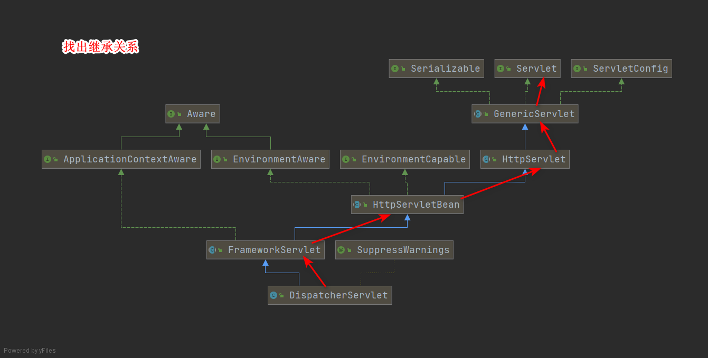

# 一、Spring MVC简介

## 1.什么是MVC

M：Model，模型层，指工程中的JavaBean，作用是处理数据

JavaBean分为两类：

- 一类称为实体类Bean：专门存储业务数据的，如 Student、User 等
- 一类称为业务处理 Bean：指 Service 或 Dao 对象，专门用于处理业务逻辑和数据访问。

V：View，视图层，指工程中的html或jsp等页面，作用是与用户进行交互，展示数据

C：Controller，控制层，指工程中的servlet，作用是接收请求和响应浏览器


工作过程：

1.用户从视图层发送数据到服务器

2.请求数据在服务器中被Controller接收

3.Controller调用相应的Model层处理请求（Model中有业务处理类bean）

4.处理后的结果返回给Controller，Controller根据请求处理结果找到相应的View视图（前端界面）

5.View层渲染数据后返回给浏览器


## 2.什么是springmvc

SpringMVC是Spring的一个后续产品，是Spring的一个子项目

注：三层架构分为表述层（或表示层，表述层表示前台页面和后台servlet）、业务逻辑层（service）、数据访问层（dao）


## 3.特点

- **Spring 家族原生产品**，与 IOC 容器等基础设施无缝对接
- **基于原生的Servlet**，通过了功能强大的**前端控制器DispatcherServlet**，对请求和响应进行统一处理
- 表述层各细分领域需要解决的问题**全方位覆盖**，提供**全面解决方案**
- **代码清新简洁**，大幅度提升开发效率
- 内部组件化程度高，可插拔式组件**即插即用**，想要什么功能配置相应组件即可
- **性能卓著**，尤其适合现代大型、超大型互联网项目要求


# 二、项目搭建以及第一个程序

## 1.基于maven创建一个web项目的方法：

### 方法一：勾选webapp

1.勾选webapp，否则没有web文件夹和web.xml文件


2.设置名字和在maven仓库的GAV坐标


3.设置使用的maven版本的安装路径，用户配置文件，仓库路径


4.项目启动如果出现

java.lang.RuntimeException: java.lang.RuntimeException: org.codehaus.plexus.component.repository.exception.ComponentLookupException: com.google.inject.ProvisionException: Unable to provision, see the following errors:

可能是版本问题，使用长期支持版的maven


---


### 方法二：不选择webapp手动添加web工程（学习中采用）

1.生成maven项目


2.设置gav


3.配置pom.xml：

（1）设置打包方式：

```xml
<groupId>com.almond.springmvc</groupId>
<artifactId>springmvcDemo1</artifactId>
<version>1.0-SNAPSHOT</version>
<!--  因为是web项目，打包方式为war而不是默认的jar  -->
<packaging>war</packaging>
```

（2）引入需要的依赖：

```xml
<dependencies>
    <!-- SpringMVC -->
    <dependency>
        <groupId>org.springframework</groupId>
        <artifactId>spring-webmvc</artifactId>
        <version>5.3.1</version>
    </dependency>

    <!-- 日志 -->
    <dependency>
        <groupId>ch.qos.logback</groupId>
        <artifactId>logback-classic</artifactId>
        <version>1.2.3</version>
    </dependency>

    <!-- ServletAPI -->
    <dependency>
        <groupId>javax.servlet</groupId>
        <artifactId>javax.servlet-api</artifactId>
        <version>3.1.0</version>
        <!--     provided：在项目开发和测试时存在，在部署时不在项目打包后的包中，
        因为服务器为我们提供了这个jar包 ，如果还在打包后的项目中会产生冲突      -->
        <scope>provided</scope>

    </dependency>

    <!-- Spring5和Thymeleaf整合包 -->
    <dependency>
        <groupId>org.thymeleaf</groupId>
        <artifactId>thymeleaf-spring5</artifactId>
        <version>3.0.12.RELEASE</version>
    </dependency>
</dependencies>
```

4.创建webapp文件


如果创建后没有蓝色的点，到pom.xml中加载maven（这与打包方式<package>标签有关）


5.配置web.xml文件


输入正确的路径将WAB-INF放在webapp文件中即可


## 2.在web.xml中配置SpringMVC

springmvc中的DispatcherServlet本质是servlet，需要在web.xml中配置，

根据规范，我们在resources中创建一个SpringMVC.xml，在web.xml中配置这个路径

```xml
<!--配置springMVC，其本质是一个servlet    -->
<servlet>
    <servlet-name>SpringMVC</servlet-name>
    <servlet-class>org.springframework.web.servlet.DispatcherServlet</servlet-class>
    
    <init-param>
        <!--参数contextConfigLocation是用来寻找springMVC的配置文件位置的，默认值在本路径下，
        但是本路径是webapp，按照原则，我们应该在resources中写这些配置文件，所以告知springMVC配置文件的位置            -->
        <param-name>contextConfigLocation</param-name>
        <!--     classpath表示文件java和resources       -->
        <param-value>classpath:SpringMVC.xml</param-value>
    </init-param>
    
    <!--根据servlet的生命周期，servlet在第一次被调用时创建，
    又因为这个servlet是所有操作的总servlet，加载时间长，
    所以我们将他的创建提前到服务器启动时        -->
    <load-on-startup>1</load-on-startup>
</servlet>

<servlet-mapping>
    <servlet-name>SpringMVC</servlet-name>
    <!--    这里/的含义是除了.jsp文件外的所有文件都接收 /*指的是所有文件包括jsp -->
    <!--为什么不能捕获jsp?jsp本质是一个servlet，用到了jsp需要对请求做特殊处理，
    如果DispatcherServlet捕获到这个请求，就对它做了常规操作，不会将其发给指定的jsp处理
        -->
    <url-pattern>/</url-pattern>
</servlet-mapping>
```

## 3.创建请求控制器

前端控制器DispatcherServlet对请求进行了统一处理，但是具体的请求有不同的处理，还需要一个控制器来处理请求，名为请求控制器。

请求控制器中每一个处理请求的方法成为控制器方法

因为SpringMVC的控制器由一个POJO（普通的Java类）担任，因此需要通过@Controller注解将其标识为一个控制层组件，**交给Spring的IOC容器管理，此时SpringMVC才能够识别控制器的存在**

在com.almond.mvc.controller下创建：

```java
@Controller//向IOC注册后，springMVC就了解这个类是请求控制器了
public class HelloController {
    
}
```

## 4.创建springmvc的配置文件

在resources文件下创建：

```xml
<!--开启组件扫描    -->
<coontext:component-scan base-package="com.almond.mvc.controller"></coontext:component-scan>

<!-- 配置Thymeleaf视图解析器 -->
<bean id="viewResolver" class="org.thymeleaf.spring5.view.ThymeleafViewResolver">
    <property name="order" value="1"/>
    <property name="characterEncoding" value="UTF-8"/>
    <property name="templateEngine">
        <bean class="org.thymeleaf.spring5.SpringTemplateEngine">
            <property name="templateResolver">
                <bean class="org.thymeleaf.spring5.templateresolver.SpringResourceTemplateResolver">

                    <!-- 视图前缀 -->
                    <property name="prefix" value="/WEB-INF/templates/"/>

                    <!-- 视图后缀 -->
                    <property name="suffix" value=".html"/>
                    <property name="templateMode" value="HTML5"/>
                    <property name="characterEncoding" value="UTF-8" />
                </bean>
            </property>
        </bean>
    </property>
</bean>

<!-- 开启mvc注解驱动 -->
<mvc:annotation-driven>
    <mvc:message-converters>
        <!-- 处理响应中文内容乱码 -->
        <bean class="org.springframework.http.converter.StringHttpMessageConverter">
            <property name="defaultCharset" value="UTF-8" />
            <property name="supportedMediaTypes">
                <list>
                    <value>text/html</value>
                    <value>application/json</value>
                </list>
            </property>
        </bean>
    </mvc:message-converters>
</mvc:annotation-driven>
```

## 5.测试

### 5.1 一个小细节在html中配置thymeleaf

#### 5.1.1 每次在html标签引入thymeleaf

```html
<html lang="en" xmlns:th="http://www.thymeleaf.org">
```

#### 5.1.2 创建HTML模板

我们可以创建一个新的html模板，在其上修改html标签


### 5.2 另一个细节

在webapp/WEB-INF下创建templates文件夹，将view层的html等文件放在这里，这是由视图前缀决定的.

### 5.3 具体测试以及结果

由于我们配置的前缀后缀

完成后的HelloController.java：

```java
@Controller
public class HelloController {

    //配置请求映射，当访问"/"("/"指的是"http://ip:port/项目名/"即上下文路径context path)时跳转到该方法
    @RequestMapping(value = "/")
    public String index(){
        //返回为跳转的视图名称，返回后会交给视图解析器Thymeleaf解析，加上前后缀就寻找到了index.html
        return "index";
    }

    //当注解()中只有value时可以省略value，这里在访问http://ip:port/项目名/target时调用此方法
    @RequestMapping("/target")
    public String toTarget(){
        return "target";
    }
}
```

完成后的index.html：

```html
<!DOCTYPE html>
<!--配置xmlns:th="http://www.thymeleaf.org"-->
<html lang="en" xmlns:th="http://www.thymeleaf.org">
<head>
    <meta charset="UTF-8">
    <title>首页</title>
</head>
<body>
    <h1>这里是首页</h1>

    <!--thymeleaf实现界面跳转,原本的href中需要填写工程名,但是这个工程名是可变的，th:href则会替我们在/前加上工程名-->
    <a th:href="@{/target}">th方法跳转至target</a>
<!--    成功访问，说明采用了请求转发，访问结果的url：http://localhost:8080/springmvc1/target-->
    
    <a href="target.html">原始方法直接去target</a>
    <!--这里的herf相当于"/springmvcDemo2/target.html"-->
<!--  权限原因，资源在WEB-INF下无法访问到url:http://localhost:8080/springmvc1/target.html-->
<!--    404，The requested resource is not available.-->

</body>
</html>
```

target.html：

```html
<!DOCTYPE html>
<html lang="en" xmlns:th="http://www.thymeleaf.org">
<head>
    <meta charset="UTF-8">
    <title>$Title$</title>
</head>
<body>
 target界面
</body>
</html>
```

## 6.过程总结

数据从浏览器发送而来：

1.如果不是jsp发送的请求，被前端控制器DispatcherServlet处理

2.前端处理器DispatcherServlet读取SpringMVC的配置文件，从中开启组件扫描，引入thymeleaf

3.组件扫描查询到我们创建的拥有@Controller注解的请求控制器

4.请求控制器将请求控制方法上的@RequestMapping注解的value值与请求的url比对，从而确定调用哪个方法

5.请求处理方法返回一个字符串，这个字符串是去掉后缀的html文件名

6.视图解析器thymeleaf接收到这个字符串，通过与我们配置的视图前缀，视图后缀拼接，完成路径的url

7.视图解析器对该url对应的界面进行渲染，返回给浏览器。

# 三、@RequestMapping注解

## 1.概念

@RequestMapping注解的作用就是将请求和处理请求的控制器方法关联起来，建立映射关系。

SpringMVC 接收到指定的请求，就会来找到在映射关系中对应的控制器方法来处理这个请求。

## 2.位置

可以放在类名上或者方法上，如果放在类上，整个类的控制器方法都是默认加上类的url再加自己注解的url

```java
@Controller//不要忘了加注解以便组件扫描到
//设置类路径，表示这个类的请求控制方法的匹配的url为"/hello"+"类的RequestMapping的value"
@RequestMapping("/hello")
public class UserController2 {
    //url为http://localhost:8080/springmvcDemo2/target无法访问到target界面
    //url为http://localhost:8080/springmvcDemo2/hello/target才能访问
    @RequestMapping("/target")
    public String toTarget() {
        return "target";
    }
}
```

## 3.属性

### 3.1 value

通过value来确定捕获的url

value属性必不可少

value为一个String[]，也就是说一个控制器方法可以捕获多个url

```java
@RequestMapping(value = {"target1","target2"})
public String toTarget1() {
    return "target";
}
```

如下的url将被捕获：

```html
<a th:href="@{/target1}">target1</a>
<a th:href="@{/target2}">target2</a>
```

### 3.2 method

method决定控制器方法捕获的请求方式，当value满足的情况下method也要满足才能匹配。不写method属性视为接收任何请求方式的请求。

method是String[]类型可以接收多种请求方式。

若当前请求的请求地址满足请求映射的value属性，但是请求方式不满足method属性，则浏览器报错405：Request method 'POST' not supported

```java
@RequestMapping(
        value = {"target"},
        method = {RequestMethod.GET}//接收/target路径而且为get请求
        //RequestMethod是一个枚举类，含有多种请求方式
        )
public String toTarget2() {
    return "target";
}
```

post请求无法访问

```html
<form th:action="@{/target}" method="post">
    <input type="submit" value="post请求去target">
<!--  405请求方式不被允许  -->
</form>

<a th:href="@{/target}">get请求去target</a>
<!--可以到target界面-->
```

> 注：
>
> 1、对于处理指定请求方式的控制器方法，SpringMVC中提供了@RequestMapping的派生注解
>
> 处理get请求的映射-->@GetMapping
>
> 处理post请求的映射-->@PostMapping
>
> 处理put请求的映射-->@PutMapping
>
> 处理delete请求的映射-->@DeleteMapping
>
> 2、常用的请求方式有get，post，put，delete
>
> 但是目前浏览器只支持get和post，若在form表单提交时，为method设置了其他请求方式的字符串（put或delete），则按照默认的请求方式get处理
>
> 若要发送put和delete请求，则需要通过spring提供的过滤器HiddenHttpMethodFilter，在RESTful部分会讲到

### 3.3 params

params属性用于和请求参数建立映射

@RequestMapping注解的params属性是一个字符串类型的数组

有四种格式：

1."param"：请求参数中必须有param，没有就400error

> 400error:Parameter conditions "username, !password" not met for actual request parameters: 

2."!param"：请求参数不能携带param请求参数，有就400error

3."param=value"：要求请求映射所匹配的请求必须携带param请求参数且param=value，不满足就400error

4."param!=value"：要求请求映射所匹配的请求必须携带param请求参数但是param!=value，不满足就400error

使用方法：

```java
 @RequestMapping(
            value = {"targetParam"},
            params = {"username","!password"}//必须有参数username,一定不能有password参数
            )
    public String toTarget3() {
        return "target";
    }
```

### 3.4 headers

@RequestMapping注解的headers属性通过请求的请求头信息匹配请求映射

@RequestMapping注解的headers属性是一个字符串类型的数组，可以通过四种表达式设置请求头信息和请求映射的匹配关系

"header"：要求请求映射所匹配的请求必须携带header请求头信息

"!header"：要求请求映射所匹配的请求必须不能携带header请求头信息

"header=value"：要求请求映射所匹配的请求必须携带header请求头信息且header=value

"header!=value"：要求请求映射所匹配的请求必须携带header请求头信息且header!=value

若当前请求满足@RequestMapping注解的value和method属性，但是不满足headers属性，此时页面显示404错误，即资源未找到

## 4.SpringMVC支持ant风格的路径

？：表示任意的单个字符

*：表示任意的0个或多个字符

\**：表示任意的一层或多层目录，可表示0层目录，表示没有这一层

注意：在使用\**时，只能使用/**/xxx的方式

## 5.SpringMVC支持路径中的占位符

原始方式：/deleteUser?id=1

rest方式：/deleteUser/1

SpringMVC路径中的占位符常用于RESTful风格中，使用方法：

1.在路径中使用{k1}拼接url

2.需要使用注解@PathVariable("paramName")修饰参数列表的参数v1，v1的值来自于请求路径中的/{k1}/的部分（访问时{k1}被具体值代替）

```java
@RequestMapping(
        value = {"test1/{id}/{username}"}
)
public String toTarget4(@PathVariable("id") Integer id,@PathVariable("username") String username) {
    System.out.println(id);
    System.out.println(username);
    return "target";
}
```

> 如果选择了使用这种参数充当/中内容的方式，参数是必须要传入的，否则就会无法访问：
>
> http://localhost:8080/springmvcDemo2/test1/
>
> http://localhost:8080/springmvcDemo2/test1
>
> 都无法访问。
>
> 404error

# 四、SpringMVC获取请求参数

## 1. 通过ServletAPI获取（不推荐）

直接在参数列表中写HttpServletRequest，就会获得到本次的请求

```java
@RequestMapping(value = {"/request"})
public String toTarget(HttpServletRequest request) {
    String username = request.getParameter("username");
    String password = request.getParameter("password");
    System.out.println(username + password);
    return "request";
}
```

## 2. 通过控制器方法的形参获取请求参数

只要形参和请求参数的名字相同，我们就能直接获取到这个请求参数

当一个请求参数名对应多个值（复选框checkbox）参数列表的情况为

​	...&hobby=java&hobby=c&hobby=c++

此时，仍然可以使用String hobby获取结果是字符串"java,c,c++"；

更好的办法是使用String[]获取：

```java
//    直接通过形参名和请求参数名对应来获取请求参数
    @RequestMapping(value = {"/request1"})
    public String toTarget1(String username,String password,String[] hobby) {
        //对于请求参数中出现多个重名的请求参数，可以设置字符串类型或字符串数组类型接收此请求参数
        System.out.println(username + password);
        System.out.println(Arrays.toString(hobby));//[java, c, c++]
        return "request";
    }
```

此外当不能满足参数和形参列表的参数名相同的情况时，使用注解@RequestParam修饰形参：

```java
@RequestMapping(value = {"/request1"})
public String toTarget2(
        //设置username形参和aaa_name参数对应，
        // 而且这个参数可以为空（默认是必须要传该参数,如果没有传该参数而且没有设置defaultValue，则报400error），
        // 默认值为json
        @RequestParam(value = "aaa_name",required = false,defaultValue = "json") String username,
        String password,
        String[] hobby) {
    System.out.println(username + password);
    System.out.println(Arrays.toString(hobby));
    return "request";
}
```

@RequestParam注解一共有三个属性：

value：指定为形参赋值的请求参数的参数名

required：设置是否必须传输此请求参数，默认值为true

若设置为true时，则当前请求必须传输value所指定的请求参数，若没有传输该请求参数，且没有设置defaultValue属性，则页面报错400：Required String parameter 'xxx' is not present；若设置为false，则当前请求不是必须传输value所指定的请求参数，若没有传输，则注解所标识的形参的值为null

defaultValue：不管required属性值为true或false，当value所指定的请求参数没有传输或传输的值为""时，则使用默认值为形参赋值

## 3. @RequestHeader

@RequestHeader是将请求头信息和控制器方法的形参创建映射关系

@RequestHeader注解一共有三个属性：value、required、defaultValue，用法同@RequestParam

```java
@RequestMapping(value = {"/testBean1"})
public String testBean1(
        User user,
        @RequestHeader("Host") String host) {
    System.out.println(host);//localhost:8080
    return "target";
}
```

## 4. @CookieValue

@CookieValue是将cookie数据和控制器方法的形参创建映射关系

@CookieValue注解一共有三个属性：value、required、defaultValue，用法同@RequestParam

要注意的是，只有存在session时才能生效，所以这里测试使用了默认值

```JAVA
@RequestMapping(value = {"/testBean2"})
public String testBean2(
        User user,
        @CookieValue(value = "JSESSIONID",required = false,defaultValue = "noSession") String JSESSIONID) {
    System.out.println(JSESSIONID);
    return "target";
}
```

## 5. 通过pojo对象来获取请求参数

实体类获取请求参数，要求实体类的属性和参数名一致(set方法中的属性名字和参数名要一致)：

```java
@RequestMapping("/testBean")
public String testBean(User user){
    System.out.println(user);
    return "target";
}
```

## 6. 解决乱码问题

设置字符集必须在获取参数之前，而springmvc中获取参数是在前端处理器，我们在代码层面是无法干涉的。所以选择使用三大组件，Listener是不行的，它不能每次访问都捕获请求，因此使用Filter。

在web.xml中配置：

```xml
<!--    因为有前端处理器在最早就获取了请求参数，而设置字符集必须在获取请求参数之前，所以要用filter实现，
拦截所有的url，设置请求和响应的字符集为UTF-8-->
<filter>
    <filter-name>CharacterEncodingFilter</filter-name>
    <filter-class>org.springframework.web.filter.CharacterEncodingFilter</filter-class>
    <init-param>
        <!--配置encoding为UTF-8，不需要配置forceRequestEncoding-->
        <param-name>encoding</param-name>
        <param-value>UTF-8</param-value>
    </init-param>
    <init-param>
        <!--配置响应字符集-->
        <param-name>forceResponseEncoding</param-name>
        <param-value>true</param-value>
    </init-param>
</filter>
<filter-mapping>
    <filter-name>CharacterEncodingFilter</filter-name>
    <url-pattern>/*</url-pattern>
</filter-mapping>
```

关于为什么这样配置参数，CharacterEncodingFilter中关于字符设定的代码：

```java
if (encoding != null) {
   if (isForceRequestEncoding() || request.getCharacterEncoding() == null) {
      request.setCharacterEncoding(encoding);
   }
   if (isForceResponseEncoding()) {
      response.setCharacterEncoding(encoding);
   }
}
```

# 五、域对象共享数据

域对象：request域，session域，application域（java中为ServletContext域）等

## 1. 向request域加入数据

### 1.1 使用Servlet原生API（不推荐使用）

```java
@RequestMapping("/testServletAPI")
public String testServletAPI(HttpServletRequest request) {
    request.setAttribute("testRequestScope", "AccessByServletAPI");
    return "success";
}
```

### 1.2 使用ModelAndView（Spring推荐使用）

```java
@RequestMapping("/testModelAndView")
public ModelAndView testModelAndView() {
    ModelAndView mav = new ModelAndView();
    //设置域对象
    mav.addObject("testRequestScope", "AccessByModelAndView");
    //设置视图名称
    mav.setViewName("success");
    return mav;
}
```

### 1.3 使用Model

```java
@RequestMapping("/testModel")
public String testModel(Model model){
    model.addAttribute("testRequestScope","AccessByModel");
    return "success";
}
```

### 1.4 使用Map

```java
@RequestMapping("/testMap")
public String testModel(Map<String,Object> map){
    map.put("testRequestScope","AccessByMap");
    return "success";
}
```

### 1.5 使用ModelMap

```
@RequestMapping("/testModelMap")
public String testModel(ModelMap map){
    map.addAttribute("testRequestScope","AccessByModelMap");
    return "success";
}
```


### 1.6Model，ModelMap，Map的关系


```java
public interface Model{}
public class ModelMap extends LinkedHashMap<String, Object> {}
public class ExtendedModelMap extends ModelMap implements Model {}
public class BindingAwareModelMap extends ExtendedModelMap {}
```


## 2. 向session域中加入数据

```java
@RequestMapping("/testSession")
public String testSession(HttpSession session){
    session.setAttribute("testSessionScope","AccessBySession");
    return "success";
}
```


## 3. 向application域中加入数据

```java
@RequestMapping("/testApplication")
public String testApplication(HttpSession session){
    ServletContext application = session.getServletContext();
    application.setAttribute("testApplicationScope","AccessByApplication");
    return "success";
}
```


# 六、SpringMVC的视图

SpringMVC中的视图是View接口，通过使用Model中的数据，渲染这些数据成为界面展示给用户。

SpringMVC有很多视图，默认有转发视图和重定向视图，当引入jstl依赖还会将转发视图转换为jstlView。

当引入thymeleaf后，由thymeleaf视图解析器解析的视图为thymeleaf视图

## 1. Thymeleaf视图

当我们使用Thymeleaf视图解析技术，而且返回值没有任何前缀，默认使用Thymeleaf进行拼接，为请求转发方式：

```java
@RequestMapping("testThymeleaf")
public String testThymeleaf(){
    return "success";
}
```

debug查看发现创建的是ThymeleafView：


## 2. forward前缀产生InternalResourceView

当控制器方法中返回值带有前缀forward，创建InternalResourceView，而且不会被thymeleaf解析，去掉前缀后直接作为最终路径进行**请求转发**：

```java
@RequestMapping("testForward")
public String testForward(){
    return "forward:/testThymeleaf";//跳转到http://ip:port/工程名/testThymeleaf
}
```

debug查看类型：


## 3. redirect前缀产生RedirectView

当控制器方法返回值有redirect前缀时，创建RedirectView，而且这个视图不会被thymeleaf解析，去掉前缀成为最终地址进行**重定向**

```java
@RequestMapping("testRedirect")
public String testRedirect(){
    return "redirect:/testThymeleaf";
}
```

debug查看类型：


## 4. 在SpringMVC配置文件中配置视图控制器

当我们在控制器方法中只是简单的实现了视图名的返回时，我们可以在SpringMVC.xml中配置一个视图控制器来代替这个控制器方法；

如下控制器方法简单的返回了视图名而没有做任何处理，可以在xml中配置这个控制器方法

```java
@RequestMapping("/")
public String toIndex(){
    return "index";
}
```

在SpringMVC.xml中，注意一旦开启了一个view-controller标签，所有controlle方法都会失效，想要正常使用控制器方法，必须加上注解驱动

```xml
<!--一旦设置了一个view-controller，所有的controller类都会失效-->
<mvc:view-controller path="/" view-name="index"></mvc:view-controller>
<!--开启注解驱动，可以让controller类重新生效-->
<mvc:annotation-driven/>
```

# 七、RESTful

## 1. RESTful简介

REST：**Re**presentational **S**tate **T**ransfer，表现层资源状态转移。

资源：服务器由各个离散的资源组成，是以名称为核心来组织的。资源可以由一个URI标识，URI就是资源的名称，也是资源的地址。

资源的表述：对于资源在某个特殊时刻的状态的描述，可以在服务器和客户端之间交换。资源的表述的格式有HTML/CSS/JSON/文本/视频/图片等等

状态转移：在客户端和服务器端之间转移（transfer）代表资源状态的表述。通过转移和操作资源的表述，来间接实现操作资源的目的。

## 2. RESTful的实现

具体说，就是 HTTP 协议里面，四个表示操作方式的动词：GET、POST、PUT、DELETE。

它们分别对应四种基本操作：GET 用来获取资源，POST 用来新建资源，PUT 用来更新资源，DELETE 用来删除资源。

REST 风格提倡 URL 地址使用统一的风格设计，从前到后各个单词使用斜杠分开，不使用问号键值对方式携带请求参数，而是将要发送给服务器的数据作为 URL 地址的一部分，以保证整体风格的一致性。

| 操作     | 传统方式         | REST风格                |
| -------- | ---------------- | ----------------------- |
| 查询操作 | getUserById?id=1 | user/1-->get请求方式    |
| 保存操作 | saveUser         | user-->post请求方式     |
| 删除操作 | deleteUser?id=1  | user/1-->delete请求方式 |
| 更新操作 | updateUser       | user-->put请求方式      |

## 3. HiddenHttpMethodFilter

浏览器只支持get和post请求，如何发送put和delete请求呢？

SpringMVC 提供了 **HiddenHttpMethodFilter** 帮助我们**将 POST 请求转换为 DELETE 或 PUT 请求**

```xml
<!--配置put，delete的请求处理器-->
<filter>
    <filter-name>HiddenHttpMethodFilter</filter-name>
    <filter-class>org.springframework.web.filter.HiddenHttpMethodFilter</filter-class>
</filter>
<filter-mapping>
    <filter-name>HiddenHttpMethodFilter</filter-name>
    <url-pattern>/*</url-pattern>
</filter-mapping>
```

HiddenHttpMethodFilter底层的方法：


> 注：
>
> 目前为止，SpringMVC中提供了两个过滤器：CharacterEncodingFilter和HiddenHttpMethodFilter
>
> 在web.xml中注册时，必须先注册CharacterEncodingFilter，再注册HiddenHttpMethodFilter
>
> 因为
>
> 在 CharacterEncodingFilter 中通过 request.setCharacterEncoding(encoding) 方法设置字符集的
>
> request.setCharacterEncoding(encoding) 方法要求前面不能有任何获取请求参数的操作

# 八、RESTful案例

## 1. 前置准备

实体类：

```java
package com.atguigu.mvc.bean;

public class Employee {

   private Integer id;
   private String lastName;

   private String email;
   //1 male, 0 female
   private Integer gender;
   
   public Integer getId() {
      return id;
   }

   public void setId(Integer id) {
      this.id = id;
   }

   public String getLastName() {
      return lastName;
   }

   public void setLastName(String lastName) {
      this.lastName = lastName;
   }

   public String getEmail() {
      return email;
   }

   public void setEmail(String email) {
      this.email = email;
   }

   public Integer getGender() {
      return gender;
   }

   public void setGender(Integer gender) {
      this.gender = gender;
   }

   public Employee(Integer id, String lastName, String email, Integer gender) {
      super();
      this.id = id;
      this.lastName = lastName;
      this.email = email;
      this.gender = gender;
   }

   public Employee() {
   }
}
```

准备dao模拟数据:(并不直接操作数据库,id自增)

```java
package com.atguigu.mvc.dao;

import java.util.Collection;
import java.util.HashMap;
import java.util.Map;

import com.atguigu.mvc.bean.Employee;
import org.springframework.stereotype.Repository;


@Repository
public class EmployeeDao {

   private static Map<Integer, Employee> employees = null;
   
   static{
      employees = new HashMap<Integer, Employee>();

      employees.put(1001, new Employee(1001, "E-AA", "aa@163.com", 1));
      employees.put(1002, new Employee(1002, "E-BB", "bb@163.com", 1));
      employees.put(1003, new Employee(1003, "E-CC", "cc@163.com", 0));
      employees.put(1004, new Employee(1004, "E-DD", "dd@163.com", 0));
      employees.put(1005, new Employee(1005, "E-EE", "ee@163.com", 1));
   }
   
   private static Integer initId = 1006;
   
   public void save(Employee employee){
      if(employee.getId() == null){
         employee.setId(initId++);
      }
      employees.put(employee.getId(), employee);
   }
   
   public Collection<Employee> getAll(){
      return employees.values();
   }
   
   public Employee get(Integer id){
      return employees.get(id);
   }
   
   public void delete(Integer id){
      employees.remove(id);
   }
}
```

## 2. 功能

| 功能                | URL 地址    | 请求方式 |
| ------------------- | ----------- | -------- |
| 访问首页√           | /           | GET      |
| 查询全部数据√       | /employee   | GET      |
| 删除√               | /employee/2 | DELETE   |
| 跳转到添加数据页面√ | /toAdd      | GET      |
| 执行保存√           | /employee   | POST     |
| 跳转到更新数据页面√ | /employee/2 | GET      |
| 执行更新√           | /employee   | PUT      |

## 3. 具体功能

### 3.1 访问首页

mvc的配置文件中：

```xml
<mvc:view-controller path="/" view-name="index"></mvc:view-controller>
<mvc:annotation-driven/>
```

创建相应的index即可

```html
<!DOCTYPE html>
<html lang="en" xmlns:th="http://www.thymeleaf.org">
<head>
    <meta charset="UTF-8">
    <title>首页</title>
</head>
<body>
<h1>这里是首页</h1>
<a th:href="@{/employee}">转到员工界面</a>
</body>
</html>
```

### 3.2 查询所有员工数据

控制器中：

```java
@Controller
public class EmployeeController {
    @Autowired
    private EmployeeDao employeeDao;

    @RequestMapping(value = {"/employee"},method = RequestMethod.GET)
    public String getEmployeeAsList(Model model){
        Collection<Employee> employeeList = employeeDao.getAll();
        model.addAttribute("employeeList",employeeList);
        return "employee_list";
    }
    ...
```

完整的（增删改查都有）html：

```html
<!DOCTYPE html>
<html lang="en" xmlns:th="http://www.thymeleaf.org">
<head>
    <meta charset="UTF-8">
    <title>员工列表</title>
</head>
<body>
<table id="dataTable" border="1" cellspacing="0" cellpadding="0" style="text-align: center">
    <tr><th colspan="5">Employee Info</th></tr>
    <tr>
        <th>id</th>
        <th>lastName</th>
        <th>email</th>
        <th>gender</th>
        <th>options((<a th:href="@{/toAdd}">add</a>))</th>
    </tr>
    <tr th:each="employee : ${employeeList}" >
        <td th:text="${employee.id}"></td>
        <td th:text="${employee.lastName}"></td>
        <td th:text="${employee.email}"></td>
        <td th:text="${employee.gender}"></td>
        <td>
                <!--链接的拼接有两种方法-->
<!--            <a th:href="@{'/employee/'+${employee.id}}">delete</a>-->
            <a @click="deleteEmployee" th:href="@{/employee/}+${employee.id}">delete</a>
            <a th:href="@{/employee/}+${employee.id}">update</a>
        </td>
    </tr>

</table>

    <!--删除请求，以post方式发送，隐藏域中表示真正的请求方式为delete-->
    <form id="deleteForm" method="post">
        <input type="hidden" name="_method" value="delete">
    </form>

    <script type="text/javascript" th:src="@{/static/js/vue.js}"></script>
    <script type="text/javascript">
        let vue = new Vue({
            el: "#dataTable",//设置容器包括要操作的标签，通过id获取这个容器
            methods:{
                deleteEmployee:function (event){//点击目标标签（@click）调用对应的函数
                    //获取对应的含有隐藏域的表单deleteForm
                    let deleteForm = document.getElementById("deleteForm");
                    //设置这个表单的action值
                    deleteForm.action = event.target.href;
                    //提交表单
                    deleteForm.submit();
                    //取消超链接的默认行为
                    event.preventDefault();
                }
            }
        });
    </script>

</body>
</html>
```

### 3.3 删除功能

删除是需要用<a>标签写出来的，但是<a>标签为get请求。我们需要使用delete请求，这时选用一个空表单来发送这个请求。


1.新建实现删除请求的空表单：

```html
<!--删除请求，以post方式发送，隐藏域中表示真正的请求方式为delete-->
<form id="deleteForm" method="post">
    <input type="hidden" name="_method" value="delete">
</form>
```

2.用vue实现为a标签绑定单击事件，注意拼接路径的方式

(1)创建a标签

方式1：（无视这个@click）

```html
<a @click="deleteEmployee" th:href="@{/employee/}+${employee.id}">delete</a>
```

方式2：

```html
<a th:href="@{'/employee/'+${employee.id}}">delete</a>
```


(2)引入vue：

1)将vue.js放在webapp/static下

2)在需要的界面引入vue.js

```html
<script type="text/javascript" th:src="@{/static/js/vue.js}"></script>
```

3)当我们引入任何的静态资源（放在static文件夹中的都是），我们不可能使用thymeleaf解析，**因为我们不会为这些静态资源创建控制器方法，使用@RequestMapping注解进行映射**

在mvc配置文件中加入：（适用于任何静态资源的引入）

```html
<!--静态资源的访问需要使用默认路径查找，
如果采用前端处理器的方式，前端处理器是servlet，
他拦截所有请求并查找是否有@RequestMapping注解的value与这个路径对应，
我们不可能给静态资源配置路径，所以无法找到-->
<!--设置默认路径查找，即不增加前后缀的方式查找，如果在前端控制器中的方式中没有找到路径，就使用默认方式查找-->
    <mvc:default-servlet-handler/>
```


（3）vue绑定事件

```html
<script type="text/javascript">
    let vue = new Vue({
        el: "#dataTable",//设置容器包括要操作的标签，通过id获取这个容器
        methods:{
            deleteEmployee:function (event){//点击目标标签（@click）调用对应的函数
                //获取对应的含有隐藏域的表单deleteForm
                let deleteForm = document.getElementById("deleteForm");
                //设置这个表单的action值
                deleteForm.action = event.target.href;
                //提交表单
                deleteForm.submit();
                //取消超链接的默认行为
                event.preventDefault();
            }
        }
    });
</script>
```

3.控制器方法

```java
@RequestMapping(value = {"/employee/{id}"},method = RequestMethod.DELETE)
public String deleteEmployee(@PathVariable("id") Integer id){
    employeeDao.delete(id);
    return "redirect:/employee";
}
```

### 3.4 数据添加

html中：

```html
<th>options((<a th:href="@{/toAdd}">add</a>))</th>
```

视图控制器标签跳转到添加数据的界面：

```html
<mvc:view-controller path="/toAdd" view-name="add"></mvc:view-controller>
```

添加数据界面：

```html
<!DOCTYPE html>
<html lang="en" xmlns:th="http://www.thymeleaf.org">
<head>
    <meta charset="UTF-8">
    <title>添加员工</title>
</head>
<body>
<form th:action="@{/employee}" method="post">
    lastName:<input type="text" name="lastName"><br>
    email:<input type="text" name="email"><br>
    gender:
    male<input type="radio" name="gender" value="1">
    female<input type="radio" name="gender" value="0">
    <br>
    <input type="submit" value="add"><br>
</form>
</body>
</html>
```

保存添加的数据：

```java
/*
实现时的一个问题：
	bug，在插入中文字符时返回乱码，debug确定了在dispatcherServlet中设置了响应字符集为UTF-8，但是IOC获取到的employee中lastName为乱码；
	反转了，不是bug，在xml配置字符集filter时<filter-mapping>写到另一个<filter>后了，导致先获取了参数,设置失败
*/
@RequestMapping(value = "/employee",method = RequestMethod.POST)
public String addEmployee(Employee employee, HttpServletResponse response){
    employeeDao.save(employee);
    return "redirect:/employee";
}
```

### 3.5 数据更新

html中：

```html
<a th:href="@{/employee/}+${employee.id}">update</a>
```

update界面：

注意id不能更改，但是要传参，设置在隐藏域

设置一个put请求方式的隐藏域以便更新数据

```html
<!DOCTYPE html>
<html lang="en" xmlns:th="http://www.thymeleaf.org">
<head>
    <meta charset="UTF-8">
    <title>修改员工</title>
</head>
<body>
<form th:action="@{/employee}" method="post">
    <input type="hidden" name="_method" value="put">
    <input type="hidden" name="id" th:value="${employee.id}">
    lastName:<input type="text" name="lastName" th:value="${employee.lastName}"><br>
    email:<input type="text" name="email" th:value="${employee.email}"><br>
    gender:
    male<input type="radio" name="gender" value="1" th:field="${employee.gender}">
    female<input type="radio" name="gender" value="0" th:field="${employee.gender}">
    <br>
    <input type="submit" value="update"><br>
</form>
</body>
</html>
```

实现向update.html跳转的控制器方法：

```java
@RequestMapping(value = {"/employee/{id}"},method = RequestMethod.GET)
public String getEmployeeById(@PathVariable("id") Integer id,Model model){
    Employee employee = employeeDao.get(id);
    model.addAttribute("employee",employee);
    return "update";
}
```

执行更新：

注意发送重定向到获取所有员工数据的控制器方法

```java
@RequestMapping(value = "employee",method = RequestMethod.PUT)
public String updateEmployee(Employee employee){
    employeeDao.save(employee);//save中自带修改功能
    return "redirect:/employee";
}
```

# 九、HttpMessageConverter

HttpMessageConverter，报文信息转换器，将请求报文转换为Java对象，或将Java对象转换为响应报文

HttpMessageConverter提供了两个注解和两个类型：@RequestBody，@ResponseBody，RequestEntity，ResponseEntity

## 1. @RequestBody

使用@RequestBody标识的形参会被注入请求体requestBody

界面：

```html
<form th:action="@{/testRequestBody}" method="post">
    username:<input type="text" name="username">
    password:<input type="text" name="password">
    <input type="submit" value="提交">
</form>
```

控制器方法：

```java
@RequestMapping(value = "/testRequestBody",method = RequestMethod.POST)
public String testRequestBody(@RequestBody String requestBody){
    System.out.println(requestBody);//username=aad&password=1234
    return "success";
}
```

## 2. RequestEntity

RequestEntity作为形参出现在参数列表，即可接收整个请求（包括请求头和请求体）

界面：

```html
<form th:action="@{/testRequestEntity}" method="post">
    username:<input type="text" name="username">
    password:<input type="text" name="password">
    <input type="submit" value="提交">
</form>
```

控制器方法：

```java
@RequestMapping(value = "/testRequestEntity",method = RequestMethod.POST)
public String testRequestBody(RequestEntity<String> requestEntity){
    System.out.println(requestEntity.getHeaders());
    System.out.println(requestEntity.getBody());
    return "success";
}
```

## 3. 原生响应

测试标签：

```html
<a th:href="@{/testResponse}">测试原生api的response</a><br>
```

控制器方法：

```java
@RequestMapping(value = "/testResponse",method = RequestMethod.GET)
public void testResponse(HttpServletResponse resp) throws IOException {
    resp.setContentType("text/html;charset=utf-8");
    resp.getWriter().write("原生response的响应");
}
```

## 4. 使用注解@ResponseBody的响应

被@ResponseBody标识的控制器方法返回值不再被解析为页面，而是返回给请求界面的响应

测试标签：

```html
<a th:href="@{/testResponseBody}">testResponseBody</a><br>
```

控制器方法：

```java
@RequestMapping(value = "/testResponseBody",method = RequestMethod.GET)
@ResponseBody
public String testResponseBody(){
    return "hello,response";
    //由于@ResponseBody，返回值的内容不再被解析成view而是response的输出流
}
```

## 5.使用注解@ResponseBody而且返回值为自定义对象的响应

提供一个类：

```java
public class User {
    private Integer id;
    private String username;
    private String password;
    private Integer age;
    private String gender;
    //自行提供get，set等方法
}
```

测试标签：

```
<a th:href="@{/testResponseBodyByUser}">testResponseBodyByUser</a><br>
```

控制器方法：

```java
@RequestMapping( "/testResponseBodyByUser")
@ResponseBody//有这个标识后，如果返回值为对象就能将其转换为json格式的字符串
public User testResponseBodyByUser(){
    return new User(1001,"tom","123456",11,"男");
}
```

我们不能向客户端传输后端的java对象，这里只能传输json，这里必须引入json才能使用


引入json:

1.pom.xml中加入：

```xml
<!--引入json-->
<dependency>
    <groupId>com.fasterxml.jackson.core</groupId>
    <artifactId>jackson-databind</artifactId>
    <version>2.12.1</version>
</dependency>
```

2.mvc配置文件中开启注解驱动：

```xml
<mvc:annotation-driven />
```


## 6. SpringMVC处理ajax请求

前置：

引入vue.js，axios.js放置在webapp/static中，保证开启默认路径查找

```xml
<mvc:default-servlet-handler/>
```


html：

1.配置a标签，挂载方法，设置id，设置跳转路径

```html
<a id="app" @click="testAxios" th:href="@{/testAxios}">testAxios</a>
```

2.引入vue和axios

```html
<script type="text/javascript" th:src="@{/static/js/vue.js}"></script>
<script type="text/javascript" th:src="@{/static/js/axios-min.js}"></script>
```

3.设置a标签的行为

```html
<script type="text/javascript">
    let vue = new Vue({
        el: "#app",//通过id找到目标标签对象
        methods: {
            testAxios : function (event){
                axios({
                    method:"post",
                    url: event.target.href,//设置发送的url
                    params:{//这里随便写的一些内容，为了确定后端获得了这些数据
                        username:"admin",
                        password:"123456"
                    }
                }).then(function (response){
                    //后端处理完成的回调
                    alert(response.data);
                });
                //阻止默认行为
                event.preventDefault();
            }
        }
    });
</script>
```


java：controller中

```java
@RequestMapping("/testAxios")
@ResponseBody
public String testAxios(String username,String password){
    System.out.println(username+","+password);
    return "hello,axios";
}
```

## 7. @RestController注解

@RestController注解是springMVC提供的一个复合注解，标识在控制器的类上，就相当于为类添加了@Controller注解，并且为其中的每个方法添加了@ResponseBody注解

## 8. ResponseEntity

ResponseEntity用于控制器方法的返回值类型，该控制器方法的返回值就是响应到浏览器的响应报文，常用于文件下载

# 十、文件上传和下载

## 1. 文件下载

使用ResponseEntity实现下载文件的功能：

控制器方法：这里没有使用try-catch

```java
@RequestMapping("/fileDownload")
public ResponseEntity fileDownload(HttpSession session) throws IOException {
    //使用servletContext获取资源在工程中的路径
    ServletContext context = session.getServletContext();
    //该路径在target目录（服务器部署的工程中，而不是我们正在操作的当前工程）下寻找
    // 默认url为"工程名"，我们要写的路径在其后拼接，注意以/开头
    String realPath = context.getRealPath("/static/imgs/atri.png");
    //创建流，读入这个文件
    InputStream inputStream = new FileInputStream(realPath);
    //inputStream.available()文件的字节大小，这个文件有多少字节就创建多大的字节数组
    byte[] bytes = new byte[inputStream.available()];
    //将文件写入到字节数组
    inputStream.read(bytes);
    
    //设置响应头信息，下载的方式和下载的默认文件名
    HttpHeaders httpHeaders = new HttpHeaders();
    httpHeaders.add("Content-Disposition","attachment;filename=atri.png");
    //设置响应状态码
    HttpStatus statusCode = HttpStatus.OK;
    //设置ResponseEntity
    ResponseEntity<byte[]> responseEntity = new ResponseEntity<>(bytes, httpHeaders, statusCode);
    //关闭输入流,最好使用finally
    inputStream.close();
    return responseEntity;
}
```

不需要准备新的html文件，直接在index.html中写出这个控制器方法的路径

```html
<a th:href="@{/fileDownload}">下载atri.png</a>
```

## 2. 文件上传

**（1）条件：**

1.文件上传使用表单实现

2.该表单为post请求方式

3.设置属性enctype="multipart/form-data"

4.引入文件上传的依赖jar包

在pom.xml中：

```xml
<!--文件上传-->
<dependency>
    <groupId>commons-fileupload</groupId>
    <artifactId>commons-fileupload</artifactId>
    <version>1.3.1</version>
</dependency>
```

**（2）配置MultipartFile解析器**

SpringMVC中为我们准备了MultipartFile类接收用户上传的文件，为了实现这一功能，在SpringMVC中配置它的解析器：

注意必须设置id为multipartResolver

```xml
<!--文件上传，mvc封装了MultipartFile，我们在控制器方法中接收这个MultipartFile即可获取上传的文件    -->
<!--上传的文件需要进过解析后才能在IOC中生成MultipartFile,现在来配置这个文件解析器multipartResolver    -->
<!--SpringMVC中使用id来搜索文件解析器multipartResolver，而不是根据类搜索，因此我们必须提供id值为multipartResolver    -->

<bean id="multipartResolver" class="org.springframework.web.multipart.commons.CommonsMultipartResolver"></bean>
```

**（3）配置前端界面**

```html
<form th:action="@{/fileUploadTest}" method="post" enctype="multipart/form-data">
    <!--name属性应当与控制器方法中的形参名一致-->
    头像:<input type="file" name="file"><br>
    <input type="submit" value="上传文件">
</form>
```

**（5）配置该前端界面的视图控制器**

```
<mvc:view-controller path="/fileUpload" view-name="fileUpload"></mvc:view-controller>
```

**（6）配置form发送请求的url的控制器方法**

```java
@RequestMapping("/fileUploadTest")
    public String testFileUpload(MultipartFile file, HttpSession session) throws IOException {
        //getOriginalFilename获取这个文件的名字,注意不是getName
        String filename = file.getOriginalFilename();
//        System.out.println(file.getName());//file

        //获取后缀名，从最后一个.处(包括.)开始截取，直到末尾
        String suffixName = filename.substring(filename.lastIndexOf("."));
        String uuid = UUID.randomUUID().toString();
        //将uuid和后缀拼接为文件名
        filename = uuid + suffixName;

        //为这个文件指定一个放置路径,需要使用servletContext
        ServletContext context = session.getServletContext();
        String filePath = context.getRealPath("uploadFile");
        //使用file对象来判断这个路径是否存在
        File fileTest = new File(filePath);
        if (!fileTest.exists()){
            //不存在该文件就创建这个文件的目录
            fileTest.mkdir();
        }
        //拼接出文件的路径
        String finalFilePath = filePath + File.separator + filename;
        //创建这个文件
        file.transferTo(new File(finalFilePath));
        return "success";
    }
```

# 十一、拦截器

## 1. 拦截器的配置

SpringMVC中的拦截器：
1.拦截控制器方法的执行

2.需要实现HandlerInterceptor

3.需要在springmvc配置

```xml
<!--配置拦截器-->
<mvc:interceptors>
    <!--两种方法注入拦截器-->
    <!--<bean class="com.almond.interceptor.FirstInterceptor"></bean>-->
    <!--<ref bean="firstInterceptor"></ref>-->
    <mvc:interceptor>
        <!--注意：这里的/*指的是一层目录，比如此处为拦截的是http://ip:port/工程名/任何字符串
            比如此时可以拦截/target，不能拦截/a/target
            想要拦截多层目录使用/**
        -->
        <mvc:mapping path="/*"/>
        <!--排除哪些路径，这里排除了首页-->
        <mvc:exclude-mapping path="/"/>
        <ref bean="firstInterceptor"></ref>
    </mvc:interceptor>
</mvc:interceptors>
```

## 2. 拦截器的三个抽象方法

SpringMVC中的拦截器有三个抽象方法：

preHandle：控制器方法执行之前执行preHandle()，其boolean类型的返回值表示是否拦截或放行，返回true为放行，即调用控制器方法；返回false表示拦截，即不调用控制器方法

postHandle：控制器方法执行之后执行postHandle()

afterComplation：处理完视图和模型数据，渲染视图完毕之后执行afterComplation()

## 3. 多个拦截器的执行顺序

a>若每个拦截器的preHandle()都返回true

此时多个拦截器的执行顺序和拦截器在SpringMVC的配置文件的配置顺序有关：

preHandle()会按照配置的顺序执行，而postHandle()和afterComplation()会按照配置的反序执行

b>若某个拦截器的preHandle()返回了false

preHandle()返回false和它之前的拦截器的preHandle()都会执行，postHandle()都不执行，返回false的拦截器之前的拦截器的afterComplation()会执行

# 十二、异常处理器

## 1. 基于配置文件的异常处理

SpringMVC提供了一个处理控制器方法执行过程中所出现的异常的接口：HandlerExceptionResolver

HandlerExceptionResolver接口的实现类有：DefaultHandlerExceptionResolver和SimpleMappingExceptionResolver

SpringMVC提供了自定义的异常处理器SimpleMappingExceptionResolver，使用方式：

```xml
<!--配置异常处理器-->
<bean class="org.springframework.web.servlet.handler.SimpleMappingExceptionResolver">
    
    <property name="exceptionMappings">
        <props>
            <!--                key为异常类的全类名,value在标签内，为要跳转的界面（使用thymeleaf解析）-->
            <prop key="java.lang.ArithmeticException">error</prop>
        </props>
    </property>
    
    <!--        name写死为exceptionAttribute表示会将异常以value为参数名放入error界面的request域，value中写异常的参数名-->
    <property name="exceptionAttribute" value="ex"></property>
    
</bean>
```

## 2. 基于注解的异常处理

```java
@ControllerAdvice//@ControllerAdvice将当前类标识为异常处理的组件
public class ExceptionHandler {

    //@ExceptionHandler标识异常处理方法,注解中value为异常类数组
    @org.springframework.web.bind.annotation.ExceptionHandler(value = {ArithmeticException.class,NullPointerException.class})
    public String handleException(Exception e, Model model){//参数的Exception类的形参会被注入产生的异常
        model.addAttribute("ex",e);//将异常对象放入请求域
        return "error";
    }
}
```

# 十一、 注解配置SpringMVC

## 1. 前置准备

1.从接口javax.servlet.ServletContainerInitializer开始：
spring3.0中容器会在类路径中寻找这个接口的实现类，并用这个实现类来配置servlet容器。


2.哪里找这个实现类？

spring提供了这个接口的实现类SpringServletContainerInitializer


3.SpringServletContainerInitializer

SpringServletContainerInitializer会寻找一个接口WebApplicationInitializer，将配置的任务交给它，

这里我们只是简单的关注一下两者的关系，源码如下：

```java
//这个注解说明本类可以处理的class类型
//这个类只能处理WebApplicationInitializer.class
@HandlesTypes(WebApplicationInitializer.class)
public class SpringServletContainerInitializer implements ServletContainerInitializer {
    
    //参数webAppInitializerClasses需要被注入才能正常初始化
   @Override
   public void onStartup(@Nullable Set<Class<?>> webAppInitializerClasses, ServletContext servletContext)
         throws ServletException {
	
      List<WebApplicationInitializer> initializers = Collections.emptyList();
	  		
      if (webAppInitializerClasses != null) {
         initializers = new ArrayList<>(webAppInitializerClasses.size());
          //遍历了webAppInitializerClasses的Set
         for (Class<?> waiClass : webAppInitializerClasses) {
            // Be defensive: Some servlet containers provide us with invalid classes,
            // no matter what @HandlesTypes says...
             //不论我们如何警告我们能处理的类型，总是有servlet容器给我们不合法的类，也就是本类只能处理WebApplicationInitializer.class，后面是初始化的过程   
            if (!waiClass.isInterface() && !Modifier.isAbstract(waiClass.getModifiers()) &&
                  WebApplicationInitializer.class.isAssignableFrom(waiClass)) {
               try {
                  initializers.add((WebApplicationInitializer)
                        ReflectionUtils.accessibleConstructor(waiClass).newInstance());
               }
               catch (Throwable ex) {
                  throw new ServletException("Failed to instantiate WebApplicationInitializer class", ex);
               }
            }
         }
      }

      if (initializers.isEmpty()) {
         servletContext.log("No Spring WebApplicationInitializer types detected on classpath");
         return;
      }

      servletContext.log(initializers.size() + " Spring WebApplicationInitializers detected on classpath");
      AnnotationAwareOrderComparator.sort(initializers);
      for (WebApplicationInitializer initializer : initializers) {
          //配置ServletContext
         initializer.onStartup(servletContext);
      }
   }

}
```


4.WebApplicationInitializer接口

spring3.2为我们提供了WebApplicationInitializer的实现类AbstractAnnotationConfigDispatcherServletInitializer，

只要我们继承了这个类，就可以被spring容器发现，并用它配置ServletContext

AbstractAnnotationConfigDispatcherServletInitializer类：


其中我们需要实现两个抽象方法


## 2. 创建初始化类代替web.xml

```java
public class WebInit extends AbstractAnnotationConfigDispatcherServletInitializer {

    /**
     * Spring的配置类(暂时还用不上)
     * @return
     */
    @Override
    protected Class<?>[] getRootConfigClasses() {
        return new Class[]{SpringConfig.class};
    }

    /**
     * SpringMVC的配置类
     * @return
     */
    @Override
    protected Class<?>[] getServletConfigClasses() {
        return new Class[]{WebConfig.class};
    }

    /**
     * 指定前端控制器DispatcherServlet的映射规则，
     * 前端控制器也是一个servlet，这里相当于在web.xml中配置它捕获的路径
     * @return
     */
    @Override
    protected String[] getServletMappings() {
        return new String[]{"/"};
    }

    /**
     * 配置过滤器
     * @return
     */
    @Override
    protected Filter[] getServletFilters() {
        //配置请求和响应的字符集
        CharacterEncodingFilter encodingFilter = new CharacterEncodingFilter();
        encodingFilter.setEncoding("UTF-8");
        encodingFilter.setForceResponseEncoding(true);
        //配置实现put，delete请求的过滤器
        HiddenHttpMethodFilter hiddenHttpMethodFilter = new HiddenHttpMethodFilter();

        return new Filter[]{encodingFilter,hiddenHttpMethodFilter};
    }
}
```

## 3.  创建SpringConfig的配置类，代替spring的配置文件

```java
/**
 * Spring的配置类(暂时不用ssm整合后使用)
 */
@Configuration
public class SpringConfig {
}
```

## 4.创建WebConfig配置类，代替SpringMVC的配置文件

SpringMVC.xml配置的内容如下

 * 1.组件扫描 
 * 2.配置thymeleaf 
 * 3.配置视图控制器view-controller
 * 4.静态资源使用默认路径识别并导入default-servlet-handler
 * 5.mvc注解驱动,解决使用视图控制器后注解全部失效的问题等
 * 6.文件上传解析器multipartResolver
 * 7.异常处理
 * 8.拦截器

```java
@Configuration//标识该类为配置类
@ComponentScan("com.almond.mvc.controller")//开启组件扫描
@EnableWebMvc//MVC注解驱动
public class WebConfig implements WebMvcConfigurer { //实现WebMvcConfigurer接口，接口中提供了组件的注册方法，
    // 以此注册default-servlet-handler这种没有java对象的标签

    /**
     * 注册default-servlet-handler
     * @param configurer
     */
    @Override
    public void configureDefaultServletHandling(DefaultServletHandlerConfigurer configurer) {
        configurer.enable();
    }

    @Override
    public void addInterceptors(InterceptorRegistry registry) {
        BaseInterceptor baseInterceptor = new BaseInterceptor();
        //registry提供一个拦截器注册方法，参数为拦截器对象，需要在其后设置拦截路径和不拦截路径
        registry.addInterceptor(baseInterceptor).addPathPatterns("/**").excludePathPatterns("/a");
    }

    /**
     * 视图控制器
     * @param registry
     */
    @Override
    public void addViewControllers(ViewControllerRegistry registry) {
        registry.addViewController("/hello").setViewName("hello");
    }

    /**
     * 配置文件上传解析器multipartResolver
     * @return
     */
    @Bean
    public MultipartResolver multipartResolver(){
        CommonsMultipartResolver commonsMultipartResolver = new CommonsMultipartResolver();
        return commonsMultipartResolver;
    }

    /**
     * 异常处理
     * @param resolvers
     */
    @Override
    public void configureHandlerExceptionResolvers(List<HandlerExceptionResolver> resolvers) {
        SimpleMappingExceptionResolver exceptionResolver = new SimpleMappingExceptionResolver();
        //设置键值对，分别为异常类的全类名，要跳转的界面路径
        Properties prop = new Properties();
//        prop.put("java.lang.ArithmeticException","error");
//        不能使用put方法！因为properties常用于文件properties的读取，这个文件中键和值都是String，
//        而put方法的参数都为Object类型
        prop.setProperty("java.lang.ArithmeticException","error");
        //创建异常映射
        exceptionResolver.setExceptionMappings(prop);
        //在请求域中设置异常信息的键，这里设置为exception=异常信息
        exceptionResolver.setExceptionAttribute("exception");
        resolvers.add(exceptionResolver);
    }

    /**
     * 配置thymeleaf
     */
    //配置生成模板解析器
    @Bean
    public ITemplateResolver templateResolver() {
        WebApplicationContext webApplicationContext = ContextLoader.getCurrentWebApplicationContext();
        // ServletContextTemplateResolver需要一个ServletContext作为构造参数，可通过WebApplicationContext 的方法获得
        ServletContextTemplateResolver templateResolver = new ServletContextTemplateResolver(
                webApplicationContext.getServletContext());
        templateResolver.setPrefix("/WEB-INF/templates/");
        templateResolver.setSuffix(".html");
        templateResolver.setCharacterEncoding("UTF-8");
        templateResolver.setTemplateMode(TemplateMode.HTML);
        return templateResolver;
    }

    //生成模板引擎并为模板引擎注入模板解析器
    @Bean
    public SpringTemplateEngine templateEngine(ITemplateResolver templateResolver) {
        SpringTemplateEngine templateEngine = new SpringTemplateEngine();
        templateEngine.setTemplateResolver(templateResolver);
        return templateEngine;
    }

    //生成视图解析器并未解析器注入模板引擎
    @Bean
    public ViewResolver viewResolver(SpringTemplateEngine templateEngine) {
        ThymeleafViewResolver viewResolver = new ThymeleafViewResolver();
        viewResolver.setCharacterEncoding("UTF-8");
        viewResolver.setTemplateEngine(templateEngine);
        return viewResolver;
    }
}
```

# 十三、SpringMVC的执行流程

## 1. SpringMVC常用组件

- DispatcherServlet：**前端控制器**，不需要工程师开发，由框架提供

作用：统一处理请求和响应，整个流程控制的中心，由它调用其它组件处理用户的请求


- HandlerMapping：**处理器映射器**，不需要工程师开发，由框架提供

作用：根据请求的url、method等信息查找Handler，即控制器方法


- Handler：**处理器**，需要工程师开发，就是@Controller修饰的控制器

作用：在DispatcherServlet的控制下Handler对具体的用户请求进行处理


- HandlerAdapter：**处理器适配器**，不需要工程师开发，由框架提供

作用：调用控制器方法


- ViewResolver：**视图解析器**，不需要工程师开发，由框架提供

作用：进行视图解析，得到相应的视图，例如：ThymeleafView、InternalResourceView、RedirectView


- View：**视图**

作用：将模型数据通过页面展示给用户

## 2. DispatcherServlet初始化过程

本质上是一个servlet，遵循servlet的生命周期：

构造器：默认是访问时调用1次

初始化：默认是访问时调用1次

服务：每次访问都会调用，比如我们访问三次就会调用三次

销毁：在服务器关闭时销毁

> 关于构造器和初始化，由于我们设置了<load-on-startup>1</load-on-startup>，所以是在服务器启动时调用

### 2.1 init方法的寻找



根据这个继承图寻找init方法：

1.GenericServlet：


2.HttpServlet中没有init方法

3.HttpServletBean中继承了GenericServlet的init方法：

重点在方法末尾调用了initServletBean()方法，**我们接下来寻找这个initServletBean()方法并且注意是否有类重写了init方法**


4.FrameworkServlet

使用查找工具并没有发现init方法，但是有initServletBean方法


查看这个方法，发现其中调用了初始化WebApplicationContext的方法


initWebApplicationContext方法：

```java
protected WebApplicationContext initWebApplicationContext() {
    //rootContext的创建过程，详细步骤见下文
   WebApplicationContext rootContext =
         WebApplicationContextUtils.getWebApplicationContext(getServletContext());
   WebApplicationContext wac = null;
	//别忘了我们的方法名是initWebApplicationContext，如果是第一次调用本方法，这里webApplicationContext一定为空
   if (this.webApplicationContext != null) {
      // A context instance was injected at construction time -> use it
      wac = this.webApplicationContext;
      if (wac instanceof ConfigurableWebApplicationContext) {
         ConfigurableWebApplicationContext cwac = (ConfigurableWebApplicationContext) wac;
         if (!cwac.isActive()) {
            if (cwac.getParent() == null) {  
               cwac.setParent(rootContext);
            }
            configureAndRefreshWebApplicationContext(cwac);
         }
      }
   }
    //如果是空，先找有没有，查找的逻辑和rootContext的创建过程相似，当然第一次执行不可能找到
   if (wac == null) {
      wac = findWebApplicationContext();
   }
    //没找到，就创建一个,详细步骤见下文
   if (wac == null) {
      wac = createWebApplicationContext(rootContext);
   }

   if (!this.refreshEventReceived) 
      synchronized (this.onRefreshMonitor) {
       //触发刷新事件,这里不要忘了我们是在讨论DispatcherServlet的init过程，所以调用的是DispatcherServlet的刷新方法
         onRefresh(wac);
      }
   }

   if (this.publishContext) {
        //在servletContext的域中设置webApplicationContext对象
       //FrameworkServlet.class.getName() + ".CONTEXT."+getServletName方法（该方法返回我们注册DispatcherServlet时的<servlet-name>的值）
      String attrName = getServletContextAttributeName();
      getServletContext().setAttribute(attrName, wac);
   }

   return wac;
}
```

DispatcherServlet中没有init方法和initServletBean方法，至此init方法寻找完成

#### 2.1.1 调用getWebApplicationContext的rootContext的创建过程

webApplicationContext的创建过程：


进入getWebApplicationContext方法，该方法直接return了一个新方法

return方法中调用的两个形参：

一个是ServletContext，后续要用这个ServletContext对象获取webApplicationContext；

另一个参数，是一个字符串，因为这个webApplicationContext装在ServletContext的域(Attribute)中 ，该字符串就是域的名字(AttributeName)。


上图中return中调用的具体方法：

可见通过键拿到域中的对象后，对其做了类型的检查，如果是WebApplicationContext就返回


一路将这个webApplicationContext返回给rootContext，至此WebApplicationContext创建完成。

需要注意的是，这个WebApplicationContext是在ServletContext的域中的，我们返回的也是对这个域中对象的引用。

#### 2.1.2 调用createWebApplicationContext(rootContext)的赋值给wac的过程

简单地返回一个方法：

```java
protected WebApplicationContext createWebApplicationContext(@Nullable WebApplicationContext parent) {
   return createWebApplicationContext((ApplicationContext) parent);
}
```

return中的具体方法：

```java
protected WebApplicationContext createWebApplicationContext(@Nullable ApplicationContext parent) {
   Class<?> contextClass = getContextClass();
   if (!ConfigurableWebApplicationContext.class.isAssignableFrom(contextClass)) {
      throw new ApplicationContextException(
            "Fatal initialization error in servlet with name '" + getServletName() +
            "': custom WebApplicationContext class [" + contextClass.getName() +
            "] is not of type ConfigurableWebApplicationContext");
   }
    //通过反射创建一个对象
   ConfigurableWebApplicationContext wac =
         (ConfigurableWebApplicationContext) BeanUtils.instantiateClass(contextClass);
	//设置这个对象的属性
   wac.setEnvironment(getEnvironment());
   wac.setParent(parent);//parent是指springmvc的IOC的父容器,是spring的IOC，两个容器各自管理各自的bean
   String configLocation = getContextConfigLocation();
   if (configLocation != null) {
      wac.setConfigLocation(configLocation);
   }
   configureAndRefreshWebApplicationContext(wac);

   return wac;
}
```

#### 2.1.3 onRefresh方法

功能是对SpringMVC的组件进行初始化：


## 3. DispatcherServlet调用组件处理请求

既然是处理请求，关注doGet,doPost,service方法

HttpServlet中有这三个方法，而FrameworkServlet对这三个方法进行了重写，重点是他们都是调用了processRequest方法：

```java
@Override
protected void service(HttpServletRequest request, HttpServletResponse response)
      throws ServletException, IOException {

   HttpMethod httpMethod = HttpMethod.resolve(request.getMethod());
   if (httpMethod == HttpMethod.PATCH || httpMethod == null) {
      processRequest(request, response);
   }
   else {
      super.service(request, response);
   }
}

/**
 * Delegate GET requests to processRequest/doService.
 * <p>Will also be invoked by HttpServlet's default implementation of {@code doHead},
 * with a {@code NoBodyResponse} that just captures the content length.
 * @see #doService
 * @see #doHead
 */
@Override
protected final void doGet(HttpServletRequest request, HttpServletResponse response)
      throws ServletException, IOException {

   processRequest(request, response);
}

/**
 * Delegate POST requests to {@link #processRequest}.
 * @see #doService
 */
@Override
protected final void doPost(HttpServletRequest request, HttpServletResponse response)
      throws ServletException, IOException {

   processRequest(request, response);
}
```

FrameworkServlet中的processRequest方法

```java
protected final void processRequest(HttpServletRequest request, HttpServletResponse response)
      throws ServletException, IOException {

   long startTime = System.currentTimeMillis();
   Throwable failureCause = null;

   LocaleContext previousLocaleContext = LocaleContextHolder.getLocaleContext();
   LocaleContext localeContext = buildLocaleContext(request);

   RequestAttributes previousAttributes = RequestContextHolder.getRequestAttributes();
   ServletRequestAttributes requestAttributes = buildRequestAttributes(request, response, previousAttributes);

   WebAsyncManager asyncManager = WebAsyncUtils.getAsyncManager(request);
   asyncManager.registerCallableInterceptor(FrameworkServlet.class.getName(), new RequestBindingInterceptor());

   initContextHolders(request, localeContext, requestAttributes);

   try {
       //doService方法是FrameworkServlet中的一个抽象方法，在DispatcherServlet中进行重写
      doService(request, response);
   }
   catch (ServletException | IOException ex) {
      failureCause = ex;
      throw ex;
   }
   catch (Throwable ex) {
      failureCause = ex;
      throw new NestedServletException("Request processing failed", ex);
   }

   finally {
      resetContextHolders(request, previousLocaleContext, previousAttributes);
      if (requestAttributes != null) {
         requestAttributes.requestCompleted();
      }
      logResult(request, response, failureCause, asyncManager);
      publishRequestHandledEvent(request, response, startTime, failureCause);
   }
}
```

DispatcherServlet中的doService

```java
@Override
protected void doService(HttpServletRequest request, HttpServletResponse response) throws Exception {
   logRequest(request);

   // Keep a snapshot of the request attributes in case of an include,
   // to be able to restore the original attributes after the include.
   Map<String, Object> attributesSnapshot = null;
   if (WebUtils.isIncludeRequest(request)) {
      attributesSnapshot = new HashMap<>();
      Enumeration<?> attrNames = request.getAttributeNames();
      while (attrNames.hasMoreElements()) {
         String attrName = (String) attrNames.nextElement();
         if (this.cleanupAfterInclude || attrName.startsWith(DEFAULT_STRATEGIES_PREFIX)) {
            attributesSnapshot.put(attrName, request.getAttribute(attrName));
         }
      }
   }

   // Make framework objects available to handlers and view objects.
   request.setAttribute(WEB_APPLICATION_CONTEXT_ATTRIBUTE, getWebApplicationContext());
   request.setAttribute(LOCALE_RESOLVER_ATTRIBUTE, this.localeResolver);
   request.setAttribute(THEME_RESOLVER_ATTRIBUTE, this.themeResolver);
   request.setAttribute(THEME_SOURCE_ATTRIBUTE, getThemeSource());

   if (this.flashMapManager != null) {
      FlashMap inputFlashMap = this.flashMapManager.retrieveAndUpdate(request, response);
      if (inputFlashMap != null) {
         request.setAttribute(INPUT_FLASH_MAP_ATTRIBUTE, Collections.unmodifiableMap(inputFlashMap));
      }
      request.setAttribute(OUTPUT_FLASH_MAP_ATTRIBUTE, new FlashMap());
      request.setAttribute(FLASH_MAP_MANAGER_ATTRIBUTE, this.flashMapManager);
   }

   RequestPath requestPath = null;
   if (this.parseRequestPath && !ServletRequestPathUtils.hasParsedRequestPath(request)) {
      requestPath = ServletRequestPathUtils.parseAndCache(request);
   }

   try {
       // 处理请求和响应
      doDispatch(request, response);
   }
   finally {
      if (!WebAsyncUtils.getAsyncManager(request).isConcurrentHandlingStarted()) {
         // Restore the original attribute snapshot, in case of an include.
         if (attributesSnapshot != null) {
            restoreAttributesAfterInclude(request, attributesSnapshot);
         }
      }
      if (requestPath != null) {
         ServletRequestPathUtils.clearParsedRequestPath(request);
      }
   }
}
```

DispatcherServlet中的doDispatch方法：

```java
protected void doDispatch(HttpServletRequest request, HttpServletResponse response) throws Exception {
   HttpServletRequest processedRequest = request;
   HandlerExecutionChain mappedHandler = null;//调用链
   boolean multipartRequestParsed = false;

   WebAsyncManager asyncManager = WebAsyncUtils.getAsyncManager(request);

   try {
      ModelAndView mv = null;
      Exception dispatchException = null;

      try {
         processedRequest = checkMultipart(request);
         multipartRequestParsed = (processedRequest != request);

         // Determine handler for the current request.
          /*
            	mappedHandler：调用链
                包含handler、interceptorList、interceptorIndex
            	handler：浏览器发送的请求所匹配的控制器方法
            	interceptorList：处理控制器方法的所有拦截器集合
            	interceptorIndex：拦截器索引，控制拦截器afterCompletion()的执行
            */
         mappedHandler = getHandler(processedRequest);
         if (mappedHandler == null) {
            noHandlerFound(processedRequest, response);
            return;
         }
		
         // Determine handler adapter for the current request.
          // 通过控制器方法创建相应的处理器适配器，调用所对应的控制器方法
         HandlerAdapter ha = getHandlerAdapter(mappedHandler.getHandler());
		
         // Process last-modified header, if supported by the handler.
         String method = request.getMethod();
         boolean isGet = "GET".equals(method);
         if (isGet || "HEAD".equals(method)) {
            long lastModified = ha.getLastModified(request, mappedHandler.getHandler());
            if (new ServletWebRequest(request, response).checkNotModified(lastModified) && isGet) {
               return;
            }
         }
		 // 调用拦截器的preHandle()
         if (!mappedHandler.applyPreHandle(processedRequest, response)) {
            return;
         }

         // Actually invoke the handler.
          // mv 就是modelAndView，这里调用控制器方法获取modelAndView对象
         mv = ha.handle(processedRequest, response, mappedHandler.getHandler());

         if (asyncManager.isConcurrentHandlingStarted()) {
            return;
         }
		
         applyDefaultViewName(processedRequest, mv);
          // 调用拦截器的postHandle()
         mappedHandler.applyPostHandle(processedRequest, response, mv);
      }
      catch (Exception ex) {
         dispatchException = ex;
      }
      catch (Throwable err) {
         // As of 4.3, we're processing Errors thrown from handler methods as well,
         // making them available for @ExceptionHandler methods and other scenarios.
         dispatchException = new NestedServletException("Handler dispatch failed", err);
      }
       // 后续处理：处理模型数据和渲染视图，详细见下
      processDispatchResult(processedRequest, response, mappedHandler, mv, dispatchException);
   }
   catch (Exception ex) {
      triggerAfterCompletion(processedRequest, response, mappedHandler, ex);
   }
   catch (Throwable err) {
      triggerAfterCompletion(processedRequest, response, mappedHandler,
            new NestedServletException("Handler processing failed", err));
   }
   finally {
      if (asyncManager.isConcurrentHandlingStarted()) {
         // Instead of postHandle and afterCompletion
         if (mappedHandler != null) {
            mappedHandler.applyAfterConcurrentHandlingStarted(processedRequest, response);
         }
      }
      else {
         // Clean up any resources used by a multipart request.
         if (multipartRequestParsed) {
            cleanupMultipart(processedRequest);
         }
      }
   }
}
```

processDispatchResult方法：

```java
private void processDispatchResult(HttpServletRequest request, HttpServletResponse response,
      @Nullable HandlerExecutionChain mappedHandler, @Nullable ModelAndView mv,
      @Nullable Exception exception) throws Exception {

   boolean errorView = false;
	//
   if (exception != null) {
      if (exception instanceof ModelAndViewDefiningException) {
         logger.debug("ModelAndViewDefiningException encountered", exception);
         mv = ((ModelAndViewDefiningException) exception).getModelAndView();
      }
      else {
         Object handler = (mappedHandler != null ? mappedHandler.getHandler() : null);
         mv = processHandlerException(request, response, handler, exception);
         errorView = (mv != null);
      }
   }

   // Did the handler return a view to render?
   if (mv != null && !mv.wasCleared()) {
       //处理模型数据并渲染视图
      render(mv, request, response);
      if (errorView) {
         WebUtils.clearErrorRequestAttributes(request);
      }
   }
   else {
      if (logger.isTraceEnabled()) {
         logger.trace("No view rendering, null ModelAndView returned.");
      }
   }

   if (WebAsyncUtils.getAsyncManager(request).isConcurrentHandlingStarted()) {
      // Concurrent handling started during a forward
      return;
   }

   if (mappedHandler != null) {
      // Exception (if any) is already handled..
       //在渲染视图之后调用拦截器的afterCompletion方法
      mappedHandler.triggerAfterCompletion(request, response, null);
   }
}
```

## 4. SpringMVC的执行流程

1.用户向服务器发送请求

2.前端处理器DispatcherServlet接收这个请求地址url，对其进行解析，得到URI（请求资源标识符）

（1）当该资源不存在时，判断是否配置了默认的路径解析mvc:default-servlet-handler

如果没有配置mvc:default-servlet-handler，客户端显示404error

如果配置了mvc:default-servlet-handler，找不到就显示404error，找到的话显示目标资源

（2）当该资源存在

3.根据URI，通过RequestMapping解析得到所有的控制器方法，以及对该控制器方法的拦截器，两者生成一个执行链对象HandlerExecutionChain，将这个执行链对象返回

4.DispatcherServlet根据这个控制器方法Handler生成一个匹配的处理器适配器HandlerAdapter

5.HandlerAdapter正常创建则由mappedHandler**从前向后**调用各个拦截器的preHandle方法

6.HandlerAdapter调用控制器方法Handler，控制器方法返回一个ModelAndView对象

> 在填充Handler的入参过程中，根据你的配置，Spring将帮你做一些额外的工作：
>
> ​		a) HttpMessageConveter： 将请求消息（如Json、xml等数据）转换成一个对象，将对象转换为指定的响应信息
>
> ​		b) 数据转换：对请求消息进行数据转换。如String转换成Integer、Double等
>
> ​		c) 数据格式化：对请求消息进行数据格式化。 如将字符串转换成格式化数字或格式化日期等
>
> ​		d) 数据验证： 验证数据的有效性（长度、格式等），验证结果存储到BindingResult或Error中

7.mappedHandler**从后向前**地调用各个拦截器的postHandle

8.判断这个返回的ModelAndView是否有异常，如果存在异常，则执行HandlerExceptionResolver进行异常处理。根据这个返回的ModelAndView选择一个视图解析器进行解析

9.处理模型数据并渲染视图，然后mappedHandler**从后向前**调用各个拦截器的afterCompletion方法

10.将渲染结果返回给客户端。

​	
