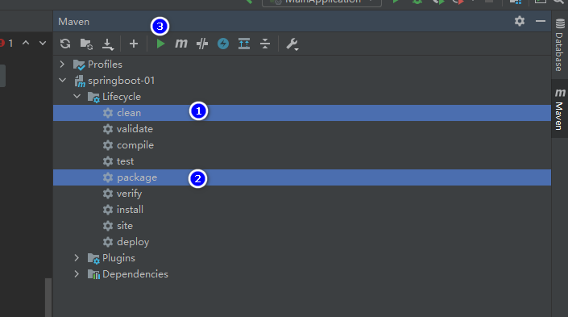
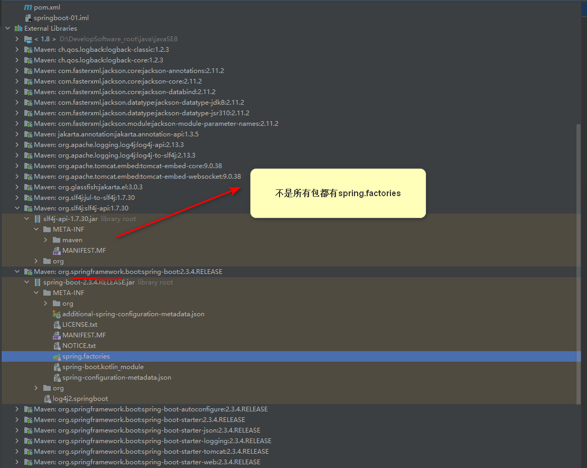
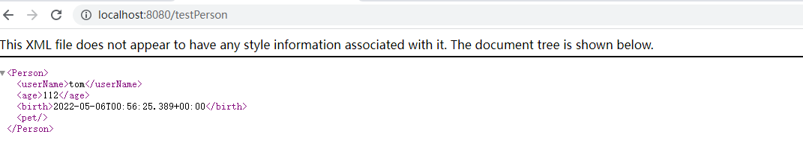
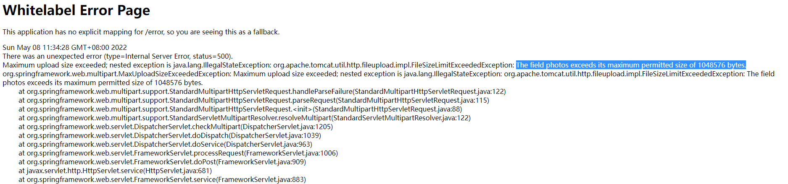
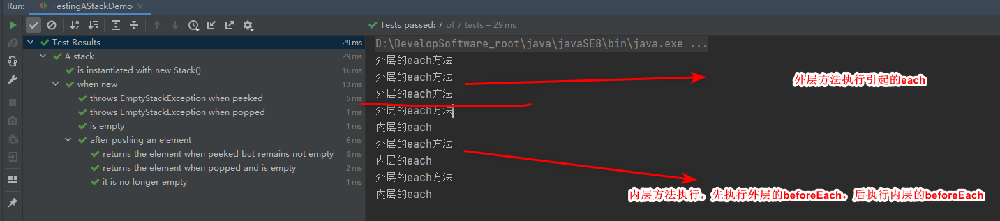

# 一、spring-boot基础

## 1.HelloWorld

**1.1 创建maven工程，向pom.xml文件中写入依赖**

```xml
<parent>
    <groupId>org.springframework.boot</groupId>
    <artifactId>spring-boot-starter-parent</artifactId>
    <version>2.3.4.RELEASE</version>
</parent>

<dependencies>
    <dependency>
        <groupId>org.springframework.boot</groupId>
        <artifactId>spring-boot-starter-web</artifactId>
    </dependency>

</dependencies>
```


**1.2 提供一个springboot主程序**

```java
//告知springboot，这是一个springboot应用
@SpringBootApplication
public class MainApplication {

    public static void main(String[] args){
        SpringApplication.run(MainApplication.class, args);
    }
}
```


**1.3 编写我们的控制器类**

```java
//@ResponseBody
//@Controller

//表名这是一个控制器类，而且返回值不是界面的名字而是要传给界面的字符串
@RestController
public class HelloController {


    @RequestMapping("/hello")
    public String handler01(){
        return "Hello,SpringBoot2";
    }
}
```


**1.4 直接运行springboot主程序的main方法**


**1.5 简化配置文件**

直接在resources中创建application.properties文件，任何配置（包括spring，springmvc等等）都可以写入这一个文件中


**1.6 部署简化**

在pom.xml中提供依赖

```xml
<build>
    <plugins>
        <plugin>
            <groupId>org.springframework.boot</groupId>
            <artifactId>spring-boot-maven-plugin</artifactId>
        </plugin>
    </plugins>
</build>
```

这样可以将我们的程序部署为jar包，这个jar包中含有所有的依赖（包括tomcat服务器等）可以直接在命令行中运行


打包：




测试：

前往生成的target文件目录，打开cmd：键入

```
java -jar 文件名
```

比如 

```
java -jar springboot-01-1.0-SNAPSHOT.jar
```


## 2.SpringBoot的简化

### 2.1 依赖管理

依赖管理基于我们在pom.xml中引入的父项目org.springframework.boot

```xml
<parent>
    <groupId>org.springframework.boot</groupId>
    <artifactId>spring-boot-starter-parent</artifactId>
    <version>2.3.4.RELEASE</version>
</parent>
```

org.springframework.boot的父项目中spring-boot-dependencies中含有相对应版本号的常用依赖，这就是自动版本仲裁，原理是springboot为我们可能引入的依赖提供了合适的版本号

```xml
<parent>
  <groupId>org.springframework.boot</groupId>
  <artifactId>spring-boot-dependencies</artifactId>
  <version>2.3.4.RELEASE</version>
</parent>
```


要点1：基于版本仲裁机制，我们引入依赖时不需要写明版本号，除非springboot中没有声明这个依赖的版本


要点2：如果springboot引入了不合适依赖版本，如何设置版本号？

以mysql驱动为例，springboot是在spring-boot-dependencies中设置了版本标签指明版本的

```xml
<mysql.version>8.0.21</mysql.version>
```

我们只需在pom.xml中修改这个标签即可：

```xml
<properties>
    <maven.compiler.source>8</maven.compiler.source>
    <maven.compiler.target>8</maven.compiler.target>
        <mysql.version>5.1.43</mysql.version>
</properties>
```


 要点3：springboot的场景启动器

```
1.形如"spring-boot-starter-*"的*称为某种场景
比如：
<parent>
    <groupId>org.springframework.boot</groupId>
    <artifactId>spring-boot-starter-parent</artifactId>
    <version>2.3.4.RELEASE</version>
</parent>
2.引入场景启动器，就是引入了该启动器定义的所有依赖

3.第三方/自定义的场景命名为
*-spring-boot-starter

4.官方支持的所有场景：
https://docs.spring.io/spring-boot/docs/current/reference/html/using-spring-boot.html#using-boot-starter

5.基本场景spring-boot-starter，所有场景都依赖于这个基本场景
<dependency>
    <groupId>org.springframework.boot</groupId>
    <artifactId>spring-boot-starter</artifactId>
    <version>2.3.4.RELEASE</version>
    <scope>compile</scope>
</dependency>
```

场景启动器就是帮我们导入很多常用依赖：


### 2.2 自动配置

测试：查找springmvc中自动配置的对象

```java
//告知springboot，这是一个springboot应用
@SpringBootApplication
public class MainApplication {

    public static void main(String[] args){
        //run就是IOC容器
        ConfigurableApplicationContext run = SpringApplication.run(MainApplication.class, args);
        //打印IOC中的对象名
        String[] names = run.getBeanDefinitionNames();
        for (String name : names) {
            System.out.println(name);
        }
    }
}
```


springboot做了如下自动配置：

（1）自动配置Tomcat

自动引入了tomcat依赖，并对其做了配置

（2）自动配置SpringMVC

引入了SpringMVC的全套组件，自动配置了SpringMVC常用功能，自动配置了前端处理器dispatcherServlet等

（3）自动配置解决了web的常见问题

处理中文字符串乱码问题的characterEncodingFilter等等

（4）约定组件扫描范围

springboot自动扫描spring主程序所在的包以及其子包

修改默认扫描的范围：

方法1，在springboot主程序中设置

```java
@SpringBootApplication(scanBasePackages="com.atguigu")
```

方法2，设置@ComponentScan 指定扫描路径

```
@SpringBootConfiguration
@EnableAutoConfiguration
@ComponentScan("com.atguigu.boot")
```


> 主程序注解@SpringBootApplication等同于
> @SpringBootConfiguration
> @EnableAutoConfiguration
> @ComponentScan("com.atguigu.boot")

（5）各个配置具有默认值

每个配置都是映射到一个类上


配置文件的值会绑定到这个类上，这个类在容器中创建其对象

（6）按需加载许多配置项

springboot中有许多的starter，目前我们引入了web，就只有web的依赖，而不会有其他的比如数据库的依赖

springboot所有自动配置功能在包spring-boot-autoconfigure中


- 

## 3. 底层注解

### 3.1 @Configuration

springboot中可以采用注解类的方式向容器注册对象，方法名就是对象的名字

```java
@Configuration//指定本类是一个配置类，相当于一个配置文件
public class MyConfig {
    @Bean//相当于给容器添加组件，返回类型为组件类型，返回值为组件实例，方法名会作为容器中的组件名
    public Person person001(){
        return new Person("tom",18);
    }
    @Bean
    public Pet pet001(){
        return new Pet("cat");
    }
}
```

在springboot主程序中可以获取到容器中的对象，而且这个对象是单例的，无论获取多少次拿到的都是同一个对象

```java
//告知springboot，这是一个springboot应用
@SpringBootApplication
public class MainApplication {

    public static void main(String[] args){
        //run就是IOC容器
        ConfigurableApplicationContext run = SpringApplication.run(MainApplication.class, args);
        //打印IOC中的对象名
        String[] names = run.getBeanDefinitionNames();
        for (String name : names) {
            System.out.println(name);
        }
        Person tom1 = run.getBean("person001", Person.class);
        Person tom2 = run.getBean("person001", Person.class);

        System.out.println(tom1==tom2);//true
    }
}
```


配置类本身也是组件；

对配置类注解中加入参数proxyBeanMethods

```java
/**
 * proxyBeanMethods = true 默认情况，是full模式
 * proxyBeanMethods = false lite模式，
 */

@Configuration(proxyBeanMethods = true)//指定本类是一个配置类，相当于一个配置文件
public class MyConfig {
    @Bean//相当于给容器添加组件，返回类型为组件类型，返回值为组件实例，方法名会作为容器中的组件名
    public Person person001(){
        Person tom = new Person("tom", 18);
        //当full模式下，表示为tom这个容器中的Person实例，增加容器中的Pet
        //lite模式下，表示对this.pet001()方法的调用，新建了一个Pet实例
        tom.setPet(pet001());
        return tom;
    }
    @Bean
    public Pet pet001(){
        return new Pet("cat");
    }
}
```

在full和lite模式下分别测试：

```java
//告知springboot，这是一个springboot应用
@SpringBootApplication()
public class MainApplication {

    public static void main(String[] args){
        //run就是IOC容器
        ConfigurableApplicationContext run = SpringApplication.run(MainApplication.class, args);
        Person tom1 = run.getBean("person001", Person.class);
        Person tom2 = run.getBean("person001", Person.class);

        System.out.println(tom1==tom2);//true
        //配置类也是容器中的一个组件
        MyConfig myConfig = run.getBean(MyConfig.class);
        System.out.println("配置类"+myConfig);
        //full:配置类com.almond.springboot.config.MyConfig$$EnhancerBySpringCGLIB$$969cd7cf@78d39a69这是一个代理类
        //lite:配置类com.almond.springboot.config.MyConfig@7da10b5b就是本身的类，不是代理
        //对full和lite模式的测试
        Person person = run.getBean("person001", Person.class);
        Pet pet = run.getBean("pet001", Pet.class);
        System.out.println("容器中的person实例的pet是否是容器中的pet?"+(person.getPet()==pet));
        //full：容器中的person实例的pet是否是容器中的pet?true
        //lite：容器中的person实例的pet是否是容器中的pet?false
    }
}
```

总结：

full模式会对所有@Bean标注的方法的类在容器中进行查询，如果有就注入容器中已有的实例，使用的是springboot中的代理配置类调用方法

lite不会进行这个查询，使用的是配置类正常调用方法

使用场景：

如果我们每个bean需要依赖于另一个bean使用full模式，如果没有依赖，使用lite，因为lite效率更高

### 3.2 @Import

Import中参数是一个class型的数组，会在容器中创建这些类的实例，名字为该类的全类名

```java
@Import({Person.class, DBHelper.class})
@Configuration(proxyBeanMethods = false)//指定本类是一个配置类，相当于一个配置文件
public class MyConfig {
    @Bean//相当于给容器添加组件，返回类型为组件类型，返回值为组件实例，方法名会作为容器中的组件名
    public Person person001(){
        Person tom = new Person("tom", 18);
        //当full模式下，表示为tom这个容器中的Person实例，增加容器中的Pet
        //lite模式下，表示对this.pet001()方法的调用，新建了一个Pet实例
        tom.setPet(pet001());
        return tom;
    }
    @Bean
    public Pet pet001(){
        return new Pet("cat");
    }
}
```

测试：

```java
//告知springboot，这是一个springboot应用
@SpringBootApplication()
public class MainApplication {

    public static void main(String[] args){
        //run就是IOC容器
        ConfigurableApplicationContext run = SpringApplication.run(MainApplication.class, args);
        //import测试
        String[] PersonNames = run.getBeanNamesForType(Person.class);
        for (String personName : PersonNames) {
            System.out.println(personName);
        }
        //com.almond.springboot.bean.Person 这是import导入的对象，名字为全类名
        //person001这个是我们方法中的Person对象
        DBHelper bean = run.getBean(DBHelper.class);
        System.out.println(bean);//ch.qos.logback.core.db.DBHelper@595f4da5
    }
}
```


### 3.3 @Condition

条件注解，满足条件再进行注入

```java
@Configuration(proxyBeanMethods = true)//指定本类是一个配置类，相当于一个配置文件
@ConditionalOnBean(name = "pet001")//当pet001在容器中存在时才进行注册方法
public class MyConfig {
    @Bean//相当于给容器添加组件，返回类型为组件类型，返回值为组件实例，方法名会作为容器中的组件名
    public Person person001(){
        Person tom = new Person("tom", 18);
        tom.setPet(pet001());
        return tom;
    }
    @Bean
    public Pet pet001(){
        return new Pet("cat");
    }
}
```


### 3.4 @ImportResource

原生配置文件导入，对于有些古老的第三方jar，需要使用xml配置，而我们使用注解配置的情况下不会加载xml的配置文件，需要将xml向注解类引入

在注解类上添加

```java
@ImportResource("classpath:beans.xml")
```


### 3.5 配置绑定

**@Component+@ConfigurationProperties**

将一个在容器中注册过的javaBean和配置文件properties文件中的字段绑定：


在properties中配置：

```properties
mycar.brand=BYD
mycar.price=10
```

在MyCar类中：

注册组件，@ConfigurationProperties设置前缀

```java
@Component
@ConfigurationProperties(prefix = "mycar")
public class MyCar {
    private String brand;
    private Integer price;
    ...
}
```

在映射方法中：

注入MyCar，配置控制器方法，访问/car

```java
//表名这是一个控制器类，而且返回值不是界面的名字而是要传给界面的字符串
@RestController
public class HelloController {

    @Autowired
    MyCar car;

    @RequestMapping("/hello")
    public String handler01(){
        return "Hello,SpringBoot2";
    }
    @RequestMapping("/car")
    public MyCar car01(){
        return car;
    }
}
```


**@EnableConfigurationProperties(类对象)**

对于第三方对象，我们不能在类上加入注解，而第三方提供了@ConfigurationProperties，则需要在springboot的配置类中加入@EnableConfigurationProperties(类对象):

```java
@Configuration(proxyBeanMethods = true)//指定本类是一个配置类，相当于一个配置文件
@EnableConfigurationProperties(MyCar.class)
public class MyConfig {
    @Bean//相当于给容器添加组件，返回类型为组件类型，返回值为组件实例，方法名会作为容器中的组件名
    public Person person001(){
        Person tom = new Person("tom", 18);
        //当full模式下，表示为tom这个容器中的Person实例，增加容器中的Pet
        //lite模式下，表示对this.pet001()方法的调用，新建了一个Pet实例
        tom.setPet(pet001());
        return tom;
    }
    @Bean
    public Pet pet001(){
        return new Pet("cat");
    }
}
```

MyCar:

```java
@ConfigurationProperties(prefix = "mycar")
public class MyCar {
```

## 4. 自动配置底层代码

### 4.1 加载自动配置类

从注解开始，@SpringBootApplication()分为三个子注解

```java
@SpringBootConfiguration
@EnableAutoConfiguration
@ComponentScan(
    excludeFilters = {@Filter(
    type = FilterType.CUSTOM,
    classes = {TypeExcludeFilter.class}
), @Filter(
    type = FilterType.CUSTOM,
    classes = {AutoConfigurationExcludeFilter.class}
)}
)
public @interface SpringBootApplication {
```

@SpringBootConfiguration:

标识@Configuration，表名当前是一个配置类

@ComponentScan：
指定扫描哪些组件


@EnableAutoConfiguration：*为需要关注的点

```java
@Target({ElementType.TYPE})
@Retention(RetentionPolicy.RUNTIME)
@Documented
@Inherited
@AutoConfigurationPackage//*
@Import({AutoConfigurationImportSelector.class})//*
public @interface EnableAutoConfiguration {
    String ENABLED_OVERRIDE_PROPERTY = "spring.boot.enableautoconfiguration";

    Class<?>[] exclude() default {};

    String[] excludeName() default {};
}
```


**@AutoConfigurationPackage：**

```java
@Import({Registrar.class})//导入一个组件Registrar
public @interface AutoConfigurationPackage {
    String[] basePackages() default {};

    Class<?>[] basePackageClasses() default {};
}
```


Register不止导入了一个组件，而是导入了spring主程序的所在包的所有组件

```java
static class Registrar implements ImportBeanDefinitionRegistrar, DeterminableImports {
    Registrar() {
    }
	
    //导入主程序所在包下的所有组件 
    public void registerBeanDefinitions(AnnotationMetadata metadata, BeanDefinitionRegistry registry) {
        AutoConfigurationPackages.register(registry, (String[])(
            new AutoConfigurationPackages.PackageImports(metadata)).getPackageNames().toArray(new String[0]));
    //new AutoConfigurationPackages.PackageImports(metadata)为主程序的包的路径
    }

    public Set<Object> determineImports(AnnotationMetadata metadata) {
        return Collections.singleton(new AutoConfigurationPackages.PackageImports(metadata));
    }
}
```


**@Import({AutoConfigurationImportSelector.class})**

getAutoConfigurationEntry给容器中导入一系列组件

```java
protected AutoConfigurationImportSelector.AutoConfigurationEntry getAutoConfigurationEntry(AnnotationMetadata annotationMetadata) {
    if (!this.isEnabled(annotationMetadata)) {
        return EMPTY_ENTRY;
    } else {
        //配置configurations后，将configurations包装后返回
        AnnotationAttributes attributes = this.getAttributes(annotationMetadata);
        //获取到所有需要导入到容器中的配置类
        List<String> configurations = this.getCandidateConfigurations(annotationMetadata, attributes);
        configurations = this.removeDuplicates(configurations);
        Set<String> exclusions = this.getExclusions(annotationMetadata, attributes);
        this.checkExcludedClasses(configurations, exclusions);
        configurations.removeAll(exclusions);
        configurations = this.getConfigurationClassFilter().filter(configurations);
        this.fireAutoConfigurationImportEvents(configurations, exclusions);
        return new AutoConfigurationImportSelector.AutoConfigurationEntry(configurations, exclusions);
    }
}
```


getCandidateConfigurations获取到所有需要导入到容器中的配置类，会获取一系列配置


在getCandidateConfigurations方法中调用了：

```java
protected List<String> getCandidateConfigurations(AnnotationMetadata metadata, AnnotationAttributes attributes) {
    List<String> configurations = SpringFactoriesLoader.loadFactoryNames(this.getSpringFactoriesLoaderFactoryClass(), this.getBeanClassLoader());
    Assert.notEmpty(configurations, "No auto configuration classes found in META-INF/spring.factories. If you are using a custom packaging, make sure that file is correct.");
    return configurations;
}
```

loadFactoryNames中最终调用了**loadSpringFactories**方法

```
public static List<String> loadFactoryNames(Class<?> factoryType, @Nullable ClassLoader classLoader) {
    String factoryTypeName = factoryType.getName();
    return (List)loadSpringFactories(classLoader).getOrDefault(factoryTypeName, Collections.emptyList());
}
```

重点来看loadSpringFactories中的一行：**加载META-INF/spring.factories**

```
Enumeration<URL> urls = classLoader != null ? classLoader.getResources("META-INF/spring.factories") : ClassLoader.getSystemResources("META-INF/spring.factories");
```


META-INF/spring.factories这个路径在哪？



一个重要的包 spring-boot-autoconfigure-2.3.4.RELEASE.jar包里面也有META-INF/spring.factories，打开后148-22+1=127，正是configurations的大小

```
# Auto Configure
21org.springframework.boot.autoconfigure.EnableAutoConfiguration=\
22org.springframework.boot.autoconfigure.admin.SpringApplicationAdminJmxAutoConfiguration,\
23org.springframework.boot.autoconfigure.aop.AopAutoConfiguration,\
24org.springframework.boot.autoconfigure.amqp.RabbitAutoConfiguration,\
...
148org.springframework.boot.autoconfigure.webservices.client.WebServiceTemplateAutoConfiguration
```

### 4.2 按需加载

127个场景在启动时都加载了，但是很多都没有开启，这是由他们的@Condition注解决定的，他们仅仅在一些条件的情况下才会被加载，这就实现了按需加载

以aop组件为例:

```java
@Configuration(
    proxyBeanMethods = false
)//想要aop加载必须满足一下条件，否则整个类都不加载
@ConditionalOnProperty(
    prefix = "spring.aop",
    name = {"auto"},
    havingValue = "true",
    matchIfMissing = true
)
public class AopAutoConfiguration {...
```

还有很多时候以包为条件，导入这个包才能起作用：

```java
@ConditionalOnBean({ReactiveRedisConnectionFactory.class})
```

### 4.3 修改默认设置

在自动配置的DispatcherServletAutoConfiguration中：为我们配置了dispatcherServlet

```java
@Bean(
    name = {"dispatcherServlet"}
)
public DispatcherServlet dispatcherServlet(WebMvcProperties webMvcProperties) {
    DispatcherServlet dispatcherServlet = new DispatcherServlet();
    dispatcherServlet.setDispatchOptionsRequest(webMvcProperties.isDispatchOptionsRequest());
    dispatcherServlet.setDispatchTraceRequest(webMvcProperties.isDispatchTraceRequest());
    dispatcherServlet.setThrowExceptionIfNoHandlerFound(webMvcProperties.isThrowExceptionIfNoHandlerFound());
    dispatcherServlet.setPublishEvents(webMvcProperties.isPublishRequestHandledEvents());
    dispatcherServlet.setEnableLoggingRequestDetails(webMvcProperties.isLogRequestDetails());
    return dispatcherServlet;
}
```

为我们配置MultipartResolver文件解析，这里的意思是用户如果自定义了MultipartResolver但是名字不是multipartResolver，按照类型拿取到这个对象，将他注册到容器中：

```java
@Bean
@ConditionalOnBean({MultipartResolver.class})//有这个类型的组件
@ConditionalOnMissingBean(
    name = {"multipartResolver"}//但是没有这个名字的组件
)
public MultipartResolver multipartResolver(MultipartResolver resolver) {//去容器中按照MultipartResolver类型找到这个对象
    return resolver;//将这个对象返回给容器，将名字注册为方法名multipartResolver
}
```


HttpEncodingAutoConfiguration的配置：

**1.如果我们自己在配置类中进行配置就不会做默认配置，因此我们可以在配置类中修改默认配置**

**2.可以在springboot的配置文件application.properties中设置默认配置的参数**

```java
@Bean
@ConditionalOnMissingBean//如果我们自己在配置类中进行配置就不会做默认配置
public CharacterEncodingFilter characterEncodingFilter() {
    CharacterEncodingFilter filter = new OrderedCharacterEncodingFilter();
    filter.setEncoding(this.properties.getCharset().name());
//    this.properties进入后可以看到前缀
    filter.setForceRequestEncoding(this.properties.shouldForce(org.springframework.boot.web.servlet.server.Encoding.Type.REQUEST));
    filter.setForceResponseEncoding(this.properties.shouldForce(org.springframework.boot.web.servlet.server.Encoding.Type.RESPONSE));
    return filter;
}
```

this.properties进入后可以看到前缀：


**因此可以在springboot的配置文件application.properties中设置默认配置的参数**


总结：

* spring-boot自动加载所有的自动配置类（xxxAutoConfiguration）
* 每个自动配置类根据一些条件（可能是查看某些需要使用的包是否在容器中）来决定是否向容器注册组件，如果注册，则按照它的配置类（xxxProperties）去进行注册。（这个配置类又进一步绑定了springboot的配置类application.properties）
* 生效的配置文件会向容器中注册很多组件
* 只要容器中注册了组件，就代表拥有了这些组件持有的功能
* 定制默认设置
  * 在用户自己的配置类中使用@Bean标签注册组件（默认组件自动配置会根据这个组件是否已经创建而决定是否创建默认组件）
  * 在spring-boot配置文件application.properties中根据前缀名修改默认属性，前缀名在各个组件的配置类（xxxProperties）中寻找

**xxxxxAutoConfiguration ---> 组件  --->** **xxxxProperties里面拿值  ----> application.properties**

## 5.简化工具

lombok：一个可以帮助我们无代码生成get，set方法，全参构造器，无参构造器，toString方法等的工具

引入lombok：在pom中配置依赖

    <dependency>
        <groupId>org.projectlombok</groupId>
        <artifactId>lombok</artifactId>
    </dependency>

使用方法：在类上加注解

```java
@AllArgsConstructor//全参构造器，如果有不是全参的有参构造器自己写java代码
@NoArgsConstructor//无参构造器
@Data//提供类所有属性的 getting 和 setting 方法，此外还提供了equals、canEqual、hashCode、toString 方法
@ToString//toString方法
public class Person {
    private String name;
    private Integer age;
    private Pet pet;

    public Person(String name, Integer age) {
        this.name = name;
        this.age = age;
    }
}
```

还可以一键给类加日志功能：

```java
@RestController
@Slf4j//lombok中自动导入日志功能
public class HelloController {
    @Autowired
    MyCar car;

    @RequestMapping("/hello")
    public String handler01(){

        log.info("使用lombok自动导入slf4j日志功能");
        //2022-04-28 15:47:18.073  INFO 9600 --- [nio-8080-exec-1]
        // c.a.s.controller.HelloController         : 使用lombok自动导入slf4j日志功能
        return "Hello,SpringBoot2";
    }
}
```


一键restart：导入devtools，按ctrl+F9可以一键重新部署(配置文件中的内容也会更新)

```
<dependency>
    <groupId>org.springframework.boot</groupId>
    <artifactId>spring-boot-devtools</artifactId>
    <optional>true</optional>
</dependency>
```

# 二、核心功能

## 1.yaml作为配置文件

yaml语法：

- key: value；kv之间有空格
- 大小写敏感
- 使用缩进表示层级关系
- 缩进不允许使用tab，只允许空格
- 缩进的空格数不重要，只要相同层级的元素左对齐即可
- '#'表示注释
- 字符串无需加引号，如果要加，''与""表示字符串内容 会被 转义/不转义，例如双引号打印换行符\n，单引号不打印换行符\n


例子：

```java
@Data
public class Pet {
    private String name;
    private Double weight;
}
```

```java
@Data
@Component//向容器中注册本类的一个对象
@ConfigurationProperties(prefix = "person")//表示这个容器中的对象可以被配置，配置文件中person开头的就是对本类的配置
public class Person {
    private String userName;
    private Boolean boss;
    private Date birth;
    private Integer age;
    private Pet pet;
    private String[] interests;
    private List<String> animal;
    private Map<String, Object> score;
    private Set<Double> salarys;
    private Map<String, List<Pet>> allPets;
}
```

将person在配置文件application.yaml中配置(application.yaml和application.properties可以同时存在，两个配置都会被加载)

```yaml
person:
  #“”会打印换行
  username: "zhang\nsan"
#  单引号不会打印换行
#  user-name: 'zhangsan\n'
  boss: false
  birth: 2001/8/15
  age: 21
  interests: [java,math,c]
  animal: [dog,cat,doge]
  score:
    English:
      first: 80
      sceond: 81
    Math: [110,120,127]
    Chinese: {first: 128,second: 123}
    salarys: [1000,12000,100]
  pet:
    name: tomcat
    weight: 100
  allPets:
    sick:
      - {name: tom}
      - {name: cat}
    health:
      - {name: doge,weight: 100}
```

测试：

```java
@RestController
@Slf4j
public class FirstController {

    @Autowired//不要忘了注入person
    private Person person;

    @RequestMapping("/person1")
    public Person getPerson(){
        log.info("成功访问");
        System.out.println(person);
        //Person(userName=zhang
        //san, boss=false, ....
        return person;
    }
}
```


配置yaml中自定义类的代码提示

```xml
<dependency>
    <groupId>org.springframework.boot</groupId>
    <artifactId>spring-boot-configuration-processor</artifactId>
    <optional>true</optional>
</dependency>
```

在打包过程中排除这个包，因为他仅在开发中使用:

```xml
<build>
    <plugins>
        <plugin>
            <groupId>org.springframework.boot</groupId>
            <artifactId>spring-boot-maven-plugin</artifactId>
            <configuration>
                <excludes>
                    <exclude>
                        <groupId>org.projectlombok</groupId>
                        <artifactId>lombok</artifactId>
                    </exclude>
                    <!--排除设置yaml中给自定义类的提示的依赖-->
                    <exclude>
                        <groupId>org.springframework.boot</groupId>
                        <artifactId>spring-boot-configuration-processor</artifactId>
                    </exclude>

                </excludes>
            </configuration>
        </plugin>
    </plugins>
</build>
```

## 2.Web开发

### 2.1 静态资源访问

只要静态资源放在类路径下： called `/static` (or `/public` or `/resources` or `/META-INF/resources`

访问方法：项目地址的url+静态资源名


如果我们有一个静态资源和控制器方法捕获的地址重名会访问谁？

会访问控制器方法，前端处理器DispatcherServlet捕获地址，它解决不了的地址由静态处理器解决


改变默认的静态资源路径

```yaml
spring:
#  设置访问静态资源时的url
  mvc:
    static-path-pattern: /res/**
#  设置静态资源在类路径下的static文件夹寻找（不配置的话为上述默认路径）
  resources:
    static-locations: [classpath:/static/]

```

不论这个静态资源在哪，我们访问时的url为

```
http://localhost:8080/res/Atri.png
```

可以配置多个资源路径：

```
#  设置静态资源在类路径下的static文件夹寻找
  resources:
    static-locations: [classpath:/static/,...]
```


### 2.2 欢迎界面

将欢迎界面放在静态资源目录中，不要设置访问静态资源的static-path-pattern属性，否则无法访问到欢迎界面

```yaml
#spring:
#  设置访问静态资源时的url,设置这个属性会导致默认访问首页以及favicon失效
#  mvc:
#    static-path-pattern: /res/**
#  设置静态资源在类路径下的static文件夹寻找
  resources:
    static-locations: [classpath:/static/]
```


### 2.3 favicon.ico

将图标放在静态资源文件夹中，不能配置访问静态资源的static-path-pattern属性，使用强制刷新ctrl+F5访问


### 2.4 源码分析

#### 2.4.1 静态资源处理

**配置类只有一个有参构造器，那么参数全部来自容器**

配置类WebMvcAutoConfiguration中有一个WebMvcAutoConfigurationAdapter类，这个类的构造器为：

```java
//有参构造器所有参数的值都会从容器中确定
//ResourceProperties resourceProperties；获取和spring.resources绑定的所有的值的对象
//WebMvcProperties mvcProperties 获取和spring.mvc绑定的所有的值的对象
//ListableBeanFactory beanFactory Spring的beanFactory
//HttpMessageConverters 找到所有的HttpMessageConverters
//ResourceHandlerRegistrationCustomizer 找到 资源处理器的自定义器。=========
//DispatcherServletPath  
//ServletRegistrationBean   给应用注册Servlet、Filter....

public WebMvcAutoConfigurationAdapter(
    ResourceProperties resourceProperties, 
    WebMvcProperties mvcProperties, 
    ListableBeanFactory beanFactory,
    ObjectProvider<HttpMessageConverters> messageConvertersProvider, ObjectProvider<WebMvcAutoConfiguration.ResourceHandlerRegistrationCustomizer> resourceHandlerRegistrationCustomizerProvider, ObjectProvider<DispatcherServletPath> dispatcherServletPath, 
    ObjectProvider<ServletRegistrationBean<?>> servletRegistrations
) {
    
    this.resourceProperties = resourceProperties;
    this.mvcProperties = mvcProperties;
    this.beanFactory = beanFactory;
    this.messageConvertersProvider = messageConvertersProvider;
    this.resourceHandlerRegistrationCustomizer = (WebMvcAutoConfiguration.ResourceHandlerRegistrationCustomizer)resourceHandlerRegistrationCustomizerProvider.getIfAvailable();
    this.dispatcherServletPath = dispatcherServletPath;
    this.servletRegistrations = servletRegistrations;
}
```

**资源处理的默认规则**

```java
public void addResourceHandlers(ResourceHandlerRegistry registry) {
    //我们可以配置属性addMappings为false，这样就会禁用静态资源处理，默认为true
    if (!this.resourceProperties.isAddMappings()) {
        logger.debug("Default resource handling disabled");
    } else {
        //cachePeriod为缓存时间，单位为秒，可以配置
        Duration cachePeriod = this.resourceProperties.getCache().getPeriod();
        CacheControl cacheControl = this.resourceProperties.getCache().getCachecontrol().toHttpCacheControl();
        //给webjars配置访问url
        if (!registry.hasMappingForPattern("/webjars/**")) {
            //配置webjars资源存放路径在classpath:/META-INF/resources/webjars/下，并放入缓存，缓存时间为cachePeriod
            this.customizeResourceHandlerRegistration(registry.addResourceHandler(new String[]{"/webjars/**"}).addResourceLocations(new String[]{"classpath:/META-INF/resources/webjars/"}).setCachePeriod(this.getSeconds(cachePeriod)).setCacheControl(cacheControl));
        }
		//给静态资源注册url
        String staticPathPattern = this.mvcProperties.getStaticPathPattern();
        if (!registry.hasMappingForPattern(staticPathPattern)) {
            //设置静态资源的访问路径，并放入缓存
            this.customizeResourceHandlerRegistration(registry.addResourceHandler(new String[]{staticPathPattern}).addResourceLocations(WebMvcAutoConfiguration.getResourceLocations(this.resourceProperties.getStaticLocations())).setCachePeriod(this.getSeconds(cachePeriod)).setCacheControl(cacheControl));
        }

    }
}
```

默认静态资源路径

```java
private static final String[] CLASSPATH_RESOURCE_LOCATIONS = new String[]{"classpath:/META-INF/resources/", "classpath:/resources/", "classpath:/static/", "classpath:/public/"};
```


**欢迎页处理规则**

```java
	HandlerMapping：处理器映射。保存了每一个Handler能处理哪些请求。	

	@Bean
		public WelcomePageHandlerMapping welcomePageHandlerMapping(ApplicationContext applicationContext,
				FormattingConversionService mvcConversionService, ResourceUrlProvider mvcResourceUrlProvider) {
			WelcomePageHandlerMapping welcomePageHandlerMapping = new WelcomePageHandlerMapping(
					new TemplateAvailabilityProviders(applicationContext), applicationContext, getWelcomePage(),
					this.mvcProperties.getStaticPathPattern());
			welcomePageHandlerMapping.setInterceptors(getInterceptors(mvcConversionService, mvcResourceUrlProvider));
			welcomePageHandlerMapping.setCorsConfigurations(getCorsConfigurations());
			return welcomePageHandlerMapping;
		}
```

上述代码中的构造器方法：

```java
WelcomePageHandlerMapping(TemplateAvailabilityProviders templateAvailabilityProviders, ApplicationContext applicationContext, Optional<Resource> welcomePage, String staticPathPattern) {
    //如果欢迎页存在且静态资源访问的url必须为/**，这里解释了我们修改静态资源url访问失效的原因
    if (welcomePage.isPresent() && "/**".equals(staticPathPattern)) {
        logger.info("Adding welcome page: " + welcomePage.get());
        this.setRootViewName("forward:index.html");
    } else if (this.welcomeTemplateExists(templateAvailabilityProviders, applicationContext)) {
        //如果静态资源找不到欢迎页，调用controller去寻找
        logger.info("Adding welcome page template: index");
        this.setRootViewName("index");
    }

}
```

#### 2.4.2 RESTful风格

rest风格就是采用HTTP中的访问方式区分请求方式，如：/user分为GET查询、POST保存、DELETE删除、PUT修改

用法：

* 在表单中设置方法为POST，在表单中增加一个隐藏域设置参数_method值为真实请求(DELETE/PUT/PATCH)
* springboot中需要手动开启这个功能，配置文件中配置 

```yaml
spring:
    mvc:
        hiddenmethod:
            filter:
                enabled: true
```

**源码分析**

```java
@Bean
@ConditionalOnMissingBean(HiddenHttpMethodFilter.class)
//想要开启本功能，必须设置spring.mvc.hiddenmethod.filter.enable=true
@ConditionalOnProperty(prefix = "spring.mvc.hiddenmethod.filter", name = "enabled", matchIfMissing = false)
public OrderedHiddenHttpMethodFilter hiddenHttpMethodFilter() {
	return new OrderedHiddenHttpMethodFilter();
}
```

具体源码见SpringMVC第七章，具体步骤：

Rest原理（表单提交要使用REST的时候）

- 表单提交会带上**_method=PUT**
- **请求过来被**HiddenHttpMethodFilter拦截

- - 请求是否正常，并且是POST

- - - 获取到**_method**的值。
    - 兼容以下请求；**PUT**.**DELETE**.**PATCH**
    - **原生request（post），包装模式requesWrapper重写了getMethod方法，返回的是传入的值。**
    - 过滤器链放行的时候用wrapper。以后的方法调用getMethod是调用requesWrapper的。

**Rest使用客户端工具，**

- 如PostMan直接发送Put、delete等方式请求，无需Filter（这也是springboot没有默认开启这个功能的原因）

#### 2.4.3 请求映射原理

DispatcherServlet中的doDispatch方法中调用了getHandler方法，这个方法返回了本次映射对应的控制器方法对象

```java
@Nullable
protected HandlerExecutionChain getHandler(HttpServletRequest request) throws Exception {
   if (this.handlerMappings != null) {
      for (HandlerMapping mapping : this.handlerMappings) {
         HandlerExecutionChain handler = mapping.getHandler(request);
         if (handler != null) {
            return handler;
         }
      }
   }
   return null;
}
```

handlerMappings中含有所有的映射规则，通过对其遍历找到合适的处理器方法


其中的RequestMappingHandlerMapping含有所有@RequestMapping标注的控制器方法（包括请求方式）

### 2.5 方法参数上的常用注解

#### 注解用法

**获取url上的参数值**

@PathVariable("id") Integer id ：在 @GetMapping("/car/{id}/user/{username}")中的{}中字符串为id的位置拿值

@PathVariable Map<String,String> params：根据@GetMapping{}中的字符串作为key，值作为value封装为一个Map<String,String>

@RequestParam("age") Integer age：拿取url中？后的参数值

@RequestParam("hobby")List<String> hobbies：拿取复选框

@RequestParam Map<String,String> params：拿取所有？后的参数值封装为map

@RequestHeader("User-Agent") String userAgent：拿请求头中的指定信息

@RequestHeader Map<String,String> header：拿请求头的所有信息封装为map

@CookieValue("Idea-834a15c8")Cookie cookie：根据cookie名拿cookie

```java
@RestController
public class ParamTestController {

//    http://localhost:8080/car/110/user/almond?age=18&hobby=java&hobby=c
    @GetMapping("/car/{id}/user/{username}")
    public Map<String,Object> getCar(@PathVariable("id") Integer id,
                                     @PathVariable Map<String,String> params,
                                     @RequestParam("age") Integer age,
                                     @RequestParam("hobby")List<String> hobbies,
                                     @RequestHeader("User-Agent") String userAgent,
                                     @RequestHeader Map<String,String> header,
                                     @CookieValue("Idea-834a15c8")Cookie cookie

                                     ){
        Map<String, Object> res = new HashMap<>();
        res.put("id", id);//获取指定位置上的参数
        res.put("paramsMap", params);//获取所有的参数封装为一个Map<String,String>
        //{"paramsMap":{"id":"110","username":"almond"},"id":110}

        //获取url拼接的参数,?后的参数,例如 ?age=18&hobby=java&hobby=c
        res.put("age", age);
        res.put("hobby", hobbies);
        //"age":18,"hobby":["java","c"]}

        res.put("userAgent", userAgent);
        res.put("header", header);
        
        System.out.println(cookie);//javax.servlet.http.Cookie@438e64bb
        return res;
    }
}
```


**获取请求体中的内容**

Post请求内容在请求体中，获取请求体的注解@RequestBody，使用字符串类型接收

```java
@PostMapping("/save")
public Map<String,Object> getContext(@RequestBody String context){
    HashMap<String, Object> res = new HashMap<>();
    res.put("context",context);
    return res;
}
```


**获取请求域中的值@RequestAttribute**

```java
@Controller
public class AttributeTest {

    @GetMapping("/goto")
    public String toSuccess(HttpServletRequest request){
        request.setAttribute("aaa", 111);
        request.setAttribute("bbb", "xxx");
        return "forward:/success";
    }

    @ResponseBody
    @RequestMapping("/success")
    public Map success(@RequestAttribute("aaa") Integer a1,
                       @RequestAttribute("bbb") String b1){
        HashMap<String, Object> res = new HashMap<>();
        res.put("a", a1);
        res.put("b", b1);
        return res;
    }
}
```


自定义配置：

url的矩阵功能需要自定义


1、语法： 请求路径：/cars/sell;low=34;brand=byd,audi,yd
2、SpringBoot默认是禁用了矩阵变量的功能
          手动开启：原理。对于路径的处理。UrlPathHelper进行解析。
                 removeSemicolonContent（移除分号内容）支持矩阵变量的
3、矩阵变量必须有url路径变量才能被解析

```java
//    http://localhost:8080/boss/bb;age=12/ee;age=22
    @ResponseBody
    @GetMapping("/boss/{bossId}/{empId}")
    public Map getBoss(@MatrixVariable(value = "age",pathVar = "bossId") Integer age1,
                       @MatrixVariable(value = "age",pathVar = "empId") Integer age2){
        HashMap<String, Object> res = new HashMap<>();
        res.put("bossage", age1);
        res.put("empage", age2);
        return res;
    }
```

自定义方法：在配置类中重写对应方法

```java
@Configuration
public class WebConfig implements WebMvcConfigurer {

    @Override
    public void configurePathMatch(PathMatchConfigurer configurer) {
        UrlPathHelper urlPathHelper = new UrlPathHelper();
        //不移除就可以使得矩阵功能生效
        urlPathHelper.setRemoveSemicolonContent(false);
        configurer.setUrlPathHelper(urlPathHelper);
    }

}
```

注入@Bean返回一个新配置类，该配置类修改了对应方法

```java
@Configuration
public class WebConfig implements WebMvcConfigurer {

    @Bean
    public WebMvcConfigurer UserWebMvcConfigure(){
        return new WebMvcConfigurer() {
            @Override
            public void configurePathMatch(PathMatchConfigurer configurer) {
                UrlPathHelper urlPathHelper = new UrlPathHelper();
                //不移除就可以使得矩阵功能生效
                urlPathHelper.setRemoveSemicolonContent(false);
                configurer.setUrlPathHelper(urlPathHelper);
            }
        };
    }

}
```

#### 源码分析

##### 1.选择合适的处理器方法

DispatcherServlet中的doDispatch方法负责处理请求的url，以处理如下请求为例：

```url
http://localhost:8080/car/110/user/almond?age=18&hobby=java&hobby=c
```

访问后首先来到doDispatch方法的1061行：

```java
mappedHandler = getHandler(processedRequest);//1061行
```

getHandler方法会根据url地址返回一个处理这个url地址的处理器Handler（2.4.3 请求映射原理）


##### 2.选择合适的处理器适配器

在1023行获取HandlerAdapter

```java
HandlerAdapter ha = getHandlerAdapter(mappedHandler.getHandler());
```

```java
protected HandlerAdapter getHandlerAdapter(Object handler) throws ServletException {
   if (this.handlerAdapters != null) {
       //对springboot提供的4个HandlerAdapter进行遍历，以确定最后使用哪一个HandlerAdapter
      for (HandlerAdapter adapter : this.handlerAdapters) {
         if (adapter.supports(handler)) {
            return adapter;
         }
      }
   }
   throw new ServletException("No adapter for handler [" + handler +
         "]: The DispatcherServlet configuration needs to include a HandlerAdapter that supports this handler");
}
```

springboot提供的四个HandlerAdapter：


其中0是支持方法上标注@RequestMapping的HandlerAdapter，1是支持函数式编程的HandlerAdapter


##### 3.真正地执行处理映射

在第1040行真正地执行处理

```java
// Actually invoke the handler.
mv = ha.handle(processedRequest, response, mappedHandler.getHandler());
```

handle中调用了handleInternal方法，这个方法最终调用了invokeHandlerMethod，这里真正调用了处理器的方法

```java
mav = invokeHandlerMethod(request, response, handlerMethod);
```

```java
...
if (this.argumentResolvers != null) {//参数解析
   invocableMethod.setHandlerMethodArgumentResolvers(this.argumentResolvers);
}
if (this.returnValueHandlers != null) {//返回值解析
   invocableMethod.setHandlerMethodReturnValueHandlers(this.returnValueHandlers);
}
...
```


###### 3.1参数解析器

确定待执行方法的参数列表的值

在invokeHandlerMethod方法所在类中提供了26个参数解析器，分别对应我们在参数列表上加的注解:


参数解析器接口：

```java
public interface HandlerMethodArgumentResolver {
    boolean supportsParameter(MethodParameter var1);

    @Nullable
    Object resolveArgument(MethodParameter var1, @Nullable ModelAndViewContainer var2, NativeWebRequest var3, @Nullable WebDataBinderFactory var4) throws Exception;
}
```

参数解析器工作方法：

* 调用supportsParameter判断是否支持该参数类型
* 如果支持调用resolveArgument解析参数


###### 3.2返回值处理器

springmvc中的处理器方法的返回值由返回值处理器决定：


##### 4.参数解析器确定参数值的流程

invokeHandlerMethod方法中：

```java
invocableMethod.invokeAndHandle(webRequest, mavContainer);
```

invokeAndHandle中：

```java
Object returnValue = invokeForRequest(webRequest, mavContainer, providedArgs);
```

该方法调用了我们自定义的Handler方法

```java
@GetMapping("/car/{id}/user/{username}")
public Map<String,Object> getCar(@PathVariable("id") Integer id,
                                 @PathVariable Map<String,String> params,
                                 @RequestParam("age") Integer age,
                                 @RequestParam("hobby")List<String> hobbies,
                                 @RequestHeader("User-Agent") String userAgent,
                                 @RequestHeader Map<String,String> header
                                 ){
                                 ...
                                 }
```

所以invokeForRequest方法中确定了方法的参数列表


invokeForRequest方法：

```
Object[] args = getMethodArgumentValues(request, mavContainer, providedArgs);
```

getMethodArgumentValues方法：在for循环中调用

```java
args[i] = this.resolvers.resolveArgument(parameter, mavContainer, request, this.dataBinderFactory);
```

```java
@Override
@Nullable
public Object resolveArgument(MethodParameter parameter, @Nullable ModelAndViewContainer mavContainer,
      NativeWebRequest webRequest, @Nullable WebDataBinderFactory binderFactory) throws Exception {
	//1.先调用getArgumentResolver得到合适的解析器
   HandlerMethodArgumentResolver resolver = getArgumentResolver(parameter);
   if (resolver == null) {
      throw new IllegalArgumentException("Unsupported parameter type [" +
            parameter.getParameterType().getName() + "]. supportsParameter should be called first.");
   }
    //2.用合适的解析器进行解析
   return resolver.resolveArgument(parameter, mavContainer, webRequest, binderFactory);
}
```


###### 4.1找出合适的解析器

getArgumentResolver方法：查找出匹配的参数解析器并返回

```JAVA
@Nullable
private HandlerMethodArgumentResolver getArgumentResolver(MethodParameter parameter) {
   HandlerMethodArgumentResolver result = this.argumentResolverCache.get(parameter);
    //如果在缓存中查出了这个解析器，直接返回
   if (result == null) {
       //如果缓存中没有解析器，遍历所有的参数解析器，查出合适的参数解析器并将其加入缓存中，返回这个参数解析器
      for (HandlerMethodArgumentResolver resolver : this.argumentResolvers) {
         if (resolver.supportsParameter(parameter)) {
            result = resolver;
            this.argumentResolverCache.put(parameter, result);
            break;
         }
      }
   }
   return result;
}
```


###### 4.2使用合适的解析器进行参数解析

再F5会调用resolveArgument方法，拿到合适的参数解析器调用resolveArgument解析参数，这样参数就返回到了arg[i]的数组中

### 2.6 参数列表上的Model、Map

在处理器方法的参数列表上有Model，或者Map类型的数据，这些数据会被自动装在请求域中


#### 用法

```java
@GetMapping("/attribute")
public String getAttribute(Map<String,Object> map,
                           Model model,
                           HttpServletRequest request,
                           HttpServletResponse response){
    map.put("map1", "mapParam");
    model.addAttribute("model1", "modelParam1");
    request.setAttribute("req1", "r111");
    Cookie cookie = new Cookie("cookie1", "c1");
    response.addCookie(cookie);
    return "forward:/success";
}
```

用一个请求接收success，并采用@ResponseBody注解测试

```java
@ResponseBody
@GetMapping("/success")
public Map<String,Object> success(HttpServletRequest request){
    request.getAttribute("msg");

    HashMap<String, Object> hm = new HashMap<>();
    Object map1 = request.getAttribute("map1");
    Object model1 = request.getAttribute("model1");
    Object req1 = request.getAttribute("req1");

    hm.put("map", map1);
    hm.put("model", model1);
    hm.put("req", req1);

    return hm;
}
```

访问结果：


#### 源码分析

##### 1.参数解析

getMethodArgumentValues方法中，对参数列表进行遍历，并为每一个参数寻找对应的参数解析器进行解析，循环中：

```java
args[i] = this.resolvers.resolveArgument(parameter, mavContainer, request, this.dataBinderFactory);
```


resolveArgument方法中分寻找解析器和解析两步

寻找解析器：在缓存中找，缓存没有就在如下的26个解析器中找：


解析：这里不重要


resolveArgument方法结束，返回值给args数组，for循环结束最终解析的所有参数结果是：


**可见Model和Map类型经过解析后同属一个对象**


##### 2.参数解析后，执行目标处理器方法

```java
return doInvoke(args);
```


##### 3.执行目标方法返回值的处理方法

在执行该方法之前，已经有mavContainer对象，它含有我们在Map，Model里设置的内容，而且此时view为null


处理返回结果的方法，传入了mavContainer对象

```java
try {
   this.returnValueHandlers.handleReturnValue(
         returnValue, getReturnValueType(returnValue), mavContainer, webRequest);
}
```

handleReturnValue方法调用：

```java
handler.handleReturnValue(returnValue, returnType, mavContainer, webRequest);
```

handler.handleReturnValue方法中，设置了返回值，将这个返回值放在了mavContainer

```java
String viewName = returnValue.toString();
mavContainer.setViewName(viewName);
```

mavContainer在这一步设置了view属性，明确了跳转的地址


##### 4.处理视图以及模型（数据）

doDispatch方法中给mav赋值：

```java
mav = invokeHandlerMethod(request, response, handlerMethod);
```

invokeHandlerMethod中调用：

getModelAndView方法：将模型和视图封装为ModelAndView对象，返回这个对象

```
ModelMap model = mavContainer.getModel();
ModelAndView mav = new ModelAndView(mavContainer.getViewName(), model, mavContainer.getStatus());
```

mav中包含了视图和模型


doDispatcher方法中1057行

```java
processDispatchResult(processedRequest, response, mappedHandler, mv, dispatchException);
```

processDispatchResult中：

```java
render(mv, request, response);
```

render中：

* 进行视图解析
* 进行模型数据渲染：

```java
view.render(mv.getModelInternal(), request, response);
```

mv.getModelInternal()是我们放入的数据：


view.render中

```java
public void render(@Nullable Map<String, ?> model, HttpServletRequest request,
      HttpServletResponse response) throws Exception {

   if (logger.isDebugEnabled()) {
      logger.debug("View " + formatViewName() +
            ", model " + (model != null ? model : Collections.emptyMap()) +
            (this.staticAttributes.isEmpty() ? "" : ", static attributes " + this.staticAttributes));
   }

   Map<String, Object> mergedModel = createMergedOutputModel(model, request, response);//将model数据加入mergedModel中
   prepareResponse(request, response);
   renderMergedOutputModel(mergedModel, getRequestToExpose(request), response);//将mergedModel放入请求域中
}
```


* 调用createMergedOutputModel，其中：

```java
mergedModel.putAll(model);//model是我们的数据
```


* 调用renderMergedOutputModel，其中：

```java
exposeModelAsRequestAttributes(model, request);
```

```java
protected void exposeModelAsRequestAttributes(Map<String, Object> model,
      HttpServletRequest request) throws Exception {
	//遍历所有的键值对，将他们放入请求域中
   model.forEach((name, value) -> {
      if (value != null) {
         request.setAttribute(name, value);
      }
      else {
         request.removeAttribute(name);
      }
   });
}
```

### 2.7 界面上的参数与javaBean的绑定

#### 使用方式

在控制器方法中可以使用javaBean作为参数直接接收数据

```html
<form method="post" action="/person">
    username:<input name="userName" value="almond"><br>
    age:<input name="age" value="18"><br>
    birth:<input name="birth" value="2022/12/11"><br>
    petName:<input name="pet.name" value="navCat"><br>
    petAge:<input name="pet.age" value="1"><br>
    <input type="submit" value="提交">
</form>
```

```java
@ResponseBody
@PostMapping("/person")
public Person getPerson(Person person){
    return person;
}
```


javaBean：

```java
@Data
public class Person {
    private String userName;
    private Integer age;
    private Date birth;
    private Pet pet;
}
```

```JAVA
@Data
public class Pet {
    private String name;
    private Integer age;
}
```

#### 源码分析

解析参数功能定位：

DispatcherServlet中

```java
mv = ha.handle(processedRequest, response, mappedHandler.getHandler());
```

AbstractHandlerMethodAdapter中：

```java
return handleInternal(request, response, (HandlerMethod) handler);
```

RequestMappingHandlerAdapter中：

```
invocableMethod.invokeAndHandle(webRequest, mavContainer);
```

ServletInvocableHandlerMethod中：

```java
Object returnValue = invokeForRequest(webRequest, mavContainer, providedArgs);
```

InvocableHandlerMethod中：

```java
for (int i = 0; i < parameters.length; i++) {
    ...
    //判断所有的参数解析器中是否存在能解析该参数的
    if (!this.resolvers.supportsParameter(parameter)) {
				throw new IllegalStateException(formatArgumentError(parameter, "No suitable resolver"));
	}
    ...
    args[i] = this.resolvers.resolveArgument(parameter, mavContainer, request, this.dataBinderFactory);
    ...
}

```

HandlerMethodArgumentResolverComposite中：

```java
public Object resolveArgument(MethodParameter parameter, @Nullable ModelAndViewContainer mavContainer,
      NativeWebRequest webRequest, @Nullable WebDataBinderFactory binderFactory) throws Exception {

   HandlerMethodArgumentResolver resolver = getArgumentResolver(parameter);//寻找解析器
   if (resolver == null) {
      throw new IllegalArgumentException("Unsupported parameter type [" +
            parameter.getParameterType().getName() + "]. supportsParameter should be called first.");
   }
   return resolver.resolveArgument(parameter, mavContainer, webRequest, binderFactory);//进行解析
}
```


##### 1. 寻找解析器


javaBean类型使用的解析器是：

org.springframework.web.servlet.mvc.method.annotation.ServletModelAttributeMethodProcessor


判断是否是ServletModelAttributeMethodProcessor解析器的逻辑：

如果 有注解 或者 不需要注解且不是简单的属性 ：

```java
public boolean supportsParameter(MethodParameter parameter) {
   return (parameter.hasParameterAnnotation(ModelAttribute.class) ||
         (this.annotationNotRequired && !BeanUtils.isSimpleProperty(parameter.getParameterType())));
}
```

BeanUtils判断是否是简单属性：（如果是自定义javaBean不是简单属性类型）

```java
public static boolean isSimpleValueType(Class<?> type) {
   return (Void.class != type && void.class != type &&
         (ClassUtils.isPrimitiveOrWrapper(type) ||
         Enum.class.isAssignableFrom(type) ||
         CharSequence.class.isAssignableFrom(type) ||
         Number.class.isAssignableFrom(type) ||
         Date.class.isAssignableFrom(type) ||
         Temporal.class.isAssignableFrom(type) ||
         URI.class == type ||
         URL.class == type ||
         Locale.class == type ||
         Class.class == type));
}
```

##### 2.解析

resolveArgument方法中：

由无参构造器创建了一个我们定义的javaBean对象（Person）:

```
attribute = createAttribute(name, parameter, binderFactory, webRequest);
```

创建组件web数据绑定器

```
WebDataBinder binder = binderFactory.createBinder(webRequest, attribute, name);
```

因为界面传输来的数据是文本（HTTP是超文本传输协议），需要进行类型转换，最终封装到javaBean中，binder中含有124个的类型转换器:


 

将web传输来的文本转换为合适的类型，并封装到无参构造器构造的javaBean中：

```
bindRequestParameters(binder, webRequest);
```


```java
servletBinder.bind(servletRequest);
```

```java
public void bind(ServletRequest request) {
    //获取请求中所有的键值对
   MutablePropertyValues mpvs = new ServletRequestParameterPropertyValues(request);
   MultipartRequest multipartRequest = WebUtils.getNativeRequest(request, MultipartRequest.class);
   if (multipartRequest != null) {
      bindMultipart(multipartRequest.getMultiFileMap(), mpvs);
   }
   addBindValues(mpvs, request);
    // 真正的绑定操作
   doBind(mpvs);
}
```

mpvs:


##### 3.真正的绑定操作：

定位：

```java
super.doBind(mpvs);//进入方法，下同
```

```java
this.applyPropertyValues(mpvs);
```

```java
this.getPropertyAccessor().setPropertyValues(mpvs, this.isIgnoreUnknownFields(), this.isIgnoreInvalidFields());
```

setPropertyValues方法中，遍历所有的键值对，设置这些属性

```java
for (PropertyValue pv : propertyValues) {
   try {
      // This method may throw any BeansException, which won't be caught
      // here, if there is a critical failure such as no matching field.
      // We can attempt to deal only with less serious exceptions.
      setPropertyValue(pv);
   }
   ...
}
```

对每个属性的设置方法：

```java
public void setPropertyValue(PropertyValue pv) throws BeansException {
   PropertyTokenHolder tokens = (PropertyTokenHolder) pv.resolvedTokens;
   if (tokens == null) {
      String propertyName = pv.getName();//拿到web中的属性名
      AbstractNestablePropertyAccessor nestedPa;
      try {
          //nestedPa是对自定义javaBean的一个包装类
         nestedPa = getPropertyAccessorForPropertyPath(propertyName);
      }
      catch (NotReadablePropertyException ex) {
         throw new NotWritablePropertyException(getRootClass(), this.nestedPath + propertyName,
               "Nested property in path '" + propertyName + "' does not exist", ex);
      }
       //
      tokens = getPropertyNameTokens(getFinalPath(nestedPa, propertyName));
      if (nestedPa == this) {
         pv.getOriginalPropertyValue().resolvedTokens = tokens;
      }
       //利用反射设置值
      nestedPa.setPropertyValue(tokens, pv);
   }
   else {
      setPropertyValue(tokens, pv);
   }
}
```

定位：

类AbstractNestablePropertyAccessor中的processLocalProperty方法

获取ph，ph中含有javaBean，javaBean要设置属性的类型，124个类型转换器

```java
PropertyHandler ph = getLocalPropertyHandler(tokens.actualName);
```

valueToApply是要设置的参数值，将这个参数由文本转换为javaBean中的类型

```java
valueToApply = convertForProperty(
      tokens.canonicalName, oldValue, originalValue, ph.toTypeDescriptor());
```


### 2.8 自定义参数转换

```html
<form method="post" action="/person">
    username:<input name="userName" value="almond"><br>
    age:<input name="age" value="18"><br>
    birth:<input name="birth" value="2022/12/11"><br>
<!--    petName:<input name="pet.name" value="navCat"><br>-->
<!--    petAge:<input name="pet.age" value="1"><br>-->
    自定义pet类型转换方式:
    <input name="pet" value="navCat,1">
    <input type="submit" value="提交">
</form>
```

配置类：

```java
@Configuration
public class WebConfig implements WebMvcConfigurer {...}
```

在配置类中：

```java
@Override
public void addFormatters(FormatterRegistry registry) {
    //<String,Pet>表示由web中的文本类型转换为我们自定义的Pet类型
    registry.addConverter(new Converter<String,Pet>() {
        @Override
        public Pet convert(String source) {
            if(!StringUtils.isEmpty(source)){
                Pet pet = new Pet();
                String[] split = source.split(",");
                pet.setName(split[0]);
                pet.setAge(Integer.parseInt(split[1]));
                return pet;
            }
            return null;
        }
    });
}
```

加入自定义的converter后，converters总数变为125个


### 2.9 数据响应

#### 1.使用方法

使用json作为响应数据，需要引入场景web

```html
<dependency>
    <groupId>org.springframework.boot</groupId>
    <artifactId>spring-boot-starter-web</artifactId>
</dependency>
```

提供控制器方法：

```java
@ResponseBody
@GetMapping("/testPerson")
public Person getPerson(){
    Person person = new Person();
    person.setAge(112);
    person.setBirth(new Date());
    person.setUserName("tom");

    return person;
}
```

在浏览器中输入对应url，返回json数据


#### 2.源码分析

##### 1.选择合适的返回值处理器

ServletInvocableHandlerMethod类中invokeAndHandle方法实现了寻找处理器

```java
try {
	this.returnValueHandlers.handleReturnValue(
	returnValue, getReturnValueType(returnValue), mavContainer, webRequest);
}
```

handleReturnValue方法中调用了selectHandler方法

```java
@Override
	public void handleReturnValue(@Nullable Object returnValue, MethodParameter returnType,
			ModelAndViewContainer mavContainer, NativeWebRequest webRequest) throws Exception {
		//这个方法进行返回值处理器的选择
		HandlerMethodReturnValueHandler handler = selectHandler(returnValue, returnType);
		if (handler == null) {
			throw new IllegalArgumentException("Unknown return value type: " + returnType.getParameterType().getName());
		}
        //2.中讨论
		handler.handleReturnValue(returnValue, returnType, mavContainer, webRequest);
	}
```

selectHandler方法实现了对返回值处理器的选择

```java
@Nullable
private HandlerMethodReturnValueHandler selectHandler(@Nullable Object value, MethodParameter returnType) {
   boolean isAsyncValue = isAsyncReturnValue(value, returnType);
   for (HandlerMethodReturnValueHandler handler : this.returnValueHandlers) {
      if (isAsyncValue && !(handler instanceof AsyncHandlerMethodReturnValueHandler)) {
         continue;
      }
       //判断是否支持这个返回值类型
      if (handler.supportsReturnType(returnType)) {
         return handler;
      }
   }
   return null;
}
```

返回值处理器有：


以第一个ModelAndViewMethodReturnValueHandler为例，判断返回值类型是否匹配的方法：

```java
@Override
public boolean supportsReturnType(MethodParameter returnType) {
   return ModelAndView.class.isAssignableFrom(returnType.getParameterType());
}
```

##### 2.使用该返回值处理器处理返回值

###### 1.定位到返回值处理逻辑

```java
@Override
public void handleReturnValue(@Nullable Object returnValue, MethodParameter returnType,
      ModelAndViewContainer mavContainer, NativeWebRequest webRequest) throws Exception {

   HandlerMethodReturnValueHandler handler = selectHandler(returnValue, returnType);
   if (handler == null) {
      throw new IllegalArgumentException("Unknown return value type: " + returnType.getParameterType().getName());
   }
   //使用返回值处理器对返回值进行处理
   handler.handleReturnValue(returnValue, returnType, mavContainer, webRequest);
}
```

```java
@Override
public void handleReturnValue(@Nullable Object returnValue, MethodParameter returnType,
      ModelAndViewContainer mavContainer, NativeWebRequest webRequest)
      throws IOException, HttpMediaTypeNotAcceptableException, HttpMessageNotWritableException {

   mavContainer.setRequestHandled(true);
    //请求作为输入信息，响应作为输出信息
   ServletServerHttpRequest inputMessage = createInputMessage(webRequest);
   ServletServerHttpResponse outputMessage = createOutputMessage(webRequest);

   // Try even with null return value. ResponseBodyAdvice could get involved.
    //write表示输出，read表示读取，使用消息转换器进行输出
   writeWithMessageConverters(returnValue, returnType, inputMessage, outputMessage);
}
```

writeWithMessageConverters方法：

```java
body = value;//返回值
valueType = getReturnValueType(body, returnType);//返回值的类型（真实的返回值的类型）
targetType = GenericTypeResolver.resolveType(getGenericType(returnType), returnType.getContainingClass());
//目标返回值（方法上写的返回值类型）
```


###### 2.内容协商

```java
List<MediaType> acceptableTypes = getAcceptableMediaTypes(request);//获取浏览器可以接收的类型
List<MediaType> producibleTypes = getProducibleMediaTypes(request, valueType, targetType);//获取可以提供的类型
```

补充说明：浏览器发送请求时在请求头中说明了它可以接收的响应类型，以及权重


将客户端的支持类型和服务器的支持类型两两匹配，寻找交集，后续对交集按照权重排序，得到最匹配的类型为mediaType

```java
for (MediaType requestedType : acceptableTypes) {
   for (MediaType producibleType : producibleTypes) {
      if (requestedType.isCompatibleWith(producibleType)) {
         mediaTypesToUse.add(getMostSpecificMediaType(requestedType, producibleType));
      }
   }
}
```


###### 3.决定类型后，将返回值转换为该类型

决定使用哪个消息转换器

在for循环中遍历所有的消息转换器

```java
for (HttpMessageConverter<?> converter : this.messageConverters) {
GenericHttpMessageConverter genericConverter = (converter instanceof GenericHttpMessageConverter ?
      (GenericHttpMessageConverter<?>) converter : null);
    //if的判断条件是canWrite，判断是否可以写，如果可以写，就调用write
    if (genericConverter != null ?
          ((GenericHttpMessageConverter) converter).canWrite(targetType, valueType, selectedMediaType) :
          converter.canWrite(valueType, selectedMediaType)) {
        ...
    }
    ...
}
```


判断是否可写：

```java
protected boolean canWrite(@Nullable MediaType mediaType) {
   if (mediaType == null || MediaType.ALL.equalsTypeAndSubtype(mediaType)) {
      return true;
   }
    //mediaType为客户端支持的类型，supportedMediaType为服务器支持的类型，如果两者匹配，说明可写
   for (MediaType supportedMediaType : getSupportedMediaTypes()) {
      if (supportedMediaType.isCompatibleWith(mediaType)) {
         return true;
      }
   }
   return false;
}
```

supportedMediaTypes为服务器支持的类型：


可写判断成功后将返回值转换为指定类型

```java
if (genericConverter != null) {
   genericConverter.write(body, targetType, selectedMediaType, outputMessage);
}
```

write方法中调用：

```java
writeInternal(t, type, outputMessage);//将返回值转换为指定类型
outputMessage.getBody().flush();//转换完成后的操作，见下
```

writeInternal中将类型转化为json

```java
objectWriter.writeValue(generator, value);//自定义对象转换为json

writeSuffix(generator, object);
generator.flush();//将json写出给响应
```


转换完成后，json写出给响应（响应被封装为outputMessage）

```java
outputMessage.getBody().flush();
```


### 2.10 内容协商

根据客户端的不同，我们可以响应给客户端不同类型的数据，json/xml/...

以响应xml为例：

#### 1.使用方法

在pom.xml中引入依赖

```xml
<!--导入xml的消息转化器-->
<dependency>
    <groupId>com.fasterxml.jackson.dataformat</groupId>
    <artifactId>jackson-dataformat-xml</artifactId>
</dependency>
```

没有修改任何代码，发送请求后



浏览器指定了xml的权限更高，所以代替了json


#### 2.源码分析

类AbstractMessageConverterMethodProcessor的writeWithMessageConverters方法：

1.获取客户端请求头中的Accept字段，其中含有可以接收的响应数据的类型以及类型的权重

```java
List<MediaType> acceptableTypes = getAcceptableMediaTypes(request);
```

2.获取可以处理返回值的所有消息转换器所提供的**转换后的类型**（只要能处理Person就拿来，不论能转换成什么类型），作为服务器可以提供的类型

```
List<MediaType> producibleTypes = getProducibleMediaTypes(request, valueType, targetType);
```

所有消息转换器：


最终选择出的类型（是类型，而不是消息转换器而且未去重）:


3.将客户端可以接收的类型与服务器提供的类型进行匹配

所有匹配的结果被放入mediaTypesToUse中

```java
List<MediaType> mediaTypesToUse = new ArrayList<>();
for (MediaType requestedType : acceptableTypes) {
   for (MediaType producibleType : producibleTypes) {
      if (requestedType.isCompatibleWith(producibleType)) {
         mediaTypesToUse.add(getMostSpecificMediaType(requestedType, producibleType));
      }
   }
}
```

循环结束后，选择出了合适的类型


4.排序后选择类型

```java
MediaType.sortBySpecificityAndQuality(mediaTypesToUse);
```


```java
for (MediaType mediaType : mediaTypesToUse) {
   if (mediaType.isConcrete()) {//因为已经排序，按照顺序，如果这个类型是合适的就直接选择该类型
      selectedMediaType = mediaType;
      break;
   }
   else ...
}
```

5.对消息转换器进行遍历，判断是否可写selectedMediaType类型的数据

判断可写：

```java
canWrite(targetType, valueType, selectedMediaType)
//targetType：方法上要求的返回值的类型
//valueType：返回值真实的类型
//selectedMediaType：最终选择出要返回给客户端的类型
```

如果可写，写出数据

```java
write(body, targetType, selectedMediaType, outputMessage);
```

这时浏览器就输出了数据


#### 3.如何获取客户端可接收的数据类型

```java
List<MediaType> acceptableTypes = getAcceptableMediaTypes(request);
```

getAcceptableMediaTypes方法中：

contentNegotiationManager负责获取接收类型，其中含有多种方法获取，默认采取获取请求头Accept字段的方法：

```
String[] headerValueArray = request.getHeaderValues(HttpHeaders.ACCEPT);
```

我们可以使用别的方法获取客户端接收类型


基于参数的内容协商

在application.yaml文件中设置：

```yaml
spring:
  mvc:
    contentnegotiation:
      favor-parameter: true
```

访问时在url的?后添加format=响应类型


原理：

定位:

类AbstractMessageConverterMethodProcessor中的writeWithMessageConverters方法：

```java
List<MediaType> acceptableTypes = getAcceptableMediaTypes(request);
```

```java
return this.contentNegotiationManager.resolveMediaTypes(new ServletWebRequest(request));
```

```java
return (this.headersWritten ? HttpHeaders.readOnlyHttpHeaders(this.headers) : this.headers);
```

遍历所有策略，有一个策略合适就直接返回这个媒体类型

```JAVA
for (ContentNegotiationStrategy strategy : this.strategies) {
   List<MediaType> mediaTypes = strategy.resolveMediaTypes(request);
   if (mediaTypes.equals(MEDIA_TYPE_ALL_LIST)) {
      continue;
   }
   return mediaTypes;
}
```

说明：所有的策略，这里有参数策略（在application.yaml中设置的），按照Accept字段的策略（默认策略）


由于参数策略在第0位，所以优先进入循环判断，而判断成功就直接return，所以采用参数策略

### 2.11 自定义消息转换器以及内容协商策略

实现功能：在浏览器上输入url，返回我们自定义的类型almond

```
http://localhost:8080/testPerson?format=almond
format=参数解析策略中的类型
```

默认的参数解析策略中的类型只有json和xml，我们需要在参数解析策略中新增almond：


#### 1.使用方法

1.在策略中添加处理自定义类型的媒体类型MediaType

在实现了接口WebMvcConfigurer的类中重写方法configureContentNegotiation

```java
@Configuration
public class WebConfig implements WebMvcConfigurer {
```

```java
@Override
public void configureContentNegotiation(ContentNegotiationConfigurer configurer) {
    HashMap<String, MediaType> mediaTypes = new HashMap<>();
    //参数策略中本身有的两种映射
    mediaTypes.put("json", MediaType.APPLICATION_JSON);
    mediaTypes.put("xml", MediaType.APPLICATION_XML);
    //自定义的规则
    mediaTypes.put("almond", MediaType.parseMediaType("application/almond"));
    ParameterContentNegotiationStrategy parameterContentNegotiationStrategy = new ParameterContentNegotiationStrategy(mediaTypes);
	//这里的参数要求是List
    configurer.strategies(Arrays.asList(parameterContentNegotiationStrategy));
}
```

这时就实现了策略里新增类型


2.提供我们的消息转换器

实现HttpMessageConverter<要转换的类>接口

```java
public class AlmondConverter implements HttpMessageConverter<Person> {
    @Override
    public boolean canRead(Class<?> clazz, MediaType mediaType) {
        return false;
    }

    @Override
    public boolean canWrite(Class<?> clazz, MediaType mediaType) {
        //可写的条件
        return clazz.isAssignableFrom(Person.class);
    }

    @Override
    public List<MediaType> getSupportedMediaTypes() {
        //支持转换为哪种类型
        return MediaType.parseMediaTypes("application/almond");
    }

    @Override
    public Person read(Class<? extends Person> clazz, HttpInputMessage inputMessage) throws IOException, HttpMessageNotReadableException {
        return null;
    }

    @Override
    public void write(Person person, MediaType contentType, HttpOutputMessage outputMessage) throws IOException, HttpMessageNotWritableException {
        String str = person.toString();
        str+="almond";
        //写出字节
        OutputStream body = outputMessage.getBody();
        body.write(str.getBytes());
    }
}
```


3.注册我们的消息转换器

在实现了接口WebMvcConfigurer的类中重写方法extendMessageConverters，表示扩展消息转换器

```java
@Override
public void extendMessageConverters(List<HttpMessageConverter<?>> converters) {
    converters.add(new AlmondConverter());
}
```


访问：


问题：采用请求头策略访问时，无论采用xml，还是json，都返回json

解决：在参数策略中加入默认的请求头的策略

```java
public void configureContentNegotiation(ContentNegotiationConfigurer configurer) {
    HashMap<String, MediaType> mediaTypes = new HashMap<>();
    //参数策略中本身有的两种映射
    mediaTypes.put("json", MediaType.APPLICATION_JSON);
    mediaTypes.put("xml", MediaType.APPLICATION_XML);
    //自定义的规则
    mediaTypes.put("almond", MediaType.parseMediaType("application/almond"));
    ParameterContentNegotiationStrategy parameterContentNegotiationStrategy = new ParameterContentNegotiationStrategy(mediaTypes);

	//加入默认的匹配规则
    HeaderContentNegotiationStrategy headerContentNegotiationStrategy = new HeaderContentNegotiationStrategy();
    configurer.strategies(Arrays.asList(
            parameterContentNegotiationStrategy,
            headerContentNegotiationStrategy)
    );

}
```


问题分析：

```java
@Override
public List<MediaType> resolveMediaTypes(NativeWebRequest request) throws HttpMediaTypeNotAcceptableException {
   for (ContentNegotiationStrategy strategy : this.strategies) {
      List<MediaType> mediaTypes = strategy.resolveMediaTypes(request);
      if (mediaTypes.equals(MEDIA_TYPE_ALL_LIST)) {
         continue;
      }
      return mediaTypes;
   }
   return MEDIA_TYPE_ALL_LIST;//执行这一步，返回*/*类型，表示客户端可以接收任何类型
}
```

只有一种策略：


这种策略将导致不能匹配上（它是参数策略，在url的参数列表上根本没有值，当然无法匹配），这时调用上面代码块的注释处，表示可以匹配所有值


在后续的匹配中：

服务器和客户端的类型进行匹配，由于客户端什么都能接收，所以结果就是服务器可以提供的类型的全集


在后续的类型转换器选择中：

由于json排在最前面，直接选择json


解决的原理：

```java
@Override
public List<MediaType> resolveMediaTypes(NativeWebRequest request) throws HttpMediaTypeNotAcceptableException {
   for (ContentNegotiationStrategy strategy : this.strategies) {
      List<MediaType> mediaTypes = strategy.resolveMediaTypes(request);
      if (mediaTypes.equals(MEDIA_TYPE_ALL_LIST)) {
         continue;
      }
      return mediaTypes;
   }
   return MEDIA_TYPE_ALL_LIST;//执行这一步，返回*/*类型，表示客户端可以接收任何类型
}
```

包括参数策略和默认的请求头策略，所以当参数策略处理不了时采用请求头策略处理:


### 2.12 thymeleaf

#### 1.使用方法

引入thymeleaf

```html
<!--导入thymeleaf-->
<dependency>
    <groupId>org.springframework.boot</groupId>
    <artifactId>spring-boot-starter-thymeleaf</artifactId>
</dependency>
```


springboot配置了thymeleaf自动配置类ThymeleafAutoConfiguration：

* 配置了templateEngine
* 配置了thymeleafViewResolver视图解析器
* 所有的自动配置都来自于ThymeleafProperties


## 3.小项目的整理

### 1. 处理在登录进入主页后刷新会重复提交登录表单的问题

```java
/**
 * 在登录页面进行post表单提交，跳转到main页面
 * @return
 */
@PostMapping("/login")
public String mainPagePre(){
    //采用重定向跳转到主页
    return "redirect:main.html";
}

//接收这个重定向url
@GetMapping("main.html")
public String mainPage(){
    //请求转发到main页面
    return "main";
}
```

在这种情况下刷新相当于重新执行了方法mainPage，没有重复的表单提交

### 2.thymeleaf引入静态资源

common.html：放在templates文件下，想要引入static文件中的css，js资源


common.html：不需要写static文件夹，直接@{/资源文件夹（css，js，...）/资源名}

```html
<head th:fragment="commonHead">
    <!--common-->
    <link href="css/style.css" rel="stylesheet" th:href="@{/css/style.css}">
    <link href="css/style-responsive.css" rel="stylesheet" th:href="@{/css/style-responsive.css}">

    <!-- HTML5 shim and Respond.js IE8 support of HTML5 elements and media queries -->
    <!--[if lt IE 9]>
    <script src="js/html5shiv.js" th:src="@{/js/html5shiv.js}"></script>
    <script src="js/respond.min.js" th:src="@{/js/respond.min.js}"></script>
    <![endif]-->
</head>
```

注意：不要忘写@{}

### 3.页面转发的源码分析

目标方法执行后，来到ServletInvocableHandlerMethod类的invokeAndHandle方法：

```java
try {
    //returnValue为"redirect:main.html"
   this.returnValueHandlers.handleReturnValue(
         returnValue, getReturnValueType(returnValue), mavContainer, webRequest);
}
```


1.handleReturnValue

```java
public void handleReturnValue(@Nullable Object returnValue, MethodParameter returnType,
      ModelAndViewContainer mavContainer, NativeWebRequest webRequest) throws Exception {

   HandlerMethodReturnValueHandler handler = selectHandler(returnValue, returnType);//1.1
   if (handler == null) {
      throw new IllegalArgumentException("Unknown return value type: " + returnType.getParameterType().getName());
   }
   handler.handleReturnValue(returnValue, returnType, mavContainer, webRequest);//1.2
}
```


1.1选择合适的返回值处理器：

最终选择合适的返回值处理器的逻辑：

```java
for (HandlerMethodReturnValueHandler handler : this.returnValueHandlers) {
   if (isAsyncValue && !(handler instanceof AsyncHandlerMethodReturnValueHandler)) {
      continue;
   }
   if (handler.supportsReturnType(returnType)) {
      return handler;
   }
}
```


1.2处理返回值

判断返回值是否是字符数组类型：如果是将字符数组转换为字符串

```java
if (returnValue instanceof CharSequence) {
   String viewName = returnValue.toString();
   mavContainer.setViewName(viewName);
    //判断是否是重定向
   if (isRedirectViewName(viewName)) {
      mavContainer.setRedirectModelScenario(true);
   }
}
```

判断是否是重定向

```java
protected boolean isRedirectViewName(String viewName) {
    //看返回值是否以“redirect:”开头
   return (PatternMatchUtils.simpleMatch(this.redirectPatterns, viewName) || viewName.startsWith("redirect:"));
}
```


2.getModelAndView


对model的处理

```java
ModelMap model = mavContainer.getModel();//采用重定向会返回一个新的model
```

```java
public ModelMap getModel() {
   if (useDefaultModel()) {
      return this.defaultModel;//defaultModel = new new BindingAwareModelMap();
   }
	...
}
```

根据视图，模型等信息生成一个ModelAndView：

```JAVA
ModelAndView mav = new ModelAndView(mavContainer.getViewName(), model, mavContainer.getStatus());
```


* 目标方法处理过程中，所有的数据和视图都会放在mavContainer中
* 在方法参数上的自定义javaBean也会放在mavContainer中
* 任何处理器方法都会返回一个ModelAndView对象，其中封装了视图和数据


3.处理派发结果

DispatcherServlet中：

```java
processDispatchResult(processedRequest, response, mappedHandler, mv, dispatchException);
```

processDispatchResult方法中：

```java
render(mv, request, response);
```

解析视图的逻辑：

```java
protected View resolveViewName(String viewName, @Nullable Map<String, Object> model,
      Locale locale, HttpServletRequest request) throws Exception {

   if (this.viewResolvers != null) {
      for (ViewResolver viewResolver : this.viewResolvers) {
         View view = viewResolver.resolveViewName(viewName, locale);
         if (view != null) {
            return view;
         }
      }
   }
   return null;
}
```


0号解析器调用getCandidateViews方法，找出合适的解析器进行解析

```java
for (ViewResolver viewResolver : this.viewResolvers) {
   View view = viewResolver.resolveViewName(viewName, locale);
   if (view != null) {
      candidateViews.add(view);
   }
   ...
```


Thymeleaf解析器可以解析这个视图，内部是判断视图名是否是redirect:开头，如果是，创建一个RedirectView对象来解析


这个视图对象（本例中为RedirectView）调用它的render方法

```java
view.render(mv.getModelInternal(), request, response);
```

这个render方法中，获取url后直接发送一个原生的重定向

```java
sendRedirect(request, response, targetUrl, this.http10Compatible);
```


### 4.拦截器拦截所有请求，检查是否登录

#### 4.1 拦截器用法

新建一个类实现接口

```java
public class LoginInterceptor implements HandlerInterceptor {
```

实现方法：

```java
@Override
public boolean preHandle(HttpServletRequest request, HttpServletResponse response, Object handler) throws Exception {
    HttpSession session = request.getSession();
    if(session.getAttribute("user")!=null){
        //放行
        return true;
    }
    //如果没有登录，请求转发到主页
    request.setAttribute("msg", "请先登录");
    request.getRequestDispatcher("/").forward(request, response);
    //阻止默认行为
    return false;

}
```

向mvc注册这个拦截器，在实现了WebMvcConfigurer接口的配置类(@Configuration)中注册

```java
@Configuration
public class AdminConfig implements WebMvcConfigurer {

    @Override
    public void addInterceptors(InterceptorRegistry registry) {
        registry.addInterceptor(new LoginInterceptor())
                .addPathPatterns("/**")
                .excludePathPatterns("/","/login","/css/**","/fonts/**","/images/**","/js/**");//排除对登录页和静态资源的拦截
    }
}
```

**注意：拦截所有请求，包括静态资源，要手动为静态资源做排除，其次静态资源默认路径中没有static，如果需要用static，要在配置中修改，而且所有的前端页面都要修改**

 #### 4.2 拦截器原理

拦截器出错的逻辑：

前置处理：一旦拦截返回false（出现异常）就会执行AfterCompletion方法

```java
boolean applyPreHandle(HttpServletRequest request, HttpServletResponse response) throws Exception {
   for (int i = 0; i < this.interceptorList.size(); i++) {
      HandlerInterceptor interceptor = this.interceptorList.get(i);
      if (!interceptor.preHandle(request, response, this.handler)) {
         triggerAfterCompletion(request, response, null);
         return false;
      }
      this.interceptorIndex = i;//this.interceptorIndex默认为-1
   }
   return true;
}
```

执行异常的逻辑，从this.interceptorIndex开始

```java
void triggerAfterCompletion(HttpServletRequest request, HttpServletResponse response, @Nullable Exception ex) {
   for (int i = this.interceptorIndex; i >= 0; i--) {
      HandlerInterceptor interceptor = this.interceptorList.get(i);
      try {
         interceptor.afterCompletion(request, response, this.handler, ex);
      }
      catch (Throwable ex2) {
         logger.error("HandlerInterceptor.afterCompletion threw exception", ex2);
      }
   }
}
```

如果第x个拦截器出错，返回为false，那么0到x-1的拦截器的AfterCompletion将直接被执行


拦截器的正常执行流程：


假设拦截器2出错，执行流程：


### 5.文件上传

#### 1.使用方法

前端的表单处理，采取post请求，类型设置为multipart/form-data

```html
<form role="form" th:action="@{/upload}" method="post" enctype="multipart/form-data">
```

后端代码处理：将文件保存在磁盘

```JAVA
@PostMapping("/upload")
public String handleUpload(@RequestParam("email") String email,
                           @RequestParam("password") String password,
                           @RequestPart("headerImg") MultipartFile headerImg,
                           @RequestPart("photos") MultipartFile[] photos) throws IOException {
    log.info("upload方法被执行");
    log.info("email:{},username{},headerSize{},photosLength{}", email, password, headerImg.getSize(), photos.length);
    //对文件进行保存
    if (!headerImg.isEmpty()) {
        String filename = headerImg.getOriginalFilename();
        //注意这里的链接写法\\,必须要事先准备好文件夹，否则会找不到该文件夹报错
        headerImg.transferTo(new File("D:\\uploadFile\\single\\" + filename));
    }
    if (photos.length > 0) {
        for (MultipartFile photo : photos) {
            photo.transferTo(new File("D:\\uploadFile\\photos\\"
                    + photo.getOriginalFilename())
            );
        }
    }
    return "main";
}
```


如果传输文件过大，会报错



默认的传输文件大小在


可以修改默认传输文件大小：

在application.properties/application.yaml中配置：

```properties
#修改上传的单个文件最大大小为10MB
spring.servlet.multipart.max-file-size=10MB
#修改一次请求上传的所有文件总的最大大小为100MB
spring.servlet.multipart.max-request-size=100MB
```

#### 2.原理


在用户没有提供MultipartResolver时，MultipartAutoConfiguration类为我们创建一个文件上传解析器multipartResolver

```java
@Bean(name = DispatcherServlet.MULTIPART_RESOLVER_BEAN_NAME)
@ConditionalOnMissingBean(MultipartResolver.class)
public StandardServletMultipartResolver multipartResolver() {
   StandardServletMultipartResolver multipartResolver = new StandardServletMultipartResolver();
   multipartResolver.setResolveLazily(this.multipartProperties.isResolveLazily());
   return multipartResolver;
}
```


过程：

1.判断是否是文件上传请求，

DispatcherServlet中的doDispatch，检查是否是文件上传请求：

```java
processedRequest = checkMultipart(request);
multipartRequestParsed = (processedRequest != request);
//如果上一步判断是文件上传请求，请求被封装为MultipartHttpServletRequest，multipartRequestParsed就是true（默认为false）
```

检查方法：判断前端表单请求中的enctype属性是否形如"multipart/..."

调用resolveMultipart方法解析请求，将请求封装为一个MultipartHttpServletRequest返回到processedRequest


2.选择合适的参数解析器

InvocableHandlerMethod类中的getMethodArgumentValues方法：遍历所有的参数，并且为每个参数找到它的解析器

查看所有的解析器中有没有能解析这个类型的解析器

```java
if (!this.resolvers.supportsParameter(parameter)) {
	...
}
```

```java
for (HandlerMethodArgumentResolver resolver : this.argumentResolvers) {
   if (resolver.supportsParameter(parameter)) {
      result = resolver;
      this.argumentResolverCache.put(parameter, result);
      break;
   }
}
```

找出可以解析这个类型的解析器并解析：

```java
args[i] = this.resolvers.resolveArgument(parameter, mavContainer, request, this.dataBinderFactory);
```

```java
for (HandlerMethodArgumentResolver resolver : this.argumentResolvers) {
   if (resolver.supportsParameter(parameter)) {
      result = resolver;
      this.argumentResolverCache.put(parameter, result);
      break;
   }
}
```

文件类型对应的解析器是：


解析：

获取这个Multipart类型的名字（前端代码中的name字段）:

```java
List<MultipartFile> multipartFiles = getMultipartFiles().get(name);
```

getMultipartFiles最终返回一个Map，里面封装了本次请求的所有MultipartFile类型的name和值

```java
private MultiValueMap<String, MultipartFile> multipartFiles;
```


什么时候封装了MultipartFile类型的Map？

```
processedRequest = checkMultipart(request);
```

parseRequest方法

```java
private void parseRequest(HttpServletRequest request) {
   try {
      Collection<Part> parts = request.getParts();
      this.multipartParameterNames = new LinkedHashSet<>(parts.size());
       //files类型与MultipartFiles一致
      MultiValueMap<String, MultipartFile> files = new LinkedMultiValueMap<>(parts.size());
      for (Part part : parts) {
         String headerValue = part.getHeader(HttpHeaders.CONTENT_DISPOSITION);
         ContentDisposition disposition = ContentDisposition.parse(headerValue);
         String filename = disposition.getFilename();
         if (filename != null) {
            if (filename.startsWith("=?") && filename.endsWith("?=")) {
               filename = MimeDelegate.decode(filename);
            }
             //如果是文件类型就在files中加入这个文件的name和文件的包装类
            files.add(part.getName(), new StandardMultipartFile(part, filename));
         }
         else {
            this.multipartParameterNames.add(part.getName());
         }
      }
       //将files放入MultipartFiles，所以MultipartFiles是在这里创建的
      setMultipartFiles(files);
   }
   catch (Throwable ex) {
      handleParseFailure(ex);
   }
}
```

### 6.异常处理

#### 1. 用法

当出现404,500错误时，跳转到我们写的error页面

在templates文件夹下新建一个error文件夹，将400.html，500.html放入其中即可


#### 2. 源码分析

##### 1.异常自动配置原理

异常处理有一个自动配置类ErrorMvcAutoConfiguration，它为我们做了自动配置，所以我们可以直接将页面放在error文件夹就实现定制异常页。

ErrorMvcAutoConfiguration中的内容：

* 向容器中放入DefaultErrorAttributes，id是errorAttributes
  * DefaultErrorAttributes implements ErrorAttributes, HandlerExceptionResolver, Ordered
  * DefaultErrorAttributes 定义了异常界面包含的数据：

```java
@Override
public Map<String, Object> getErrorAttributes(WebRequest webRequest, ErrorAttributeOptions options) {
    //options中包含着异常信息，而本方法可以对这些异常信息进行控制
   Map<String, Object> errorAttributes = getErrorAttributes(webRequest, options.isIncluded(Include.STACK_TRACE));
    //如果没有包含某个异常信息，就将这个参数移除
   if (!options.isIncluded(Include.EXCEPTION)) {
      errorAttributes.remove("exception");
   }
   if (!options.isIncluded(Include.STACK_TRACE)) {
      errorAttributes.remove("trace");//错误栈
   }
   if (!options.isIncluded(Include.MESSAGE) && errorAttributes.get("message") != null) {
      errorAttributes.remove("message");//错误信息
   }
   if (!options.isIncluded(Include.BINDING_ERRORS)) {
      errorAttributes.remove("errors");
   }
   return errorAttributes;
}
```

* 向容器中放入BasicErrorController，id为basicErrorController

  * BasicErrorController默认处理/error的请求

    ```java
    @RequestMapping("${server.error.path:${error.path:/error}}")
    //配置了server.error.path就捕获该字段值，否则捕获error.path字段值，如果error.path也没有配置，捕获/error
    ```

  * 两种响应方式，客户端是浏览器时，响应类型为HTML时，响应一个ModelAndView，这是一个空白错误页

    ```java
    return (modelAndView != null) ? modelAndView : new ModelAndView("error", model);
    ```

  * 两种响应方式，响应类型不为HTML时（Postman发送请求，而不是浏览器时），响应一个

    ```java
    return new ResponseEntity<>(body, status);
    //body含有所有错误信息
    ```

* 向容器中注册一个默认的空白错误页

  * 在WhitelabelErrorViewConfiguration中

    ```java
    @Bean(name = "error")
    @ConditionalOnMissingBean(name = "error")
    public View defaultErrorView() {
       return this.defaultErrorView;
    }
    ```

* 向容器中放入组件BeanNameViewResolver，id是beanNameViewResolver

  * BeanNameViewResolver是按照viewName去容器中拿视图对象的

    ```java
    public View resolveViewName(String viewName, Locale locale) 
    ```

* 容器中放入组件DefaultErrorViewResolver，id是conventionErrorViewResolver

  ```java
  @Bean
  @ConditionalOnBean(DispatcherServlet.class)
  @ConditionalOnMissingBean(ErrorViewResolver.class)
  DefaultErrorViewResolver conventionErrorViewResolver() {
     return new DefaultErrorViewResolver(this.applicationContext, this.resources);
  }
  ```

  * DefaultErrorViewResolver

  * 调用resolve方法

  * ```java
    modelAndView = resolve(SERIES_VIEWS.get(status.series()), model);//将响应状态码作为viewnName传入
    ```

  * resolve方法：

    ```java
    private ModelAndView resolve(String viewName, Map<String, Object> model) {
        //viewName是响应状态码
        //errorViewName解释了我们在error放入以状态码命名的error视图就能自动将这些视图作为错误视图使用
       String errorViewName = "error/" + viewName;
       TemplateAvailabilityProvider provider = this.templateAvailabilityProviders.getProvider(errorViewName,
             this.applicationContext);
       if (provider != null) {
          return new ModelAndView(errorViewName, model);
       }
       return resolveResource(errorViewName, model);
    }
    ```

##### 2.异常的响应流程

* 执行目标处理器方法，这个方法出现的异常会被catch后封装为一个dispatchException类

  ```java
  mv = ha.handle(processedRequest, response, mappedHandler.getHandler());
  ```

* 即使出现异常，仍然会进行视图解析流程

  ```java
  processDispatchResult(processedRequest, response, mappedHandler, mv, dispatchException);
  //如果出现异常，mv为null
  //dispatchException异常类也作为参数传入这个方法
  ```

* 视图解析流程中，判断是否有异常，有异常为我们生成一个ModelAndView

  ```java
  mv = processHandlerException(request, response, handler, exception);//经过这一步，mv就不为空了
  ```

  * 遍历所有的处理器异常解析器，找出合适的处理器异常解析器

    ```java
    for (HandlerExceptionResolver resolver : this.handlerExceptionResolvers) {
       exMv = resolver.resolveException(request, response, handler, ex);
       if (exMv != null) {
          break;
       }
    }
    ```

  * 默认的处理器异常解析器：

    

    1.下标1的解析器包含了三个解析器

    2.DefaultErrorAttribute是在自动配置类中配置的，实现了异常处理接口HandlerExceptionResolver的一个类

    3.HandlerExceptionResolver:要求处理器异常解析器的解析返回值为ModelAndView

    ```java
    @Nullable
    ModelAndView resolveException(
          HttpServletRequest request, 
        HttpServletResponse response, 
        @Nullable Object handler,
        Exception ex
    );
    //handler是发生异常的处理器类，ex是发生的异常类型
    ```

  * 第一个处理器异常解析器DefaultErrorAttribute，将异常信息保存到请求域中，返回null

    ```java
    request.setAttribute(ERROR_INTERNAL_ATTRIBUTE, ex);
    ```

  * 第二个处理器异常解析器中含有三个异常解析器，默认的三个异常解析器都不能解析异常，所以异常被抛出

    ```java
    //这是在第二个解析器中的循环，调用第二个解析器内含的三个解析器进行异常解析
    for (HandlerExceptionResolver handlerExceptionResolver : this.resolvers) {
       ModelAndView mav = handlerExceptionResolver.resolveException(request, response, handler, ex);
       if (mav != null) {
          return mav;
       }
    }
    ```

  * 如果没有任何处理器异常解析器可以处理这个异常，本次请求结束，系统自动发送一个/error请求（处理器异常解析器的sendError方法或者没有异常解析器发送这个方法时tomcat底层发送/error请求），**这个请求被BasicErrorController捕获**

* BasicErrorController中的方法errorHtml（因为我们采用浏览器访问，需要返回HTML，所以来到这个方法）

  ```java
  @RequestMapping(produces = MediaType.TEXT_HTML_VALUE)
  public ModelAndView errorHtml(HttpServletRequest request, HttpServletResponse response) {
     HttpStatus status = getStatus(request);//响应状态码
     Map<String, Object> model = Collections
           .unmodifiableMap(getErrorAttributes(request, getErrorAttributeOptions(request, MediaType.TEXT_HTML)));//异常数据，包括错误信息，堆栈信息等
     response.setStatus(status.value());
      //解析异常视图
     ModelAndView modelAndView = resolveErrorView(request, response, status, model);
     return (modelAndView != null) ? modelAndView : new ModelAndView("error", model);
  }
  ```

  * resolveErrorView

    ```java
    for (ErrorViewResolver resolver : this.errorViewResolvers) {
       ModelAndView modelAndView = resolver.resolveErrorView(request, status, model);
       if (modelAndView != null) {//只要能解析出ModelAndView就返回
          return modelAndView;
       }
    }
    ```

    所有的错误视图解析器只有一个，DefaultErrorViewResolver，这个对象也是在自动配置类中装配到容器中的

    

  * DefaultErrorViewResolver的解析：在自动配置类里讲过，原理是拿到响应状态码，拼接"error/"+状态码，以此寻找错误视图，寻找的逻辑是，先找准确视图（比如404.html，500.html），若没有，去找粗略视图（支持4xx.html这样的文件，表示状态码400-499都是跳转到这个错误页面），最终返回一个ModelAndView：

    

    

#### 3. 处理器异常解析器

##### 1. 配置全局异常处理类

新建处理异常的类：

```java
//处理整个web的异常
@Slf4j
@ControllerAdvice//注解作用：向容器中注册组件，而且这个组件会被增强
public class GlobalExceptionHandler {

    //标注了@ExceptionHandler注解，注解内容是能处理的异常的类对象，
    // 后续会有处理器异常解析器在容器中寻找标注这个注解的对象
    @ExceptionHandler({
            ArithmeticException.class,
            NullPointerException.class
    })
    public String handlerException(Exception e){
        log.info("异常为{}",e.getClass());
        return "login";//跳转到的视图地址
    }
}
```

原理：

有两个处理器异常解析器0和1，其中下标为1的处理器异常解析器内含三个处理器异常解析器，其中ExceptionHandlerExceptionResolver会寻找所有标注了@ExceptionHandler注解的方法，根据异常类型判断是否能处理此次异常，如果类型匹配，则调用这个方法，返回一个视图

##### 2. 自定义异常类

配置一个标注了@ResponseStatus注解的异常类，提供有参（参数是错误信息String message），无参构造器:

```java
//@ResponseStatus配置本次异常对应响应状态码的值，错误原因
//有这个注解标注就能被处理器异常解析器找到
@ResponseStatus(value = HttpStatus.FORBIDDEN,reason = "用户数量太多")
public class UserTooManyException extends RuntimeException{
    public UserTooManyException(){

    }
    public UserTooManyException(String message){
        super(message);
    }
}
```


处理器异常解析器ResponseStatusExceptionResolver会查找到这个标注了注解的异常类：

```JAVA
ResponseStatus status = AnnotatedElementUtils.findMergedAnnotation(ex.getClass(), ResponseStatus.class);
```

拿到注解上标注的信息，包括状态码，错误信息，并给服务器发送新的请求：

```java
response.sendError(statusCode, resolvedReason);//请求跳转到指定错误页
```

相当于本次请求已经结束，没有处理器异常解析器能解析这个异常，ModelAndView为空，最终进入到下一次请求，即/error请求


##### 3. spring框架的底层异常

这个是由spring配置的异常处理，比如参数不存在的异常等

由DefaultHandlerExceptionResolver解析这一类的异常，最后发送/error请求

```java
response.sendError(HttpServletResponse.SC_BAD_REQUEST, ex.getMessage());
```


##### 4. 自定义异常解析器

实现接口HandlerExceptionResolver，重写方法，并且提供高优先级（否则轮不到自定义的解析器解析就返回了）

```java
@Order(value = Ordered.HIGHEST_PRECEDENCE)//value可以是自己写的任何一个数字，数字越小，优先级越高
@Component
public class CustomerHandlerExceptionResolver implements HandlerExceptionResolver {
    @Override
    public ModelAndView resolveException(HttpServletRequest request, HttpServletResponse response, Object handler, Exception ex) {

        try {
            response.sendError(511,"自定义的异常解析器");
        } catch (IOException e) {
            e.printStackTrace();
        }
        //返回一个空的ModelAndView，会使得循环结束，避免后面的解析器再次解析
        return new ModelAndView();
    }
}
```

### 7.Web原生组件的注册（Servlet、Filter、Listener）

#### 1.在组件的类上加注解进行注册

servlet：

提供一个类继承HttpServlet，@WebServlet指定拦截url，重写方法:

```java
@WebServlet(urlPatterns = "/myServlet")
public class MyServlet extends HttpServlet {

    @Override
    protected void doGet(HttpServletRequest req, HttpServletResponse resp) throws ServletException, IOException {
        resp.getWriter().write("自定义原生servlet的doGet方法");
    }
}
```

在springboot主配置类中：加上注解@ServletComponentScan

```java
//指定原生servlet组件放置位置,如果不写默认扫描本类所在包以及子包
@ServletComponentScan(basePackages = "com.almond.springboot.springbootwebdemo.servlet")
@SpringBootApplication
public class SpringbootWebDemoApplication {

    public static void main(String[] args) {
        SpringApplication.run(SpringbootWebDemoApplication.class, args);
    }

}
```

访问结果：


没有解决字符乱码问题，也就是说，**没有经过spring的拦截器**


Filter：

同样在springboot主程序中开启注解@ServletComponentScan

提供Filter类：使用@WebFilter提供路径urlPatterns

```java
@Slf4j
//设置拦截路径(/*是原生写法，/**是spring写法)
@WebFilter(urlPatterns = "/css/*")
public class MyFilter implements Filter {
    @Override
    public void init(FilterConfig filterConfig) throws ServletException {
        log.info("自定义的Filter调用init方法");
    }

    @Override
    public void doFilter(ServletRequest servletRequest, ServletResponse servletResponse, FilterChain filterChain) throws IOException, ServletException {
        log.info("自定义Filter调用doFilter方法");
        filterChain.doFilter(servletRequest, servletResponse);
    }

    @Override
    public void destroy() {
        log.info("自定义Filter调用destroy方法");
    }
}
```


Listener：

同样在springboot主程序中开启注解扫描

```java
@Slf4j
@WebListener
public class MyListener implements ServletContextListener {
    @Override
    public void contextInitialized(ServletContextEvent sce) {
        log.info("MyListener监听到项目启动");
    }

    @Override
    public void contextDestroyed(ServletContextEvent sce) {
        log.info("MyListener监听到项目销毁");
    }
}
```


#### 2.在配置类中注册

在类MyRegistConfig中配置下列操作

```java
@Configuration(proxyBeanMethods = true)//保证各个组件依赖的是容器中的同一个对象（单实例）
public class MyRegistConfig {}
```

servlet：

```java
@Bean
public ServletRegistrationBean myServlet(){
    MyServlet myServlet = new MyServlet();
    //可变长参数，可以写多个拦截路径
    return new ServletRegistrationBean(myServlet,"/myServlet","/my");
}
```

filter：

方式一，设置拦截一个servlet的拦截路径

```java
@Bean
public FilterRegistrationBean myFilter(){
    MyFilter myFilter = new MyFilter();
    //filter的路径可以是一个ServletRegistrationBean对象，即拦截这个对象的路径
    return new FilterRegistrationBean(myFilter,myServlet());
}
```

方式二，自定义拦截url，多个url用List封装

```java
@Bean
public FilterRegistrationBean myFilter(){
    MyFilter myFilter = new MyFilter();
    //filter的路径可以是一个ServletRegistrationBean对象，即拦截这个对象的路径
    FilterRegistrationBean filterRegistrationBean = new FilterRegistrationBean(myFilter);
    filterRegistrationBean.setUrlPatterns(Arrays.asList("/css/*","my"));
    return filterRegistrationBean;
}
```

listener：

```java
@Bean
public ServletListenerRegistrationBean myListener(){
    MyListener myListener = new MyListener();
    return new ServletListenerRegistrationBean(myListener);
}
```

#### 3. DispatcherServlet配置的原理

DispatcherServlet在DispatcherServletAutoConfiguration自动配置：

根据webMvcProperties的配置信息，给容器中放了一个DispatcherServlet:

```java
@Bean(name = DEFAULT_DISPATCHER_SERVLET_BEAN_NAME)
public DispatcherServlet dispatcherServlet(WebMvcProperties webMvcProperties) {...}
```

```JAVA
public static final String DEFAULT_DISPATCHER_SERVLET_BEAN_NAME = "dispatcherServlet";
```


上述操作只是给容器中放了一个类，并没有将其配置为Servlet组件，配置组件的方法跟我们自定义servlet一样，在配置类的方法返回一个ServletRegistrationBean对象：

自动配置类中内部的配置类：

```java
@Configuration(proxyBeanMethods = false)
@Conditional(DispatcherServletRegistrationCondition.class)
@ConditionalOnClass(ServletRegistration.class)
@EnableConfigurationProperties(WebMvcProperties.class)
@Import(DispatcherServletConfiguration.class)
protected static class DispatcherServletRegistrationConfiguration {
    ...
    //实现DispatcherServlet的配置
}
```

配置方法：

```java
@Bean(name = DEFAULT_DISPATCHER_SERVLET_REGISTRATION_BEAN_NAME)
@ConditionalOnBean(value = DispatcherServlet.class, name = DEFAULT_DISPATCHER_SERVLET_BEAN_NAME)
public DispatcherServletRegistrationBean dispatcherServletRegistration(DispatcherServlet dispatcherServlet,
      WebMvcProperties webMvcProperties, ObjectProvider<MultipartConfigElement> multipartConfig) {
    //1.DispatcherServletRegistrationBean继承了ServletRegistrationBean可以用来注册servlet
    //2.webMvcProperties.getServlet().getPath()最终拿到的路径是"/"
   DispatcherServletRegistrationBean registration = 
       new DispatcherServletRegistrationBean(
       dispatcherServlet,                                                               webMvcProperties.getServlet().getPath()
);
    //对这个注册的类设置一些属性
   registration.setName(DEFAULT_DISPATCHER_SERVLET_BEAN_NAME);
   registration.setLoadOnStartup(webMvcProperties.getServlet().getLoadOnStartup());
   multipartConfig.ifAvailable(registration::setMultipartConfig);
    //将注册类返回，至此DispatcherServlet注册为Servlet，用来捕获"/"请求（包括/xxx/xxx/...）
   return registration;
}
```


为什么我们在未登录时使用自己配置的servlet捕获请求后没有被拦截器拦截？

这个拦截器是在DispatcherServlet中拦截的，而自定义servlet和DispatcherServlet捕获请求时，由于自定义servlet捕获的是准确的路径，优先选择，是我们自定义的servlet进行处理，后续流程跟DispatcherServlet无关。

### 8.服务器

启动流程：

* spring-boot根据场景导入不同的包。web场景包自动导入tomcat

* web应用会创建一个web版的ioc容器ServletWebServerApplicationContext

* ServletWebServerApplicationContext启动时寻找ServletWebServerFactory，并由这个工厂找到Servlet的服务器

  * ServletWebServerFactory可以生成多种服务器

  * ServletWebServerFactory导入了一个ServletWebServerFactoryConfiguration配置类

    ```java
    @Import({ ServletWebServerFactoryAutoConfiguration.BeanPostProcessorsRegistrar.class,
          ServletWebServerFactoryConfiguration.EmbeddedTomcat.class,
          ServletWebServerFactoryConfiguration.EmbeddedJetty.class,
          ServletWebServerFactoryConfiguration.EmbeddedUndertow.class })
    ```

    * ServletWebServerFactoryConfiguration中按照一定条件（查看我们有哪个服务器的包）向容器中注入tomcat，jetty，Undertow服务器

  * ServletWebServerFactory创建出服务器，并启动


自定义配置：

1.在配置文件中修改

2.重写接口方法进行配置

```java
@Component
public class CustomizationBean implements WebServerFactoryCustomizer<ConfigurableServletWebServerFactory> {

    @Override
    public void customize(ConfigurableServletWebServerFactory server) {
        server.setPort(9000);
    }

}
```

3.直接提供ConfigurableServletWebServerFactory类

## 三、数据访问

### 1.配置操作数据库的场景：

pom文件中引入依赖:

```xml
<!--引入jdbc场景-->
        <dependency>
            <groupId>org.springframework.boot</groupId>
            <artifactId>spring-boot-starter-data-jdbc</artifactId>
        </dependency>
        <!-- https://mvnrepository.com/artifact/mysql/mysql-connector-java -->
        <!--按照本机mysql版本，引入mysql驱动-->
        <dependency>
            <groupId>mysql</groupId>
            <artifactId>mysql-connector-java</artifactId>
<!--            <version>5.1.49</version>-->
        </dependency>
```

application.yaml中配置数据库：注意默认导入的mysql驱动版本为8，url后写明时区，驱动的类名不同

```yaml
spring:
  datasource:
    url: jdbc:mysql://localhost:3306/spring?serverTimezone=Asia/Shanghai&useUnicode=true&characterEncoding=utf8&useSSL=false
    username: root
    password: 932723
    driver-class-name: com.mysql.cj.jdbc.Driver
```


### 2.配置数据库连池

(1)自定义所有参数

druid：

```
<dependency>
    <groupId>com.alibaba</groupId>
    <artifactId>druid</artifactId>
    <version>1.1.17</version>
</dependency>
```

配置类：

```java
@Configuration
public class MyDataSourceConfig {

    @ConfigurationProperties("spring.datasource")//自动将druidSource和配置文件中的spring.datasource绑定
    @Bean
    public DataSource dataSource(){
        DruidDataSource druidDataSource = new DruidDataSource();
        //自动与配置文件字段绑定
        return druidDataSource;
    }

    /**
     * 配置druid的监控页
     */
    @Bean
    public ServletRegistrationBean statViewServlet(){
        StatViewServlet statViewServlet = new StatViewServlet();
        ServletRegistrationBean<StatViewServlet> statViewServletServletRegistrationBean =
                new ServletRegistrationBean<StatViewServlet>(statViewServlet, "/druid/*");
        return statViewServletServletRegistrationBean;
    }
}
```


(2)直接导入场景，自动配置所有参数（使用）

```xml
<dependency>
    <groupId>com.alibaba</groupId>
    <artifactId>druid-spring-boot-starter</artifactId>
    <version>1.1.17</version>
</dependency>
```

### 3.mybatis导入

#### 1.配置

pom.xml配置:

``` xml
<dependency>
     <groupId>org.mybatis.spring.boot</groupId>
     <artifactId>mybatis-spring-boot-starter</artifactId>
     <version>2.1.4</version>
</dependency>
```

application.yaml配置：

```yaml
mybatis:
  #配置映射文件xml位置
  mapper-locations: classpath:/mybatis/mapper/*.xml
  #所有关于mybatis的配置都可以写在yaml中（如果使用config-location属性写在另一个配置文件中，就不能在yaml中写configuration属性）
  configuration:
    #开启双驼峰规则 user_name->userName
    map-underscore-to-camel-case: true
```

在"classpath:/mybatis/mapper"下提供映射文件xml：

```xml
<?xml version="1.0" encoding="UTF-8"?>
<!DOCTYPE mapper PUBLIC "-//mybatis.org//DTD Mapper 3.0//EN" "http://mybatis.org/dtd/mybatis-3-mapper.dtd">
<mapper namespace="com.almond.springboot.springbootwebdemo.mapper.AccountMapper">
    <select id="getAccountById" resultType="com.almond.springboot.springbootwebdemo.pojo.Account">
        select id,user_name,money from t_account where id=#{id}
    </select>
</mapper>
```

提供数据库操作的接口：**注意加上@Mapper注解**

```
@Mapper
public interface AccountMapper {
    public Account getAccountById(Integer id);
}
```


如果不想给每个mapper都加注解，可以在spring-boot主程序中标注@MapperScan

```java
@MapperScan("com.almond.springboot.springbootwebdemo.mapper")
//指定原生servlet组件放置位置,如果不写默认扫描本类所在包以及子包
@ServletComponentScan(basePackages = "com.almond.springboot.springbootwebdemo.servlet")
@SpringBootApplication
public class SpringbootWebDemoApplication {

    public static void main(String[] args) {
        SpringApplication.run(SpringbootWebDemoApplication.class, args);
    }

}
```


#### 2.基于注解的开发

不需要提供xml映射文件

```java
@Mapper
public interface CityMapper {

    @Select("select * from city where id=#{id}")
    public City getCityById(Integer id);
}
```


#### 3.mybatis-plus

javaBean中指明本类和哪个表中的一行对应

```java
@AllArgsConstructor
@NoArgsConstructor
@Data
@TableName("t_user")//指定要操作的表名，默认表名为<>中的类名（User）
public class User {
    //查询要求javaBean的所有属性都要在表中找到对应字段，这里标识本属性在表中不存在
    @TableField(exist = false)
    private String userName;
    @TableField(exist = false)
    private String password;

    //以下是数据库的属性
    private Long id;
    private String name;
    private Integer age;
    private String email;
}
```

mapper：BaseMapper提供了基本的数据库操作

```java
@Mapper
public interface UserMapper extends BaseMapper<User> {//<User>指和数据库表对应的javaBean类
}
```

service层：

```java
public interface UserService extends IService<User> {//接口继承IService接口，<>填入与数据库表中对应的javaBean类
}
```

```java
//<UserMapper, User>映射类和javaBean类，ServiceImpl提供了service方法的实现
@Service
public class UserServiceImpl extends ServiceImpl<UserMapper, User> implements UserService {
}
```

## 四、单元测试

引入junit5：

```xml
<dependency>
    <groupId>org.springframework.boot</groupId>
    <artifactId>spring-boot-starter-test</artifactId>
</dependency>
```


### 1.单元测试的注解

* @DisplayName

  ```java
  @DisplayName("junit5的测试类")
  public class junit5Test {
  
      @DisplayName("测试方法1")
      @Test
      void test1(){
          System.out.println("test01");
      }
  }
  ```

  

* @BeforeAll/@AfterAll：在所有测试方法执行前/后执行，必须声明为static的

  ```java
  @BeforeAll
  static void beforeAll(){
      System.out.println("beforeAll:在所有方法前执行");
  }
  
  @AfterAll
  static void afterAll(){
      System.out.println("afterAll:在所有方法后执行");
  }
  ```

  

* @BeforeEach/@AfterEach：在每一个方法的前/后执行

  ```java
  @BeforeEach
  void beforeEach(){
      System.out.println("beforeEach：在每个方法前执行");
  }
  @AfterEach
  void afterEach(){
      System.out.println("afterEach：在每个方法后执行");
  }
  ```

  

* @Disabled :表示测试类或测试方法不执行，类似于JUnit4中的@Ignore

* @Timeout :表示测试方法运行如果超过了指定时间将会返回错误

* @RepeatedTest :表示方法可重复执行，下方会有详细介绍

* @SpringBootTest：表示是一个spring测试类，可以使用spring的容器等功能

### 2.断言

断言经常不会自动导包：

```java
import static org.junit.jupiter.api.Assertions.*;
```

简单断言：

```java
@Test
@DisplayName("simple assertion")
public void simple() {
     assertEquals(3, 1 + 2, "simple math");
     assertNotEquals(3, 1 + 1);

     assertNotSame(new Object(), new Object());
     Object obj = new Object();
     assertSame(obj, obj);

     assertFalse(1 > 2);
     assertTrue(1 < 2);

     assertNull(null);
     assertNotNull(new Object());
}
```
数组断言：

```java
@Test
@DisplayName("array assertion")
public void array() {
 assertArrayEquals(new int[]{1, 2}, new int[] {1, 2});
}
```

组合断言：

```java
@Test
@DisplayName("assert all")
public void all() {
 assertAll("Math",
    () -> assertEquals(2, 1 + 1),
    () -> assertTrue(1 > 0)
 );
}
//assertAll方法中提供了函数式接口
```

异常断言：断言会出现异常，运行出现异常，则说明正常，如果没有出现异常，那么报错

```java
@Test
void testException(){
    assertThrows(ArithmeticException.class, ()->{int i = 10/0;});
}
```

超时断言：

```java
@Test
@DisplayName("超时测试")
public void timeoutTest() {
    //如果测试方法时间超过1s将会异常
    Assertions.assertTimeout(Duration.ofMillis(1000), () -> Thread.sleep(500));
}
```

快速失败：

```java
@Test
void testFail() {
    int x = 1;
    int y = 1;
    if (x==y){
        fail();//测试失败
    }
}
```


### 3.前置条件

如果假设不成立，后续的代码不会执行，而且与断言不同不会报错误，而是报skippd

```java
@Test
void testAssumptions(){
    Assumptions.assumeTrue(1==0,"假设错误，后面的代码不执行");
    System.out.println("后续代码");
}
```


### 3.嵌套测试

一个测试类里有内部类，构成嵌套测试；外层的测试方法执行不会带动内层的beforeEach/afterEach执行，内层的测试方法执行会带动外层的beforeEach/afterEach方法执行

```java
@DisplayName("A stack")
class TestingAStackDemo {

    Stack<Object> stack;

    @Test
    @DisplayName("is instantiated with new Stack()")
    void isInstantiatedWithNew() {
        new Stack<>();
    }

    @Nested
    @DisplayName("when new")
    class WhenNew {

        @BeforeEach
        void createNewStack() {
            System.out.println("外层的each方法");
            stack = new Stack<>();
        }

        @Test
        @DisplayName("is empty")
        void isEmpty() {
            assertTrue(stack.isEmpty());
        }

        @Test
        @DisplayName("throws EmptyStackException when popped")
        void throwsExceptionWhenPopped() {
            assertThrows(EmptyStackException.class, stack::pop);
        }

        @Test
        @DisplayName("throws EmptyStackException when peeked")
        void throwsExceptionWhenPeeked() {
            assertThrows(EmptyStackException.class, stack::peek);
        }

        @Nested
        @DisplayName("after pushing an element")
        class AfterPushing {

            String anElement = "an element";

            @BeforeEach
            void pushAnElement() {
                System.out.println("内层的each");
                stack.push(anElement);
            }

            @Test
            @DisplayName("it is no longer empty")
            void isNotEmpty() {
                assertFalse(stack.isEmpty());
            }

            @Test
            @DisplayName("returns the element when popped and is empty")
            void returnElementWhenPopped() {
                assertEquals(anElement, stack.pop());
                assertTrue(stack.isEmpty());
            }

            @Test
            @DisplayName("returns the element when peeked but remains not empty")
            void returnElementWhenPeeked() {
                assertEquals(anElement, stack.peek());
                assertFalse(stack.isEmpty());
            }
        }
    }
}
```

这个方法正常执行，执行结果：




### 4.参数化测试

```java

@ParameterizedTest
@ValueSource(strings = {"one", "two", "three"})
@DisplayName("参数化测试1")
public void parameterizedTest1(String string) {
    System.out.println(string);//"one", "two", "three"
    Assertions.assertTrue(StringUtils.isNotBlank(string));
}


@ParameterizedTest
@MethodSource("method")    //指定方法名
@DisplayName("方法来源参数")
public void testWithExplicitLocalMethodSource(String name) {
    System.out.println(name);
    Assertions.assertNotNull(name);
}

static Stream<String> method() {
    return Stream.of("apple", "banana");
}
```


## 五、指标监控

### 1.指标监控的使用方法

导入spring-boot-starter-actuator

```java
<dependency>
    <groupId>org.springframework.boot</groupId>
    <artifactId>spring-boot-starter-actuator</artifactId>
</dependency>
```

application中配置：

```yaml
management:
  endpoints:
    enabled-by-default: true #暴露所有端点信息
    web:
      exposure:
        include: '*' #以web形式暴露所有节点
```

访问

```
http://localhost:8080/actuator/
```

这个页面中有所有可以访问的页面


### 2.health

health页展示本服务器是否健康（up），在微服务中，如果本机不健康（down），可以将本机重启

设置展示health指标的详细信息:

```yaml
  endpoint:
    health:
      show-details: always
```

访问

```
http://localhost:8080/actuator/health
```

结果：


## 六、原理解析

### 1.Profile

Profile允许我们编写多套配置文件，针对开发，测试，上线来使用。


### （1）使用多套配置文件

例如：

```java
@Controller
public class ProfileController {
	
    //${}表示从配置文件中取，:jack表示如果取不到使用默认值jack
    @Value("${person.name:jack}")
    private String userName;

    @ResponseBody
    @GetMapping("/")
    public String test01(){
        return userName;
    }
}
```

默认的配置文件：application.properties

```properties
spring.profiles.active=test
```

生产环境：application-prod.yaml

```yaml
person:
  name: prod-tom
```

测试环境：application-test.yaml

```yaml
person:
  name: test-tom
```

**通过修改默认配置文件中的active字段，可以选择使用不同的环境，默认的配置文件一定会加载，如果和使用环境有不同配置，使用环境优先**


### （2）在不同环境下使用不同的子类

有两个类：

```java
@Profile("prod")//使用prod配置文件
@Component
@ConfigurationProperties("environment")//类中属性来自配置文件中的environment字段
@Data
public class ProdEnvironment implements environment {
    private String name = "prod";
    private Integer id = 1;
}
```

```java
@Profile("test")//使用test配置文件
@Component
@ConfigurationProperties("environment")
@Data
public class TestEnvironment implements environment{
    private String name = "test";
    private Integer id = 2;
}
```

在prod下测试：

```java
@Autowired(required = false)
private ProdEnvironment prodEnvironment;
@Autowired(required = false)
private TestEnvironment testEnvironment;

@ResponseBody
@GetMapping("/environment")
public String testEnvirnoment(){
    return prodEnvironment.toString();//可以拿到值
}
```

在prod环境下测试

```java
@ResponseBody
@GetMapping("/environment")
public String testEnvirnoment(){
    return testEnvironment.toString();//java.lang.NullPointerException
}
```


### 2.外部化配置

配置文件application.yaml的寻找路径:

(1) classpath 根路径

(2) classpath 根路径下config目录

(3) jar包当前目录

(4) jar包当前目录的config目录

(5) /config子目录的直接子目录


加载顺序：

1. 　当前jar包内部的application.properties和application.yml
2. 　当前jar包内部的application-{profile}.properties 和 application-{profile}.yml
3. 　引用的外部jar包的application.properties和application.yml
4. 　引用的外部jar包的application-{profile}.properties 和 application-{profile}.yml


指定环境优先，外部优先（外部配置的后加载，所以覆盖了前面的配置），后面的可以覆盖前面的同名配置项

### 3.自定义starter

创建一个空的Project，在空项目中放入两个module，一个Maven模块(starter)，一个Spring初始化项目（不引入场景，自动配置类）

starter：在pom文件中引入自动配置类

自动配置类：

```java
//默认不放在容器中
public class HelloService {

    @Autowired
    HelloProperties helloProperties;

    public String sayHello(String userName){
        return helloProperties.getPrefix() +
                userName +
                helloProperties.getSuffix();
    }
}
```

```java
@ConfigurationProperties("almond.hello")
public class HelloProperties {
    private String prefix;
    private String suffix;

    public String getPrefix() {
        return prefix;
    }

    public void setPrefix(String prefix) {
        this.prefix = prefix;
    }

    public String getSuffix() {
        return suffix;
    }

    public void setSuffix(String suffix) {
        this.suffix = suffix;
    }
}
```

```java
@Configuration
//在容器中没有HelloService时加载
@ConditionalOnMissingBean(HelloService.class)
//使得标注了@ConfigurationProperties的类生效，具体来说是使得HelloProperties和配置文件绑定，并且将HelloProperties放在容器中
@EnableConfigurationProperties(HelloProperties.class)
public class HelloServiceAutoConfiguration {

    @Bean
    public HelloService helloService(){
        return new HelloService();
    }
}
```

创建spring.factories


写入：

```
org.springframework.boot.autoconfigure.EnableAutoConfiguration=com.almond.hello.auto.HelloServiceAutoConfiguration
```

打包：先打包自动配置，再打包starter


### 4.spring启动原理

spring启动分为创建SpringApplication和运行SpringApplication两步：

```java
return new SpringApplication(primarySources).run(args);
```

#### （1）创建SpringApplication

* 初始化一些信息
* 判断当前应用类型（响应式还是servlet）
* 调用getSpringFactoriesInstances方法，就是在所有的spring.factories文件中找对应的类型对象，bootstrap：在所有的spring.factories文件中寻找所有的初始启动引导器
* 在所有的spring.factories文件中寻找所有的Initializer（**ApplicationContextInitializer，可以自定义，需要在spring.factories配置**）
* 在所有的spring.factories文件中寻找所有的Listener（**ApplicationListener，可以自定义，需要在spring.factories配置**）
* 寻找主程序位置，在堆栈中寻找方法名为main的方法

#### （2）运行SpringApplication

``` java
return new SpringApplication(primarySources).run(args);//args就是main方法上的参数
```


* 记录启动时间

* 创建bootstrapContext（启动引导上下文）对象

  * 遍历所有的bootstrap，调用其初始化方法完成对上下文的配置

    ```java
    this.bootstrapRegistryInitializers.forEach((initializer) -> initializer.initialize(bootstrapContext));
    ```

* 进入Headless模式

* 获取所有的RunListener（运行监听器）

  * 调用getSpringFactoriesInstances(SpringApplicationRunListener.class, types, this, args)到spring.factories中寻找

    **SpringApplicationRunListener，可以自定义，需要在spring.factories配置**

  * SpringApplicationRunListener:用户如果需要，可以实现这个接口。

    ```JAVA
    public interface SpringApplicationRunListener {...}
    ```

* 执行所有SpringApplicationRunListener的starting方法（包括用户自定义的）

* 保存命令行参数，这个参数在通过命令行（cmd）启动java程序时传入

  ```java
  ApplicationArguments applicationArguments = new DefaultApplicationArguments(args);
  ```

* 准备环境信息

  * 创建一个基础环境对象（根据我们使用的类型创建，本次是StandardServletEnvironment，如果使用响应式则环境也不同）
  * 读取所有的配置源的配置信息（@PropertySource注解标注一个外部数据源）
  * 绑定环境信息
  * 运行监听器调用environmentPrepared方法通知所有监听器环境准备完成

* **创建IOC容器**，context = createApplicationContext();

  * 根据项目类型（原生Servlet，响应式等）创建容器
    * 本次返回为AnnotationConfigApplicationContext

* prepareContext方法，准备ApplicationContext，即IOC容器的基本信息

  * 保存环境信息

  * IOC的一些后置处理流程

  * 应用初始化器，调用创建SpringApplication时保存的对象的initialize方法
    * 遍历所有的ApplicationContextInitializer，调用initialize方法。对IOC进行初始化扩展功能。
    * 遍历所有的ApplicationListener调用其contextPrepared方法，通知所有的监听器contextPrepared事件已经完成
    * 方法结束前，listeners.contextLoaded(context)，通知所有监听器ApplicationContext事件完成

* 刷新IOC容器

  * 创建容器中的所有组件（spring5中的原理）

* 刷新完成后的工作

* 所有监听器调用started方法，即通知所有监听器start事件完成

* 调用所有的Runner

  * 获取容器中的**ApplicationRunner，可以自定义**
  * 获取容器中的**CommandLineRunner，可以自定义**
  * 对Runner进行合并，排序（按照@Order）
  * 遍历Runner，调用run方法

* 如果有异常，调用监听器的failed方法，通知监听器失败事件

* 调用监听器的running方法，通知监听器项目正在运行

* 如果running有异常，调用监听器的failed方法

* 返回IOC容器（context），启动过程结束


#### （3）自定义组件

三个需要配置在spring.factories里的自定义类

```java
public class MyApplicationContextInitializer implements ApplicationContextInitializer {
    @Override
    public void initialize(ConfigurableApplicationContext applicationContext) {
        System.out.println("MyApplicationContextInitializer的initialize方法");
    }
}
```

```java
public class MyApplicationListener implements ApplicationListener {
    @Override
    public void onApplicationEvent(ApplicationEvent event) {
        System.out.println("MyApplicationListener的onApplicationEvent方法");
    }
}
```

```java
public class MySpringApplicationRunListener implements SpringApplicationRunListener {

    private SpringApplication application;

    //必须提供这个有参构造器
    public MySpringApplicationRunListener(SpringApplication application,String[] args) {
        this.application=application;
    }

    @Override
    public void starting(ConfigurableBootstrapContext bootstrapContext) {
        System.out.println("MySpringApplicationRunListener的starting方法");
    }

    @Override
    public void environmentPrepared(ConfigurableBootstrapContext bootstrapContext, ConfigurableEnvironment environment) {
        System.out.println("MySpringApplicationRunListener的environmentPrepared方法");
    }

    @Override
    public void contextPrepared(ConfigurableApplicationContext context) {
        System.out.println("MySpringApplicationRunListener的contextPrepared方法");
    }

    @Override
    public void contextLoaded(ConfigurableApplicationContext context) {
        System.out.println("MySpringApplicationRunListener的contextLoaded方法");
    }

    @Override
    public void started(ConfigurableApplicationContext context, Duration timeTaken) {
        System.out.println("MySpringApplicationRunListener的started方法");
    }

    @Override
    public void ready(ConfigurableApplicationContext context, Duration timeTaken) {
        System.out.println("MySpringApplicationRunListener的ready方法");
    }

    @Override
    public void failed(ConfigurableApplicationContext context, Throwable exception) {
        System.out.println("MySpringApplicationRunListener的failed方法");
    }
}
```

在项目的resources创建META-INF/spring.factories文件，写入

```
org.springframework.context.ApplicationContextInitializer=\
  com.almond.springboot.user.MyApplicationContextInitializer

org.springframework.context.ApplicationListener=\
  com.almond.springboot.user.MyApplicationListener

org.springframework.boot.SpringApplicationRunListener=\
  com.almond.springboot.user.MySpringApplicationRunListener
```


后面两个组件不需要配置在spring.factories，但是要放在容器中：

```java
 //Runner的意义是在应用启动时做一个一次性的操作
@Order(1)//优先于MyApplicationRunner加载
@Component//放在容器中

public class MyCommandLineRunner implements CommandLineRunner {
    @Override
    public void run(String... args) throws Exception {
        System.out.println("MyCommandLineRunner的run方法");
    }
}
```

```java
//Runner的意义是在应用启动时做一个一次性的操作
@Order(2)//加载权值为2
@Component
public class MyApplicationRunner implements ApplicationRunner {
    @Override
    public void run(ApplicationArguments args) throws Exception {
        System.out.println("MyApplicationRunner的run方法");
    }
}
```

测试结果：

``` 
MyApplicationListener的onApplicationEvent方法
MySpringApplicationRunListener的starting方法
MyApplicationListener的onApplicationEvent方法
MySpringApplicationRunListener的environmentPrepared方法

  .   ____          _            __ _ _
 /\\ / ___'_ __ _ _(_)_ __  __ _ \ \ \ \
( ( )\___ | '_ | '_| | '_ \/ _` | \ \ \ \
 \\/  ___)| |_)| | | | | || (_| |  ) ) ) )
  '  |____| .__|_| |_|_| |_\__, | / / / /
 =========|_|==============|___/=/_/_/_/
 :: Spring Boot ::                (v2.6.7)

MyApplicationContextInitializer的initialize方法
MyApplicationListener的onApplicationEvent方法
MySpringApplicationRunListener的contextPrepared方法
2022-05-13 15:37:59.256  INFO 820 --- [           main] SpringBootTestCustomerStarterApplication : Starting SpringBootTestCustomerStarterApplication using Java 1.8.0_321 on LAPTOP-81T0VGQS with PID 820 (D:\DevelopCode_root\Java\spring-boot-test-customer-starter\target\classes started by Alm0nd in D:\DevelopCode_root\Java\spring-boot-test-customer-starter)
2022-05-13 15:37:59.256  INFO 820 --- [           main] SpringBootTestCustomerStarterApplication : No active profile set, falling back to 1 default profile: "default"
MyApplicationListener的onApplicationEvent方法
MySpringApplicationRunListener的contextLoaded方法
2022-05-13 15:37:59.952  INFO 820 --- [           main] o.s.b.w.embedded.tomcat.TomcatWebServer  : Tomcat initialized with port(s): 8080 (http)
2022-05-13 15:37:59.952  INFO 820 --- [           main] o.apache.catalina.core.StandardService   : Starting service [Tomcat]
2022-05-13 15:37:59.952  INFO 820 --- [           main] org.apache.catalina.core.StandardEngine  : Starting Servlet engine: [Apache Tomcat/9.0.62]
2022-05-13 15:38:00.069  INFO 820 --- [           main] o.a.c.c.C.[Tomcat].[localhost].[/]       : Initializing Spring embedded WebApplicationContext
2022-05-13 15:38:00.069  INFO 820 --- [           main] w.s.c.ServletWebServerApplicationContext : Root WebApplicationContext: initialization completed in 766 ms
2022-05-13 15:38:00.304  INFO 820 --- [           main] o.s.b.w.embedded.tomcat.TomcatWebServer  : Tomcat started on port(s): 8080 (http) with context path ''
MyApplicationListener的onApplicationEvent方法
MyApplicationListener的onApplicationEvent方法
2022-05-13 15:38:00.304  INFO 820 --- [           main] SpringBootTestCustomerStarterApplication : Started SpringBootTestCustomerStarterApplication in 1.319 seconds (JVM running for 2.058)
MyApplicationListener的onApplicationEvent方法
MyApplicationListener的onApplicationEvent方法
MySpringApplicationRunListener的started方法
MyCommandLineRunner的run方法
MyApplicationRunner的run方法
MyApplicationListener的onApplicationEvent方法
MyApplicationListener的onApplicationEvent方法
MySpringApplicationRunListener的ready方法
```

