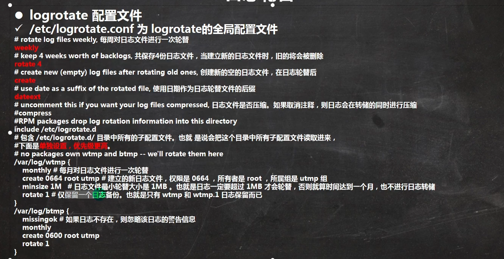

# 一.linux文件结构

linux中所有的内容都是文件，包括cpu，disk等

其中远程登录后的文件目录：

- /bin：是Binary的缩写，这个目录存放着最经常使用的命令。
- /sbin：s就是Super User的意思，这里存放的是系统管理员使用的系统管理程序。
- /home：存放普通用户的主目录，在Linux中每个用户都有一个自己的目录，一般该目录名是以用户的账号命名的。
- /root：该目录为系统管理员，也称作超级权限者的用户主目录。
- /lib：系统开机所需要最基本的动态连接共享库，其作用类似于Windows里的DLL文件。几乎所有的应用程序都需要用到这些共享库。
- /lost+found：这个目录一般情况下是空的，当系统非法关机后，这里就存放了一些文件。
- /etc：所有的系统管理所需要的配置文件和子目录my.conf。
- /usr：这是一个非常重要的目录，用户的很多应用程序和文件都放在这个目录下，类似与windows下的program files目录。
- /boot：存放的是启动Linux时使用的一些核心文件，包括一些连接文件以及镜像文件。
- /proc：这个目录是一个虚拟的目录，它是系统内存的映射，访问这个目录来获取系统信息。
- /srv：service的缩写，该目录存放一些服务启动之后需要提供的数据。
- /sys：这是linux2.6内核的一个很大的变化。该目录下安装了2.6内核中新出现的一个文件系统sysfs。
- /tmp：这个目录是用来存放一些临时文件的。
- /dev：类似windows的设备管理器，把所有的硬件用文件的形式存储。
- /media：linux系统会自动识别一些设备，例如U盘光驱等等，当识别后，linux会把识别的设备挂载到这个目录下。
- /mnt：系统提供该目录是为了让用户临时挂载别的文件系统的，我们可以将外部的存储挂载在/mnt/上，然后进入该目录就可以查看里面的内容了。
- /opt：这是给主机额外安装软件所摆放的目录，如安装ORACLE数据库就可放到该目录下。默认为空。
- /usr/local：这是另一个给主机额外安装软件所安装的目录，一般是通过编译源码的方式安装的程序。
- /var：这个目录中存放着在不断扩充着的东西，习惯将经常被修改的目录放在这个目录下，包括各种日志文件。
- /selinux：SELinux是一种安全子系统，它能控制程序只能访问特定文件。

# 二.vim指令

Xshell登录到linux后，可以使用vim读写文件

* vim三种模式
  * 正常模式：正常模式可以使用快捷键
  * 插入/编辑模式：可以向文件写入内容
  * 命令行模式：提供指令


指令切换

在shell中，进入/创建一个文件:

```
vim Hello.java
```

**刚进入文件时，处于正常模式**，此时输入的字符不可视

1.键入i/o进入编辑模式，此时可以编辑文件

2.在其他模式下，键入ESC可以返回正常模式

3.在其他模式下，键入:（冒号）进入命令行模式


常用命令：

在**正常模式**下，按下ESC

1.复制/粘贴

可以移动光标，使用yy赋值当前光标所在的行，使用5yy复制当前行开始的五行，使用p粘贴

2.删除

dd删除当前行，5dd删除当前起的五行

3.查找

键入/Hello回车，所有查找结果会高亮，按n可以跳转到下一个结果

4.撤销操作

u

5.光标移动

光标移动到末尾G

光标移动到开头gg

光标移动到指定行数：

* 输入行数（最好先开启行数）
* 键入shift+G


**命令行模式**下，按下冒号

1.显示/取消显示 行号

set nu

set nonu

2.退出文件

保存并退出，wq

退出（没有对文件进行修改的情况下），q

强制退出不保存，q!


# 三.常用shell指令

## 1.组

多个用户在一个组中，拥有这个组的权限，不同组的权限有所不同

每个用户一定在某个组中，如果我们创建用户时没有给他指定组，那么自动创建一个组，组名为该用户名


用户和组相关的三个文件：

（1）/etc/passwd文件：记录了用户信息

用户名：口令：用户标识号：组标识号：注释性说明：主目录：登录的shell

> 登录的shell，shell可以理解为解释命令的工具，我们输入的命令->shell解析->linux内核

（2）/etc/shadow文件：口令的配置文件

（3）/etc/group组的配置文件


## 2.文件目录

绝对路径 /home/tom/a.txt

相对路径 home/tom/a.txt


### 2.1 基本操作

1.cd

```
cd ../	回到上一级文件夹
cd ~	回到用户文件夹
cd /	回到根目录
cd /home/tom	跳转至指定的绝对路径
cd home/tom		跳转至指定的相对路径
```

2.pwd显示当前绝对路径

3.创建文件夹

mkdir

```
mkdir /home/dog		在home文件夹下创建dog文件夹
mkdir -p /home/animal/tiger		在home文件夹下创建animal/tiger多级目录
```

4.删除文件

rmdir

```
rmdir /home/dog
不可删除有内容的文件夹
```

rm -rf

```
rm -rf /home/animal
强制删除
```

5.touch创建一个空文件

```
[root@CentAlmond home]# cd milan
[root@CentAlmond milan]# touch newFile.txt
[root@CentAlmond milan]# ls
newFile.txt
```

6.cp复制

```
cp 源文件 目的文件夹：
[root@CentAlmond home]# cp /home/milan/newFile.txt /home/file

复制一个多文件的目录：
[root@CentAlmond file]# cp -r /home/file/ /home/milan/copy
包括file都会被复制到copy文件夹中

如果有重名文件，需要对每个文件确认是否覆盖
[root@CentAlmond file]# cp -r /home/file/ /home/milan/copy
cp: overwrite ‘/home/milan/copy/file/newFile.txt’? y
cp: overwrite ‘/home/milan/copy/file/newfile2’? y
强制覆盖，不提示：
[root@CentAlmond file]# \cp -r /home/file/ /home/milan/copy
```

7.删除

```
普通删除
[root@CentAlmond file]# rm newFile.txt
rm: remove regular empty file ‘newFile.txt’? y

不提示删除
[root@CentAlmond file]# rm -f newfile2

递归删除
[root@CentAlmond milan]# rm -r copy
rm: descend into directory ‘copy’? y
rm: descend into directory ‘copy/file’? y
rm: remove regular empty file ‘copy/file/newfile2’? y
rm: remove directory ‘copy/file’? y
rm: remove directory ‘copy’? y
[root@CentAlmond milan]# ls
newFile.txt

不提示递归删除
rm -rf copy
```

7.移动文件

mv

```
可以用于重命名一个文件：
[root@CentAlmond home]# touch cat.txt
[root@CentAlmond home]# ls
almond  cat.txt  file  milan  teamer1  user01
[root@CentAlmond home]# mv cat.txt pig.txt
[root@CentAlmond home]# ls
almond  file  milan  pig.txt  teamer1  user01

移动单个文件并改名（这里误写成在根目录创建这个文件了）
[root@CentAlmond home]# mv pig.txt /home.milan.tiger.txt
[root@CentAlmond /]# cd /
[root@CentAlmond /]# ls
bin  boot  dev  etc  home  home.milan.tiger.txt  lib  lib64  lost+found  media  mnt  opt  proc  root  run  sbin  srv  sys  tmp  usr  var

移动多个文件
[root@CentAlmond milan]# mv aaa /home
[root@CentAlmond milan]# cd /home
[root@CentAlmond home]# ls
aaa  almond  file  milan  teamer1  user01
[root@CentAlmond home]# cd aaa
[root@CentAlmond aaa]# ls
bbb

```

8.查看文件

cat只读

```
查看文件，并显示行号
[root@CentAlmond aaa]# cat -n /etc/profile

结合管道命令使用（将本命令的执行结果交给管道命令执行）
[root@CentAlmond aaa]# cat -n /etc/profile |more
然后可以和结果进行交互，回车显示下一行，空格进行翻页

```

more

```
[root@CentAlmond aaa]# more /etc/profile
回车显示下一行，空格进行翻页,q退出，=显示当前行的行号，:f显示文件名和行号
```

less加载一部分文件就显示，而不是全部加载才显示，适用于大文件

```
[root@CentAlmond aaa]# less /etc/profile
```


### 2.2 echo、head、tail


```
echo
输出环境变量
[root@CentAlmond aaa]# echo $HOSTNAME
CentAlmond
输出指定字符串
[root@CentAlmond aaa]# echo "almond"
almond

head
显示文件前几行（默认是10）
[root@CentAlmond aaa]# head /etc/profile
显示前5行
[root@CentAlmond aaa]# head -n 5 /etc/profile

tail
显示倒数的若干行，与head一致
监控文档的更新
[root@CentAlmond home]# tail -f mydata.txt
此时开始跟踪文档的更新，在另一个终端对mydata写入信息，就会输出在这里,退出输入ctrl+C

```


### 2.3 重定向

```
>表示重定向，覆盖文件
>>重定向，在文件末尾添加

将本身是在控制台输出的内容重定向到一个文件中，如果没有则创建这个文件
[root@CentAlmond home]# ls -l /home > /home/homeInfo.txt
[root@CentAlmond home]# cat homeInfo.txt
total 28
drwxr-xr-x.  3 root    root   4096 May 16 15:26 aaa
drwx------. 17 almond  almond 4096 May 16 15:56 almond
drwxr-xr-x.  2 root    root   4096 May 16 15:16 file
-rw-r--r--.  1 root    root      0 May 16 16:15 homeInfo.txt
drwx------.  5 teamer1 g1     4096 May 16 15:33 milan
-rw-r--r--.  1 root    root      0 May 16 15:59 mydata.txt
-rw-r--r--.  1 root    root      6 May 16 16:00 mydate.txt
drwx------.  3 teamer1 g2     4096 May 15 21:44 teamer1
drwx------.  5 user01  user01 4096 May 15 20:17 user01

>是覆盖写
[root@CentAlmond home]# echo "hello" > /home/homeInfo.txt
[root@CentAlmond home]# cat homeInfo.txt
hello

>>是追加写
[root@CentAlmond home]# echo "almond" >> /home/homeInfo.txt
[root@CentAlmond home]# cat homeInfo.txt
hello
almond

```


### 2.4 链接

（相当于快捷方式）

```
ln -s 源文件 去源文件的链接
[root@CentAlmond home]# ln -s /root /home/myroot
删除链接
[root@CentAlmond home]# rm /home/myroot
rm: remove symbolic link ‘/home/myroot’? y

```


### 2.5 查看历史命令

```
[root@CentAlmond home]# history

最近10个指令
[root@CentAlmond home]# history 10

执行历史记录中标号为10的命令
!10
```


### 2.6 查找

find

```
find 在哪个路径下查找 查找方式
按照文件名查
[root@CentAlmond home]# find /home -name mydata.txt
/home/mydata.txt
按照user查
[root@CentAlmond home]# find /home -name mydata.txt
/home/mydata.txt
查找大于200MB的文件（+n大于n，-n小于n，n等于n，单位有k，M，G）
[root@CentAlmond home]# find / -size +100M
```


locate快速检索文件路径，他有一个数据库，有文件路径的信息

使用前需要更新数据库

```
[root@CentAlmond home]# updatedb
[root@CentAlmond home]# locate mydata.txt
/home/mydata.txt
/usr/share/systemtap/examples/io/eatmydata.txt

```


定位指令

```
[root@CentAlmond home]# which ls
alias ls='ls --color=auto'
	/usr/bin/ls
```


管道grep

```
-n显示行数，查找一个文件中含有指定信息的行
[root@CentAlmond home]# cat /home/mydata.txt | grep -n "yes"
1:yes
3:yes

另一种写法
[root@CentAlmond home]# grep -n "hello" /home/mydata.txt
4:hello
区分大小写
[root@CentAlmond home]# grep -ni "hello" /home/mydata.txt
2:HELLO
4:hello

```


### 2.7 压缩、解压

```
gzip/gunzip
[root@CentAlmond home]# gzip /home/mydata.txt
[root@CentAlmond home]# ls
aaa  almond  file  homeInfo.txt  milan  mydata.txt.gz  mydate.txt  teamer1  user01
[root@CentAlmond home]# gunzip /home/mydata.txt.gz
[root@CentAlmond home]# ls
aaa  almond  file  homeInfo.txt  milan  mydata.txt  mydate.txt  teamer1  user01

zip/unzip
将home已经home下的所有文件压缩成myhome.zip放在当前文件夹下
[root@CentAlmond home]# zip -r myhome /home/
将zip文件解压到home/milan下
[root@CentAlmond home]# unzip -d /home/milan /home/myhome.zip


```


tar

tar压缩为xxx.tar.gz

选项：
-c 产生.tar.打包文件
-v 显示详细信息
-f 指定压缩后的文件名
-z 打包时同时压缩
-x 解包.tar文件

**选项中f要放在最后一个，因为要跟一个参数**


将两个文件**包括这两个文件的根文件（home）**压缩为myinfo.tar.gz，放在当前目录下:

```
[root@CentAlmond home]# tar -zcvf myinfo.tar.gz /home/mydata.txt /home/mydate.txt
```

解压

```
[root@CentAlmond home]# tar -zxvf myinfo.tar.gz


查看压缩的目录格式：
[root@CentAlmond home]# ls
aaa  almond  file  home  homeInfo.txt  milan  myhome.zip  myinfo.tar.gz  teamer1  user01  z
[root@CentAlmond home]# cd home
[root@CentAlmond home]# ls
mydata.txt  mydate.txt
可见压缩的格式是 home里存放我们要压缩的两个文件
```

解压到指定目录

```
[root@CentAlmond home]# tar -zxvf /home/myinfo.tar.gz -C /home/milan
```

# 四.组

每个用户都有一个组，每个用户创建的文件属于该用户（所有者），该用户所属组的组员拥有使用这个文件的权限，其他组也对该文件有一定的权限


## 1.基本命令

查看文件所有者

```
[root@CentAlmond home]# ls -ahl
显示：
total 128M
drwxr-xr-x.  9 root    root   4.0K May 16 17:18 .
dr-xr-xr-x. 18 root    root   4.0K May 16 15:28 ..
drwxr-xr-x.  3 root    root   4.0K May 16 15:26 aaa
drwx------. 17 almond  almond 4.0K May 16 15:56 almond
drwxr-xr-x.  2 root    root   4.0K May 16 15:16 file
drwxr-xr-x.  2 root    root   4.0K May 16 17:18 home
-rw-r--r--.  1 root    root     13 May 16 16:19 homeInfo.txt
drwx------.  6 teamer1 g1     4.0K May 16 17:04 milan
-rw-r--r--.  1 root    root   128M May 16 17:02 myhome.zip
-rw-r--r--.  1 root    root    174 May 16 17:14 myinfo.tar.gz
drwx------.  3 teamer1 g2     4.0K May 15 21:44 teamer1
drwx------.  5 user01  user01 4.0K May 15 20:17 user01
-rw-r--r--.  1 root    root    10K May 16 17:14 z
```

修改文件所有者

```
[root@CentAlmond home]# chown user01 apple.txt
```


组的创建，向组中加入组员：

```
[root@CentAlmond home]# groupadd animal
[root@CentAlmond home]# useradd -g animal fox
[root@CentAlmond home]# id fox
uid=1003(fox) gid=1004(animal) groups=1004(animal)
```

查看文件属于哪个组

```
登录到fox用户
[fox@CentAlmond ~]$ touch fox.txt
[fox@CentAlmond ~]$ ls -ahl
...
-rw-r--r--.  1 fox  animal（属于animal组）    0 May 16 17:46 fox.txt
...
```

修改文件所属的组

```
[root@CentAlmond home]# chgrp fruit apple.txt
```


改变用户所在的组

查看是否有某个组

```
[root@CentAlmond home]# cat /etc/group | grep -n fruit
77:fruit:x:1005:
```

修改用户的组

```
[root@CentAlmond home]# usermod -g fruit fox 
[root@CentAlmond home]# id fox
uid=1003(fox) gid=1005(fruit) groups=1005(fruit)
```


## 2.权限

```
[root@CentAlmond home]# ls -l
total 130216
drwxr-xr-x.  3 root    root        4096 May 16 15:26 aaa
drwx------. 17 almond  almond      4096 May 16 15:56 almond
-rw-r--r--.  1 user01  fruit          0 May 16 17:50 apple.txt
drwxr-xr-x.  2 root    root        4096 May 16 15:16 file
drwx------.  5 fox     fruit       4096 May 16 17:49 fox
drwxr-xr-x.  2 root    root        4096 May 16 17:18 home
-rw-r--r--.  1 root    root          13 May 16 16:19 homeInfo.txt
drwx------.  6 teamer1 g1          4096 May 16 17:04 milan
-rw-r--r--.  1 root    root   133285293 May 16 17:02 myhome.zip
-rw-r--r--.  1 root    root         174 May 16 17:14 myinfo.tar.gz
drwx------.  3 teamer1 g2          4096 May 15 21:44 teamer1
drwx------.  5 user01  user01      4096 May 15 20:17 user01
-rw-r--r--.  1 root    root       10240 May 16 17:14 z
```

最左边的一列代表权限，由10为组成

第0位：

> d：文件夹
>
> -：单个文件
>
> c：字符设备文件，比如鼠标键盘
>
> b：块设备，硬盘

第1-3位：文件所有者对该文件的权限

第4-6位：文件所属组对文件所有的权限

第7-9位：其他组（除了所有组的其他组）对文件的权限


权限字母rwx

（1）作用在单个文件：

* r：可读
* w：可写，**可以修改该文件但是必须有改文件所在目录的权限才能删除该文件（因为删除改变了目录结构）**
* x：可执行

（2）作用在文件目录：

* r：可读，可以使用ls查询目录内容，并不是指可以cd进来
* w：可写，可以修改，可以创建，删除，重命名目录，单指对文件目录进行的更改
* x：可执行，指可以cd进入目录


一行各个字段的意义

```
drwxr-xr-x.  3(表示本文件内有三个子文件或文件夹) root    root        4096(字节数) May 16 15:26(最后修改日期) aaa
```

## 3.修改权限

u所有者，g文件所属的组，o代表其他组，a表示所有人

```
=来赋予权限
[root@CentAlmond home]# chmod u=rwx,g=rx,o=r abc.txt
+-来赋予权限
[root@CentAlmond home]# chmod u-x,g+w abc.txt
[root@CentAlmond home]# chmod a+r abc.txt
```

通过数字变更权限：

r=4，w=2，x=1

```
1-->x
2-->w
3-->xw
4-->r
5-->rx
6-->rw
7-->rwx
```

设置：

```
[root@CentAlmond home]# chmod 755 abc.txt
u为7-->rxw
g为5——>rx
o为5——>rx
```


## 4.修改文件所有者

更改一个文件的所有者

```
[root@CentAlmond home]# chown fox /home/abc.txt
```

更改一个文件夹的所有者（文件夹下可能有多个文件，整个目录都会更改所有者）

```
[root@CentAlmond milan]# chown -R fox home
[root@CentAlmond milan]# ll
total 4
drwxr-xr-x. 8 fox  root 4096 May 16 17:22 home
-rw-r--r--. 1 root root    0 May 16 14:54 newFile.txt
[root@CentAlmond milan]# cd home
[root@CentAlmond home]# ll
total 36
drwxr-xr-x.  3 fox root 4096 May 16 15:26 aaa
drwx------. 17 fox root 4096 May 16 15:56 almond
drwxr-xr-x.  2 fox root 4096 May 16 15:16 file
-rw-r--r--.  1 fox root   13 May 16 16:19 homeInfo.txt
drwx------.  5 fox root 4096 May 16 15:33 milan
-rw-r--r--.  1 fox root   24 May 16 16:54 mydata.txt
-rw-r--r--.  1 fox root    6 May 16 16:00 mydate.txt
drwx------.  3 fox root 4096 May 15 21:44 teamer1
drwx------.  5 fox root 4096 May 15 20:17 user01

```

更改所有者和所在组

```
[root@CentAlmond home]# chown root:root aaa
用户名:组名
```


## 5.修改所在组

修改单一文件的所在组

```
[root@CentAlmond home]# chgrp animal aaa
```

修改一个文件夹以及其子目录的所在组，-R表示递归

```
[root@CentAlmond milan]# chgrp -R animal home
```


一个问题：组员t1从t转到ct，再转回t，他创建的文件默认都是ct组?

```
[t1@CentAlmond ~]$ vim t.txt
[t1@CentAlmond ~]$ id t1
uid=1006(t1) gid=1007(t) groups=1007(t)
[t1@CentAlmond ~]$ ls -ahl
total 52K
drwxr-x---.  5 t1   t    4.0K May 16 20:58 .
drwxr-xr-x. 14 root root 4.0K May 16 20:06 ..
-rw-r--r--.  1 t2   t       0 May 16 20:37 aaa
-rwxrw----.  1 t1   ct      8 May 16 20:54 aaa.java
-rw-r--r--.  1 t1   t      18 Oct 31  2018 .bash_logout
-rw-r--r--.  1 t1   t     193 Oct 31  2018 .bash_profile
-rw-r--r--.  1 t1   t     231 Oct 31  2018 .bashrc
drwxr-xr-x.  3 t1   t    4.0K May 16 20:14 .cache
drwxr-xr-x.  3 t1   t    4.0K May 16 20:14 .config
-rwxrw----.  1 t1   t      29 May 16 20:52 monkey.java
drwxr-xr-x.  4 t1   t    4.0K May 15 18:16 .mozilla
-rw-r--r--.  1 t1   ct      8 May 16 20:58 t.txt
-rw-------.  1 t1   ct    861 May 16 20:58 .viminfo
-rw-------.  1 t1   t      56 May 16 20:14 .Xauthority

```

重新连接后的测试：

```
[t1@CentAlmond ~]$ vim t1new.txt
[t1@CentAlmond ~]$ ls -ahl
total 60K
drwxr-x---.  5 t1   t    4.0K May 16 21:03 .
drwxr-xr-x. 14 root root 4.0K May 16 20:06 ..
-rw-r--r--.  1 t2   t       0 May 16 20:37 aaa
-rwxrw----.  1 t1   ct      8 May 16 20:54 aaa.java
-rw-------.  1 t1   ct    455 May 16 21:02 .bash_history
-rw-r--r--.  1 t1   t      18 Oct 31  2018 .bash_logout
-rw-r--r--.  1 t1   t     193 Oct 31  2018 .bash_profile
-rw-r--r--.  1 t1   t     231 Oct 31  2018 .bashrc
drwxr-xr-x.  3 t1   t    4.0K May 16 20:14 .cache
drwxr-xr-x.  3 t1   t    4.0K May 16 20:14 .config
-rwxrw----.  1 t1   t      29 May 16 20:52 monkey.java
drwxr-xr-x.  4 t1   t    4.0K May 15 18:16 .mozilla
-rw-r--r--.  1 t1   t       9 May 16 21:03 t1new.txt
-rw-r--r--.  1 t1   ct      8 May 16 20:58 t.txt
-rw-------.  1 t1   t    1.1K May 16 21:03 .viminfo
-rw-------.  1 t1   t      56 May 16 21:02 .Xauthority

```

**注意：在远程登录的shell不是实时更新的，如果用户的组被更改，那么必须重新连接一次linux**

# 五.定时任务调用

## 1.crontab

反复执行命令

```
[root@CentAlmond ~]# crontab -e
```

之后会弹出一个可写的vim文件窗口（这个文件窗口中含有我们所有定义的定时调度任务），直接编写执行的时间和命令，这个命令可以就是一行指令，也可以是运行一个写好的shell脚本。


通过脚本运行多个命令

1.先写脚本：

```
[root@CentAlmond home]# vim my.sh
```

脚本写法跟命令行写法一致，可以写入多个命令

2.给新建的脚本增加运行权限x（**默认没有运行权限**）

3.在定时调用中添加一道运行这个脚本的命令（/home/my.sh）

```
[root@CentAlmond ~]# crontab -e
```

进入界面后，编写调用时间+调用的命令（/home/my.sh）

## 2.at定时任务

特点：

* 只执行一次命令
* at命令必须要有atd的守护进程来执行，如果该线程未启动就不能执行
* atd每60s检查一次任务队列，时间符合就执行任务

检查运行的进程：

```
ps -ef
[root@CentAlmond home]# ps -ef | grep atd
root       6915      1  0 12:57 ?        00:00:00 /usr/sbin/atd -f
root      17947  16722  0 13:49 pts/0    00:00:00 grep --color=auto atd //这个是我们的grep中写的atd
```


定时任务：

```
[root@CentAlmond home]# at 5pm + 2 days
进入下面的输入行，输入错误退格键为Ctrl+backspace，按两次Ctrl+D确认命令
at> ls /home<EOT>
job 1 at Thu May 19 17:00:00 2022
```


查看定时任务

```
[root@CentAlmond home]# atq
```

删除任务

```
atrm 任务编号

[root@CentAlmond home]# atq
1	Thu May 19 17:00:00 2022 a root
[root@CentAlmond home]# atrm 1
[root@CentAlmond home]# atq
```

# 六.磁盘分区

查看分区情况

```
lsblk

[root@CentAlmond /]# lsblk
NAME   MAJ:MIN RM  SIZE RO TYPE MOUNTPOINT
sda      8:0    0   20G  0 disk 
├─sda1   8:1    0    1G  0 part /boot    //硬盘分区1被挂载到/boot文件
├─sda2   8:2    0    2G  0 part [SWAP]
└─sda3   8:3    0   17G  0 part /
sr0     11:0    1 1024M  0 rom  
```

硬盘被挂载到各个文件中，当我们访问各个文件，相当于访问了硬盘。

若一个硬盘满了，我们可以用另一个新的硬盘挂载到原来硬盘的所在分区


SCSI硬盘编号：sdx~，x为abcd，代表1234号**硬盘**；~表示分区号

```
sda2表示第1块硬盘上的第2个分区
```


## 1.临时挂载

案例：在虚拟机上新增一个硬盘，实现该硬盘的分区挂载

```
[root@CentAlmond ~]# lsblk
NAME   MAJ:MIN RM  SIZE RO TYPE MOUNTPOINT
sda      8:0    0   20G  0 disk 
├─sda1   8:1    0    1G  0 part /boot
├─sda2   8:2    0    2G  0 part [SWAP]
└─sda3   8:3    0   17G  0 part /
sdb      8:16   0    1G  0 disk 		//新硬盘
sr0     11:0    1 1024M  0 rom 
```

给硬盘分区：

```
fdisk 硬盘位置

[root@CentAlmond ~]# fdisk /dev/sdb
```

进入fdisk界面

```
Command (m for help): m
Command action
   a   toggle a bootable flag
   b   edit bsd disklabel
   c   toggle the dos compatibility flag
   d   delete a partition
   g   create a new empty GPT partition table
   G   create an IRIX (SGI) partition table
   l   list known partition types
   m   print this menu
   n   add a new partition//分区
   o   create a new empty DOS partition table
   p   print the partition table
   q   quit without saving changes//不保存退出
   s   create a new empty Sun disklabel
   t   change a partition's system id
   u   change display/entry units
   v   verify the partition table
   w   write table to disk and exit//保存退出
   x   extra functionality (experts only)
```

开始分区：

```
Partition type:
   p   primary (0 primary, 0 extended, 4 free)
   e   extended
Select (default p): p //选择主分区还是扩展分区
Partition number (1-4, default 1): 1
First sector (2048-2097151, default 2048): 
Using default value 2048
Last sector, +sectors or +size{K,M,G} (2048-2097151, default 2097151): 
Using default value 2097151
Partition 1 of type Linux and of size 1023 MiB is set
```

保存退出：

```
Command (m for help): w
The partition table has been altered!

Calling ioctl() to re-read partition table.
Syncing disks.

查看结果：
[root@CentAlmond ~]# lsblk
NAME   MAJ:MIN RM  SIZE RO TYPE MOUNTPOINT
sda      8:0    0   20G  0 disk 
├─sda1   8:1    0    1G  0 part /boot
├─sda2   8:2    0    2G  0 part [SWAP]
└─sda3   8:3    0   17G  0 part /
sdb      8:16   0    1G  0 disk 
└─sdb1   8:17   0 1023M  0 part 
sr0     11:0    1 1024M  0 rom  
```

**只有格式化的分区才能够挂载到文件中，即我们需要指定这个分区的格式（正如我们创建虚拟机时给每个分区指定为ext4）**，而且我们新建的分区没有uuid，在格式化后就会创建这个uuid

```
[root@CentAlmond ~]# lsblk -f
NAME   FSTYPE LABEL UUID                                 MOUNTPOINT
sda                                                      
├─sda1 ext4         e299d1a3-489c-4e6a-9e3a-b5983dd1efcc /boot
├─sda2 swap         fb8d7922-28a2-4daf-8227-87fcfa2070be [SWAP]
└─sda3 ext4         3d2f91b6-1e49-43be-a3a9-c994f02f4bc8 /
sdb                                                      
└─sdb1                                                   
sr0                                                      
```

格式化：ext4为格式，/dev/sdb1为分区

```
[root@CentAlmond ~]# mkfs -t ext4 /dev/sdb1
```

格式化后：新分区有了uuid

```
[root@CentAlmond ~]# lsblk -f
NAME   FSTYPE LABEL UUID                                 MOUNTPOINT
sda                                                      
├─sda1 ext4         e299d1a3-489c-4e6a-9e3a-b5983dd1efcc /boot
├─sda2 swap         fb8d7922-28a2-4daf-8227-87fcfa2070be [SWAP]
└─sda3 ext4         3d2f91b6-1e49-43be-a3a9-c994f02f4bc8 /
sdb                                                      
└─sdb1 ext4         d5535cde-e97e-4782-bed0-3375c743e878 
```

挂载：

```
[root@CentAlmond /]# pwd
/
[root@CentAlmond /]# mkdir newdisk				//在合适的位置创建文件夹
[root@CentAlmond /]# mount /dev/sdb1 /newdisk   //挂载


[root@CentAlmond /]# lsblk -f
NAME   FSTYPE LABEL UUID                                 MOUNTPOINT
sda                                                      
├─sda1 ext4         e299d1a3-489c-4e6a-9e3a-b5983dd1efcc /boot
├─sda2 swap         fb8d7922-28a2-4daf-8227-87fcfa2070be [SWAP]
└─sda3 ext4         3d2f91b6-1e49-43be-a3a9-c994f02f4bc8 /
sdb                                                      
└─sdb1 ext4         d5535cde-e97e-4782-bed0-3375c743e878 /newdisk 		//成功挂载
```

**以上的挂载是临时的，当重启后失效**

卸载：

```
umount /dev/sdb1 /newdisk

[root@CentAlmond /]# umount /dev/sdb1 /newdisk
umount: /newdisk: not mounted
[root@CentAlmond /]# lsblk -f
NAME   FSTYPE LABEL UUID                                 MOUNTPOINT
sda                                                      
├─sda1 ext4         e299d1a3-489c-4e6a-9e3a-b5983dd1efcc /boot
├─sda2 swap         fb8d7922-28a2-4daf-8227-87fcfa2070be [SWAP]
└─sda3 ext4         3d2f91b6-1e49-43be-a3a9-c994f02f4bc8 /
sdb                                                      
└─sdb1 ext4         d5535cde-e97e-4782-bed0-3375c743e878 
sr0
```


## 2.永久挂载

修改配置文件：

```
[root@CentAlmond /]# vim /etc/fstab
```

加入新分区的信息（uuid直接用文件目录替代即可）

```
#
# /etc/fstab
# Created by anaconda on Sun May 15 18:15:50 2022
#
# Accessible filesystems, by reference, are maintained under '/dev/disk'
# See man pages fstab(5), findfs(8), mount(8) and/or blkid(8) for more info
#
/dev/sdb1                                 /newdisk                ext4    defaults        0 0
UUID=3d2f91b6-1e49-43be-a3a9-c994f02f4bc8 /                       ext4    defaults        1 1
UUID=e299d1a3-489c-4e6a-9e3a-b5983dd1efcc /boot                   ext4    defaults        1 2
UUID=fb8d7922-28a2-4daf-8227-87fcfa2070be swap                    swap    defaults        0 0
```

这时重启后就挂载上了(这是因为系统启动后会查这个配置文件，然后进行挂载)

```
[root@CentAlmond ~]# lsblk -f
NAME   FSTYPE LABEL UUID                                 MOUNTPOINT
sda                                                      
├─sda1 ext4         e299d1a3-489c-4e6a-9e3a-b5983dd1efcc /boot
├─sda2 swap         fb8d7922-28a2-4daf-8227-87fcfa2070be [SWAP]
└─sda3 ext4         3d2f91b6-1e49-43be-a3a9-c994f02f4bc8 /
sdb                                                      
└─sdb1 ext4         d5535cde-e97e-4782-bed0-3375c743e878 /newdisk
```


## 3.查看磁盘情况

查看空间使用情况：

```
[root@CentAlmond ~]# df -h
Filesystem      Size  Used Avail Use% Mounted on
/dev/sda3        17G  5.6G   11G  36% /
devtmpfs        895M     0  895M   0% /dev
tmpfs           910M     0  910M   0% /dev/shm
tmpfs           910M   11M  900M   2% /run
tmpfs           910M     0  910M   0% /sys/fs/cgroup
/dev/sdb1       991M  2.6M  922M   1% /newdisk
/dev/sda1       976M  144M  766M  16% /boot
tmpfs           182M   12K  182M   1% /run/user/42
tmpfs           182M     0  182M   0% /run/user/0
```


查看当前文件夹下的空间使用：

-max-depth=1只查看当前目录/opt下的文件，而不查询子文件夹，-a表示查询所有文件（文件夹以及单个的文件，默认不查询单个文件）

```

[root@CentAlmond ~]# du -ha --max-depth=1 /opt
4.0K	/opt/rh
8.0K	/opt
增加汇总：
[root@CentAlmond ~]# du -hac --max-depth=1 /opt
4.0K	/opt/rh
8.0K	/opt
8.0K	total
```


找出当前文件夹下的，不含子文件夹的所有以-开头的文件数量

grep "^-" ：正则表达式，表示以-开头的文件，wc表示计数

```
[root@CentAlmond ~]# ls -l /home | grep "^-" | wc -l
8
[root@CentAlmond ~]# ls -l /home | grep "^-"
-rwxr-xr-x.  1 fox     root           0 May 16 19:44 abc.txt
-rw-r--r--.  1 user01  fruit          0 May 16 17:50 apple.txt
-rw-r--r--.  1 root    root          13 May 16 16:19 homeInfo.txt
-rw-r--r--.  1 root    root        1320 May 17 13:45 mycal.txt
-rw-r--r--.  1 root    root   133285293 May 16 17:02 myhome.zip
-rw-r--r--.  1 root    root         174 May 16 17:14 myinfo.tar.gz
-rwxr--r--.  1 root    root          47 May 17 13:34 my.sh
-rw-r--r--.  1 root    root       10240 May 16 17:14 z
//当前目录有8个符合条件的
```


找出当前文件**以及子文件夹下的**所有-开头的文件数量:

```
[root@CentAlmond ~]# ls -lR /home | grep "^-" | wc -l
24
```

 

以树状的形式显示文件夹：

```
[root@CentAlmond ~]# tree /home
```

如果没有这个指令，手动安装一个

```
[root@CentAlmond ~]# yum install tree
输入两次y回车
```

# 七.网络配置

## 1.虚拟机怎么连接到主机

虚拟机ip地址：192.168.245.129 （255.255.255.0）

```
[root@CentAlmond ~]# ifconfig
ens33: flags=4163<UP,BROADCAST,RUNNING,MULTICAST>  mtu 1500
        inet 192.168.245.129  netmask 255.255.255.0  broadcast 192.168.245.255
        inet6 fe80::1c1e:d048:40ff:7a5  prefixlen 64  scopeid 0x20<link>
        ether 00:0c:29:4e:bd:0b  txqueuelen 1000  (Ethernet)
        RX packets 5622  bytes 415814 (406.0 KiB)
        RX errors 0  dropped 0  overruns 0  frame 0
        TX packets 10286  bytes 2797293 (2.6 MiB)
        TX errors 0  dropped 0 overruns 0  carrier 0  collisions 0
```

主机中VMnet8为192.168.245.1（255.255.255.0），VMware中NAT模式默认使用VMnet8

```
 IPv4 地址 . . . . . . . . . . . . : 192.168.245.1
   子网掩码  . . . . . . . . . . . . : 255.255.255.0
```

两者同属一个子网中


ping

主机可以ping通虚拟机

虚拟机ping主机会卡住，这是因为主机有防火墙

```
[root@CentAlmond ~]# ping 192.168.245.1
PING 192.168.245.1 (192.168.245.1) 56(84) bytes of data.
```


## 2.修改虚拟机ip为固定ip

因为服务器的ip应该不是DHCP动态分配的，而是固定的，这样才能方便外界请求访问到服务器。


案例：将虚拟机ip修改为固定ip，ip为192.168.200.130

```
vim /etc/sysconfig/network-scripts/ifcfg-ens33
```

```
TYPE="Ethernet"
PROXY_METHOD="none"
BROWSER_ONLY="no"
BOOTPROTO="static"		#这里修改为static
DEFROUTE="yes"
IPV4_FAILURE_FATAL="no"
IPV6INIT="yes"
IPV6_AUTOCONF="yes"
IPV6_DEFROUTE="yes"
IPV6_FAILURE_FATAL="no"
IPV6_ADDR_GEN_MODE="stable-privacy"
NAME="ens33"
UUID="0906b665-d288-42b5-9ff8-1fd1640a8b1d"
DEVICE="ens33"
ONBOOT="yes"
#这里加入ip，网关，DNS服务器地址
IPADDR=192.168.200.130
GATEWAY=192.168.200.2
DNS1=192.168.200.2
```

在vmware中修改网关和虚拟机所在的子网地址


在Xshell中重新设置服务器ip，进行远程登录


一个问题：

虚拟机中网关


VMnet8的ip：

```
以太网适配器 VMware Network Adapter VMnet8:

   连接特定的 DNS 后缀 . . . . . . . :
   本地链接 IPv6 地址. . . . . . . . : fe80::1d7c:5938:3d91:c21%21
   IPv4 地址 . . . . . . . . . . . . : 192.168.200.1 //不是192.168.200.2？
   子网掩码  . . . . . . . . . . . . : 255.255.255.0
   默认网关. . . . . . . . . . . . . :
```

VMnet8的ip192.168.200.1是同一个子网的另一台机器（我们的主机）而不是网关地址(都写了一个默认网关了)，linux服务器中配置的网关地址为192.168.200.2可以正常ping通，192.168.200.1无法ping通(防火墙)。


## 3.使用主机名找到服务器（配置本地dns）

在Windows系统下找到配置文件：

C:\Windows\System32\drivers\etc\hosts

添加：ip地址 主机名

```
192.168.200.130 cent01
```

可以直接ping通

```
C:\WINDOWS\system32>ping cent01

正在 Ping cent01 [192.168.200.130] 具有 32 字节的数据:
来自 192.168.200.130 的回复: 字节=32 时间<1ms TTL=64
来自 192.168.200.130 的回复: 字节=32 时间<1ms TTL=64
来自 192.168.200.130 的回复: 字节=32 时间<1ms TTL=64
来自 192.168.200.130 的回复: 字节=32 时间<1ms TTL=64

192.168.200.130 的 Ping 统计信息:
    数据包: 已发送 = 4，已接收 = 4，丢失 = 0 (0% 丢失)，
往返行程的估计时间(以毫秒为单位):
    最短 = 0ms，最长 = 0ms，平均 = 0ms
```

在linux下给网关起个别名：

```
[root@CentAlmond ~]# vim /etc/hosts

127.0.0.1   localhost localhost.localdomain localhost4 localhost4.localdomain4
::1         localhost localhost.localdomain localhost6 localhost6.localdomain6
192.168.200.2 gate01
```

测试：

```
[root@CentAlmond ~]# ping gate01
PING gate01 (192.168.200.2) 56(84) bytes of data.
64 bytes from gate01 (192.168.200.2): icmp_seq=1 ttl=128 time=0.135 ms
64 bytes from gate01 (192.168.200.2): icmp_seq=2 ttl=128 time=0.215 ms
64 bytes from gate01 (192.168.200.2): icmp_seq=3 ttl=128 time=0.205 ms
64 bytes from gate01 (192.168.200.2): icmp_seq=4 ttl=128 time=0.477 ms
```


## 4.dns的本地寻找流程

1.首先在浏览器寻找是否有DNS缓存

2.在操作系统中寻找dns缓存，比如Windows中在cmd键入

```
ipconfig /displaydns
```

dns本地缓存有两个位置

（1）缓存中寻找，我们最近访问的一些网站会被记录dns

（2）在hosts文件中寻找是否有配置dns缓存,这些是用户自己配置的映射，**hosts文件中配置的dns也算在本地缓存中**

```
这是在ipconfig /displaydns下的输出,其中有hosts文件中自定义的内容
    cent01
    ----------------------------------------
    没有 AAAA 类型的记录


    cent01
    ----------------------------------------
    记录名称. . . . . . . : cent01
    记录类型. . . . . . . : 1
    生存时间. . . . . . . : 590197
    数据长度. . . . . . . : 4
    部分. . . . . . . . . : 答案
    A (主机)记录  . . . . : 192.168.200.130
```

3.到本地dns服务器寻找

# 八.进程管理

运行起来的程序叫进程

进程分前台和后台，前台可以简单理解为占据这个界面的进程；后台是我们"看不到"的程序，比如系统服务，mysql数据库，tomcat服务器等


## 1.查看所有进程：

```
[root@CentAlmond ~]# ps -aux
```


```
[root@CentAlmond ~]# ps -aux | grep sshd
root       6902  0.0  0.2 112756  4316 ?        Ss   16:04   0:00 /usr/sbin/sshd -D
root      17509  0.0  0.2 158712  5540 ?        Ss   16:08   0:00 sshd: root@pts/0
root      18983  0.0  0.0 112712   976 pts/0    S+   17:58   0:00 grep --color=auto sshd

```


## 2.查看父子进程

父进程可以产生多个子进程，终止父进程时可以选择终止他的子进程


以全格式查看进程（这包含了父进程的PID，即PPID字段）

```
[root@CentAlmond ~]# ps -ef
UID         PID   PPID  C STIME TTY          TIME CMD
root          1      0  0 21:17 ?        00:00:03 /usr/lib/systemd/systemd --switched-root --system --deserialize 22
root          2      0  0 21:17 ?        00:00:00 [kthreadd]
root          3      2  0 21:17 ?        00:00:00 [ksoftirqd/0]
root          5      2  0 21:17 ?        00:00:00 [kworker/0:0H]
root          6      2  0 21:17 ?        00:00:00 [kworker/u256:0]
...
```

使用方法：

```
[root@CentAlmond ~]# ps -ef | grep sshd
root       6932      1  0 21:17 ?        00:00:00 /usr/sbin/sshd -D
root       7942   6932  0 21:18 ?        00:00:00 sshd: root@pts/0
root       8071   7951  0 21:23 pts/0    00:00:00 grep --color=auto sshd
```


## 3.终止进程

1.kill，终止进程

案例，通过终止一个用户的进程来使得用户强制登出

sshd是远程登录服务

```
[root@CentAlmond ~]# ps -ef | grep sshd
root       6932      1  0 21:17 ?        00:00:00 /usr/sbin/sshd -D
root       7942   6932  0 21:18 ?        00:00:00 sshd: root@pts/0
root       8118   6932  0 21:28 ?        00:00:00 sshd: t1 [priv]
t1         8123   8118  0 21:28 ?        00:00:00 sshd: t1@pts/1
root       8214   7951  0 21:31 pts/0    00:00:00 grep --color=auto sshd
[root@CentAlmond ~]# kill 8123
t1就被强制登出
```

终止所有远程登录服务

```
[root@CentAlmond ~]# ps -ef | grep sshd
root       7942      1  0 21:18 ?        00:00:00 sshd: root@pts/0     //这就是远程登录服务
root       9182      1  0 21:39 ?        00:00:00 /usr/sbin/sshd -D
root       9198   7951  0 21:40 pts/0    00:00:00 grep --color=auto sshd
[root@CentAlmond ~]# kill 7942
```

启动远程登录服务：

```
[root@CentAlmond ~]# /bin/systemctl start sshd.service
```


2.killall，终止进程以及其子进程

在linux图形界面下，开启多个文本类文件，下边栏显示gedit字样

```
[root@CentAlmond ~]# killall gedit
```

全部文本都被关闭


选项-9，强制终止进程

案例：强制删除终端

```
[root@CentAlmond ~]# ps -aux | grep bash
root       6390  0.0  0.0 115304   956 ?        S    21:17   0:00 /bin/bash /usr/sbin/ksmtuned
root       7951  0.0  0.1 116652  3316 pts/0    Ss   21:18   0:00 -bash
root       8527  0.0  0.0  72312   780 ?        Ss   21:37   0:00 /usr/bin/ssh-agent /bin/sh -c exec -l /bin/bash -c "env GNOME_SHELL_SESSION_MODE=classic gnome-session --session gnome-classic"
root       9364  0.0  0.1 116616  3268 pts/1    Ss+  21:45   0:00 bash
root       9435  0.0  0.1 116616  3268 pts/3    Ss+  21:45   0:00 bash
root       9515  0.0  0.0 112712   976 pts/0    S+   21:48   0:00 grep --color=auto bash
[root@CentAlmond ~]# kill 9364 //无法终止
[root@CentAlmond ~]# kill -9  9364
```


## 4.pstree

树状显示信息

```
pstree -u  	//按用户查看进程树
pstree -p	//按pid查看进程树
```


## 5.服务管理

服务：即后台程序/守护进程，比如mysql，sshd

```
service start/stop/restart/reload/status
```

查看服务名

```
setup
```

进入界面，空格代表选中，tab切换操作（用于操作完成退出）


## 6.运行级别


查看当前运行级别

```
[root@CentAlmond ~]# systemctl get-default
graphical.target
```

设置运行级别	

```
[root@CentAlmond ~]# systemctl set-default multi-user.target
Removed symlink /etc/systemd/system/default.target.
Created symlink from /etc/systemd/system/default.target to /usr/lib/systemd/system/multi-user.target.
[root@CentAlmond ~]# systemctl get-default
multi-user.target
```

这时就重启就无法开启图形界面


## 5.chkconfig

设置一个服务在某个级别自启动/关闭

chkconfig管理的服务在/etc/init.d查看


列出管理的服务：

```
[root@CentAlmond ~]# chkconfig --list

Note: This output shows SysV services only and does not include native
      systemd services. SysV configuration data might be overridden by native
      systemd configuration.

      If you want to list systemd services use 'systemctl list-unit-files'.
      To see services enabled on particular target use
      'systemctl list-dependencies [target]'.

netconsole     	0:off	1:off	2:off	3:off	4:off	5:off	6:off
network        	0:off	1:off	2:on	3:on	4:on	5:on	6:off
```


设置服务network在级别3默认关闭：

```
[root@CentAlmond ~]# chkconfig --level 3 network off
```


## 6.systemctl

查询一个服务的状态

```
[root@CentAlmond ~]# systemctl list-unit-files | grep firewall
firewalld.service                             enabled 
```

设置一个服务开机自启动(enable就是开机自启动)

```
[root@CentAlmond ~]# systemctl enable firewalld.service

关闭自启动：
[root@CentAlmond ~]# systemctl disable firewalld.service
```

查看服务是否自启动

```
[root@CentAlmond ~]# systemctl is-enabled firewalld.service
enabled
```


服务查询，服务开启，服务关闭：（立即生效，而不是自启动）

```
[root@CentAlmond ~]# systemctl stop firewalld.service
[root@CentAlmond ~]# systemctl status firewalld.service
● firewalld.service - firewalld - dynamic firewall daemon
   Loaded: loaded (/usr/lib/systemd/system/firewalld.service; enabled; vendor preset: enabled)
   Active: inactive (dead) since Wed 2022-05-18 17:48:23 CST; 24s ago
...
[root@CentAlmond ~]# systemctl start firewalld.service
[root@CentAlmond ~]# systemctl status firewalld.service
● firewalld.service - firewalld - dynamic firewall daemon
   Loaded: loaded (/usr/lib/systemd/system/firewalld.service; enabled; vendor preset: enabled)
   Active: active (running) since Wed 2022-05-18 17:49:08 CST; 15s ago
...

```

防火墙可以指定关闭的端口


## 7.开启一个端口

查看所有端口对应的网络协议

```
[root@CentAlmond ~]# netstat -anp | more
```

打开/关闭端口，需要reload一下防火墙才有用

```
[root@CentAlmond ~]# firewall-cmd --permanent --add-port=111/tcp
success
重启防火墙
[root@CentAlmond ~]# firewall-cmd --reload
success
查看是否成功开启端口
[root@CentAlmond ~]# firewall-cmd --query-port=111/tcp
yes
```

在windows的cmd远程登录，注意端口号和ip之间是一个空格

```
C:\Users\Alm0nd>telnet 192.168.200.130 111
```

关闭端口：

```
[root@CentAlmond ~]# firewall-cmd --permanent --remove-port=111/tcp
success
```

## 8.top指令

top可以按一定秒数刷新监控进程

```
[root@CentAlmond ~]# top -d 3
```


僵尸进程：进程以及dead而内存没有释放

进入这个动态监控界面时，直接键入：

P：以CPU使用率排序，默认

M：以内存的使用率排序

N：以pid排序

q：退出

u：查看指定的用户的进程

k：kill进程，删除指定pid，然后再输入选项（强制删除9）


## 9.监听网络

```
[root@CentAlmond ~]# netstat -an | more
```


显示进程名和进程号：

```
[root@CentAlmond ~]# netstat -anp | grep sshd
tcp        0      0 0.0.0.0:22              0.0.0.0:*               LISTEN      6889/sshd           
tcp        0      0 127.0.0.1:6010          0.0.0.0:*               LISTEN      16600/sshd: root@pt 
tcp        0      0 127.0.0.1:6011          0.0.0.0:*               LISTEN      16744/sshd: t1@pts/ 
tcp        0      0 192.168.200.130:22      192.168.200.1:53664     ESTABLISHED 16600/sshd: root@pt 
tcp        0      0 192.168.200.130:22      192.168.200.1:53716     ESTABLISHED 16739/sshd: t1 [pri 
tcp6       0      0 :::22                   :::*                    LISTEN      6889/sshd           
tcp6       0      0 ::1:6010                :::*                    LISTEN      16600/sshd: root@pt 
tcp6       0      0 ::1:6011                :::*                    LISTEN      16744/sshd: t1@pts/ 
unix  2      [ ]         DGRAM                    56825    16600/sshd: root@pt  
unix  3      [ ]         STREAM     CONNECTED     54894    16744/sshd: t1@pts/  
unix  2      [ ]         DGRAM                    54891    16739/sshd: t1 [pri  
unix  3      [ ]         STREAM     CONNECTED     54895    16739/sshd: t1 [pri  
unix  3      [ ]         STREAM     CONNECTED     41339    6889/sshd 
```

# 九.软件包

## 1.管理软件包

查询软件包是否安装

````
[root@CentAlmond ~]# rpm -qa | grep firefox
firefox-60.2.2-1.el7.centos.x86_64

[root@CentAlmond ~]# rpm -q firefox
firefox-60.2.2-1.el7.centos.x86_64
````

查询软件包的详细信息：

```
[root@CentAlmond ~]# rpm -qi firefox
Name        : firefox
Version     : 60.2.2
Release     : 1.el7.centos
Architecture: x86_64
Install Date: Sun 15 May 2022 06:19:03 PM CST
Group       : Unspecified
Size        : 216144933
License     : MPLv1.1 or GPLv2+ or LGPLv2+
Signature   : RSA/SHA256, Tue 09 Oct 2018 08:51:59 PM CST, Key ID 24c6a8a7f4a80eb5
Source RPM  : firefox-60.2.2-1.el7.centos.src.rpm
Build Date  : Tue 09 Oct 2018 08:33:46 AM CST
Build Host  : x86-01.bsys.centos.org
Relocations : (not relocatable)
Packager    : CentOS BuildSystem <http://bugs.centos.org>
Vendor      : CentOS
URL         : https://www.mozilla.org/firefox/
Summary     : Mozilla Firefox Web browser
Description :
Mozilla Firefox is an open-source web browser, designed for standards
compliance, performance and portability.
```

查询软件安装信息

```
[root@CentAlmond ~]# rpm -ql firefox
```

查看已经安装的文件的安装程序

```
[root@CentAlmond ~]# rpm -qf /etc/passwd
setup-2.8.71-10.el7.noarch
```


删除软件：

```
rpm -e firefox
```

安装软件：

```
rpm -ivh RPM包的全路径名称
i 安装
v verbose提示
h hash 进度条
```


```
rpm -e firefox
yum list | grep firefox
yum install firefox
```

## 2.安装jdk


## 3.安装mysql

下载安装包，需要使用国内镜像

```
wget http://dev.mysql.com/get/mysql-5.7.26-1.el7.x86_64.rpm-bundle.tar
```

解压mysql安装包，

```
[root@CentAlmond mysql]# tar -zxvf mysql-5.7.26-1.el7.x86_64.rpm-bundle.tar 
```

删除marisa和mariadb（自带的数据库会和mysql冲突）

```
[root@CentAlmond mysql]# rpm -qa | grep mari
mariadb-libs-5.5.60-1.el7_5.x86_64
marisa-0.2.4-4.el7.x86_64

[root@CentAlmond mysql]# rpm -e --nodeps mariadb-libs
[root@CentAlmond mysql]# rpm -e --nodeps marisa
```

分别安装：

```
[root@CentAlmond mysql]# rpm -ivh mysql-community-common-5.7.26-1.el7.x86_64.rpm 

[root@CentAlmond mysql]# rpm -ivh mysql-community-libs-5.7.26-1.el7.x86_64.rpm 

[root@CentAlmond mysql]# rpm -ivh mysql-community-client-5.7.26-1.el7.x86_64.rpm 

[root@CentAlmond mysql]# rpm -ivh mysql-community-server-5.7.26-1.el7.x86_64.rpm 
```

开启mysql服务

```
[root@CentAlmond mysql]# systemctl start mysqld.service
```

mysql会自动分配一个密码，获取这个密码

```
[root@CentAlmond mysql]# grep "password" /var/log/mysqld.log
2022-05-19T04:19:09.877762Z 1 [Note] A temporary password is generated for root@localhost: EFH6>W4q#siJ
```

登录mysql：

```
[root@CentAlmond mysql]# mysql -u root -p
粘贴密码后回车
```

设置密码策略(个人开发环境直接用最简单的策略，真实开发不要改)

```
mysql> set global validate_password_policy=0
    -> ;
```

设置密码:

```
set password for 'root'@'localhost' =password('yuchenxi2001');
```

执行使得密码生效：

```
mysql> flush privileges;
```

 # 十.shell编程

新建一个shell脚本

```
[root@CentAlmond shellcode]# vim Hello.sh
```

在新建的shell中输入如下内容，注意要指明使用的是什么类型的shell（#!/bin/bash）

```
#!/bin/bash
echo "Hello,shell!"
```

运行新建脚本的方法1

```
[root@CentAlmond shellcode]# sh ./Hello.sh
Hello,shell!
```

运行新建脚本的方法2，新建的shell是默认没有用户运行权限的

```
[root@CentAlmond shellcode]# ./Hello.sh
-bash: ./Hello.sh: Permission denied
[root@CentAlmond shellcode]# chmod u+x Hello.sh
[root@CentAlmond shellcode]# ./Hello.sh
Hello,shell!
```


## 1.变量

shell变量有系统变量和自定义变量，系统变量比如$PATH

自定义变量的定义，**等号两步一定不能有空格**，**变量名习惯用大写，也可以小写**，#为注释

```
#!/bin/bash
#定义变量
a=100
#输出变量要加上$
echo a=$a
echo "a=$a"
#撤销变量a
unset a
echo a=$a
#定义静态变量,该变量不能修改
readonly b=2
echo b=$b
#将命令赋值给a
a=$(date)
echo $a
#将字符串赋值给a
a=date
echo $a
#将命令赋给a的另一种方式
a=`date`
echo $a
```

测试，echo可以加引号，也可以不加；变量unset后就没有值输出，

```
[root@CentAlmond shellcode]# ./var.sh 
a=100
a=100
a=
b=2
Thu May 19 14:58:56 CST 2022
date
Thu May 19 14:58:56 CST 2022
```

## 2.自定义环境变量

当用户自定义了一个环境变量，那么所有的shell文件都可以访问到这个环境变量

/etc/profile中配置环境变量就是对整个系统而言的环境变量，在该文件的末尾定义我们的环境变量

```
export 变量名=变量值
export TOMCAT_HOME=/opt/tomcat
```

加载配置的环境变量

```
[root@CentAlmond shellcode]# source /etc/profile
```

可以在外界使用

```
[root@CentAlmond shellcode]# echo $TOMCAT_HOME
/opt/tomcat
```


多行注释，注意必须开头另起一行，结尾另起一行

```
:<<!
注释内容
!
```


## 3.命令行参数

调用一个shell脚本时可以加入参数

```
[root@CentAlmond shellcode]# vim position.sh
[root@CentAlmond shellcode]# chmod u+x position.sh 
[root@CentAlmond shellcode]# ./position.sh 100 200
param0=./position.sh,param1=100,param2=200
all params 100 200
all params 100 200
nums of params 2
```

position.sh:如果参数多于9，则获取方法为${参数的序号}

````
#!/bin/bash
echo "param0=$0,param1=$1,param2=$2"
echo "all params $*"
echo "all params $@"
echo "nums of params $#"
````


## 4.预定义变量


## 5.运算符

方法3中，将结果赋给一个值需要加``,运算符两边必须有空格，乘法为转义符+乘号

```
#!/bin/bash
#方法1
RES1=$(((2+3)*4))
echo RES1=$RES1
#方法2,推荐使用的方法
RES2=$[(2+3)*4]
echo RES2=$RES2
#方法3,运算符号两边有空格
TEMP=`expr 2 + 3`
RES3=`expr $TEMP \* 4`
echo $RES3
```

测试：

```
[root@CentAlmond shellcode]# ./operator.sh 
RES1=20
RES2=20
20
```


## 6.条件判断

两边必须有空格，非空返回true，

```
[ 条件 ]
```

判断语句：


如果1=1就输出，如果在shellcode有文件aaa.txt就输出

```
#!/bin/bash
if [ 1=1 ]
then
        echo "equal!"
fi
if [ -f /shellcode/aaa.txt ]
then
        echo "file aaa.txt exists!"
fi
```

测试

```
[root@CentAlmond shellcode]# chmod u+x ifdemo.sh 
[root@CentAlmond shellcode]# ./ifdemo.sh
equal!
[root@CentAlmond shellcode]# touch aaa.txt
[root@CentAlmond shellcode]# ./ifdemo.sh
equal!
file aaa.txt exists!
```


## 7.elseif

```
#!/bin/bash
if [ $1 -ge 60 ]
then
        echo "及格"
elif [ $1 -lt 60 ]
then
        echo "小于60"
fi
```


## 8.case


案例：若是1输出1，若是2输出2，否则输出其他

```
#!/bin/bash
case $1 in
"1")
        echo "one"
;;
"2")
        echo "two"
;;
*)
        echo "other"
;;
esac
```


## 9.for


$@和$*的区别：

```
#!/bin/bash
for i in "$*"
do
        echo "num is $i"
done
echo "------------"
for j in "$@"
do
        echo "num is $j"
done
```

测试:

```
[root@CentAlmond shellcode]# ./for1.sh 12 23 23
num is 12 23 23 		//$*
------------
num is 12			//$@
num is 23
num is 23
```


for语法2，从1加到100

```
#!/bin/bash
SUM=0
for(( i=1 ; i<=100 ; i++))
do
        SUM=$[$SUM+$i]
done
echo $SUM
```


## 10.while


## 11.读取控制台输入

```
read 选项 参数
选项：
-p 指定读取值时的提示符，比如：-p "请输入xxx"
-t 设置等待输入的时间，单位是秒，超时不候，比如-t 10
```


## 12.函数

系统函数，用户自定义函数

两个常用系统函数

basename：由文件位置路径获取文件名

```
[root@CentAlmond shellcode]# basename /user/aaa.txt
aaa.txt
[root@CentAlmond shellcode]# basename /user/aaa.txt .txt
aaa
```

dirname：根据路径获取目标文件所在的根路径

```
[root@CentAlmond shellcode]# dirname /aaa/bbb/ccc/test.txt
/aaa/bbb/ccc
```


自定义函数：


```
#!/bin/bash
function add()
{
        RES=$[$X+$Y]
        echo "和为$RES"
}

read -p "输入操作数x" X
read -p "输入操作数y" Y

add $X $Y
```


$var 与 ${var} 并没有什么不一样


# 十一.日志

## 1.日志位置

日志信息在/var/log中

```
[root@CentAlmond ~]# cd /var/log
[root@CentAlmond log]# ls
anaconda           btmp       gdm                 mysqld.log  samba              tuned                 vmware-network.6.log    vmware-vmusr.log    yum.log
audit              chrony     glusterfs           ntpstats    secure             vmware                vmware-network.7.log    wpa_supplicant.log
boot.log           cron       grubby_prune_debug  pluto       speech-dispatcher  vmware-network.1.log  vmware-network.8.log    wtmp
boot.log-20220516  cups       lastlog             ppp         spooler            vmware-network.2.log  vmware-network.9.log    Xorg.0.log
boot.log-20220517  dmesg      libvirt             qemu-ga     sssd               vmware-network.3.log  vmware-network.log      Xorg.0.log.old
boot.log-20220518  dmesg.old  maillog             rhsm        swtpm              vmware-network.4.log  vmware-vgauthsvc.log.0  Xorg.1.log
boot.log-20220519  firewalld  messages            sa          tallylog           vmware-network.5.log  vmware-vmsvc.log        Xorg.1.log.old
```

这里的文件是二进制存储，不能用cat查看

```
直接有指令可以定位到lastlog文件
[root@CentAlmond log]# lastlog
```

常用日志：


## 2.日志服务的原理

上述的日志文件都由一个后台程序rsyslogd来管理，/etc/rsyslog.conf中记录了rsyslog管理日志的规则，该文件记录了指令和它对应的日志文件

```
...
# Log cron stuff
cron.*                                                  /var/log/cron
...
```


## 3.rsyslog.conf

日志类型：


日志级别：


 怎么阅读日志：


## 4.自定义日志服务

在rsyslog.conf中：

```
#自定义日志类型
*.*                                                     /var/log/user.log
```

所有的日志都会被记录到user.log，我们简单的重启就能看到这个文件被自动创建并写入内容

## 5.日志轮替

日志轮替配置文件为/etc/logrotate.conf


对3的说明，比如本身有secure，secure1，secure2，将secure2改为secure3，将secure1改为secure2，将secure改为secure1，创建新的secure


配置文件的属性：




（推荐使用）可以将某个日志文件的轮替规则写在/etc/logrotate.d（这是一个文件夹）中：

```
[root@CentAlmond ~]# cd /etc/logrotate.d
[root@CentAlmond logrotate.d]# ls
bootlog  chrony  cups  glusterfs  iscsiuiolog  libvirtd  libvirtd.qemu  mysql  numad  ppp  psacct  samba  sssd  syslog  wpa_supplicant  yum
[root@CentAlmond logrotate.d]# cat bootlog
/var/log/boot.log
{
    missingok
    daily
    copytruncate
    rotate 7
    notifempty
}

```

配置文件的参数说明：


案例：给user.log配置轮替

在/etc/logrotate.d创建一个user（没有后缀），写入如下信息

```
/var/log/user.log
{
        missingok
        daily
        copytruncate
        rotate 7
        notifempty
}
```

## 6.日志轮替原理

日志轮替依赖于crond程序（定时任务程序）：

```
[root@CentAlmond logrotate.d]# cd /etc/cron.daily/
[root@CentAlmond cron.daily]# ls
logrotate  man-db.cron  mlocate
```

整体流程：rsyslogd负责日志的写入，logroate负责日志的轮替


## 7.内存日志

重启时内存日志被清空

查看内存日志：

```
[root@CentAlmond cron.daily]# journalctl | grep sshd
May 19 18:48:37 CentAlmond sshd[6888]: Server listening on 0.0.0.0 port 22.
May 19 18:48:37 CentAlmond sshd[6888]: Server listening on :: port 22.
May 19 18:59:48 CentAlmond sshd[7994]: Nasty PTR record "192.168.200.1" is set up for 192.168.200.1, ignoring
May 19 18:59:51 CentAlmond sshd[7994]: Accepted password for root from 192.168.200.1 port 56736 ssh2
May 19 18:59:51 CentAlmond sshd[7994]: pam_unix(sshd:session): session opened for user root by (uid=0)
```


# 十二.定制linux-min

## 1. 进入单用户模式

开机，在选择使用的系统界面按e进入如下菜单

在fi后的这一段加上`init=/bin/sh`,Ctrl+x进入单用户模式


## 2.取消硬盘的挂载并彻底移除硬盘

1.删除挂载信息

```
[root@CentAlmond ~]# vim /etc/fstab
```

在fstab中将不需要的行删除，一般来说我们自定义的硬盘uuid不是手写的而是写成引用的形式


2.查看分区，解除挂载

```
[root@CentAlmond ~]# df -h
```


解除挂载并再次查看

```
[root@CentAlmond ~]# umount /newdisk
[root@CentAlmond ~]# df -h
Filesystem      Size  Used Avail Use% Mounted on
/dev/sda3        17G   11G  5.2G  68% /
devtmpfs        895M     0  895M   0% /dev
tmpfs           910M     0  910M   0% /dev/shm
tmpfs           910M   11M  900M   2% /run
tmpfs           910M     0  910M   0% /sys/fs/cgroup
/dev/sda1       976M  144M  766M  16% /boot
tmpfs           182M  8.0K  182M   1% /run/user/42
tmpfs           182M   36K  182M   1% /run/user/0
```

3.删除分区

根据硬盘名对硬盘进行删除

```
[root@CentAlmond ~]# fdisk /dev/sdb
```


4.查看是否删除分区成功(sdb没有分区了)

```
[root@CentAlmond ~]# lsblk -f
NAME   FSTYPE LABEL UUID                                 MOUNTPOINT
sda                                                      
├─sda1 ext4         e299d1a3-489c-4e6a-9e3a-b5983dd1efcc /boot
├─sda2 swap         fb8d7922-28a2-4daf-8227-87fcfa2070be [SWAP]
└─sda3 ext4         3d2f91b6-1e49-43be-a3a9-c994f02f4bc8 /
sdb                                                      
sr0
```

# 十三.备份与恢复

dump和restore指令进行对linux的备份和恢复

```
[root@CentAlmond ~]# yum -y install dump
[root@CentAlmond ~]# yum -y install restore 	//如果说没有找到可能已经安装了，不要在意
```


> dump的增量备份：
>
> **只支持对分区的增量备份，如果对文件夹或者单一文件进行增量备份会报错**
>
> 增量备份的层级有0到9
>
> 当第一次备份时，备份所有文件，层级为0
>
> 第二次备份，只备份在层级0基础上增加的文件，层级为1
>
> ...
>
> 当上一次层级为9，再次备份，将对文件做完整备份，层级又为0


案例：备份/boot下的文件到/opt

```
[root@CentAlmond opt]# dump -0uj -f /opt/boot.bak0.bz2 /boot/
```

在boot中随便添加点文件，以层级1进行备份，发现只备份了增加的内容

```
-rw-r--r--.  1 root root 128M May 20 16:03 boot.bak0.bz2
-rw-r--r--.  1 root root  12K May 20 16:06 boot.bak1.bz2
```


恢复：

1查看现在的文件和备份文件是否

有差别

```
[root@CentAlmond opt]# restore -C -f boot.bak1.bz2
Dump tape is compressed.
Dump   date: Fri May 20 16:06:40 2022
Dumped from: Fri May 20 16:03:30 2022
Level 1 dump of /boot on CentAlmond:/dev/sda1
Label: none
filesys = /boot
没有差别
```

有差别：

```
[root@CentAlmond opt]# mv /boot/hel.txt /boot/hel111.txt 	//相当于将这个文件改名
[root@CentAlmond opt]# restore -C -f boot.bak1.bz2
Dump tape is compressed.
Dump   date: Fri May 20 16:06:40 2022
Dumped from: Fri May 20 16:03:30 2022
Level 1 dump of /boot on CentAlmond:/dev/sda1
Label: none
filesys = /boot
restore: unable to stat ./hel.txt: No such file or directory
Some files were modified!  1 compare errors
```

2查看备份了哪些文件

```
[root@CentAlmond opt]# restore -t -f boot.bak1.bz2
Dump tape is compressed.
Dump   date: Fri May 20 16:06:40 2022
Dumped from: Fri May 20 16:03:30 2022
Level 1 dump of /boot on CentAlmond:/dev/sda1
Label: none
         2	.
       349	./hel.txt
```

3.恢复文件

**注意，增量备份需要从层级0开始一层层地恢复，而不是一次到位**

```
恢复的文件会解压到当前文件夹
[root@CentAlmond boottemp]# restore -r -f /opt/boot.bak0.bz2
Dump tape is compressed.
[root@CentAlmond boottemp]# ls
只有第一次备份的基础文件，没有增量备份的文件

[root@CentAlmond boottemp]# restore -r -f /opt/boot.bak1.bz2
Dump tape is compressed.
[root@CentAlmond boottemp]# ls
有增量备份的文件
initramfs-3.10.0-957.el7.x86_64.img 
```

# 十四.可视化管理工具

## 1.webmin

配置

```
下载安装webmin工具
[root@CentAlmond boottemp]#  wget http://download.webmin.com/download/yum/webmin-1.700-1.noarch.rpm
[root@CentAlmond boottemp]# rpm -ivh webmin-1.700-1.noarch.rpm 
该应用的权限很高，在安装就指定了一个默认密码，需要修改密码（这里改为123456）
[root@CentAlmond boottemp]# /usr/libexec/webmin/changepass.pl /etc/webmin root 123456
Updated password of Webmin user root
修改默认端口号，防止被攻击
[root@CentAlmond boottemp]# vim /etc/webmin/miniserv.conf
```


在防火墙打开我们自定义的端口：

````
[root@CentAlmond boottemp]# firewall-cmd --zone=public --add-port=6666/tcp --permanent
success
[root@CentAlmond boottemp]# firewall-cmd --reload
success
[root@CentAlmond boottemp]# firewall-cmd --zone=public --list-ports
8080/tcp 6666/tcp
````

启动服务:

```
[root@CentAlmond boottemp]# /etc/webmin/start
Starting Webmin server in /usr/libexec/webmin
Pre-loaded WebminCore
Failed to bind to port 10000 : Address already in use
```

在主机访问网址ip+自定义端口号，如果没有响应可能是自定义端口被占用了，换一个端口使用

正常访问的情况：


## 2.bt宝塔

下载安装：

```
[root@CentAlmond bt]# wget -O install.sh http://download.bt.cn/install/install_6.0.sh
[root@CentAlmond bt]# sh install.sh
```

安装完成会提示用户名，密码等信息:

```
外网面板地址: http://219.139.30.232:8888/7733b64e
内网面板地址: http://192.168.200.130:8888/7733b64e
username: thzecygg
password: e7efdc7a
If you cannot access the panel,
release the following panel port [8888] in the security group
若无法访问面板，请检查防火墙/安全组是否有放行面板[8888]端口
```

# 十五.

## 1.找回MySQL密码

修改/etc/my.cnf文件：

```
[root@CentAlmond ~]# vim /etc/my.cnf
```

输入:


重启mysql，加载配置

```
[root@CentAlmond ~]# service mysqld restart
Redirecting to /bin/systemctl restart mysqld.service
```

直接输入空密码登录：

```
[root@CentAlmond ~]# mysql -uroot -p
Enter password: (直接回车)
Welcome to the MySQL monitor.  Commands end with ; or \g.
Your MySQL connection id is 2
Server version: 5.7.26 MySQL Community Server (GPL)

Copyright (c) 2000, 2019, Oracle and/or its affiliates. All rights reserved.

Oracle is a registered trademark of Oracle Corporation and/or its
affiliates. Other names may be trademarks of their respective
owners.

Type 'help;' or '\h' for help. Type '\c' to clear the current input statement.

mysql> 

```

找到mysql数据库的user表，对表中字段authentication_string进行修改，并flush

```
mysql> update user set authentication_string=password("123456") where user='root';
Query OK, 1 row affected, 1 warning (0.01 sec)
Rows matched: 1  Changed: 1  Warnings: 1
mysql> flush privileges;
Query OK, 0 rows affected (0.00 sec)
```

将文件my.cnf修改回来，重启数据库即可
